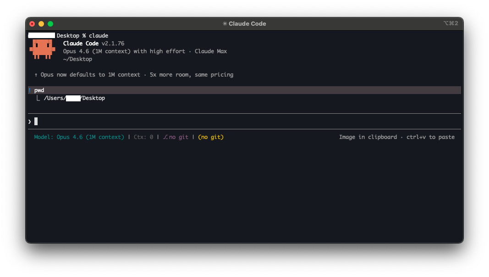

<!-- Tags: Claude Code, AI Coding, Software Development, Developer, Programming -->

*(Insert cover image: cover.png)*


# The Engineer's AI Accelerator — Claude Code in Practice

> A development experience you won't want to go back from

---

## Introduction

As a developer, most of my day is spent in code — debugging, building features, reviewing PRs, writing docs. These things eat up the bulk of working hours.

A while back I started using Claude Code, and it felt different from other AI chat tools. It runs in the terminal, reads your codebase directly, runs commands, edits files — it actually works inside your project rather than guessing from the outside.

After using it for a while, I put together the scenarios I've found most useful. Here's what I've learned.

---

## Understanding Business Logic & Debugging

Taking over an unfamiliar module is one of the most common situations engineers face. Not knowing where to start, not knowing what a change might break — everyone's been there.

With Claude Code, just describe what you need in plain language:

```
"Find where the user login validation logic is"
"What's the flow from controller to service to repository for this API?"
"If I change UserService.updateProfile(), what else would be affected?"
```

It scans your codebase, locates the relevant files and functions, traces the call chain, and maps out the full flow.

Debugging works the same way — paste in an error log and it analyzes the root cause, lists possible directions to investigate, and ranks them by likelihood.

One tip: **don't just paste the error message. Let it read the related source code too.** The analysis gets significantly more accurate.

---

## Feature Development — The Most Important Use Case

Everyone's experienced this: vague requirements, something gets built, it's not what the PM had in mind, and you spend time going back and forth. It's a productivity killer.

Claude Code can generate code directly from a spec — and it follows your project's existing coding style.

**But here's the key: the more complete the spec, the better the output.**

This really is the most important point. The more detailed the requirements you provide, the closer the output is to what you actually want. A good spec should include:

- Input / output formats
- Edge cases and error handling
- Business logic rules

Don't just say "build me an upload feature." Say:

```
"Requirement: users can upload a profile photo, jpg/png only, max 5MB,
 apply compression, store to S3, update user profile"
```

The more specific the spec, the more complete the generated code — main logic, error handling, even tests.

---

## CLAUDE.md — Giving Claude Your Project Rules

This feature is genuinely useful. CLAUDE.md is a config file in your project root that Claude Code reads every time it starts — essentially project-level rules for the AI.

What to put in it:

- Project architecture overview (what goes where)
- Coding style rules (naming conventions, indentation)
- Common commands (how to run tests, how to build)
- Prohibitions (don't use a certain library, don't touch a certain file)
- Commit message format, branch naming rules

Simple example:

```markdown
# CLAUDE.md

## Project Structure
- src/controllers/ — API entry points
- src/services/ — Business logic
- src/repositories/ — Data access

## Rules
- Use TypeScript strict mode
- Wrap all API responses in ResponseWrapper
- Never use the any type

## Common Commands
- Run tests: npm run test
- Start locally: npm run dev
```

When the whole team shares one CLAUDE.md, everyone's Claude Code output trends toward consistency. That matters more than it sounds.

---

## Code Review & Git Operations

Large PRs are slow to review and easy to miss things in.

Just tell Claude Code "review the current git diff" and it analyzes the changes — logic correctness, performance issues, security risks, edge case handling. For larger PRs, reviewing module by module works even better.

Git operations are just as straightforward:

```
"Commit the current changes"
"Create a PR targeting the develop branch"
```

It analyzes the staged changes and generates a meaningful commit message automatically. PR descriptions include a summary of what changed. The things engineers most hate writing — commit messages and PR descriptions — are no longer something you have to think about.

---

## Architecture Planning — Plan Mode: Think Before You Act

Major architectural changes are scary. The impact is wide, and it's easy to make a mess.

Claude Code has a **Plan Mode** — toggle it with `Shift + Tab`. It analyzes and plans first; you review and confirm the approach before anything gets changed.

The flow:

1. Analyze existing code
2. Propose a plan with concrete steps
3. You confirm, then implementation begins
4. Execute step by step — reviewable at each stage

Good use cases: splitting modules, introducing design patterns, API version upgrades, DB schema changes. For any large structural change, use Plan Mode first. It saves a lot of wasted work.

---

## Writing Documentation — The Engineer's Lifesaver

Writing docs is probably one of the things engineers like least (anyone relate?).

Claude Code can generate structured Markdown documentation quickly — and can convert it to Word or PowerPoint.

The workflow:

1. Have Claude Code produce a `.md` file
2. Review the content, adjust until satisfied
3. Convert to `.docx` or `.pptx`

The slides for a recent internal sharing session were actually made this way. Generate Markdown, review it, then convert to pptx. A surprisingly smooth flow.

---

## Quick Reference

Useful commands and shortcuts:

- `claude` — launch Claude Code
- `/compact` — compress the conversation, free up context window
- `/clear` — clear the conversation, start fresh
- `Shift + Tab` — toggle Plan Mode / Act Mode
- `Esc` — interrupt the current operation
- `claude -p "command"` — headless mode, useful for scripting

Habits that improve results:

- **Give context before asking** — tell it what you're working on and what changed
- **Be specific with prompts** — "fix this bug" is weaker than "how do I fix the NPE on line 42 of UserService"
- **Use Plan Mode when uncertain** — when you're not sure how to approach something, let it plan first
- **Break large tasks into steps** — doing too much at once leads to errors
- **Run /compact regularly** — long conversations hurt quality; compress periodically

---

## Summary

After using it for a while, five principles stand out:

- **Input quality determines output quality** — more complete specs, more specific questions, better results
- **Plan before acting** — use Plan Mode for large tasks to avoid rework
- **Use CLAUDE.md** — define project rules, keep output consistent
- **Iterate** — first pass is rarely perfect; refine from there
- **Humans still review** — AI is an accelerator, humans hold the steering wheel

One-line summary: **Claude Code is an AI-Powered Development Accelerator.**

It won't replace engineers, but it lets you put your time where it actually matters.

Thanks for reading. If you have questions or your own experience to share, leave a comment.
