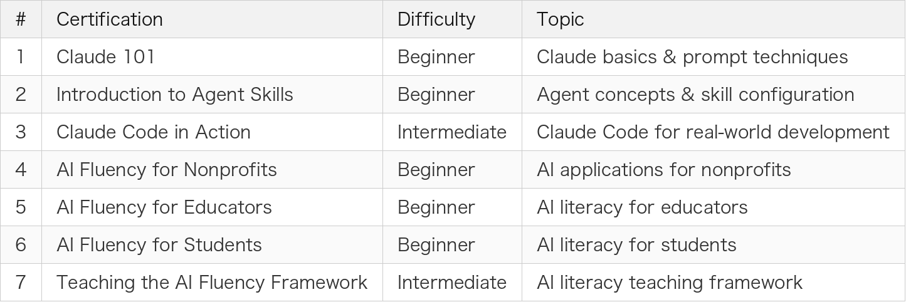

# Weekend Challenge: Earning All 7 Anthropic Claude Certifications

> Free, online, unlimited retakes — now is the perfect time to get Claude certified

---

## Introduction

Anthropic recently launched a series of official online courses and certifications covering Claude basics, Agent development, Claude Code hands-on practice, and even AI literacy programs for educators and nonprofits.

As a developer who already uses Claude Code heavily in my daily workflow, I couldn't resist the challenge when I saw the official certifications. I ended up completing all 7 over a weekend — here's a breakdown of each one.

---

## Overview of All 7 Certifications

<!--
| # | Certification | Difficulty | Topic |
|---|---------------|------------|-------|
| 1 | Claude 101 | Beginner | Claude basics & prompt techniques |
| 2 | Introduction to Agent Skills | Beginner | Agent concepts & skill configuration |
| 3 | Claude Code in Action | Intermediate | Claude Code for real-world development |
| 4 | AI Fluency for Nonprofits | Beginner | AI applications for nonprofits |
| 5 | AI Fluency for Educators | Beginner | AI literacy for educators |
| 6 | AI Fluency for Students | Beginner | AI literacy for students |
| 7 | Teaching the AI Fluency Framework | Intermediate | AI literacy teaching framework |
-->

---

## 1. Claude 101

The most fundamental introductory course, designed for people who have never used Claude before.

Topics covered:

- Introduction to Claude's core capabilities
- How to write effective prompts
- Conversation techniques and best practices
- Claude's capabilities and limitations

**Takeaway**: If you're already using Claude, this one's a breeze. But the Prompt Engineering concepts are well-organized and worth a quick review.

*(Insert image here: 01-Claude-101.jpg)*

---

## 2. Introduction to Agent Skills

An introduction to Claude's Agent capabilities and skill configuration.

Topics covered:

- What is an AI Agent
- Claude Agent architecture concepts
- How to configure and use Agent Skills
- Real-world Agent applications

**Takeaway**: Great for understanding that Claude is more than just a chatbot — it can be an automation assistant. The content is conceptual but lays a solid foundation for understanding Claude Code.

*(Insert image here: 02-Introduction-to-Agent-Skills.jpg)*

---

## 3. Claude Code in Action

This is the one I found most valuable — it teaches you how to use Claude Code in real development workflows.

Topics covered:

- Installing and configuring the Claude Code CLI
- Collaborative development in the terminal
- Using CLAUDE.md for project configuration
- Switching between Plan Mode and Act Mode
- Real-world development workflows

**Takeaway**: If you're a developer, this is a must. The content aligns well with my previous Claude Code article. The exam isn't hard, but if you haven't actually used Claude Code, you might want to check the official docs first.

*(Insert image here: 03-Claude-Code-in-Action.jpg)*

---

## 4. AI Fluency for Nonprofits

A collaboration between Anthropic and GivingTuesday, designed for nonprofit organizations.

Topics covered:

- AI use cases in nonprofit operations
- Using AI to improve operational efficiency
- Principles of responsible AI use
- Real-world case studies

**Takeaway**: Although it's targeted at nonprofits, the framework for "explaining AI to non-technical people" is genuinely useful — great reference material for promoting AI tools within your company.

*(Insert image here: 04-AI-Fluency-for-Nonprofits.jpg)*

---

## 5. AI Fluency for Educators

An AI literacy course for education professionals.

Topics covered:

- AI applications in educational settings
- How to guide students in using AI responsibly
- AI ethics and academic integrity
- Methods for integrating AI into curriculum design

**Takeaway**: Even if you're not a teacher, the methodology for "teaching others to use AI" is highly valuable. These teaching frameworks can be directly applied when driving AI tool adoption within your team.

*(Insert image here: 05-AI-Fluency-for-Educators.jpg)*

---

## 6. AI Fluency for Students

An AI literacy course for students.

Topics covered:

- How students can effectively use AI tools
- AI is not a cheating tool — it's a learning accelerator
- Critical thinking and AI output verification
- Building personal AI usage guidelines

**Takeaway**: The core message — "AI is a learning partner, not an answer generator" — applies to everyone. As developers using Claude Code, we still need to review the output, not blindly accept it.

*(Insert image here: 06-AI-Fluency-for-Students.jpg)*

---

## 7. Teaching the AI Fluency Framework

The capstone of the entire AI Fluency series.

Topics covered:

- Complete introduction to the AI Fluency Framework
- How to design AI literacy courses
- Methods for evaluating learning outcomes
- Building organization-level AI literacy programs

**Takeaway**: If you're responsible for driving AI adoption at your company, this is the most practical certification. It doesn't just teach you how to use AI — it teaches you how to help an entire organization use AI effectively.

*(Insert image here: 07-Teaching-the-AI-Fluency-Framework.jpg)*

---

## Exam Tips

A few suggestions for those who want to give it a try:

1. **Completely free**: No payment required — just sign up at Anthropic's learning center
2. **Unlimited retakes**: No pressure if you don't pass the first time
3. **Recommended order**: Claude 101 → Agent Skills → Claude Code in Action → AI Fluency series
4. **Preparation**: Watch the course videos + hands-on experience with Claude, and you should be good
5. **Time commitment**: Each course takes about 30–60 minutes, the exam itself takes 10–15 minutes

---

## Conclusion

These 7 certifications cover the full journey from "getting to know Claude" to "driving AI adoption across an organization":

- **Technical track**: Claude 101 → Agent Skills → Claude Code in Action
- **Applied track**: AI Fluency for Nonprofits / Educators / Students
- **Leadership track**: Teaching the AI Fluency Framework

For developers, the first three are the most practical. But if you need to promote AI tools within your team or organization, the frameworks and methodologies in the last four are equally valuable.

Most importantly — all courses and certifications are completely free. You can earn all of them in a single weekend. That's an incredible return on investment.

Check out the Anthropic Learning Center to start your challenge!

---

Thanks for reading. If you've also taken these certifications, feel free to share your experience in the comments.
