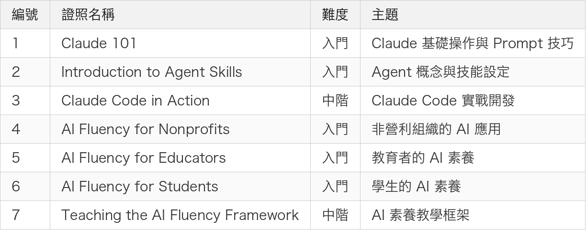

# 週末挑戰 Anthropic Claude 官方證照 — 7 張考取心得

> 免費、線上、不限次數，現在是考取 Claude證照的好時機

---

## 前言

最近 Anthropic 推出了一系列官方線上課程與認證，涵蓋 Claude 基礎操作、Agent 開發、Claude Code 實戰，甚至還有面向教育和非營利組織的 AI 素養課程。

身為一個已經在日常開發中重度使用 Claude Code 的工程師，看到官方出了認證，當然要來挑戰一下。結果週末把考了7張證照，這裡整理一下每張證照的內容和心得。

---

## 7 張證照總覽

<!--
| 編號 | 證照名稱 | 難度 | 主題 |
|------|----------|------|------|
| 1 | Claude 101 | 入門 | Claude 基礎操作與 Prompt 技巧 |
| 2 | Introduction to Agent Skills | 入門 | Agent 概念與技能設定 |
| 3 | Claude Code in Action | 中階 | Claude Code 實戰開發 |
| 4 | AI Fluency for Nonprofits | 入門 | 非營利組織的 AI 應用 |
| 5 | AI Fluency for Educators | 入門 | 教育者的 AI 素養 |
| 6 | AI Fluency for Students | 入門 | 學生的 AI 素養 |
| 7 | Teaching the AI Fluency Framework | 中階 | AI 素養教學框架 |
-->

---

## 1. Claude 101

這是最基礎的入門課程，適合完全沒用過 Claude 的人。

內容涵蓋：

- Claude 的基本功能介紹
- 如何撰寫有效的 Prompt
- 對話技巧與最佳實踐
- Claude 的能力範圍與限制

**小提示**：如果你已經在用 Claude，這張基本上秒過。但裡面有些關於 Prompt Engineering 的觀念整理得不錯，值得快速看一遍。

*(在這裡插入圖片：01-Claude-101.jpg)*

---

## 2. Introduction to Agent Skills

介紹 Claude 的 Agent 能力與技能設定。

內容涵蓋：

- 什麼是 AI Agent
- Claude Agent 的架構概念
- 如何設定與使用 Agent Skills
- Agent 在實際場景中的應用

**小提示**：這門課對於想了解 Claude 不只是聊天機器人，而是能當「自動化助手」的人很有幫助。講得比較概念性，但對後續理解 Claude Code 有鋪墊。

*(在這裡插入圖片：02-Introduction-to-Agent-Skills.jpg)*

---

## 3. Claude Code in Action

這張是我覺得最有價值的一張，直接教你怎麼在實際開發中使用 Claude Code。

內容涵蓋：

- Claude Code CLI 的安裝與設定
- 在 Terminal 中與 Claude 協作開發
- CLAUDE.md 的使用方式
- Plan Mode / Act Mode 的切換
- 實際的開發工作流程

**小提示**：如果你是工程師，這張必考。很多內容跟我之前寫的 Claude Code 實戰分享相呼應。考試內容不難，但如果沒有實際用過 Claude Code，可能需要先去官方文件看一下。

*(在這裡插入圖片：03-Claude-Code-in-Action.jpg)*

---

## 4. AI Fluency for Nonprofits

由 Anthropic 和 GivingTuesday 合作推出，面向非營利組織。

內容涵蓋：

- AI 在非營利組織中的應用場景
- 如何用 AI 提升營運效率
- 負責任地使用 AI 的原則
- 實際案例分享

**小提示**：雖然是面向非營利組織，但裡面「如何向非技術人員解釋 AI」的框架蠻實用的，之後在公司內部推廣 AI 工具時可以參考。

*(在這裡插入圖片：04-AI-Fluency-for-Nonprofits.jpg)*

---

## 5. AI Fluency for Educators

面向教育工作者的 AI 素養課程。

內容涵蓋：

- 教育場景中的 AI 應用
- 如何引導學生正確使用 AI
- AI 倫理與學術誠信
- 課程設計中融入 AI 的方法

**小提示**：即使不是老師，裡面關於「如何教別人使用 AI」的方法論很有參考價值。特別是在團隊中推動 AI 工具導入時，這些教學框架可以直接套用。

*(在這裡插入圖片：05-AI-Fluency-for-Educators.jpg)*

---

## 6. AI Fluency for Students

面向學生的 AI 素養課程。

內容涵蓋：

- 學生如何有效地使用 AI 工具
- AI 不是作弊工具，而是學習加速器
- 批判性思考與 AI 輸出驗證
- 建立自己的 AI 使用規範

**小提示**：這門課的核心觀念 — 「AI 是學習夥伴，不是答案產生器」 — 其實對所有人都適用。工程師用 Claude Code 也是一樣，你要 Review 它的輸出，不是無腦接受。

*(在這裡插入圖片：06-AI-Fluency-for-Students.jpg)*

---

## 7. Teaching the AI Fluency Framework

這是整個 AI Fluency 系列的集大成者。

內容涵蓋：

- AI Fluency 框架的完整介紹
- 如何設計 AI 素養課程
- 評估學習成效的方法
- 建立組織層級的 AI 素養計畫

**小提示**：如果你在公司負責推動 AI 導入，這張證照的內容最實用。它不只教你怎麼用 AI，而是教你怎麼讓一整個組織都能有效地使用 AI。

*(在這裡插入圖片：07-Teaching-the-AI-Fluency-Framework.jpg)*

---

## 考試攻略

幾個建議給想挑戰的人：

1. **全部免費**：不需要付費，直接到 Anthropic 官網的學習中心報名
2. **不限次數**：考不過可以重來，不用擔心壓力
3. **建議順序**：Claude 101 → Agent Skills → Claude Code in Action → AI Fluency 系列
4. **準備方式**：看完課程影片 + 實際操作過 Claude，基本上就能通過
5. **時間**：認真看的話每門課大約 30-60 分鐘，考試本身 10-15 分鐘

---

## 總結

這 7 張證照涵蓋了從「認識 Claude」到「在組織中推動 AI」的完整路徑：

- **技術面**：Claude 101 → Agent Skills → Claude Code in Action
- **應用面**：AI Fluency for Nonprofits / Educators / Students
- **管理面**：Teaching the AI Fluency Framework

對工程師來說，前三張最實用。但如果你在團隊或組織中有推動 AI 工具的需求，後面四張的框架和方法論也很值得學習。

最重要的是 — 這些課程和認證都是免費的，花一個週末的時間就能全部拿到，CP 值非常高。

有興趣的人可以直接到 Anthropic 的學習中心開始挑戰！

---

感謝閱讀，如果你也考了這些證照，歡迎留言分享你的心得。
