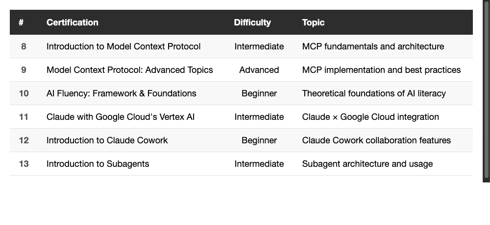

# 6 More Anthropic Claude Certifications — MCP, Subagents, Cowork & Beyond

> Last time I got 7. This time I picked up 6 more. That's 13 total — full collection unlocked.

---

## Intro

In my last article, I shared how I grabbed 7 Anthropic Claude certifications in a single weekend. A week later, Anthropic dropped a batch of new courses — this time covering more advanced topics like MCP (Model Context Protocol), Subagents, Claude Cowork, and even Google Cloud Vertex AI integration.

As someone already deep in the Claude ecosystem, I had to keep the streak going. Here's a rundown of the 6 new certs.

---

## The 6 New Certifications at a Glance

<!--
| # | Certification | Difficulty | Topic |
|---|---------------|------------|-------|
| 8 | Introduction to Model Context Protocol | Intermediate | MCP fundamentals and architecture |
| 9 | Model Context Protocol: Advanced Topics | Advanced | MCP implementation and best practices |
| 10 | AI Fluency: Framework & Foundations | Beginner | Theoretical foundations of AI literacy |
| 11 | Claude with Google Cloud's Vertex AI | Intermediate | Claude × Google Cloud integration |
| 12 | Introduction to Claude Cowork | Beginner | Claude Cowork collaboration features |
| 13 | Introduction to Subagents | Intermediate | Subagent architecture and usage |
-->

---

## 8. Introduction to Model Context Protocol

MCP is an open protocol by Anthropic that lets AI models interact with external tools and data sources. This course covers the core concepts.

What it covers:

- What MCP is and what problem it solves
- Client-Server architecture
- The three building blocks: Tools, Resources, and Prompts
- How MCP differs from traditional API integration

**Takeaway**: If you've used Claude Code, you've already experienced MCP in action — connecting to databases, calling external APIs, etc. This course lays out the underlying protocol clearly. Understanding the fundamentals makes configuring MCP Servers much more intuitive.

*(Insert image: ../2026-04-02_claude-certifications-2/08-Introduction-to-MCP.jpg)*

---

## 9. Model Context Protocol: Advanced Topics

The advanced follow-up to the MCP intro — diving deep into implementation details.

What it covers:

- Building custom MCP Servers
- Transport layer options (stdio / SSE)
- Security considerations and best practices
- Error handling and debugging techniques

**Takeaway**: This one's packed with value. The sections on transport selection and security are essential if you plan to adopt MCP in a team or product. The exam tests some implementation details, so I'd recommend going through the full course material before attempting it.

*(Insert image: ../2026-04-02_claude-certifications-2/09-MCP-Advanced-Topics.jpg)*

---

## 10. AI Fluency: Framework & Foundations

A new addition to the AI Fluency series, co-developed with several universities.

What it covers:

- Theoretical foundations of the AI literacy framework
- How to assess AI literacy levels
- Organizational AI maturity models
- Cross-disciplinary AI use cases

**Takeaway**: There's some overlap with "Teaching the AI Fluency Framework," but this one leans more academic. It's great if you want a deeper understanding of the theory behind AI literacy. If you're responsible for AI adoption strategy at your company, the frameworks here are worth studying.

*(Insert image: ../2026-04-02_claude-certifications-2/10-AI-Fluency-Framework-Foundations.jpg)*

---

## 11. Claude with Google Cloud's Vertex AI

Learn how to use Claude through Google Cloud's Vertex AI platform.

What it covers:

- Setting up the Claude API on Vertex AI
- Differences from using the Anthropic API directly
- Google Cloud security and compliance advantages
- Best practices for enterprise deployment

**Takeaway**: If your company already runs on Google Cloud, using Claude through Vertex AI lets you leverage existing IAM, billing, and monitoring. Less useful for individual developers, but very practical for enterprise users. That said, even if you don't use Vertex AI, you can still pass the exam just by studying the course material.

*(Insert image: ../2026-04-02_claude-certifications-2/11-Claude-with-Vertex-AI.jpg)*

---

## 12. Introduction to Claude Cowork

Claude Cowork is Anthropic's collaboration feature that helps you work more effectively with Claude.

What it covers:

- Core concepts of Cowork
- Building effective collaboration workflows
- Context management in long conversations
- Best practices for team collaboration

**Takeaway**: This course gave me a more systematic understanding of "how to collaborate with AI." It's not just about throwing a prompt and expecting a perfect result — it's about treating Claude as a real working partner.

*(Insert image: ../2026-04-02_claude-certifications-2/12-Introduction-to-Claude-Cowork.jpg)*

---

## 13. Introduction to Subagents

Subagents let Claude spawn sub-tasks and handle multiple jobs concurrently.

What it covers:

- The concept and architecture of Subagents
- When to use Subagents
- Subagent lifecycle management
- Coordination between the main Agent and Subagents

**Takeaway**: If you've used Claude Code's Agent features, you know how powerful Subagents can be — spinning up multiple threads to search, analyze, and execute tasks simultaneously. This course explains the mechanics behind it, helping you better control and leverage this capability.

*(Insert image: ../2026-04-02_claude-certifications-2/13-Introduction-to-Subagents.jpg)*

---

## Exam Tips (Supplementary)

Same as last time, a few reminders:

1. **Still completely free** — sign up at Anthropic's learning center
2. **Take the two MCP courses back-to-back** — the continuity helps a lot
3. **Vertex AI benefits from some Google Cloud background** — no hands-on required, but knowing the basics helps
4. **Slightly harder overall** — this batch is a step up from the first round, especially MCP Advanced Topics

---

## The Full 13-Cert Collection

Combined with the 7 from my previous article, here's the complete set:

**Foundational Series (7)**
1. Claude 101
2. Introduction to Agent Skills
3. Claude Code in Action
4. AI Fluency for Nonprofits
5. AI Fluency for Educators
6. AI Fluency for Students
7. Teaching the AI Fluency Framework

**Advanced Series (6)**
8. Introduction to Model Context Protocol
9. Model Context Protocol: Advanced Topics
10. AI Fluency: Framework & Foundations
11. Claude with Google Cloud's Vertex AI
12. Introduction to Claude Cowork
13. Introduction to Subagents

Recommended order for engineers:

1. **Must-have**: Claude 101 → Claude Code in Action → Both MCP courses → Subagents
2. **Recommended**: Agent Skills → Claude Cowork → Vertex AI
3. **Nice-to-have**: AI Fluency series (useful for driving AI adoption in your organization)

---

## Wrapping Up

Anthropic's course catalog keeps growing fast — from basic Claude usage to advanced topics like MCP and Subagents. As an engineer, I find the MCP and Subagents content the most valuable — these directly impact how much you can accomplish with Claude.

While everything's still free, spend a few hours and knock them all out.

---

Thanks for reading. If you're also collecting Claude certifications, drop a comment — I'd love to hear about your experience!
