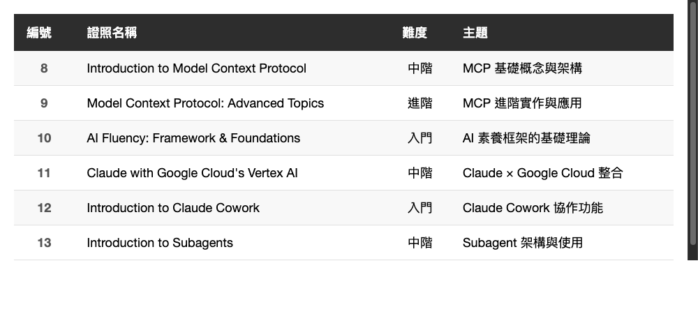

# 再收 6 張 Anthropic Claude 證照 — MCP、Subagents、Cowork 全攻略

> 上次考了 7 張，這次補上 6 張新課程，累計 13 張全到手

---

## 前言

上一篇分享了我在一個週末考取 7 張 Anthropic Claude 證照的經驗。沒想到過了一週，Anthropic 又陸續推出了新的課程和認證 — 這次主題更進階，涵蓋了 MCP（Model Context Protocol）、Subagents、Claude Cowork，甚至還有 Google Cloud Vertex AI 的整合課程。

身為一個已經入坑的人，當然要繼續蒐集。這篇整理這 6 張新證照的內容和心得。

---

## 6 張新證照總覽

<!--
| 編號 | 證照名稱 | 難度 | 主題 |
|------|----------|------|------|
| 8 | Introduction to Model Context Protocol | 中階 | MCP 基礎概念與架構 |
| 9 | Model Context Protocol: Advanced Topics | 進階 | MCP 進階實作與應用 |
| 10 | AI Fluency: Framework & Foundations | 入門 | AI 素養框架的基礎理論 |
| 11 | Claude with Google Cloud's Vertex AI | 中階 | Claude × Google Cloud 整合 |
| 12 | Introduction to Claude Cowork | 入門 | Claude Cowork 協作功能 |
| 13 | Introduction to Subagents | 中階 | Subagent 架構與使用 |
-->

---

## 8. Introduction to Model Context Protocol

MCP 是 Anthropic 推出的開放協定，讓 AI 模型能跟外部工具和資料來源互動。這門課介紹 MCP 的核心概念。

內容涵蓋：

- MCP 是什麼，解決了什麼問題
- Client-Server 架構
- Tools、Resources、Prompts 三大元件
- MCP 與傳統 API 整合的差異

**心得**：如果你有在用 Claude Code，應該已經體驗過 MCP 的威力了（例如連接資料庫、呼叫外部 API）。這門課把底層的協定講得很清楚，了解原理之後在設定 MCP Server 時會更有概念。

*(在這裡插入圖片：08-Introduction-to-MCP.jpg)*

---

## 9. Model Context Protocol: Advanced Topics

上一門的進階版，深入 MCP 的實作細節。

內容涵蓋：

- 自定義 MCP Server 的開發
- Transport 層的選擇（stdio / SSE）
- 安全性考量與最佳實踐
- 錯誤處理與除錯技巧

**心得**：這門課的含金量很高。特別是關於 Transport 選擇和安全性的部分，如果你打算在團隊或產品中導入 MCP，這些都是必須知道的。考試會考到一些實作細節，建議看完課程再考。

*(在這裡插入圖片：09-MCP-Advanced-Topics.jpg)*

---

## 10. AI Fluency: Framework & Foundations

這門課是 AI Fluency 系列的新增成員，由多所大學合作推出。

內容涵蓋：

- AI 素養框架的理論基礎
- 如何評估 AI 素養的程度
- 組織導入 AI 的成熟度模型
- 跨領域的 AI 應用案例

**心得**：跟之前的 Teaching the AI Fluency Framework 有些重疊，但這門更偏「學術基礎」，適合想深入了解 AI 素養框架理論背景的人。如果你在公司負責 AI 導入策略，這門課的框架很有參考價值。

*(在這裡插入圖片：10-AI-Fluency-Framework-Foundations.jpg)*

---

## 11. Claude with Google Cloud's Vertex AI

教你如何透過 Google Cloud 的 Vertex AI 平台使用 Claude。

內容涵蓋：

- Vertex AI 上的 Claude API 設定
- 與直接使用 Anthropic API 的差異
- Google Cloud 的安全性與合規優勢
- 企業部署的最佳實踐

**心得**：如果你的公司已經在用 Google Cloud，透過 Vertex AI 來使用 Claude 可以整合現有的 IAM、計費和監控。對個人開發者來說用處不大，但對企業用戶非常實用。
此外，就算沒有使用Vertex AI，也可以透過學習課程，來通過考試。

*(在這裡插入圖片：11-Claude-with-Vertex-AI.jpg)*

---

## 12. Introduction to Claude Cowork

Claude Cowork 是 Anthropic 推出的協作功能，讓你可以更有效地與 Claude 協同工作。

內容涵蓋：

- Cowork 的核心概念
- 如何建立有效的協作流程
- 長對話中的上下文管理
- 團隊協作的最佳實踐

**心得**：這門課讓我對「如何跟 AI 協作」有了更系統化的理解。不只是丟一個 prompt 就期待完美結果，而是把它當成真正的工作夥伴來互動。

*(在這裡插入圖片：12-Introduction-to-Claude-Cowork.jpg)*

---

## 13. Introduction to Subagents

Subagents 是讓 Claude 能夠派生出子任務、同時處理多個工作的機制。

內容涵蓋：

- Subagent 的概念與架構
- 何時該使用 Subagent
- Subagent 的生命週期管理
- 與主 Agent 的協調機制

**心得**：如果你用過 Claude Code 的 Agent 功能，就知道 Subagent 有多強大 — 它可以同時開多條線去搜尋、分析、執行任務。這門課把背後的機制解釋得很清楚，有助於你更好地控制和利用這個能力。

*(在這裡插入圖片：13-Introduction-to-Subagents.jpg)*

---

## 考試攻略（補充）

跟上一篇一樣，幾個提醒：

1. **依然全部免費**：到 Anthropic 官網的學習中心報名即可
2. **MCP 兩門建議連著考**：先考 Introduction，再考 Advanced Topics，連貫性很好
3. **Vertex AI 需要一點 Google Cloud 背景**：不需要實際操作，但了解基本概念會更順
4. **難度提升**：這批新課程整體比第一批稍難，特別是 MCP Advanced Topics

---

## 13 張全制霸心得

加上前一篇的 7 張，現在累計 13 張 Anthropic 官方證照：

**基礎系列（7 張）**
1. Claude 101
2. Introduction to Agent Skills
3. Claude Code in Action
4. AI Fluency for Nonprofits
5. AI Fluency for Educators
6. AI Fluency for Students
7. Teaching the AI Fluency Framework

**進階系列（6 張）**
8. Introduction to Model Context Protocol
9. Model Context Protocol: Advanced Topics
10. AI Fluency: Framework & Foundations
11. Claude with Google Cloud's Vertex AI
12. Introduction to Claude Cowork
13. Introduction to Subagents

如果要排個推薦順序給工程師：

1. **必考**：Claude 101 → Claude Code in Action → MCP 兩門 → Subagents
2. **推薦**：Agent Skills → Claude Cowork → Vertex AI
3. **加分**：AI Fluency 系列（對推動組織 AI 導入有幫助）

---

## 總結

Anthropic 的課程和認證一直在快速擴充，從基礎的 Claude 使用到進階的 MCP 和 Subagents，涵蓋面越來越廣。作為工程師，我覺得最有價值的是 MCP 和 Subagents 相關的內容 — 這些直接影響你能用 Claude 做到多少事情。

趁著現在全部免費，花幾個小時把它們都考一輪吧。

---

感謝閱讀。如果你也在蒐集 Claude 證照，歡迎留言交流！
