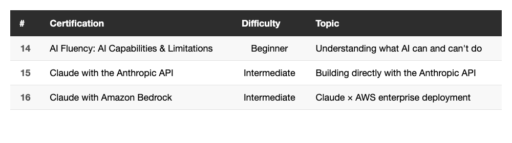

# All 16 Anthropic Claude Certifications — Complete Collection: API, Bedrock & AI Limitations

> April 5, 2026 — Every official Anthropic certification: done.

---

## Intro

This is the third and final article in the series — for now.

The first two covered 7 and 6 certifications respectively. These last 3 round out a complete set: **all 16 official Anthropic certifications**, as of today.

These three lean technical: building directly with the Anthropic API, deploying Claude on AWS, and understanding where AI's capabilities actually stop. High value for engineers.

---

## The Final 3 at a Glance

<!--
| # | Certification | Difficulty | Topic |
|---|---------------|------------|-------|
| 14 | AI Fluency: AI Capabilities & Limitations | Beginner | Understanding what AI can and can't do |
| 15 | Claude with the Anthropic API | Intermediate | Building directly with the Anthropic API |
| 16 | Claude with Amazon Bedrock | Intermediate | Claude × AWS enterprise deployment |
-->

---

## 14. AI Fluency: AI Capabilities & Limitations

This course digs into what AI can genuinely do — and where it falls short.

What it covers:

- Core capabilities of current AI systems
- Common misconceptions and over-inflated expectations
- Model knowledge cutoffs and hallucination issues
- How to critically evaluate AI output

**Takeaway**: This is the course for people who don't know what they don't know. Most people's mental model of AI is either way too optimistic or needlessly skeptical. This course recalibrates both — AI is a powerful tool, but understanding its hard limits is what actually lets you use it well.

*(Insert image: ../2026-04-05_claude-certifications-3/14-AI-Capabilities-and-Limitations.jpg)*

---

## 15. Claude with the Anthropic API

Learn how to integrate Claude directly using the Anthropic API.

What it covers:

- Anthropic API architecture and fundamentals
- Using the Messages API
- Designing effective system prompts
- Implementing streaming output
- API key management and best practices

**Takeaway**: If you've only ever used Claude through the web interface or Claude Code, this course gives you a clear picture of what's happening under the hood. The Messages API design and streaming implementation are especially useful if you want to embed Claude into your own product. Essential reading for engineers building on top of Claude.

*(Insert image: ../2026-04-05_claude-certifications-3/15-Claude-with-the-Anthropic-API.jpg)*

---

## 16. Claude with Amazon Bedrock

Learn how to deploy and use Claude through AWS's Amazon Bedrock platform.

What it covers:

- Amazon Bedrock platform overview
- Calling Claude via the Bedrock API
- How it differs from the Anthropic API directly
- AWS IAM permission setup
- Enterprise deployment considerations

**Takeaway**: The AWS counterpart to the Vertex AI course from the previous article. If your company runs on AWS, using Claude through Bedrock lets you plug into existing AWS infrastructure — IAM, CloudWatch, VPC — and makes compliance and security much easier to manage. Even without hands-on Bedrock experience, the course material alone is enough to pass the exam.

*(Insert image: ../2026-04-05_claude-certifications-3/16-Claude-with-Amazon-Bedrock.jpg)*

---

## All 16 — The Complete List

As of April 5, 2026, Anthropic has released **16 official certifications**. Here's the full collection:

**Batch 1 (March 21–22, 2026 — 7 certs)**
1. Claude 101
2. Introduction to Agent Skills
3. Claude Code in Action
4. AI Fluency for Nonprofits
5. AI Fluency for Educators
6. AI Fluency for Students
7. Teaching the AI Fluency Framework

**Batch 2 (March 23–28, 2026 — 6 certs)**
8. Introduction to Model Context Protocol
9. Model Context Protocol: Advanced Topics
10. AI Fluency: Framework & Foundations
11. Claude with Google Cloud's Vertex AI
12. Introduction to Claude Cowork
13. Introduction to Subagents

**Batch 3 (April 4, 2026 — 3 certs)**
14. AI Fluency: AI Capabilities & Limitations
15. Claude with the Anthropic API
16. Claude with Amazon Bedrock

---

## Exam Tips — Final Edition

After three articles, here's what holds across all 16:

1. **Watch the course before attempting the exam** — questions closely follow course content, don't skip
2. **Technical courses are harder than conceptual ones** — MCP Advanced and Anthropic API require some engineering background; the AI Fluency series is more accessible
3. **The three cloud integrations share the same logic** — Vertex AI (Google), Bedrock (AWS), and the Anthropic API direct path are structurally similar; finishing one makes the other two faster
4. **Everything is free and unlimited attempts** — no pressure, just retake if needed

---

## Wrapping Up

Across three articles and about two weeks of spare time, I worked through every official Anthropic certification that currently exists.

For engineers, the highest-value ones are:
- **Claude Code in Action** — directly improves your daily workflow
- **Both MCP courses** — gives you the mental model for how Claude connects to external tools
- **Claude with the Anthropic API** — essential for embedding Claude in your own product
- **Introduction to Subagents** — demystifies the Agent architecture

The AI Fluency series is also worth it, especially if you're driving AI adoption across a team or organization.

Anthropic keeps shipping new courses. If more certifications drop, I'll write a follow-up.

---

Thanks for reading. If you're also collecting Anthropic certs, drop a comment — would love to compare notes.
