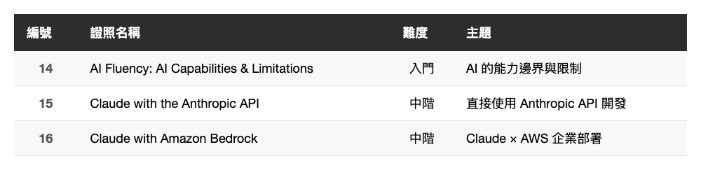

# 集滿 16 張！Anthropic Claude 官方證照完整解鎖 — API、Bedrock、AI 能力邊界

> 2026 年 4 月 5 日，完成 Anthropic 官方目前所有課程認證

---

## 前言

這是這個系列的第三篇，也是（目前）最後一篇。

前兩篇分別考了 7 張和 6 張，這次補上最新的 3 張，正好湊成 **16 張** — Anthropic 官方目前所有課程認證全部完成。

這三張的主題偏向「技術應用」：如何用 Anthropic API 直接開發、如何在 AWS 上部署 Claude、以及 AI 本身的能力邊界在哪裡。對工程師來說含金量很高。

---

## 3 張新證照總覽

<!--
| 編號 | 證照名稱 | 難度 | 主題 |
|------|----------|------|------|
| 14 | AI Fluency: AI Capabilities & Limitations | 入門 | AI 的能力邊界與限制 |
| 15 | Claude with the Anthropic API | 中階 | 直接使用 Anthropic API 開發 |
| 16 | Claude with Amazon Bedrock | 中階 | Claude × AWS 企業部署 |
-->

---

## 14. AI Fluency: AI Capabilities & Limitations

這門課探討 AI 真正能做什麼、不能做什麼。

內容涵蓋：

- 現階段 AI 的核心能力
- AI 的常見誤解與過度期待
- 模型的知識邊界與幻覺問題
- 如何正確評估 AI 的輸出

**心得**：這門課對「不知道自己不知道什麼」的人很有幫助。很多人對 AI 的期待不是太低就是太高，這門課幫你校準認知 — AI 是很強的工具，但它有明確的能力邊界，了解這些限制才能更有效地使用它。

*(在這裡插入圖片：14-AI-Capabilities-and-Limitations.jpg)*

---

## 15. Claude with the Anthropic API

教你如何直接透過 Anthropic API 來整合和使用 Claude。

內容涵蓋：

- Anthropic API 的基本架構
- Messages API 的使用方式
- System prompt 的設計技巧
- 串流輸出（Streaming）的實作
- API 金鑰管理與最佳實踐

**心得**：如果你之前都是用 Claude.ai 的網頁介面或 Claude Code，這門課會讓你對底層 API 有更清楚的認識。特別是 Messages API 的設計邏輯和 Streaming 的實作，對想要把 Claude 整合進自己產品的工程師很實用。

*(在這裡插入圖片：15-Claude-with-the-Anthropic-API.jpg)*

---

## 16. Claude with Amazon Bedrock

教你如何透過 AWS 的 Amazon Bedrock 服務來部署和使用 Claude。

內容涵蓋：

- Amazon Bedrock 平台介紹
- 在 Bedrock 上呼叫 Claude 的方式
- 與直接使用 Anthropic API 的差異
- AWS IAM 權限設定
- 企業級部署的考量

**心得**：上一篇寫過 Vertex AI，這篇則是 AWS 版本。對於公司基礎設施在 AWS 上的團隊，透過 Bedrock 使用 Claude 可以整合現有的 AWS 生態系（IAM、CloudWatch、VPC 等），在合規和安全性上也更容易管控。就算沒有實際用過 Bedrock，看完課程內容也能順利通過考試。

*(在這裡插入圖片：16-Claude-with-Amazon-Bedrock.jpg)*

---

## 16 張完整解鎖！完整清單

截至 2026 年 4 月 5 日，Anthropic 官方推出的所有課程認證共 **16 張**，全部完成：

**第一批（2026/03/21–22，共 7 張）**
1. Claude 101
2. Introduction to Agent Skills
3. Claude Code in Action
4. AI Fluency for Nonprofits
5. AI Fluency for Educators
6. AI Fluency for Students
7. Teaching the AI Fluency Framework

**第二批（2026/03/23–28，共 6 張）**
8. Introduction to Model Context Protocol
9. Model Context Protocol: Advanced Topics
10. AI Fluency: Framework & Foundations
11. Claude with Google Cloud's Vertex AI
12. Introduction to Claude Cowork
13. Introduction to Subagents

**第三批（2026/04/04，共 3 張）**
14. AI Fluency: AI Capabilities & Limitations
15. Claude with the Anthropic API
16. Claude with Amazon Bedrock

---

## 考試攻略總結

三篇文章寫下來，歸納幾個通用原則：

1. **先看課程再考試**：不要跳過課程直接考，Anthropic 的題目跟課程內容高度相關
2. **技術類比入門類難**：MCP Advanced、Anthropic API 這類課程需要有一點技術基礎，純概念的 AI Fluency 系列相對好過
3. **雲端整合三選一**：Vertex AI（Google）、Bedrock（AWS）、Anthropic API（直接），三門課邏輯相通，考一門後再考其他兩門會快很多
4. **全部免費、不限次數**：沒有壓力，考不過重來就好

---

## 總結

從第一篇到這篇，花了大約兩週的零碎時間，把 Anthropic 目前所有的官方認證都考完了。

對工程師來說最值得的是這幾張：
- **Claude Code in Action** — 直接提升日常開發效率
- **MCP 兩門** — 理解 Claude 連接外部工具的底層機制
- **Claude with the Anthropic API** — 整合 Claude 進自己產品的必備知識
- **Introduction to Subagents** — 理解 Agent 架構

其他的也值得學，特別是 AI Fluency 系列，對推動組織 AI 導入有實質幫助。

Anthropic 還在持續推出新課程，如果之後有新的認證，我會繼續更新。

---

感謝閱讀。如果你也有在考 Anthropic 的認證，歡迎留言交流！
