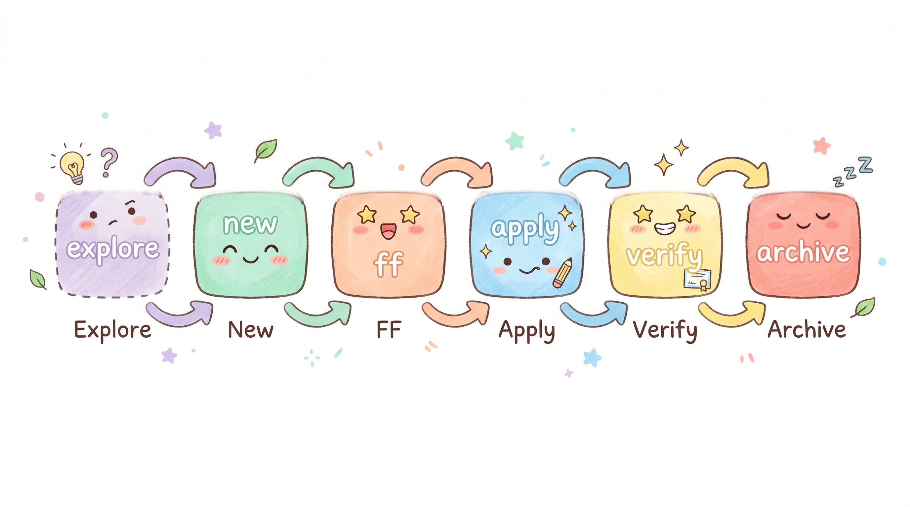
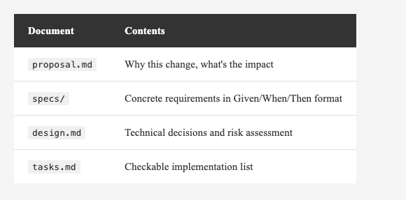
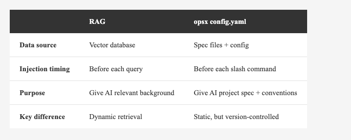

*(Insert cover image: cover.png)*

<!--
Gemini prompt: A cute Ghibli-inspired soft pastel illustration. A chibi engineer character and a kawaii AI robot sit at a table together, looking at a glowing blueprint document between them labeled "Spec". The engineer points at the spec, and the AI robot nods with a happy lightbulb above its head. Behind them, a neat stack of documents (proposal, specs, design, tasks) floats softly. Soft pastel colors (mint, peach, lavender, sky blue), white background, clean and simple. 16:9 ratio.
-->

# Align Before You Build — OpenSpec / opsx, Prompt Engineering, and RAG

> Have you ever given an AI a requirement, it wrote something that "looked right" — but ran completely wrong?

---

## Intro

AI coding assistants are powerful. But they have a fundamental problem: **requirements only exist in the chat window**.

Today you say "add a login feature," and the AI gives you an implementation. Tomorrow you say "revise the login flow," and the AI may have forgotten last session's decisions entirely — rebuilding from scratch, or going in the opposite direction.

That's not the AI failing. It's because it has no memory of your specs.

OpenSpec can fix this.

---

## What Is OpenSpec?

[OpenSpec](https://github.com/Fission-AI/OpenSpec) is an SDD (Spec-Driven Development) tool.

Its core philosophy:

```
→ fluid not rigid
→ iterative not waterfall
→ built for brownfield not just greenfield
```

The idea is simple: **agree on the spec before AI touches any code.**

*(Insert image: ../2026-04-10_openspec-opsx/workflow-overview.png)*


---

## Installation

```bash
npm install -g openspec
openspec init
```

`openspec init` creates the `openspec/` folder and `config.yaml` in your project root, and automatically injects slash commands into your Claude Code environment. For full details, see the [official GitHub](https://github.com/Fission-AI/OpenSpec).

*(Insert image: ../2026-04-10_openspec-opsx/install-result.png)*


---

## The opsx Workflow

After installing OpenSpec, it injects a set of slash commands into your project. There are two modes:

### Quick Path (`core` profile — default)

One command generates all spec artifacts at once:

```text
/opsx:propose → /opsx:apply → /opsx:archive
```

### Full Workflow (expanded — recommended)

Requires manual activation, gives you step-by-step control:

```bash
openspec config profile   # select expanded workflow
openspec update           # apply to project
```

Once enabled, you can start with `/opsx:explore` to clarify requirements before diving in:

```text
You:  /opsx:explore I want to refactor API error handling, not sure where to start
AI:   Let me look at how errors are currently handled...
      [Analyzes codebase]

      I see three patterns mixed across the codebase:
      1. Direct try-catch (most API calls)
      2. Result type (parts of the network layer)
      3. Custom Error enum (login flow only)

      Recommend unifying to Result type + a centralized ErrorHandler.
      Want to start planning this change?

You:  Yes, let's go
AI:   Run /opsx:new refactor-api-error-handling to create the change.
```

`/opsx:explore` creates no artifacts — it's a space to think before acting. Once the approach is clear, move into the implementation flow:

```text
You:  /opsx:new refactor-api-error-handling
AI:   Created openspec/changes/refactor-api-error-handling/
      Ready to create the first artifact.

You:  /opsx:ff
AI:   Creating all planning artifacts...
      ✓ proposal.md  — why we're doing this, what's changing
      ✓ specs/       — requirements and scenarios (Given/When/Then)
      ✓ design.md    — technical decisions and risks
      ✓ tasks.md     — checkable implementation list
      Ready for implementation!

You:  /opsx:apply
AI:   Implementing...
      ✓ 1.1 Create unified AppError enum
      ✓ 1.2 Refactor network layer to return Result type
      ✓ 2.1 Build centralized ErrorHandler
      ✓ 2.2 Update all call sites
      All tasks complete!

You:  /opsx:verify
AI:   Validating implementation against specs...
      ✓ All tasks checked off
      ✓ All requirements have corresponding implementation
      ✓ All call sites unified to consistent format
      Ready to archive.

You:  /opsx:archive
AI:   Archived to openspec/changes/archive/2026-04-06-refactor-api-error-handling/
      Specs updated. Ready for the next feature.
```

The key idea: **the expanded commands break what used to be one big step into reviewable stages** — you get to read and adjust each artifact before moving on. `/opsx:explore` adds one more layer before that: think it through before you build.

*(Insert image: ../2026-04-10_openspec-opsx/command-flow.png)*

<!--
Gemini prompt: A cute Ghibli-inspired soft pastel illustration showing a horizontal flow of six kawaii rounded box characters connected by arrows, each with a tiny face: "explore" (dashed border, optional, slightly faded with a thinking expression) → "new" → "ff" → "apply" → "verify" → "archive". Each box is a different soft pastel color (lavender, mint, peach, sky blue, yellow, coral). Arrows between them are friendly and rounded. Clean white background, simple and cheerful. 16:9 ratio.
-->

Every change gets its own folder with four documents:

*(Insert image: table-artifacts.png)*


<!--
| Document | Contents |
|----------|----------|
| `proposal.md` | Why this change, what's the impact |
| `specs/` | Concrete requirements in Given/When/Then format |
| `design.md` | Technical decisions and risk assessment |
| `tasks.md` | Checkable implementation list |
-->

---

## opsx and Prompt Engineering

Here's a question worth sitting with: **what is an opsx spec file, fundamentally?**

The answer: **a structured prompt**.

A typical AI coding interaction looks like this:

```
You: Clean up commented-out code in this Swift project
AI:  (guesses your intent — might delete too much or too little)
```

A spec written with opsx looks like this:

```markdown
### Requirement: Remove commented-out code
The system SHALL identify and remove commented-out code,
preserving explanatory comments.

#### Scenario: Remove single-line commented code
- WHEN file contains `// let oldValue = 123`
- THEN that line is deleted

#### Scenario: Preserve explanatory comments
- WHEN file contains `// This handles edge case`
- THEN that line is kept
```

What's the difference?

1. **Eliminates ambiguity** — Given/When/Then makes edge cases explicit; the AI doesn't have to guess
2. **Verifiability** — each scenario is a test case; the AI can check its own output against the spec, and you can write unit tests directly from the same scenarios — spec and tests speak the same language
3. **Reproducibility** — this spec lives in your codebase; re-running always yields consistent results

It's worth noting that Given/When/Then is the standard syntax for BDD (Behavior-Driven Development). opsx brings BDD thinking directly into the AI coding workflow — if you're already comfortable with testing, writing a spec feels almost identical to writing test cases. The main difference: the executor is now an AI, not a test runner.

This is the core of prompt engineering: **converting vague intent into structured, predictable instructions**.

opsx makes this a first-class part of the workflow — not something you have to reinvent each time.

*(Insert image: ../2026-04-10_openspec-opsx/prompt-comparison.png)*


---

## opsx and RAG

RAG (Retrieval-Augmented Generation) works like this: before the AI answers, retrieve relevant knowledge from an external source and inject it into the context window.

opsx's `config.yaml` has a `context` field:

```yaml
# openspec/config.yaml
context: |
  Tech stack: Swift, UIKit, MVVM
  API conventions: RESTful, JSON
  Testing: XCTest for unit tests
  Style: SwiftLint, strict naming conventions

rules:
  specs:
    - Use Given/When/Then format
  design:
    - Include sequence diagrams for complex flows
```

This context is injected into every artifact's prompt — so the AI always knows the project's background when generating specs or executing tasks.

This maps closely to how RAG works:

*(Insert image: table-rag-comparison.png)*


<!--
| | RAG | opsx config.yaml |
|---|-----|-----------------|
| Data source | Vector database | Spec files + config |
| Injection timing | Before each query | Before each slash command |
| Purpose | Give AI relevant background | Give AI project spec + conventions |
| Key difference | Dynamic retrieval | Static, but version-controlled |
-->

opsx is "manual RAG" — you maintain the context yourself rather than auto-indexing from documents. The upside: **version-controlled, transparent, fully in your control**. You know exactly what the AI sees.

*(Insert image: ../2026-04-10_openspec-opsx/folder-structure.png)*


---

## Real-World Use: An Enterprise iOS Project

Here's an actual scenario from a large iOS enterprise project (details anonymized).

**Background**: A large iOS project spanning multiple apps (admin-facing, user-facing) and shared core modules. Over time, Swift source files accumulated significant commented-out legacy code and excessive blank lines, hurting readability.

**The opsx workflow**:

### Step 1: Create the Change

```
/opsx:new clean-up-code-and-lines
/opsx:ff
```

`/opsx:new` creates the change folder, `/opsx:ff` generates all spec artifacts at once. AI generates `proposal.md`:

```markdown
## Why
Commented-out code and excess blank lines have accumulated,
reducing code readability.

## What Changes
- Remove commented-out code (preserve explanatory comments)
- Collapse consecutive blank lines into one
- Remove blank lines between MARK comments and the code below
```

### Step 2: Define Specs

The spec file uses Given/When/Then to make the "keep vs. delete" boundary explicit — no guessing:

```markdown
#### Scenario: Remove commented-out code
- WHEN file contains `// let oldValue = 123`
- THEN that line is deleted

#### Scenario: Preserve explanatory comments
- WHEN file contains `// Handles edge case`
- THEN that line is kept
```

### Step 3: Technical Design

`design.md` records a key decision:

> **Decision**: Sub-agents use Sonnet, not Opus
>
> **Reason**: This is a pattern-matching task, not high-level reasoning. Sonnet is sufficient and more cost-effective.

It also defines a **parallel execution strategy**: three independent app directories, each assigned to a separate sub-agent, running simultaneously.

Two custom skills were part of the design as well: a **cleanup skill** to scan each directory and remove matching content, and a **verification skill** to confirm the changes stayed within the spec's defined boundaries. Skills encapsulate repeatable operations and give the AI clear behavioral guardrails — no need to re-describe the same steps each time.

Skills also come with another advantage: you can configure them to run on lighter models — Haiku, for instance. For rule-based tasks like cleanup and verification, there's no need to reach for the top-tier model. A faster model is more than sufficient — and the tokens you save are better spent on work that actually requires reasoning.

### Step 4: Execute, Verify, and Archive

```
/opsx:apply
/opsx:verify
/opsx:archive
```

Three sub-agents run in parallel. After completion, `/opsx:verify` confirms all tasks are done and the implementation matches the spec. Then a quick check of the git diff confirms only comments and blank lines were removed — zero logic changes — before archiving.

---

**What did this workflow actually deliver?**

- **No guessing** — what to delete, what to keep: it's all in the spec
- **Decisions are documented** — why Sonnet over Opus is recorded in design.md, not lost in chat history
- **Reproducible** — next time a similar cleanup is needed, reference this archive or adapt it in minutes
- **Team knowledge base** — the archive isn't just storage, it's a structured decision history. A new team member can read the archive and understand the why, how, and boundaries of any past change — more clearly than digging through git log

---

## When NOT to Use opsx

opsx's value is in making specs explicit — but not every situation is worth that overhead:

- **Quick prototypes** — requirements are still being discovered; specs you write today will change tomorrow. Validate the idea first.
- **One-off scripts** — throwaway tools don't need maintainable spec documents
- **Early exploration** — when you don't yet know what you're building, use `/opsx:explore` to think it through first; enter the full workflow once direction is clear
- **Trivial changes** — renaming a variable or adding a log line is faster done directly than through the full process

The simple rule: **opsx pays off when your change is worth documenting, reproducing, and explaining to someone else.**

*(Insert image: ../2026-04-10_openspec-opsx/when-not-to-use.png)*


---

## Wrapping Up

OpenSpec / opsx isn't just "have AI write your docs." It's a systematic integration of **prompt engineering** and **RAG** principles directly into your development workflow:

- **Prompt engineering** — spec files convert vague intent into structured, verifiable instructions
- **Manual RAG** — config.yaml continuously injects project context, so the AI always knows what world it's operating in

If you're already using Claude Code or another AI coding assistant, opsx is worth trying — especially as your project grows and requirements get more complex.

---

Thanks for reading. If you're using OpenSpec, drop a comment — would love to hear how you're using it.
