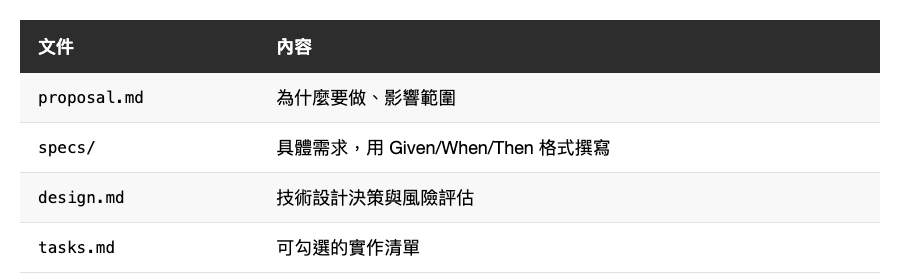
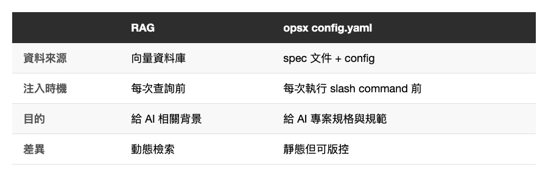

*(在這裡插入封面圖：cover.png)*

<!--
Gemini prompt: A cute Ghibli-inspired soft pastel illustration. A chibi engineer character and a kawaii AI robot sit at a table together, looking at a glowing blueprint document between them labeled "Spec". The engineer points at the spec, and the AI robot nods with a happy lightbulb above its head. Behind them, a neat stack of documents (proposal, specs, design, tasks) floats softly. Soft pastel colors (mint, peach, lavender, sky blue), white background, clean and simple. 16:9 ratio.
-->

# 讓 AI 寫 code 前先對齊規格 — OpenSpec / opsx 實戰與提示詞工程

> 你有沒有遇過：給 AI 一個需求，它寫出來的東西「看起來對」，但跑起來完全不是你想要的？

---

## 前言

AI coding assistant 很強，但有一個根本問題：**需求只活在對話框裡**。

你今天說「幫我加一個登入功能」，AI 給你一個實作。明天你說「幫我改一下登入流程」，AI 可能已經忘了上次的決策，從頭來過，甚至做出相反的方向。

這不是 AI 不好，是因為它沒有你的「規格記憶」。

OpenSpec 可以解決這件事。

---

## OpenSpec 是什麼？

[OpenSpec](https://github.com/Fission-AI/OpenSpec) 是一個 SDD（Spec-Driven Development，規格驅動開發）工具。

它的核心哲學是：

```
→ fluid not rigid（流動，不僵化）
→ iterative not waterfall（迭代，不瀑布）
→ built for brownfield not just greenfield（適合既有專案，不只是新專案）
```

簡單說：**在 AI 動手之前，先把規格寫清楚。**

*(在這裡插入圖片：workflow-overview.png)*

<!--
Gemini prompt: A cute Ghibli-inspired soft pastel illustration split into two halves. Left half labeled "Without OpenSpec": a small stressed chibi engineer character talking to a kawaii AI robot, the robot outputs a code block with a big question mark and a confused face. Right half labeled "With OpenSpec": the same chibi engineer holds a glowing document stack (proposal, specs, design, tasks), the kawaii AI robot outputs a clean code block with a happy checkmark face. Soft pastel colors, white background, no extra text. 16:9 ratio.
-->

---

## 安裝

```bash
npm install -g openspec
openspec init
```

`openspec init` 會在專案根目錄建立 `openspec/` 資料夾與 `config.yaml`，slash commands 也會自動注入到 Claude Code 環境中。更多細節可參考 [官方 GitHub](https://github.com/Fission-AI/OpenSpec)。

*(在這裡插入圖片：install-result.png)*

<!--
Gemini prompt: A cute Ghibli-inspired soft pastel illustration of a cozy terminal window as a kawaii character, showing two commands being typed: "npm install -g openspec" and "openspec init". Below, a cheerful kawaii folder tree pops out like a sprout: openspec/ with config.yaml and changes/ as tiny smiling sub-folders. Soft mint and peach tones, white background, simple and cheerful. 16:9 ratio.
-->

---

## opsx 工作流程

安裝 OpenSpec 之後，它會在你的專案裡注入一組 slash commands。OpenSpec 提供兩種模式：

### 快速路徑（core profile，預設）

適合快速啟動：一個指令產生所有規格文件。

```text
/opsx:propose → /opsx:apply → /opsx:archive
```

### 完整工作流（expanded workflow，推薦）

需要手動啟用，提供更細緻的控制：

```bash
openspec config profile   # 選擇 expanded workflow
openspec update           # 套用到專案
```

啟用後，如果需求還不清楚，可以先用 `/opsx:explore` 釐清（可選），再進入實作流程；需求明確時，直接從 `/opsx:new` 開始即可：

```text
你：/opsx:explore 想重構 API 錯誤處理，但不確定從哪裡切入
AI：我來看一下目前的錯誤處理方式...
     [分析 codebase]

     目前有三種模式混用：
     1. 直接 try-catch（大部分 API 呼叫）
     2. Result type（部分 network layer）
     3. 自定義 Error enum（只有登入流程用）

     建議統一為 Result type + 集中的 ErrorHandler。
     要開始規劃這個變更嗎？

你：好，開始吧
AI：執行 /opsx:new refactor-api-error-handling 來建立變更。
```

`/opsx:explore` 不會建立任何 artifact，純粹是一個「先思考、再動手」的空間。想法成形後再進入實作流程：

```text
你：/opsx:new refactor-api-error-handling
AI：建立 openspec/changes/refactor-api-error-handling/
     準備好建立第一個 artifact 了

你：/opsx:ff
AI：依序建立所有規格文件...
     ✓ proposal.md  — 為什麼要做、做什麼
     ✓ specs/       — 需求與情境（Given/When/Then）
     ✓ design.md    — 技術設計與風險
     ✓ tasks.md     — 可勾選的實作清單
     準備好可以開始實作了！

你：/opsx:apply
AI：實作中...
     ✓ 1.1 建立統一的 AppError enum
     ✓ 1.2 重構 network layer 回傳 Result type
     ✓ 2.1 建立集中的 ErrorHandler
     ✓ 2.2 更新所有 call site
     全部完成！

你：/opsx:verify
AI：驗證實作是否符合規格...
     ✓ 所有 tasks 已完成
     ✓ 需求均有對應實作
     ✓ 所有 call site 均已統一格式
     可以封存。

你：/opsx:archive
AI：已封存至 openspec/changes/archive/2026-04-06-refactor-api-error-handling/
     規格已更新。準備好進行下一個功能。
```

核心概念：**新指令把原本一口氣做完的事拆開了**，讓你在每個 artifact 之間都有機會審閱、修改，再繼續。`/opsx:explore` 則是在這之前多一層「先想清楚再動手」的保護。

*(在這裡插入圖片：command-flow.png)*

<!--
Gemini prompt: A cute Ghibli-inspired soft pastel illustration showing a horizontal flow of six kawaii rounded box characters connected by arrows, each with a tiny face: "explore" (dashed border, optional, slightly faded with a thinking expression) → "new" → "ff" → "apply" → "verify" → "archive". Each box is a different soft pastel color (lavender, mint, peach, sky blue, yellow, coral). Arrows between them are friendly and rounded. Clean white background, simple and cheerful. 16:9 ratio.
-->

每一個變更都有自己的資料夾，包含四份文件：

*(在這裡插入圖片：table-artifacts.png)*


<!--
| 文件 | 內容 |
|------|------|
| `proposal.md` | 為什麼要做、影響範圍 |
| `specs/` | 具體需求，用 Given/When/Then 格式撰寫 |
| `design.md` | 技術設計決策與風險評估 |
| `tasks.md` | 可勾選的實作清單 |
-->

---

## opsx 與提示詞工程的關聯

這裡有個值得深入思考的問題：**opsx 的 spec 文件，本質上是什麼？**

答案是：**結構化的 prompt**。

一般的 AI coding 互動長這樣：

```
你：幫我清理這個 Swift 專案裡被註解掉的程式碼
AI：（猜測你的意圖，可能清多也可能清少）
```

用 opsx 寫出來的 spec 長這樣：

```markdown
### Requirement: 刪除被註解掉的程式碼
系統 SHALL 識別並刪除被註解掉的程式碼，保留一般說明性註解。

#### Scenario: 刪除單行註解程式碼
- WHEN 檔案包含 `// let oldValue = 123`
- THEN 該行被刪除

#### Scenario: 保留說明性註解
- WHEN 檔案包含 `// 這是功能說明`
- THEN 該行被保留
```

差異在哪？

1. **消除歧義** — Given/When/Then 格式把「邊界條件」明確化，AI 不需要猜
2. **可驗證性** — 每個 scenario 都是一個測試案例，AI 可以對照檢查自己的輸出；你也可以直接根據這些 scenario 撰寫單元測試 —— spec 和 test 說的是同一件事，天然對齊
3. **可重現性** — 這份 spec 放在 codebase 裡，任何時候重跑都會得到一致的結果

值得一提的是，Given/When/Then 正是 BDD（行為驅動開發）的標準語法。opsx 把 BDD 的思維帶進了 AI coding 流程——如果你本來就熟悉測試，會發現寫 spec 和寫測試案例的思路幾乎完全一樣，只是執行者從人變成了 AI。

這正是提示詞工程的核心：**把模糊的意圖轉換成結構化、可預測的指令**。

opsx 讓這件事變成工作流程的一部分，而不是每次都要重新想。

*(在這裡插入圖片：prompt-comparison.png)*

<!--
Gemini prompt: A cute Ghibli-inspired soft pastel illustration split into two halves. Left half "Vague Prompt": a small chibi character whispers vaguely into a speech bubble, a kawaii AI robot scratches its head with a big question mark above, looking confused and overwhelmed. Soft red/orange tint. Right half "Structured Spec (opsx)": the chibi character holds a neat glowing document with bullet points and checkboxes, the kawaii AI robot looks happy and confident with a checkmark. Soft green tint. White background, no extra text. 16:9 ratio.
-->

---

## opsx 與 RAG 的關聯

RAG（Retrieval-Augmented Generation）的概念是：**給 AI 回答前，先從外部知識庫撈出相關資料，注入到 context 裡**。

opsx 的 `config.yaml` 有一個 `context` 欄位：

```yaml
# openspec/config.yaml
context: |
  Tech stack: Swift, UIKit, MVVM
  API conventions: RESTful, JSON
  Testing: XCTest for unit tests
  Style: SwiftLint, strict naming conventions

rules:
  specs:
    - Use Given/When/Then format
  design:
    - Include sequence diagrams for complex flows
```

這段 context 會被注入到每一個 artifact 的 prompt 裡，讓 AI 在生成 spec 或執行任務時，始終知道「這個專案的背景是什麼」。

這跟 RAG 的做法高度相似：

*(在這裡插入圖片：table-rag-comparison.png)*


<!--
| | RAG | opsx config.yaml |
|---|-----|-----------------|
| 資料來源 | 向量資料庫 | spec 文件 + config |
| 注入時機 | 每次查詢前 | 每次執行 slash command 前 |
| 目的 | 給 AI 相關背景 | 給 AI 專案規格與規範 |
| 差異 | 動態檢索 | 靜態但可版控 |
-->

當然，opsx 是「手動 RAG」— 你要自己維護這些 context，而不是從文件自動向量化檢索。但它的好處是：**版控、透明、可修改**。你完全掌握 AI 看到的是什麼。

*(在這裡插入圖片：folder-structure.png)*

<!--
Gemini prompt: A cute Ghibli-inspired soft pastel illustration of a folder tree structure as a friendly town map. The root folder "openspec/" is a cozy kawaii house, inside it "config.yaml" is a small signboard, "changes/" is a cheerful district with two kawaii building sub-folders: one labeled "refactor-api-error-handling/" with four tiny document characters inside (proposal, specs, design, tasks each with smiling faces), and one labeled "archive/" looking like a cozy library. Soft pastel colors: warm peach, mint green, sky blue. White background. 16:9 ratio.
-->

---

## 實際應用：某企業 iOS 專案

以一個實際使用的場景為例。

**背景**：一個大型 iOS 企業專案，包含多個 App（管理端、使用者端）與共用核心模組，Swift 原始碼隨著時間累積了大量被註解掉的舊程式碼和多餘空行，降低了可讀性。

**使用 opsx 的流程**：

### Step 1：建立變更

```
/opsx:new clean-up-code-and-lines
/opsx:ff
```

`/opsx:new` 建立變更資料夾，`/opsx:ff` 一次產生所有規格文件。AI 生成 `proposal.md`：

```markdown
## Why
專案中累積了被註解掉的程式碼和多餘空行，降低程式碼可讀性。

## What Changes
- 刪除被註解掉的程式碼（保留一般說明性註解）
- 壓縮連續多餘空行為單一空行
- 移除 MARK 註解與下方程式碼之間的空行
```

### Step 2：規格定義

`/opsx:ff` 產生的 specs 文件，會用 Given/When/Then 把「保留」與「刪除」的邊界條件全部明確化——這是 spec 文件最核心的價值，讓 AI 不需要猜：

```markdown
#### Scenario: 刪除單行註解程式碼
- WHEN 檔案包含 `// let oldValue = 123`
- THEN 該行被刪除

#### Scenario: 保留說明性註解
- WHEN 檔案包含 `// 這是功能說明`
- THEN 該行被保留
```

### Step 3：技術設計

`design.md` 記錄了一個關鍵決策：

> **決定**: sub-agents 使用 Sonnet 而非 Opus
>
> **理由**: 這是模式匹配任務，不需要高階推理能力，Sonnet 足夠且成本較低。

同時設計了**並行策略**：將三個獨立的 App 目錄分給三個 sub-agent 同時處理，加速執行。

這個流程也搭配了兩個自訂 skill：**清除 skill** 負責掃描各目錄並刪除符合條件的內容，**驗證 skill** 則負責確認變更沒有超出 spec 定義的範圍。skill 把重複性的操作封裝起來，讓 AI 執行時有明確的行為邊界，不需要每次重新描述細節。

skill 還有另一個好處：可以指定使用更輕量的模型來執行，例如 Haiku。對於規則明確的清除、驗證任務，不需要動用頂階模型，用快速模型處理就夠了——省下的 token，留給真正需要推理的工作。

### Step 4：執行、驗證、封存

```
/opsx:apply
/opsx:verify
/opsx:archive
```

三個 sub-agent 並行清理，完成後先跑 `/opsx:verify` 確認所有 tasks 完成、實作符合規格，再檢查 git diff 確認只有刪除無用內容、未動到任何程式邏輯，最後封存。

---

**這個流程帶來了什麼？**

- **AI 不需要猜** — 什麼該刪、什麼不該刪，spec 裡都寫清楚了
- **決策有紀錄** — 為什麼選 Sonnet 不選 Opus，design.md 裡說得清清楚楚
- **可重現** — 下次有類似需求，直接參考這份 archive，或稍微調整就能重用
- **團隊知識庫** — archive 不只是封存，它是結構化的決策歷史。新人進來看 archive，就能理解每個變更的 why、how 和邊界條件，比翻 git log 更清楚

---

## 什麼時候不適合用 opsx？

opsx 的價值在於「把規格說清楚」，但不是所有場景都值得這個成本：

- **快速 prototype** — 需求還在摸索，spec 寫了也會馬上改，不如先跑起來驗證想法
- **一次性 script** — 用完即丟的工具，不需要建立可維護的規格文件
- **需求極度模糊的探索期** — 還不確定要做什麼，先用 `/opsx:explore` 想清楚，確定方向再進流程
- **極簡變更** — 改一個變數名、加一行 log，直接改比走流程快

簡單說：**當你的變更值得被記錄、被重現、被其他人理解，opsx 才發揮最大價值。**

*(在這裡插入圖片：when-not-to-use.png)*

<!--
Gemini prompt: A cute Ghibli-inspired soft pastel illustration split into two halves. Left half "Use opsx": a chibi engineer confidently holds a glowing spec document stack, working on a large kawaii building labeled "complex feature". Right half "Skip opsx": the same chibi engineer casually fixes a tiny kawaii lightbulb with a screwdriver, looking relaxed and happy. Soft pastel colors, white background, no extra text. 16:9 ratio.
-->

---

## 總結

OpenSpec / opsx 不只是一個「讓 AI 幫你寫文件」的工具，它其實是把**提示詞工程**和**RAG** 的概念，系統性地整合進開發流程裡：

- **提示詞工程** — spec 文件把模糊需求轉成結構化、可驗證的指令
- **手動 RAG** — config.yaml 把專案背景持續注入，讓 AI 永遠知道它在哪個脈絡下工作

如果你已經在用 Claude Code 或其他 AI coding assistant，opsx 是一個值得試試的加速器。特別是當你的專案開始變大、需求開始變複雜的時候。

---

感謝閱讀。如果你有在用 OpenSpec，歡迎留言分享你的使用心得！
