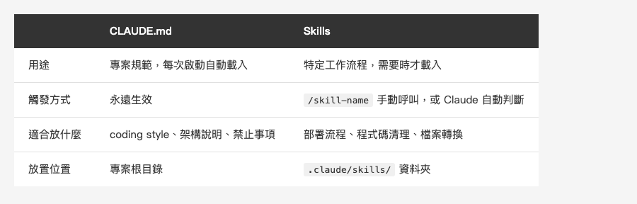
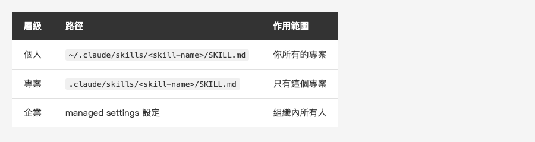
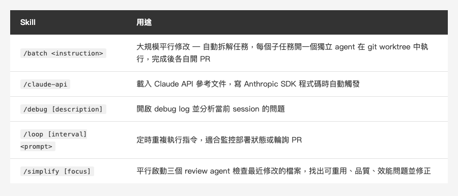
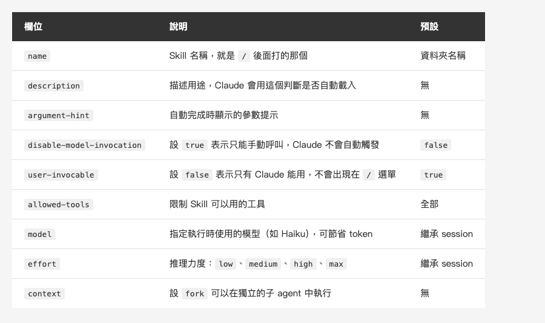
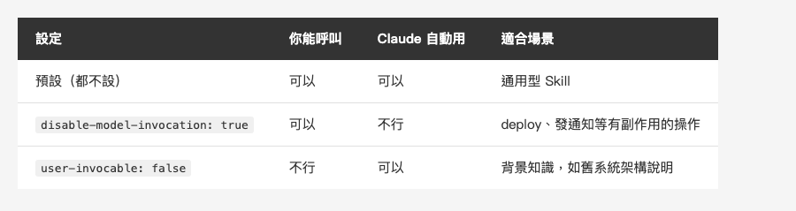

*(在這裡插入封面圖：cover.png)*

<!--
Gemini prompt: A cute Ghibli-inspired soft pastel illustration. A chibi engineer character stands in front of a magical toolbox labeled "Skills". The toolbox is open, glowing softly, with colorful tool icons floating out: a broom (clean), a document (convert), a magnifying glass (check). On the left side, a notebook labeled "CLAUDE.md" sits on a desk. The engineer looks excited, reaching for the floating tools. Soft pastel colors (mint, peach, lavender), white background, clean and simple. 16:9 ratio.
-->

# 讓 Claude Code 學會你的工作流 — Skills 自訂指令實戰

> CLAUDE.md 讓 AI 記住專案規範，Skills 讓 AI 學會你的工作方式。

---

## 前言

上次介紹 CLAUDE.md 的時候，很多人回饋說「終於不用每次都跟 AI 重複解釋專案規範了」。

但用了一段時間之後，你可能會發現一個問題：**有些事情不只是「規範」，而是一整套「工作流程」。**

比如說：
- 每次要清理程式碼裡被註解掉的舊 code，你都要打一大段描述
- 每次要把 Markdown 轉成 Word 交付，你都要交代 pandoc 的參數跟後處理
- 每次要 deploy，你都要解釋一遍步驟

這些不適合放進 CLAUDE.md，因為它們不是「永遠適用的規範」，而是「需要時才呼叫的能力」。

**這就是 Skills 要解決的問題。**

---

## Skills 是什麼？

Skills 是 Claude Code 的自訂指令系統。你建立一個 `SKILL.md` 檔案，寫好指令，Claude 就會把它加入工具箱。

呼叫方式有兩種：

- **手動呼叫**：直接打 `/skill-name`，就像用 CLI 指令一樣
- **自動呼叫**：Claude 會根據你的對話內容，判斷是否需要啟用某個 Skill

背後的機制是這樣的：Claude 在每個 session 裡**都會看到所有 Skill 的 description**（但不是完整內容），用來判斷什麼時候該自動啟用。只有在真正觸發的時候，完整的 `SKILL.md` 指令才會載入。

所以 **description 寫得好不好，直接影響 Claude 能不能在對的時機自動幫你用上對的 Skill。**

簡單記：**CLAUDE.md 是規範，Skills 是能力。**

*(在這裡插入圖片：skills-vs-claudemd.png)*

<!--
Gemini prompt: A cute Ghibli-inspired soft pastel illustration with two panels. Left panel "CLAUDE.md": a kawaii notebook with a checklist and gears icon, labeled "Rules - Always On". Right panel "Skills": a kawaii toolbox with colorful tools popping out, labeled "Abilities - On Demand". Both panels have a small chibi engineer character. Soft pastel colors, white background, simple and clean. 16:9 ratio.
-->

跟 CLAUDE.md 的差異：

*(在這裡插入圖片：table-comparison.png)*

<!--
| | CLAUDE.md | Skills |
|---|---|---|
| 用途 | 專案規範，每次啟動自動載入 | 特定工作流程，需要時才載入 |
| 觸發方式 | 永遠生效 | `/skill-name` 手動呼叫，或 Claude 自動判斷 |
| 適合放什麼 | coding style、架構說明、禁止事項 | 部署流程、程式碼清理、檔案轉換 |
| 放置位置 | 專案根目錄 | `.claude/skills/` 資料夾 |
-->

---

## 快速上手：建立第一個 Skill

一個 Skill 就是一個資料夾加一個 `SKILL.md`：

```
~/.claude/skills/my-skill/
└── SKILL.md
```

`SKILL.md` 的結構很簡單，上面是 YAML frontmatter，下面是 Markdown 指令：

```yaml
---
name: explain-code
description: 用類比和圖解來解釋程式碼
---

解釋程式碼時，請遵循以下步驟：

1. **先用比喻**：把程式碼比喻成日常生活中的東西
2. **畫一張圖**：用 ASCII art 呈現流程或結構
3. **逐步走讀**：step-by-step 解釋發生了什麼
4. **點出陷阱**：常見的錯誤或誤解是什麼？
```

然後就能用了：

```
/explain-code src/auth/login.ts
```

就這樣，沒有其他設定。

---

## Skills 放在哪裡？

放的位置決定了作用範圍：

*(在這裡插入圖片：table-scope.png)*

<!--
| 層級 | 路徑 | 作用範圍 |
|---|---|---|
| 個人 | `~/.claude/skills/<skill-name>/SKILL.md` | 你所有的專案 |
| 專案 | `.claude/skills/<skill-name>/SKILL.md` | 只有這個專案 |
| 企業 | managed settings 設定 | 組織內所有人 |
-->

**個人 Skills** 適合放你自己的工作習慣，像是程式碼清理、文件轉換這類你在每個專案都會用到的東西。

**專案 Skills** 適合放跟專案綁定的流程，commit 進 repo 之後團隊其他人也能用。

---

## 內建 Skills：開箱即用

Claude Code 本身就內建了幾個 Bundled Skills，不用安裝，每個 session 都能直接用：

*(在這裡插入圖片：table-bundled.png)*

<!--
| Skill | 用途 |
|---|---|
| `/batch <instruction>` | 大規模平行修改 — 自動拆解任務，每個子任務開一個獨立 agent 在 git worktree 中執行，完成後各自開 PR |
| `/claude-api` | 載入 Claude API 參考文件，寫 Anthropic SDK 程式碼時自動觸發 |
| `/debug [description]` | 開啟 debug log 並分析當前 session 的問題 |
| `/loop [interval] <prompt>` | 定時重複執行指令，適合監控部署狀態或輪詢 PR |
| `/simplify [focus]` | 平行啟動三個 review agent 檢查最近修改的檔案，找出可重用、品質、效能問題並修正 |
-->

這些 Bundled Skills 跟一般 Skill 的差別在於：它們是 **prompt-based**，不是固定邏輯，而是給 Claude 一套 playbook 讓它自己編排工作，包括啟動平行 agent、讀檔、根據 codebase 調整策略。

---

## 官方 Plugin Marketplace：一鍵安裝現成擴充

除了內建 Skills，Claude Code 還有一個官方的 **Plugin Marketplace**，可以在 [claude.com/plugins](https://claude.com/plugins) 瀏覽，也可以直接在 Claude Code 裡用 `/plugin` 指令開啟。

安裝方式很直覺：

```
/plugin install github@claude-plugins-official
```

目前 Marketplace 上的 Plugin 大致分成幾類：

**程式語言支援（Code Intelligence）**
— 安裝後 Claude 會透過 LSP（Language Server Protocol）獲得即時的型別檢查、跳轉定義、找引用等能力。支援 TypeScript、Python、Swift、Go、Rust、Java 等主流語言。

**外部服務整合**
— GitHub、GitLab、Slack、Jira/Confluence、Figma、Notion、Sentry、Vercel、Supabase 等，讓 Claude 直接跟這些工具互動。

**開發工作流**
— `commit-commands`（Git commit 流程）、`pr-review-toolkit`（PR Review）等，把常見的開發流程包裝成即用的指令。

Plugin 跟 Skill 的差別在於：**Plugin 是一個完整的擴充包**，裡面可以包含 Skills、Agents、Hooks、MCP Server，甚至 LSP Server。如果 Skill 是一把螺絲起子，Plugin 就是一整個工具箱。

團隊也可以建立自己的 Marketplace，把內部的 Plugin 集中管理：

```
/plugin marketplace add your-org/claude-plugins
```

成員加入後就能一鍵安裝團隊共用的工具，不用每個人自己設定。

*(在這裡插入圖片：plugin-marketplace.png)*

<!--
Gemini prompt: A cute Ghibli-inspired soft pastel illustration of a magical marketplace storefront. The shop sign reads "Plugin Marketplace". Shelves display colorful plugin boxes with labels like "GitHub", "TypeScript", "Slack". A chibi engineer character browses the shelves with a shopping basket. Some plugin boxes glow softly. Soft pastel colors (mint, peach, lavender, sky blue), white background, clean and simple. 16:9 ratio.
-->

**但每個團隊、每個人的工作流都不一樣，通用的 Plugin 和 Skill 不一定能完全符合你的需求。** 這時候就輪到自訂 Skills 出場了。

---

## 實戰範例：我自己在用的三個 Skills

光講觀念太抽象，直接來看我實際在用的 Skills。

### 範例一：clean-legacy — 清理被註解掉的程式碼

接手舊專案的人應該都很有感，到處都是被註解掉的程式碼，看了礙眼但又不敢亂刪，怕刪到有用的東西。

這個 Skill 就是專門做這件事的：

```yaml
---
name: clean-legacy
description: 清理遺留碼 - 刪除被註解掉的程式碼（非一般註解）並壓縮多餘空行
argument-hint: [file-path or directory]
user-invocable: true
---

# 清理遺留碼

當用戶要求清理程式碼時，執行以下任務：

## 1. 刪除被註解掉的程式碼（保留一般註解）

判斷標準 - 符合以下特徵的是「被註解掉的程式碼」，應刪除：
- `// let oldValue = 123` → 刪除（純程式碼）
- `// 這是說明註解，保留` → 保留（中文說明）
- `// MARK:`, `// TODO:` → 保留（標記用途）
- 檔案標頭的版權資訊 → 保留

## 2. 壓縮多餘空行
將連續 2 行以上的空行壓縮為 1 行
```

使用方式：

```
/clean-legacy Sources/MyClass.swift
/clean-legacy Sources/              # 整個目錄也行
```

**重點是那個判斷邏輯：** 它不會把所有註解都刪掉，而是會區分「被註解掉的程式碼」跟「真正的說明註解」。含中文的註解會保留，`// MARK:`、`// TODO:` 也會保留，只有看起來像程式碼的註解才會被清掉。

### 範例二：clean-check — 驗證清理結果

清完之後怕出事？再跑一個驗證：

```yaml
---
name: clean-check
description: 驗證 clean-legacy 執行結果 - 確認 git diff 只有刪除註解和空白行
argument-hint: [file-path (optional)]
user-invocable: true
---

# 驗證清理結果

在執行 clean-legacy 後使用，檢查 git diff 確認：
- 只有刪除（沒有新增程式碼）
- 刪除的都是註解或空白行
- 沒有誤刪實際程式碼
```

它會分析 git diff，把刪除的每一行分類成「安全刪除」或「可疑刪除」，有問題會列出來讓你確認：

```
✅ 檢查通過

📊 變更統計：
  - 刪除註解：23 行
  - 刪除空白：15 行
  - 總計：38 行安全刪除

結論：所有刪除都是註解或空白，沒有影響程式碼功能。
```

**這兩個 Skill 搭配使用**就是一個完整的工作流：先清理，再驗證。比起直接手動刪程式碼安全很多。

### 範例三：convert-docx — Markdown 轉 Word

工作上常常需要交付 Word 文件，但我都習慣用 Markdown 寫，最後再轉成 `.docx`。

問題是 pandoc 轉出來的表格框線會消失，每次都要手動修。所以我把整個流程包成一個 Skill：

```yaml
---
name: convert-docx
description: 將 Markdown 轉為 Word (.docx)，自動修正表格框線與欄寬
argument-hint: <md-file-path>
user-invocable: true
---

# Markdown 轉 Word（含表格框線修正）

1. 執行 pandoc 轉換
2. 執行 fix_tables.py 修正表格框線與欄寬
3. 開啟產出的 .docx 檔案
```

使用方式：

```
/convert-docx project-spec.md
```

一行搞定，不用記 pandoc 參數，也不用手動跑 Python 修表格。

**在官方 skill 基礎上加強**

Claude Code 有內建的 `docx` skill，底層也是用 pandoc，大部分場景已經很好用。不過 pandoc 轉出來的 Word 表格在 XML 層級少了 `<w:tblBorders>` 定義，開啟後表格框線會消失，欄寬也是固定值。

對交付文件來說，這個細節還是需要處理。實測同一份交付文件：

*(在這裡插入圖片：table-docx-compare.png)*

<!--
| 項目 | `/convert-docx` | 官方 `docx` skill (pandoc) |
|------|:---------------:|:-------------------------:|
| 表格框線 | ✅ 完整 | ❌ 無框線 |
| 欄寬 | ✅ 自動分配 | ❌ 固定寬度 |
| 圖片嵌入 | ✅ 正常 | ✅ 正常 |
| 操作步驟 | 1 步完成 | 1 步（但需手動修框線） |
-->

自訂 Skill 多了一個 `fix_tables.py` 後處理腳本，用 `python-docx` 對每張表格補上框線、把欄寬改成 autofit，轉完直接可以交付。

**這就是自訂 Skill 的價值：在官方工具的基礎上，針對自己的需求再加強。**

*(在這裡插入圖片：skills-workflow.png)*

<!--
Gemini prompt: A cute Ghibli-inspired soft pastel illustration showing a workflow. Three kawaii tool icons in a row connected by arrows: (1) a broom icon labeled "clean-legacy" sweeping code, (2) a magnifying glass with checkmark labeled "clean-check" inspecting, (3) a document icon with Word logo labeled "convert-docx" transforming. A small chibi engineer character watches happily. Soft pastel colors, white background, clean layout. 16:9 ratio.
-->

---

## Frontmatter 設定參考

`SKILL.md` 最上面的 YAML 可以控制 Skill 的行為，幾個常用的欄位：

*(在這裡插入圖片：table-frontmatter.png)*

<!--
| 欄位 | 說明 | 預設 |
|---|---|---|
| `name` | Skill 名稱，就是 `/` 後面打的那個 | 資料夾名稱 |
| `description` | 描述用途，Claude 會用這個判斷是否自動載入 | 無 |
| `argument-hint` | 自動完成時顯示的參數提示 | 無 |
| `disable-model-invocation` | 設 `true` 表示只能手動呼叫，Claude 不會自動觸發 | `false` |
| `user-invocable` | 設 `false` 表示只有 Claude 能用，不會出現在 `/` 選單 | `true` |
| `allowed-tools` | 限制 Skill 可以用的工具 | 全部 |
| `model` | 指定執行時使用的模型（如 Haiku），可節省 token | 繼承 session |
| `effort` | 推理力度：`low`、`medium`、`high`、`max` | 繼承 session |
| `context` | 設 `fork` 可以在獨立的子 agent 中執行 | 無 |
-->

---

## 誰能觸發？兩個關鍵設定

這是比較容易搞混的地方，用一張表釐清：

*(在這裡插入圖片：table-invocation.png)*

<!--
| 設定 | 你能呼叫 | Claude 自動用 | 適合場景 |
|---|---|---|---|
| 預設（都不設） | 可以 | 可以 | 通用型 Skill |
| `disable-model-invocation: true` | 可以 | 不行 | deploy、發通知等有副作用的操作 |
| `user-invocable: false` | 不行 | 可以 | 背景知識，如舊系統架構說明 |
-->

**小提醒：** deploy 這類有副作用的操作，一定要加 `disable-model-invocation: true`。你不會想要 Claude 覺得「程式碼看起來準備好了」就自己跑 deploy。

---

## 帶參數的 Skill

Skill 可以接收參數，用 `$ARGUMENTS` 佔位符：

```yaml
---
name: fix-issue
description: 修復 GitHub issue
disable-model-invocation: true
---

修復 GitHub issue $ARGUMENTS，遵循專案 coding standards。

1. 讀取 issue 描述
2. 理解需求
3. 實作修正
4. 寫測試
5. 建立 commit
```

```
/fix-issue 123
```

Claude 會把 `$ARGUMENTS` 替換成 `123`。

如果有多個參數，可以用 `$0`、`$1`、`$2` 取得個別值：

```yaml
---
name: migrate-component
description: 從一個框架遷移元件到另一個
---

將 $0 元件從 $1 遷移到 $2，保留所有既有行為和測試。
```

```
/migrate-component SearchBar React Vue
```

---

## 進階：注入動態內容

Skills 支援 `` !`command` `` 語法，在 Skill 送給 Claude 之前先執行 shell 指令，把結果塞進去：

```yaml
---
name: pr-summary
description: 摘要 PR 的變更內容
context: fork
---

## PR 資訊
- PR diff: !`gh pr diff`
- 改了哪些檔案: !`gh pr diff --name-only`

根據以上資訊，產出 PR 摘要。
```

這個 `` !`gh pr diff` `` 會先跑 `gh pr diff`，把輸出結果替換進去，Claude 看到的是實際的 diff 內容，不是指令本身。

---

## 進階：附帶檔案的 Skill

Skill 不只有 `SKILL.md`，可以帶一整個資料夾：

```
my-skill/
├── SKILL.md           # 主要指令（必要）
├── template.md        # 範本檔案
├── examples/
│   └── sample.md      # 範例輸出
└── scripts/
    └── validate.sh    # Claude 可以執行的腳本
```

像我的 `convert-docx` 就附帶了一個 `fix_tables.py` 腳本，Claude 執行轉換流程時會自動找到並執行它。

**重點：** 在 `SKILL.md` 裡面要引用這些檔案，Claude 才知道它們存在：

```markdown
## 附件資料

- 完整 API 文件：見 [reference.md](reference.md)
- 使用範例：見 [examples.md](examples.md)
```

官方建議 `SKILL.md` 控制在 500 行以內，太詳細的參考資料放附件。

---

## 跟舊版 commands 的關係

如果你之前用過 `.claude/commands/`，別擔心，**舊的 commands 完全相容**。

- `.claude/commands/deploy.md` 跟 `.claude/skills/deploy/SKILL.md` 效果一樣
- 如果兩邊同名，Skills 優先
- Skills 多了 frontmatter 設定跟附帶檔案的能力

不需要急著遷移，但新建的建議直接用 Skills 格式。

---

## 番外：寫文章時順手做了第四個 Skill

其實這篇文章裡的表格圖片，也是用 Skill 產的。

寫到一半發現每篇文章都在做同樣的事：Markdown 表格 → HTML → 截圖 → PNG。手動一張一張處理很繁瑣，而且每次都要記住那套 HTML 樣式跟 playwright 指令。

於是就順手包成了 `/gen-table-image`：

```yaml
---
name: gen-table-image
description: 從 Markdown 文章中的 HTML comment 提取表格，轉為 PNG 圖片
argument-hint: <md-file-path> [table-name]
disable-model-invocation: true
---
```

使用方式：

```
/gen-table-image index.md                    # 產出文章裡全部表格圖片
/gen-table-image index.md table-comparison   # 只重產某一張
```

它會自動掃描 `.md` 檔案，找出 `` 搭配 HTML comment 裡的 Markdown 表格，轉成帶樣式的 HTML 再用 playwright 截圖。概念圖（含 Gemini prompt 的）會自動跳過。

這篇文章裡的 6 張表格圖片，就是一行指令產出的。

**Skill 就是這樣自然誕生的 — 不是刻意規劃，而是做到第二次重複的事情時，順手包起來。**

---

## 寫好 Skill 的幾個建議

用了一段時間，整理了幾個心得：

1. **Description 要寫好** — Claude 靠 description 判斷何時自動載入，關鍵詞要包含使用者會說的話
2. **有副作用的加 `disable-model-invocation`** — deploy、發通知、改 production，手動觸發才安全
3. **善用參數** — 讓 Skill 更靈活，一個 Skill 處理多種情境
4. **搭配使用** — 像 clean-legacy + clean-check，多個 Skill 組成一套工作流
5. **個人 vs 專案** — 個人習慣放 `~/.claude/skills/`，團隊流程放專案的 `.claude/skills/` 並 commit 進 repo
6. **用對模型省 token** — 不是每個 Skill 都需要最強的模型。像程式碼清理、格式轉換這類模式匹配的任務，在 frontmatter 加上 `model: haiku` 就能用更快更便宜的模型執行，效果一樣好但 token 成本低很多

---

## 總結

CLAUDE.md 解決了「AI 不懂專案規範」的問題，Skills 進一步解決了「AI 不會你的工作流程」的問題。

三個關鍵觀念：

- **CLAUDE.md 是規範，Skills 是能力** — 前者永遠生效，後者按需呼叫
- **Skill = 一個 SKILL.md + 可選的附帶檔案** — 結構簡單，上手容易
- **控制誰能觸發很重要** — 有副作用的操作一定要設成只能手動呼叫

一句話總結的話：**Skills 讓你把重複的工作流程變成一行指令。**

如果你已經有在用 Claude Code，建議從最常重複做的事情開始，包成你的第一個 Skill。一旦開始用，你會發現到處都是可以自動化的機會。

感謝閱讀。如果你也有在用 Claude Code，歡迎留言分享你寫了什麼好用的 Skill。
