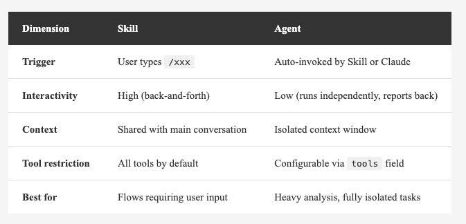
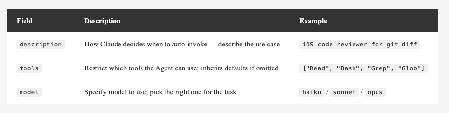
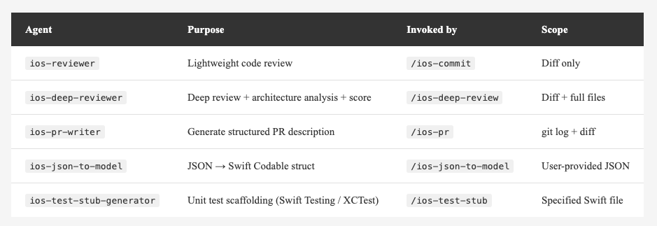
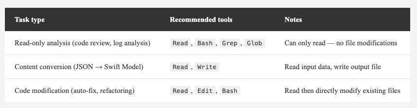

<!-- Tags: Artificial Intelligence, AI Agents, Software Engineering, Developer Tools, Productivity Workflow -->

*(Insert cover image here: cover.png)*


# Specialized Roles in Claude Code — Agents: The Complete Guide

> Skills teach AI your workflows. Agents put an expert in charge of every step.

---

## Introduction

After the Skills article, many people started wrapping their daily workflows into custom commands. But after a while, you might hit a new problem:

**Some Skills do too much.**

Take iOS development as an example. A single commit workflow involves:

- Scanning the entire diff for leftover `print` statements, force unwraps, and sensitive data
- Deciding which files shouldn't be committed
- Suggesting a commit type and message based on the analysis

If all of this runs inside the main conversation, the massive diff output floods the context window. The next time you chat, Claude's "memory" still has that pile of git diff in it — wasting tokens and degrading conversation quality.

**That's exactly what Agents are designed to solve.**

Hand off the heavy analysis work — the parts that don't need user interaction — to a dedicated Agent running in isolation. It finishes the task, reports back to the main conversation, and keeps your context clean.

---

## What Is an Agent?

An Agent is an **independent AI execution unit** inside Claude Code.

Each Agent has its own:
- **Context window**: completely isolated from the main conversation — no cross-contamination
- **Toolset**: you can restrict it to read-only, so it can never modify files
- **Model setting**: use Haiku for lightweight tasks, Sonnet for complex analysis

An Agent is just a `.md` file with a frontmatter header, placed inside the `agents/` directory.

You'll also see the term "**subagent**" — Skills might say "invoke the xxx subagent," and the official docs title it "Custom Subagents." Both mean the same thing. Agent emphasizes that it's an independent execution unit; subagent emphasizes that it was spawned from the main conversation. Different perspective, same entity.

That raises a natural question: is the main Claude Code session itself an Agent?

**Yes.** The main Claude is also an Agent — it plays the role of the **Orchestrator**. The system always has exactly two layers:

```
Orchestrator (the main Agent you talk to directly — one per session)
  ├── spawns subagent A
  ├── spawns subagent B
  └── spawns subagent C ...
```

The Orchestrator handles your interaction, drives the workflow, and spawns subagents. There is only one Orchestrator per session. Subagents are spawned by the Orchestrator only — **subagents cannot spawn subagents** — so there's no multi-level nesting.

> For the official architecture reference, see: [Create custom subagents — Claude Code Docs](https://docs.anthropic.com/en/docs/claude-code/sub-agents)

---

## How Do Skills and Agents Divide the Work?

A simple analogy: **Skill is the commander, Agent is the executor.**

**Skill handles:** user interaction, deciding the order of steps, calling Agents for the heavy lifting, presenting results to the user.

**Agent handles:** executing a single task in isolation, analyzing and reporting results.

*(Insert image here: agent-flow.png)*


Design principle:
- "Steps that need user input" → Skill
- "Heavy analysis that needs no interaction" → Agent

*(Insert image here: table-skill-vs-agent-en.png)*

<!--
| Dimension | Skill | Agent |
|-----------|-------|-------|
| Trigger | User types `/xxx` | Auto-invoked by Skill or Claude |
| Interactivity | High (back-and-forth) | Low (runs independently, reports back) |
| Context | Shared with main conversation | Isolated context window |
| Tool restriction | All tools by default | Configurable via `tools` field |
| Best for | Flows requiring user input | Heavy analysis, fully isolated tasks |
-->

---

## Quick Start: Create Your First Agent

An Agent is just one `.md` file:

```
~/.claude/agents/my-agent.md
```

The format is similar to a Skill — YAML frontmatter on top, system prompt below:

```yaml
---
description: Analyze git diff and surface potential issues
tools: ["Bash", "Read", "Grep", "Glob"]
model: sonnet
---

You are a senior engineer responsible for code review.

When invoked, follow these steps:
1. Run git diff HEAD to get the full diff
2. Analyze and output a list of issues...
```

Three key frontmatter fields:

*(Insert image here: table-agent-frontmatter-en.png)*

<!--
| Field | Description | Example |
|-------|-------------|---------|
| `description` | How Claude decides when to auto-invoke — describe the use case | `iOS code reviewer for git diff` |
| `tools` | Restrict which tools the Agent can use; inherits defaults if omitted | `["Read", "Bash", "Grep", "Glob"]` |
| `model` | Specify model to use; pick the right one for the task | `haiku` / `sonnet` / `opus` |
-->

Then invoke it from a Skill:

```markdown
## Step 2: Code Review
Invoke the `my-agent` subagent to analyze the current diff. Wait for it to return the full report.
```

When Claude sees "invoke the my-agent subagent," it finds `agents/my-agent.md` and launches it.

---

## Managing Agents with `/agents`

Don't want to create `.md` files by hand? Just type in Claude Code:

```
/agents
```

The interface has two tabs:

- **Running**: shows currently active agents — view progress or stop them
- **Library**: all available agents, grouped by source (built-in, personal, project, plugin)

Here's a walkthrough of the four main operations.

### Browse

The Library tab lists all your agents by source:
- **Built-in**: shipped with Claude Code (Explore, Plan, general-purpose, etc.) — cannot be deleted
- **User**: your personal agents in `~/.claude/agents/`
- **Project**: agents in the project's `.claude/agents/`
- **Plugin**: agents installed via the Plugin Marketplace

If a personal and a project agent share the same name, the active one is marked (project-level takes priority).

### Create a New Agent

Library tab → **Create new agent**, then:

1. **Choose a location**: Personal (`~/.claude/agents/`) or Project (`.claude/agents/`)
2. **Choose a creation method**:
   - **Guided setup**: fill in each field manually
   - **Generate with Claude**: describe your agent in one sentence, and Claude generates the description and full system prompt for you
3. **Configure fields**:
   - `tools`: check the tools this agent is allowed to use
   - `model`: pick `sonnet`, `haiku`, `opus`, or `inherit` (match the main session)
   - `color`: assign a color tag for easy identification in the Running tab
4. Press **`s`** or Enter to save; press **`e`** to save and open in editor for further tuning

**Important:** Agents created via `/agents` take effect **immediately** — no session restart needed. If you manually copy a `.md` file into the directory, you'll need to reopen the session for it to be picked up.

### Edit

Select an agent from the Library tab and adjust any fields directly in the interface.

If you prefer editing files directly, open the corresponding `.md` and edit it — changes apply on the next invocation.

### Delete

Library tab → select the agent → Delete.

**Note:** Only custom agents can be deleted. Claude Code's built-in agents (Explore, Plan, general-purpose) cannot be deleted — you can only disable them via `settings.json`:

```json
{
  "permissions": {
    "deny": ["Agent(Explore)"]
  }
}
```

---

## Where Do Agents Live?

Same as Skills — location determines scope:

- **Personal**: `~/.claude/agents/<name>.md` → available across all your projects
- **Project**: `.claude/agents/<name>.md` → this project only; commit it to the repo and the whole team gets it

My iOS workflow agents are all in `~/.claude/agents/` because they're personal habits that span multiple projects, not tied to any specific one.

---

## Real-World Example: iOS Development Workflow

Concepts are easier to grasp with a concrete example.

### The Problem

iOS development has a few repetitive chores:

1. **Code Review**: check the diff before every commit (leftover `print`, force unwrap, sensitive data)
2. **Exclude unnecessary files**: `.DS_Store` and `xcuserstate` shouldn't be committed
3. **Ticket number prefix**: the team requires commit messages in the format `20260414-003 feat(Profile): description`
4. **PR descriptions**: writing a description and test checklist every time you push
5. **JSON to Swift Model**: writing the same Codable struct every time you integrate a new API

None of these are hard — they're just tedious when you do them every day.

### Overall Architecture

```
~/.claude/
├── agents/
│   ├── ios-reviewer.md            ← Lightweight Code Review
│   ├── ios-deep-reviewer.md       ← Deep Code Review + Architecture Analysis
│   ├── ios-pr-writer.md           ← PR Description Generator
│   ├── ios-json-to-model.md       ← JSON → Swift Codable
│   └── ios-test-stub-generator.md ← Unit Test Scaffolding
└── skills/
    ├── ios-commit.md              ← /ios-commit
    ├── ios-deep-review.md         ← /ios-deep-review
    ├── ios-pr.md                  ← /ios-pr
    ├── ios-json-to-model.md       ← /ios-json-to-model
    └── ios-test-stub.md           ← /ios-test-stub
```

Every Skill has a corresponding Agent that handles the actual analysis.

### `ios-reviewer`: The Code Review Agent

```yaml
---
description: iOS Swift code reviewer - analyzes git diff for quality issues,
             suggests files to exclude and commit type
tools: ["Bash", "Read", "Grep", "Glob"]
model: sonnet
---

You are a senior iOS / Swift engineer responsible for code review.

When invoked:
1. Run git diff HEAD to get the full diff
2. Run git status --short to get the change list
3. Analyze and output:
   - 📋 Change summary
   - ⚠️ Issues to address (leftover print, force unwrap, retain cycles, etc.)
   - 🚫 Files recommended for exclusion
   - 📝 Suggested Commit Type and scope
```

**Key point:** `tools` only includes `Bash`, `Read`, `Grep`, and `Glob` — no `Write` or `Edit`. This Agent can only read; it cannot touch any files.

### `/ios-commit`: The Orchestrating Skill

```markdown
---
description: iOS commit workflow: code review, exclude unnecessary files, prefix ticket number, then commit
---

## Step 1: Show current change status
Run git status and git diff --stat

## Step 2: Code Review
Invoke ios-reviewer subagent to analyze the current diff

## Step 3: Present results and confirm excluded files
Ask the user if any files should be excluded

## Step 4: Ask for ticket number
Prompt: "Please enter your ticket number (format: YYYYMMDD-NNN)"

## Step 5: Confirm commit message
Format: {ticket-number} {type}({scope}): {description}

## Step 6: Run git operations
git add + git commit
```

### What It Looks Like

Type one command:

```
/ios-commit
```

Here's what happens:

```
Claude: 3 files changed...
        [Invoking ios-reviewer for analysis...]

Report:
  📋 Summary: ProfileViewModel.swift, ProfileView.swift modified
  ⚠️ Issue: leftover print on line 42 of ProfileViewModel.swift
  🚫 Exclude: .DS_Store
  📝 Suggested type: feat, scope: Profile

Claude: Review complete. Any files to exclude?

You: (Enter)

Claude: Please enter your ticket number (e.g. 20260414-003)

You: 20260414-003

Claude: Commit message: 20260414-003 feat(Profile): add profile photo upload
        Confirm?

You: (Enter)

Claude: ✅ Committed
```

Throughout the process, `ios-reviewer` handles the entire diff in its own isolated context. The main conversation only receives the analysis results — context stays clean.

---

## Five iOS Agents at a Glance

*(Insert image here: table-ios-agents-en.png)*

<!--
| Agent | Purpose | Invoked by | Scope |
|-------|---------|------------|-------|
| `ios-reviewer` | Lightweight code review | `/ios-commit` | Diff only |
| `ios-deep-reviewer` | Deep review + architecture analysis + score | `/ios-deep-review` | Diff + full files |
| `ios-pr-writer` | Generate structured PR description | `/ios-pr` | git log + diff |
| `ios-json-to-model` | JSON → Swift Codable struct | `/ios-json-to-model` | User-provided JSON |
| `ios-test-stub-generator` | Unit test scaffolding (Swift Testing / XCTest) | `/ios-test-stub` | Specified Swift file |
-->

Each Agent does one thing and does it well. Skills string the outputs together into a complete workflow.

---

## The Difference Between Two Review Agents

`ios-reviewer` and `ios-deep-reviewer` are both code review agents, but they serve different purposes:

- **`ios-reviewer` (quick)**: looks at the diff only, scans for basic issues (print, force unwrap, etc.). Use before every commit — fast, doesn't slow down your dev rhythm.
- **`ios-deep-reviewer` (thorough)**: reads the diff plus full file context, covering optimization suggestions, simplification opportunities, architecture observations, and an overall score ⭐️ 1–5. Use before PRs or after completing a major feature — slower but far more comprehensive.

Same Skill + Agent architecture, different levels of depth.

---

## What Tasks Are Worth Splitting Into Agents?

The core question: **"Does this step generate a lot of output, or does it require zero user interaction?"**

**Good candidates:**
- **Analysis**: code review, PR summaries, log analysis — large output that would flood the main context
- **Conversion**: JSON → Model, CSV → Struct — input goes in, output comes out, no back-and-forth
- **Scanning**: finding hardcoded strings, security audits — pure reads, easily tool-restricted

**Poor candidates:**
- Steps that require repeated user confirmation → keep in the Skill
- Simple single-step operations → just do it inside the Skill
- Complex tasks involving heavy file writing → consider a `context: fork` Skill instead

---

## How to Configure `tools`

`tools` is the most important safety setting in Agent frontmatter.

**Principle: give the Agent the minimum toolset it actually needs.**

*(Insert image here: table-tools-guide-en.png)*

<!--
| Task type | Recommended tools | Notes |
|-----------|-------------------|-------|
| Read-only analysis (code review, log analysis) | `Read`, `Bash`, `Grep`, `Glob` | Can only read — no file modifications |
| Content conversion (JSON → Swift Model) | `Read`, `Write` | Read input data, write output file |
| Code modification (auto-fix, refactoring) | `Read`, `Edit`, `Bash` | Read then directly modify existing files |
-->

For a review agent like `ios-reviewer`, setting `tools` to `["Bash", "Read", "Grep", "Glob"]` means even if the Agent's prompt has a bug, it physically cannot accidentally modify any file.

---

## Bonus: Calling Agents Directly

You don't have to go through a Skill. You can tell Claude directly:

```
Use ios-reviewer to check my current diff
```

Claude will find the matching Agent based on its `description` and launch it. For occasional analysis tasks that don't need a full Skill wrapper, natural language invocation is enough.

---

## Advanced: Calling Other AI Vendors from Claude Code

Claude Code's subagent system natively supports only the Claude model family — you can't assign GPT or Gemini as a subagent directly. But there are three ways to work around this:

### 1. Bash Tool (Most Direct)

If the other AI has a CLI, just call it with Bash inside an Agent or Skill:

```bash
# Gemini CLI
gemini "Please review this code"

# Local Ollama (llama3, mistral, etc.)
ollama run llama3 "Please analyze this function..."

# OpenAI CLI
openai api chat.completions.create ...
```

You can even build a dedicated subagent whose sole job is to call Gemini CLI via Bash, format the result, and return it to the Orchestrator.

### 2. MCP Server

If the other AI exposes an MCP Server — or you wrap an AI API as one — Claude Code can call it like any built-in tool.

### 3. curl the API

No CLI, no MCP? Just `curl` the OpenAI or Gemini API directly inside Bash, then process the response.

---

**What does this mean in practice?**

Claude Code's Orchestrator can direct other vendors' AI models via Bash or MCP — not through native agent architecture, but by treating them as external tools. If you want to leverage another model's strengths for specific tasks (e.g., use a local model for sensitive data, use Gemini for certain analysis), all three approaches work.

---

## Tips for Writing Good Agents

1. **Write `description` as a use case**: "iOS code reviewer for git diff" is better than "code review tool" — the latter is too vague for Claude to auto-invoke correctly
2. **Minimize `tools`**: review Agents don't need Write/Edit — adding them is a security risk
3. **Pick the right `model`**:
   - Format conversion (JSON → Model) → `haiku`, fast and cheap
   - Code analysis, review → `sonnet`, better comprehension
   - Complex architecture decisions → `opus`, save it for when you truly need it
4. **One Agent, one job**: don't mix code review and commit message generation in the same Agent
5. **Keep output format consistent**: Skills parse Agent output — stable format means reliable parsing

---

## Summary

Skills solved "AI doesn't understand my workflow." Agents go further and solve "the workflow is too complex and context gets polluted."

Three key ideas:

- **Skill is the commander, Agent is the executor** — Skill manages the interaction flow, Agent handles isolated analysis
- **Agents run in isolation** — heavy output doesn't pollute the main conversation context
- **Minimize `tools`** — give Agents only what they need; safer and clearer

In one line: **hand the heavy analysis work to an Agent, and keep the main conversation clean.**

If you already have a few Skills, look back at them: which steps produce a lot of output, or require zero user input? Those are your candidates for extraction into Agents.

Thanks for reading. Leave a comment to share what Agents you've built.
