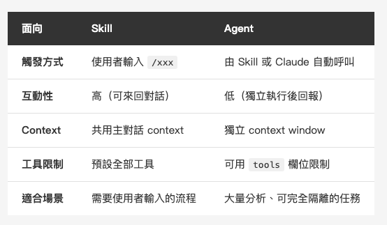
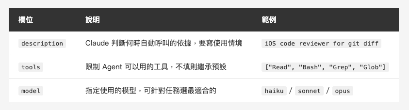
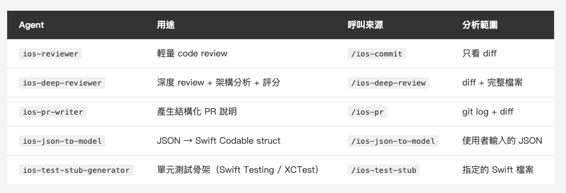
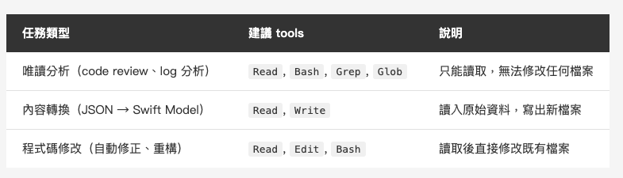

<!-- Tags: Artificial Intelligence, AI Agents, Software Engineering, Developer Tools, Productivity Workflow -->

*(在這裡插入封面圖：cover.png)*

<!--
Gemini prompt: A cute Ghibli-inspired soft pastel illustration. A chibi engineer character stands at a command center, holding a clipboard. Around them, four small robot characters each carry a specialized tool: one holds a magnifying glass (reviewer), one holds a document (PR writer), one holds code brackets (model generator), one holds a test tube (test stub). The engineer is pointing and directing. Soft pastel colors (mint, peach, lavender), white background, clean and simple. 16:9 ratio.
-->

# 讓 Claude Code 擁有專業分工 — Agents 攻略

> Skills 讓 AI 學會工作流程，Agents 讓每個步驟都有專家負責。

---

## 前言

上篇介紹 Skills 之後，很多人開始把日常工作流程包成一個個指令。但用一段時間後，你可能會遇到一個新問題：

**有些 Skill 做的事情太複雜了。**

以 iOS 開發為例，一個 commit 流程要做的事：

- 掃描整份 diff，找出 `print` 殘留、force unwrap、敏感資訊
- 判斷哪些檔案不應該 commit
- 根據分析結果建議 commit type 和 message

如果這些都在主對話裡執行，大量的 diff 輸出會塞滿 context window。後續繼續聊的時候，Claude 的「記憶」裡還殘留著那一大堆 git diff，既佔 token 又影響對話品質。

**這就是 Agents 要解決的問題。**

把需要大量分析、不需要用戶互動的部分，交給一個**獨立的 Agent 去執行**。它在隔離環境裡完成任務，把結果回報給主對話，context 保持乾淨。

---

## Agent 是什麼？

Agent 是 Claude Code 裡的**獨立 AI 執行單元**。

每個 Agent 有自己的：
- **Context window**：跟主對話完全隔離，不互相污染
- **工具集**：可以限制它只能讀取、不能修改
- **模型設定**：輕量任務用 Haiku，複雜分析用 Sonnet

一個 Agent 就是一個帶有 frontmatter 的 `.md` 檔案，放在 `agents/` 目錄裡。

你可能也會看到「**subagent**」這個詞——Skill 裡寫「呼叫 xxx subagent」、官方文件標題寫 Custom Subagents，指的都是同一件事。Agent 強調它是獨立執行單元，subagent 強調它從主對話被派生出去，場景不同，本質一樣。

說到這裡，你可能會想：那我平常跟 Claude Code 對話的那個主視窗，也算是 Agent 嗎？

**是的。** 那個主要的 Claude 本質上也是一個 Agent，扮演的是**協調者（Orchestrator）**的角色。整個系統的架構是固定兩層：

```
Orchestrator（你直接對話的主 Agent，每個 session 只有一個）
  ├── 派生 subagent A
  ├── 派生 subagent B
  └── 派生 subagent C ...
```

Orchestrator 負責跟你互動、決定流程、派生 subagents。一個 session 只有一個 Orchestrator。Subagent 只能由 Orchestrator 派生，**subagent 不能再派生 subagent**，所以不會有多層巢狀。

> 以上架構說明可參考官方文件：[Create custom subagents — Claude Code Docs](https://docs.anthropic.com/en/docs/claude-code/sub-agents)

---

## Skill 跟 Agent 怎麼分工？

一個簡單的比喻：**Skill 是指揮官，Agent 是執行者。**

Skill 負責：與使用者互動、決定工作順序、呼叫 Agent 執行重活、把結果呈現給使用者

Agent 負責：在隔離環境裡執行單一任務、分析後回報結果

*(在這裡插入圖片：agent-flow.png)*

<!--
Gemini prompt: A cute Ghibli-inspired soft pastel illustration showing two characters. Left: a chibi engineer labeled "Skill" holding a clipboard and pointing. Right: a kawaii robot labeled "Agent" holding a magnifying glass, inside a rounded box labeled "Isolated Context". An arrow goes from the engineer to the robot (labeled "Invoke"), and a smaller arrow returns (labeled "Report Results"). Soft pastel colors, white background, clean layout. 16:9 ratio.
-->

設計原則：
- 「需要使用者輸入的部分」→ Skill
- 「大量分析、不需要互動的部分」→ Agent

*(在這裡插入圖片：table-skill-vs-agent.png)*

<!--
| 面向 | Skill | Agent |
|------|-------|-------|
| 觸發方式 | 使用者輸入 `/xxx` | 由 Skill 或 Claude 自動呼叫 |
| 互動性 | 高（可來回對話） | 低（獨立執行後回報） |
| Context | 共用主對話 context | 獨立 context window |
| 工具限制 | 預設全部工具 | 可用 `tools` 欄位限制 |
| 適合場景 | 需要使用者輸入的流程 | 大量分析、可完全隔離的任務 |
-->

---

## 快速上手：建立第一個 Agent

一個 Agent 的完整結構只有一個 `.md` 檔案：

```
~/.claude/agents/my-agent.md
```

格式跟 Skill 很像，上面是 YAML frontmatter，下面是給 Agent 的 system prompt：

```yaml
---
description: 分析 git diff 找出潛在問題
tools: ["Bash", "Read", "Grep", "Glob"]
model: sonnet
---

你是一位資深工程師，負責程式碼審查。

當被呼叫時，請執行以下步驟：
1. 執行 git diff HEAD 取得完整 diff
2. 分析後輸出問題清單...
```

三個關鍵 frontmatter 欄位：

*(在這裡插入圖片：table-agent-frontmatter.png)*

<!--
| 欄位 | 說明 | 範例 |
|------|------|------|
| `description` | Claude 判斷何時自動呼叫的依據，要寫使用情境 | `iOS code reviewer for git diff analysis` |
| `tools` | 限制 Agent 可以用的工具，不填則繼承預設 | `["Read", "Bash", "Grep", "Glob"]` |
| `model` | 指定使用的模型，可以針對任務選最適合的 | `haiku` / `sonnet` / `opus` |
-->

然後在 Skill 裡呼叫：

```markdown
## 步驟 2：Code Review
呼叫 `my-agent` subagent 對目前 diff 進行分析，等待它回傳完整報告。
```

Claude 看到「呼叫 my-agent subagent」就會找到 `agents/my-agent.md`，啟動它執行任務。

---

## 用 `/agents` 管理你的 Agent

不想手動建立 `.md` 檔案？直接在 Claude Code 裡輸入：

```
/agents
```

介面分成兩個 tab：

- **Running**：顯示目前正在執行中的 agents，可以查看進度或中止
- **Library**：所有可用的 agents，依來源分組（內建、個人、專案、Plugin）

以下逐一說明四個主要操作。

### 瀏覽

Library tab 會把你所有的 agents 依來源列出，包含：
- **Built-in**：Claude Code 內建（Explore、Plan、general-purpose 等），不可刪除
- **User**：你放在 `~/.claude/agents/` 的個人 agents
- **Project**：專案的 `.claude/agents/` 裡的 agents
- **Plugin**：透過 Plugin Marketplace 安裝的 agents

如果個人跟專案有同名的 agent，會標示哪一個是目前 **active**（專案層級優先）。

### 建立新 Agent

Library tab → 選 **Create new agent**，接著：

1. **選擇存放位置**：Personal（`~/.claude/agents/`）或 Project（`.claude/agents/`）
2. **選擇建立方式**：
   - **Guided setup**：逐欄位手動填寫
   - **Generate with Claude**：用一句話描述你要的 agent，Claude 自動幫你生成 description 和完整 system prompt
3. **設定欄位**：
   - `tools`：勾選這個 agent 能用的工具
   - `model`：選 `sonnet`、`haiku`、`opus`，或維持 `inherit`（跟主對話相同）
   - `color`：指定顏色標籤，方便在 Running tab 辨識不同 agent
4. 按 **`s`** 或 Enter 儲存；或按 **`e`** 儲存後直接在編輯器開啟繼續細調

**重要：** 透過 `/agents` 介面建立的 agent **立即生效**，不需要重啟 session。若你是直接手動把 `.md` 檔案複製到目錄，則需要重新開啟 session 才能讀到。

### 編輯

從 Library tab 選擇要修改的 agent，可以直接在介面裡調整所有欄位。

喜歡直接改檔案的話，開對應的 `.md` 手動編輯也行，存檔後下次呼叫就會生效。

### 刪除

從 Library tab 選要刪除的 agent → 選 Delete。

**注意：** 只有自訂 agent 可以刪除，Claude Code 的內建 agents（Explore、Plan、general-purpose）不能刪除，只能透過 `settings.json` 停用：

```json
{
  "permissions": {
    "deny": ["Agent(Explore)"]
  }
}
```

---

## Agent 放在哪裡？

跟 Skills 一樣，位置決定作用範圍：

- **個人**：`~/.claude/agents/<name>.md` → 你所有的專案都能使用
- **專案**：`.claude/agents/<name>.md` → 只有這個專案，commit 進 repo 後團隊都能用

我的 iOS workflow agents 都放在 `~/.claude/agents/`，因為這是跨專案的個人習慣，不綁定特定專案。

---

## 實戰：iOS 開發工作流程

光講概念太抽象，直接看一個完整的真實範例。

### 問題背景

iOS 開發裡有幾件重複的瑣事：

1. **Code Review**：每次 commit 前確認 diff 沒有問題（print 殘留、force unwrap、敏感資訊）
2. **排除不必要檔案**：`.DS_Store`、`xcuserstate` 不應 commit
3. **派工單號前綴**：假設團隊要求 commit message 格式為 `20260414-003 feat(Profile): 說明`
4. **PR 說明撰寫**：每次推 PR 都要手寫說明、測試項目
5. **JSON 轉 Swift Model**：串接 API 時重複的 Codable struct 撰寫

每一件都不難，但每天都要做就很煩。

### 整體架構

```
~/.claude/
├── agents/
│   ├── ios-reviewer.md            ← 輕量 Code Review
│   ├── ios-deep-reviewer.md       ← 深度 Code Review + 架構分析
│   ├── ios-pr-writer.md           ← PR 說明產生器
│   ├── ios-json-to-model.md       ← JSON → Swift Codable
│   └── ios-test-stub-generator.md ← 單元測試骨架
└── skills/
    ├── ios-commit.md              ← /ios-commit
    ├── ios-deep-review.md         ← /ios-deep-review
    ├── ios-pr.md                  ← /ios-pr
    ├── ios-json-to-model.md       ← /ios-json-to-model
    └── ios-test-stub.md           ← /ios-test-stub
```

每個 Skill 背後都有一個對應的 Agent 負責實際的分析。

### `ios-reviewer`：負責 Code Review 的 Agent

```yaml
---
description: iOS Swift code reviewer - analyzes git diff for quality issues,
             suggests files to exclude and commit type
tools: ["Bash", "Read", "Grep", "Glob"]
model: sonnet
---

你是一位資深 iOS / Swift 工程師，專責 Code Review。

當被呼叫時：
1. 執行 git diff HEAD 取得完整 diff
2. 執行 git status --short 取得變更清單
3. 分析後輸出：
   - 📋 變更摘要
   - ⚠️ 需注意的問題（print 殘留、force unwrap、retain cycle 等）
   - 🚫 建議排除的檔案
   - 📝 建議的 Commit Type 和 scope
```

**重點：** `tools` 只有 `Bash`、`Read`、`Grep`、`Glob`，沒有 `Write` 或 `Edit`。這個 Agent 只能讀，絕對不會動到任何檔案。

### `/ios-commit`：負責指揮的 Skill

```markdown
---
description: iOS commit 工作流程：code review、排除不必要檔案、加派工單號後 commit
---

## 步驟 1：顯示目前變更狀態
執行 git status 和 git diff --stat

## 步驟 2：Code Review
呼叫 ios-reviewer subagent 對目前 diff 進行分析

## 步驟 3：呈現結果並確認排除檔案
詢問使用者是否有需要排除的檔案

## 步驟 4：詢問派工單號
詢問：「請輸入派工單號（格式：YYYYMMDD-NNN）」

## 步驟 5：確認 commit message
格式：{派工單號} {type}({scope}): {描述}

## 步驟 6：執行 git 操作
git add + git commit
```

### 實際使用流程

打一行指令：

```
/ios-commit
```

接下來發生的事：

```
Claude：目前有 3 個檔案變更...
        [正在呼叫 ios-reviewer 分析中...]

回報：
  📋 變更摘要：修改 ProfileViewModel.swift、ProfileView.swift
  ⚠️ 問題：ProfileViewModel.swift 第 42 行有殘留 print
  🚫 建議排除：.DS_Store
  📝 建議類型：feat，scope：Profile

Claude：以上是 review 結果。是否有需要排除的檔案？

你：（Enter）

Claude：請輸入派工單號（例：20260414-003）

你：20260414-003

Claude：Commit message：20260414-003 feat(Profile): 新增大頭照上傳功能
        確認送出？

你：（Enter）

Claude：✅ 已 commit
```

整個過程，`ios-reviewer` 在自己的隔離 context 裡處理了整份 diff，主對話只收到分析結果，context 保持清爽。

---

## 五個 iOS Agents 一覽

*(在這裡插入圖片：table-ios-agents.png)*

<!--
| Agent | 用途 | 呼叫來源 | 分析範圍 |
|-------|------|---------|---------|
| `ios-reviewer` | 輕量 code review | `/ios-commit` | 只看 diff |
| `ios-deep-reviewer` | 深度 review + 架構分析 + 評分 | `/ios-deep-review` | diff + 完整檔案 |
| `ios-pr-writer` | 產生結構化 PR 說明 | `/ios-pr` | git log + diff |
| `ios-json-to-model` | JSON → Swift Codable struct | `/ios-json-to-model` | 使用者輸入的 JSON |
| `ios-test-stub-generator` | 單元測試骨架（Swift Testing / XCTest）| `/ios-test-stub` | 指定的 Swift 檔案 |
-->

每個 Agent 只做一件事，做好它。Skill 把這些 Agent 的輸出串起來，形成完整的工作流程。

---

## 兩種 Review 的差別

`ios-reviewer` 和 `ios-deep-reviewer` 都是 code review agent，但分工不同：

- **`ios-reviewer`（快速版）**：只看 diff，掃描基本問題（print、force unwrap 等）。每次 commit 前用，速度快，不影響開發節奏。
- **`ios-deep-reviewer`（深度版）**：讀 diff + 完整檔案上下文，涵蓋優化建議、精簡建議、架構觀察，最後附整體評分 ⭐️ 1–5。PR 前或重要功能完成後才用，較慢但更全面。

同樣的 Skill + Agent 架構，可以組合出不同深度的工具。

---

## 哪些任務適合拆成 Agent？

核心判斷問題：**「這個步驟需要大量輸出，或完全不需要使用者參與嗎？」**

**適合：**
- **分析類**：code review、PR summary、log 分析 — 輸出量大，放主 context 佔空間
- **轉換類**：JSON → Model、CSV → Struct — 輸入進去、輸出出來，沒有中間互動
- **掃描類**：找 hardcoded strings、掃安全問題 — 純讀取，可以限制工具集

**不適合：**
- 需要反覆跟使用者確認的步驟 → 放在 Skill 裡
- 簡單的單步操作 → 直接在 Skill 裡做就好
- 需要大量寫檔的複雜任務 → 考慮用 `context: fork` 的 Skill

---

## `tools` 怎麼設定？

`tools` 是 Agent frontmatter 裡最重要的安全設定。

**原則：給最小需要的工具集。**

*(在這裡插入圖片：table-tools-guide.png)*

<!--
| 任務類型 | 建議 tools | 說明 |
|---------|-----------|------|
| 唯讀分析（code review、log 分析）| `Read`, `Bash`, `Grep`, `Glob` | 只能讀取，無法修改任何檔案 |
| 內容轉換（JSON → Swift Model）| `Read`, `Write` | 讀入原始資料，寫出新檔案 |
| 程式碼修改（自動修正、重構）| `Read`, `Edit`, `Bash` | 讀取後直接修改既有檔案 |
-->

像 `ios-reviewer` 這樣的 review agent，tool 設定成 `["Bash", "Read", "Grep", "Glob"]`，即使 Agent 的 prompt 寫錯，也沒辦法意外改到任何檔案。

---

## 番外：Agent 也可以直接呼叫

不一定要透過 Skill。你可以直接對 Claude 說：

```
用 ios-reviewer 幫我看一下這次的 diff
```

Claude 會根據 `description` 找到對應的 Agent 並啟動它。對於偶爾才用到的分析任務，不需要包成 Skill，直接自然語言呼叫就夠了。

---

## 進階：在 Claude Code 裡呼叫其他廠商的 AI

Claude Code 的 subagent 系統原生只支援 Claude 家族的模型，沒辦法直接把 GPT 或 Gemini 指定為 subagent。但有三種方式可以繞過這個限制：

### 1. Bash 工具（最直接）

只要對方有 CLI，在 Agent 或 Skill 裡直接用 Bash 呼叫就行：

```bash
# Gemini CLI
gemini "請幫我 review 這段程式碼"

# 本地 Ollama（llama3、mistral 等）
ollama run llama3 "請幫我分析這個函式..."

# OpenAI CLI
openai api chat.completions.create ...
```

你甚至可以建一個專門的 subagent，它的任務就是用 Bash 呼叫 Gemini CLI，把結果整理後回傳給主 Orchestrator。

### 2. MCP Server

如果對方提供 MCP Server，或你自己把某個 AI API 包成 MCP Server，Claude Code 就能直接把它當工具用，呼叫起來跟內建工具一樣自然。

### 3. curl 打 API

沒有 CLI 也沒關係，Bash 裡直接 `curl` 打 OpenAI / Gemini API，拿回回應後繼續處理。

---

**這意味著什麼？**

Claude Code 的 Orchestrator 可以透過 Bash 或 MCP，去「指揮」其他廠商的 AI，只是不是原生的 agent 架構，而是把對方當成一個外部工具在用。如果你有特定任務想借助其他模型的強項（例如用本地 AI 處理敏感資料、用 Gemini 做某些分析），這幾種方式都可以達到。

---

## 寫好 Agent 的幾個建議

1. **description 要寫使用情境**：「iOS code reviewer for git diff」比「code review tool」好，因為後者太模糊
2. **tools 最小化**：review 類 Agent 不需要 Write/Edit，加了反而有安全風險
3. **model 要選對**：
   - 格式轉換（JSON → Model）→ `haiku`，快且便宜
   - 程式碼分析、review → `sonnet`，理解力更好
   - 複雜架構判斷 → `opus`，留給真正需要的場景
4. **一個 Agent 做一件事**：不要把 code review 和 commit message 產生混在同一個 Agent
5. **輸出格式要固定**：Skill 要解析 Agent 的輸出，格式穩定才可靠

---

## 總結

Skills 解決了「AI 不懂我的工作流程」，Agents 進一步解決「流程太複雜、context 被污染」。

三個關鍵觀念：

- **Skill 是指揮官，Agent 是執行者** — Skill 管互動流程，Agent 管獨立分析
- **Agent 隔離執行** — 大量輸出不污染主對話 context
- **tools 最小化** — 只給 Agent 需要的工具，安全又清晰

一句話：**把需要大量分析的重活交給 Agent，主對話保持乾淨。**

如果你已經有幾個 Skills，回頭看看：裡面哪些步驟輸出量很大、或完全不需要使用者參與？那就是可以拆成 Agent 的機會。

感謝閱讀。歡迎留言分享你包了什麼好用的 Agent。
