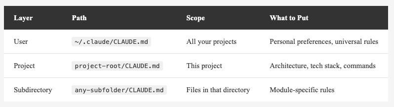
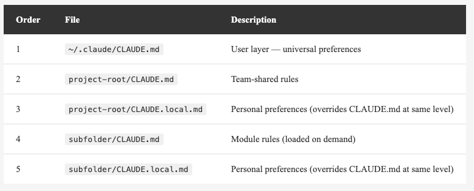
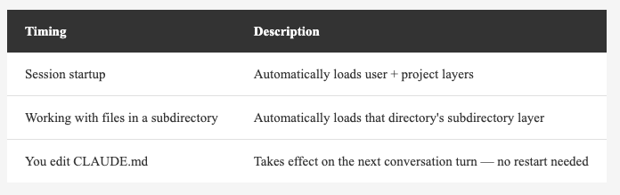
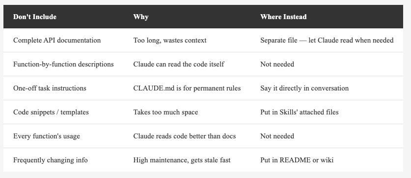
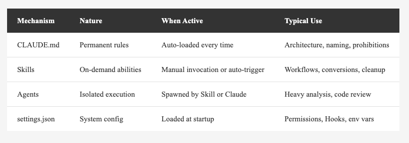

<!-- Tags: Artificial Intelligence, Software Development, Developer Tools, Claude Code, Productivity -->

*(Insert cover image: cover.png)*

<!--
Gemini prompt: A cute Ghibli-inspired soft pastel illustration. A chibi engineer character stands beside a tall, layered cake-like structure with three tiers. Each tier is labeled: bottom "User" (largest), middle "Project", top "Subfolder" (smallest). The structure glows softly, and a small notebook labeled "CLAUDE.md" floats beside each tier. The engineer looks up admiringly at the layered structure. Soft pastel colors (mint, peach, lavender), white background, clean and simple. 16:9 ratio.
-->

# The Complete Guide to CLAUDE.md — Make Claude Code Truly Understand Your Project

> The first article introduced it. The Skills article mentioned it. Now let's break it down completely.

---

## Introduction

If you've been following this series, you already know what CLAUDE.md is — a config file in your project that Claude Code reads automatically on startup.

But "knowing about it" and "using it well" are two different things.

After some time, I've noticed many people's CLAUDE.md files share similar problems:

- **Too much content**, so Claude can't find the important parts
- **Only placed at the project root**, unaware that layering is possible
- **Too vague**, so Claude reads it but doesn't act on it
- **Wrong things included, right things missing**

This article covers CLAUDE.md thoroughly: how to layer it, how to write it, what to include, and what to leave out.

---

## What Is CLAUDE.md? The One-Liner

**CLAUDE.md is your project's instruction manual — written for Claude.**

It's not code, not a config file. It's a set of instructions written in Markdown. Claude Code reads it on startup and references it throughout every conversation.

Think of it as: **everything you'd tell a new team member on their first day.**

"Our coding style works like this." "Run tests this way." "Don't touch that folder." "Commit messages follow this format." — These unwritten rules passed around by word of mouth? That's exactly what CLAUDE.md is for.

---

## Three-Layer Architecture: It's Not Just One File

Most people only know to put a single CLAUDE.md at the project root. But it actually has **three layers**:

*(Insert image: table-three-layers-en.png)*

<!--
| Layer | Path | Scope | What to Put |
|-------|------|-------|-------------|
| User | `~/.claude/CLAUDE.md` | All your projects | Personal preferences, universal rules |
| Project | `project-root/CLAUDE.md` | This project | Architecture, tech stack, commands |
| Subdirectory | `any-subfolder/CLAUDE.md` | Files in that directory | Module-specific rules |
-->

When all three layers exist, Claude **reads and concatenates all of them**. It's not an override — it's a merge.

So what happens when they conflict? Say the user layer says "commit messages in English" while the project layer says "commit messages in Chinese"?

According to the [official documentation](https://docs.anthropic.com/en/docs/claude-code/memory):

> All discovered files are **concatenated into context rather than overriding each other**.

> If two rules contradict each other, **Claude may pick one arbitrarily**.

That's right — the official docs explicitly state: **when there's a conflict, Claude may pick one arbitrarily.**

This means CLAUDE.md doesn't work like CSS with strict override precedence. It's more like giving Claude multiple instruction sheets simultaneously — when they contradict, there's no guarantee which one Claude follows.

**So the correct approach is: avoid conflicts, not rely on precedence.**

Specifically:
- Put "universal preferences" in the user layer, "project rules" in the project layer — don't overlap
- If a project needs to override a personal preference, explicitly state it: "Regardless of personal preferences, this project always uses xxx"
- Periodically review your CLAUDE.md files across layers and remove outdated or contradictory instructions

The only case with clear precedence is `CLAUDE.local.md` within the same directory (covered in the next section) — officially guaranteed to load after `CLAUDE.md`.

*(Insert image: layer-diagram.png)*

<!--
Gemini prompt: A cute Ghibli-inspired soft pastel illustration showing three floating notebook icons stacking on top of each other like layers. Bottom layer (largest) labeled "~/.claude/CLAUDE.md — Personal", middle layer labeled "project/CLAUDE.md — Project", top layer (smallest) labeled "src/api/CLAUDE.md — Subfolder". Arrows point downward showing "merge" between each layer. A chibi engineer character stands beside them looking at the merged result. Soft pastel colors, white background, clean and simple. 16:9 ratio.
-->

### User Layer: `~/.claude/CLAUDE.md`

This is your **personal config**, effective across all projects.

Good for:
- Your coding preferences (e.g., "I prefer guard let over if let")
- Language-agnostic universal rules (e.g., "commit messages in English")
- Rules you want every project to follow

```markdown
# Personal Preferences

- Respond and write commit messages in Traditional Chinese
- Open .md files using `code <path>` command
- Do not add Co-Authored-By line in git commits
- Write code comments in English
```

**Note:** This layer is never committed to any repo — it's purely personal.

**Tip:** The "no Co-Authored-By" rule works as a natural language instruction in CLAUDE.md and usually holds, but the more reliable approach is the `attribution` setting in `~/.claude/settings.json` — a system-level setting enforced by Claude Code itself:

```json
{
  "attribution": {
    "commit": "",
    "pr": ""
  }
}
```

Setting both values to empty strings removes all attribution from commits and PRs.

### Project Layer: `project-root/CLAUDE.md`

This is the **team-shared** project spec. Once committed to the repo, everyone gets the same rules.

```markdown
# MyApp

## Tech Stack
- iOS 17+, Swift, SwiftUI
- Architecture: MVVM + Coordinator
- Data layer: SwiftData
- Networking: URLSession + async/await

## Project Structure
- Sources/Features/ — Feature modules, one folder per feature
- Sources/Core/ — Shared components (networking, storage, utilities)
- Sources/Design/ — Design system (colors, fonts, components)

## Rules
- All Views must support Dynamic Type
- ViewModels must be @Observable classes
- Network requests must go through NetworkService protocol
- No force unwrap (unless with an explicit fatalError explanation)

## Common Commands
- Run tests: `xcodebuild test -scheme MyApp -destination 'platform=iOS Simulator,name=iPhone 16'`
- SwiftLint: `swiftlint lint --strict`
```

### Subdirectory Layer: `any-subfolder/CLAUDE.md`

When Claude works on files in a subdirectory, it **additionally loads** that directory's CLAUDE.md.

This is the most overlooked yet most useful layer.

```
Sources/
├── Features/
│   └── CLAUDE.md          ← Feature module rules
├── Core/
│   └── Network/
│       └── CLAUDE.md      ← Network layer specific rules
└── Design/
    └── CLAUDE.md          ← Design system rules
```

For example, `Sources/Core/Network/CLAUDE.md`:

```markdown
# Network Layer Rules

- All API requests must go through NetworkService protocol
- Responses wrapped in APIResponse<T>
- Error handling uses NetworkError enum
- Don't import frameworks other than Foundation directly
- When adding a new endpoint, update APIEndpoint enum accordingly
```

When Claude works on files under `Sources/Core/Network/`, it sees all three layers simultaneously: user + project + this subdirectory. Rules get more specific the deeper you go.

---

## The Hidden Fourth Layer: CLAUDE.local.md

Every directory can have a `CLAUDE.local.md` alongside its `CLAUDE.md`.

It works exactly the same way, with two key differences:

- **Within the same directory, `.local.md` loads after `.md`**, so it takes priority on conflicts
- **It should never be committed** — add it to `.gitignore`

The use case? **Team rules go in `CLAUDE.md`, personal preferences go in `CLAUDE.local.md`.**

For example:

```
MyApp/
├── CLAUDE.md              ← Team rule: commit messages in English
├── CLAUDE.local.md        ← My preference: commit messages in Chinese (overrides team rule)
└── .gitignore             ← Contains CLAUDE.local.md
```

The team gets a unified baseline, and everyone can make personal tweaks without interfering with each other.

The [official documentation](https://docs.anthropic.com/en/docs/claude-code/memory) on `.local.md`:

> Within each directory, `CLAUDE.local.md` is appended after `CLAUDE.md`, so when instructions conflict, **your personal notes are the last thing Claude reads at that level**.

Note this guarantee only applies **within the same directory**. Cross-layer conflicts (e.g., user layer vs. project layer) still follow the "may pick one arbitrarily" rule.

Loading order summary:

*(Insert image: table-priority-en.png)*

<!--
| Order | File | Description |
|-------|------|-------------|
| 1 | `~/.claude/CLAUDE.md` | User layer — universal preferences |
| 2 | `project-root/CLAUDE.md` | Team-shared rules |
| 3 | `project-root/CLAUDE.local.md` | Personal preferences (overrides CLAUDE.md at same level) |
| 4 | `subfolder/CLAUDE.md` | Module rules (loaded on demand) |
| 5 | `subfolder/CLAUDE.local.md` | Personal preferences (overrides CLAUDE.md at same level) |
-->

**Within the same directory**, `.local.md` has clear precedence. **Across layers**, there's no guaranteed precedence — avoiding contradictions is the real solution.

---

## When Does It Load?

A common question: when does Claude read CLAUDE.md? Do I need to restart after editing?

*(Insert image: table-loading-en.png)*

<!--
| Timing | Description |
|--------|-------------|
| Session startup | Automatically loads user + project layers |
| Working with files in a subdirectory | Automatically loads that directory's subdirectory layer |
| You edit CLAUDE.md | Takes effect on the next conversation turn — no restart needed |
-->

**No restart needed.** After editing CLAUDE.md, Claude picks up the changes on the very next turn.

---

## What to Include

CLAUDE.md should contain things that are **"impossible to know unless someone tells you."**

### 1. Project Architecture

Claude can't read minds about what your folder structure means.

```markdown
## Project Structure
- Sources/Features/ — Feature modules, one folder per feature (View + ViewModel + Model)
- Sources/Core/ — Shared infrastructure, no Feature dependencies
- Tests/Unit/ — Unit tests, structure mirrors Sources/
- Tests/UI/ — UI tests, organized by user flow
```

### 2. Technical Decisions

"Why A instead of B" — you can't derive this from code alone.

```markdown
## Technical Decisions
- Networking uses URLSession, not Alamofire — no extra dependencies needed
- SwiftData over Core Data — new project, minimum iOS 17
- State management uses @Observable, not ObservableObject — following WWDC23 migration guidance
```

### 3. Naming Conventions & Coding Style

Many teams have their own naming habits, but they're rarely documented.

```markdown
## Naming Conventions
- ViewModel: `{Feature}ViewModel` (e.g., ProfileViewModel)
- View: `{Feature}View` (e.g., ProfileView)
- Network methods: `fetch{Resource}` (e.g., fetchUserProfile)
- Bool variables use `is` / `has` / `should` prefix
```

### 4. Prohibitions

Telling Claude what **not to do** is just as important as telling it what to do.

```markdown
## Prohibited
- No force unwrap (!)
- No network requests in View body
- No storing sensitive data in UserDefaults — use Keychain
- No adding public methods without corresponding tests
- Do not modify files under Sources/Legacy/ — pending migration
```

### 5. Common Commands

Claude doesn't know how your project runs tests or builds.

```markdown
## Common Commands
- Build: `xcodebuild build -scheme MyApp -destination 'platform=iOS Simulator,name=iPhone 16'`
- Unit tests: `xcodebuild test -scheme MyAppTests -destination 'platform=iOS Simulator,name=iPhone 16'`
- Lint: `swiftlint lint --strict`
- Format: `swift format --in-place Sources/`
```

---

## What NOT to Include

This is a common pitfall — stuffing everything into CLAUDE.md until it's bloated and Claude can't find the important parts.

*(Insert image: table-dont-put-en.png)*

<!--
| Don't Include | Why | Where Instead |
|---------------|-----|---------------|
| Complete API documentation | Too long, wastes context | Separate file — let Claude read when needed |
| Function-by-function descriptions | Claude can read the code itself | Not needed |
| One-off task instructions | CLAUDE.md is for permanent rules | Say it directly in conversation |
| Code snippets / templates | Takes too much space | Put in Skills' attached files |
| Every function's usage | Claude reads code better than docs | Not needed |
| Frequently changing info | High maintenance, gets stale fast | Put in README or wiki |
-->

**Core principle: CLAUDE.md is for rules, not data.**

A useful test: if a section exceeds 10 lines, ask yourself "Can Claude figure this out by reading the codebase?" If yes, don't include it.

---

## Writing Tips: How to Make Claude Actually Follow Your Rules

How well you write CLAUDE.md directly affects Claude's behavior. Here are some tips refined through real usage.

### 1. Use Specific Rules, Not Vague Descriptions

```markdown
# ❌ Vague
- Write clean code
- Follow good naming conventions
- Handle errors properly

# ✅ Specific
- Each function should not exceed 30 lines
- Variables use camelCase, constants use UPPER_SNAKE_CASE
- All throwing functions must use do-catch at the call site, not try?
```

### 2. Lead with Positive, Supplement with Negative

State "what to do" first, then "what not to do."

```markdown
# ✅ Positive first, then negative
- Use guard let for early return (don't use nested if let)
- ViewModel uses @Observable class (not ObservableObject + @Published)
- Dependency injection via init parameters (don't access Singletons directly)
```

### 3. Explain the "Why"

When Claude knows the reason, it makes better judgment calls in edge cases.

```markdown
# ❌ Rule only
- Don't use AnyView

# ✅ With reason
- Don't use AnyView — it breaks SwiftUI's diffing mechanism, causing unnecessary view rebuilds and hurting performance
```

### 4. Use Clear Section Headings

The clearer CLAUDE.md is structured, the easier Claude finds the relevant rules.

```markdown
## Architecture
...

## Naming Conventions
...

## Testing Rules
...

## Prohibited
...

## Common Commands
...
```

Don't mix all rules together — categorize with headings.

---

## In Practice: My Three-Layer CLAUDE.md

Let's look at what I actually use.

### User Layer `~/.claude/CLAUDE.md`

```markdown
# Personal Preferences

- Respond and write commit messages in Traditional Chinese
- Open .md files using `code <path>` command
- Do not add Co-Authored-By line in git commits
- Write code comments in English
```

Just a few lines, but they apply to every project.

### Project Layer `MyApp/CLAUDE.md`

```markdown
# MyApp

## Tech Stack
- iOS 17+, Swift 5.9, SwiftUI
- Architecture: MVVM + Coordinator
- Data layer: SwiftData
- Minimum deployment: iOS 17.0

## Project Structure
- Sources/Features/{Feature}/ — Feature modules (View, ViewModel, Model)
- Sources/Core/ — Shared components, must not depend on Features
- Sources/Design/ — Design system
- Tests/Unit/ — Unit tests
- Tests/UI/ — UI tests

## Architecture Rules
- Views handle UI only — logic goes in ViewModel
- ViewModel is @Observable class, dependencies injected via init
- Model is a plain struct, no business logic
- Cross-module communication through Coordinator — no direct Feature-to-Feature dependencies

## Naming Conventions
- Feature modules: {Feature}View, {Feature}ViewModel, {Feature}Model
- Protocol: {Name}Protocol (e.g., NetworkServiceProtocol)
- Mock: Mock{Name} (e.g., MockNetworkService)

## Prohibited
- No force unwrap
- No side effects in View body
- No direct Singleton access — use dependency injection
- Do not modify files under Sources/Legacy/

## Common Commands
- Build: `xcodebuild build -scheme MyApp -destination 'platform=iOS Simulator,name=iPhone 16'`
- Test: `xcodebuild test -scheme MyAppTests -destination 'platform=iOS Simulator,name=iPhone 16'`
- Lint: `swiftlint lint --strict`
```

### Subdirectory Layer `Sources/Core/Network/CLAUDE.md`

```markdown
# Network Layer

- All requests go through NetworkServiceProtocol
- Responses wrapped in APIResponse<T: Decodable>
- Errors use NetworkError enum (cases: serverError, timeout, noConnection, decodingError)
- When adding an API, update APIEndpoint enum accordingly
- Every endpoint must have a corresponding unit test (using MockURLProtocol)
```

All three layers together — under 60 lines, but Claude's behavior noticeably improves.

---

## Advanced: Dynamic Content Injection

Like Skills, CLAUDE.md also supports the [`` !`command` `` syntax](https://docs.anthropic.com/en/docs/claude-code/memory#dynamic-content-with-bash-commands) — it executes shell commands at load time and injects the output:

```markdown
## Current Git State
!`git branch --show-current`

## Project Version
!`cat .xcconfig | grep MARKETING_VERSION`
```

Claude sees the execution results, not the commands themselves.

**Use sparingly.** If a command is slow or produces lengthy output, it slows down every session startup. Best for "fast, short output" commands.

---

## Advanced: `.claude/CLAUDE.md` vs Root `CLAUDE.md`

You might notice that besides root `CLAUDE.md`, there's also `.claude/CLAUDE.md`.

Both work exactly the same — Claude reads both. The only difference is visibility: one sits at the project root in plain sight, the other is tucked inside the `.claude` folder.

Should personal preferences go in `.claude/CLAUDE.md` or `CLAUDE.local.md`?

**Use `CLAUDE.local.md`.** It's the officially designed "personal override" mechanism — clearer semantics, and its precedence at the same directory level is explicitly guaranteed.

---

## Common Mistakes

### Mistake 1: Writing a README Instead

```markdown
# ❌ This isn't CLAUDE.md — this is a README
MyApp is a social networking application where users can post updates,
follow other users, and receive push notifications. We use SwiftUI
as our UI framework, paired with SwiftData for persistence...
```

CLAUDE.md isn't an intro document for humans. It's **instructions** for Claude — write rules, not prose.

### Mistake 2: Rules Too Vague

```markdown
# ❌ Too vague
- Write good code
- Watch out for performance
- Handle errors well
```

This is the same as writing nothing. Claude can't determine what you want from "write good code."

### Mistake 3: Too Much Content

```markdown
# ❌ 200 lines of API documentation
## UserAPI
### GET /users/{id}
Response:
{
  "id": "string",
  "name": "string",
  "email": "string",
  ...
}
(150 more lines omitted)
```

Keep API docs in the project — let Claude read them when needed. Putting them in CLAUDE.md means they load every time, wasting context for nothing.

### Mistake 4: Duplicating Code

```markdown
# ❌ Rewriting what's already in the code
- NetworkService has the following methods:
  - fetchUser(id:) -> User
  - updateProfile(user:) -> Void
  - deleteAccount() -> Void
```

Claude can read the code itself. Just tell it "all network requests must go through NetworkServiceProtocol" — no need to list every method.

---

## Team Usage

CLAUDE.md's real power shines in team settings.

### Setup

1. Create `CLAUDE.md` at the project root
2. Write the team's rules
3. Commit to repo
4. Everyone using Claude Code automatically gets the same rules

### The Effect

*(Insert image: team.png)*

<!--
Gemini prompt: A cute Ghibli-inspired soft pastel illustration. Three chibi engineer characters sit at separate desks, each with a laptop. Above each laptop, identical glowing scrolls float — all labeled "CLAUDE.md". The code flowing out of each laptop looks consistent and uniform. The characters look happy and in sync. Soft pastel colors (mint, peach, lavender), white background, clean and simple. 16:9 ratio.
-->

Without CLAUDE.md, everyone's Claude output has different coding styles. Colleague A prefers guard let, B uses if let, C uses force unwrap and nobody catches it.

With CLAUDE.md, the team's Claude Code output **naturally converges**, because everyone shares the same ruleset.

### Maintenance Tips

- Maintain CLAUDE.md like you maintain README — **when technical decisions change, update the rules too**
- Review CLAUDE.md changes during code review — it's a config that affects the entire team
- When new members join, have them read CLAUDE.md first — it's more reliable than verbal onboarding

---

## CLAUDE.md vs Other Configuration Mechanisms

This series has introduced several configuration approaches. Here's how they divide responsibilities:

*(Insert image: table-comparison-all-en.png)*

<!--
| Mechanism | Nature | When Active | Typical Use |
|-----------|--------|-------------|-------------|
| CLAUDE.md | Permanent rules | Auto-loaded every time | Architecture, naming, prohibitions |
| Skills | On-demand abilities | Manual invocation or auto-trigger | Workflows, conversions, cleanup |
| Agents | Isolated execution | Spawned by Skill or Claude | Heavy analysis, code review |
| settings.json | System config | Loaded at startup | Permissions, Hooks, env vars |
-->

Quick reference:
- **CLAUDE.md** — tells Claude "what the rules are"
- **Skills** — tells Claude "how to do something"
- **Agents** — tells Claude "who to delegate to"
- **settings.json** — tells Claude Code "how the system works"

---

## Summary

CLAUDE.md is the most fundamental — and most underestimated — part of the Claude Code ecosystem. Get it right, and everything else (Skills, Agents) has a solid foundation.

Three key takeaways:

- **Three-layer architecture** — User layer for personal preferences, project layer for team rules, subdirectory layer for module details
- **Rules, not data** — Write specific rules and prohibitions, don't stuff API docs or code
- **Team shared** — Commit to repo so everyone's Claude Code output naturally converges

In one sentence: **A well-written CLAUDE.md makes Claude feel like a new teammate who actually read the onboarding docs.**

Next up: Hooks and Memory — making Claude Code not just remember rules, but react automatically and retain long-term memory.

Thanks for reading. If you have tips on writing CLAUDE.md, feel free to share in the comments.

---

## References

- [Claude Code Docs — Memory](https://docs.anthropic.com/en/docs/claude-code/memory) — Complete official docs on CLAUDE.md, covering loading mechanics, layered architecture, CLAUDE.local.md, and writing tips
- [Claude Code Docs — Skills](https://docs.anthropic.com/en/docs/claude-code/skills) — How Skills differ from and complement CLAUDE.md
- [Claude Code Docs — Sub-agents](https://docs.anthropic.com/en/docs/claude-code/sub-agents) — Official documentation for Agents
