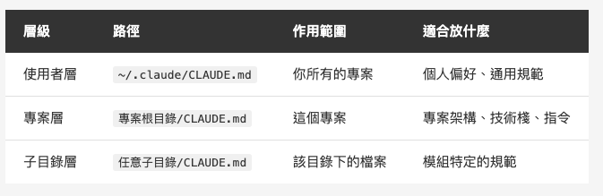
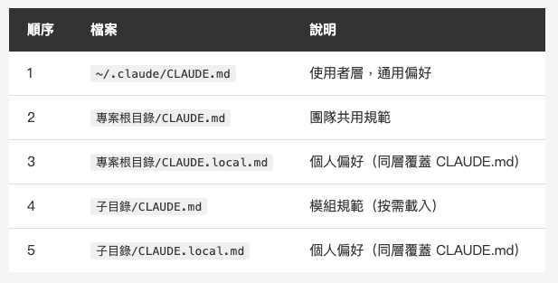
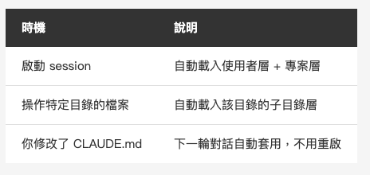
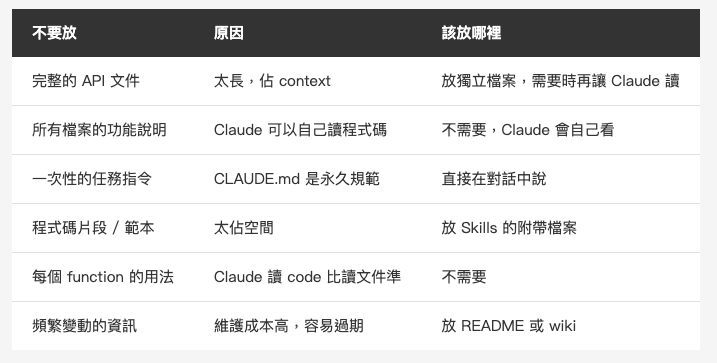
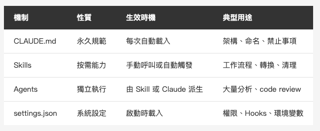

<!-- Tags: Artificial Intelligence, Software Development, Developer Tools, Claude Code, Productivity -->

*(在這裡插入封面圖：cover.png)*

<!--
Gemini prompt: A cute Ghibli-inspired soft pastel illustration. A chibi engineer character stands beside a tall, layered cake-like structure with three tiers. Each tier is labeled: bottom "User" (largest), middle "Project", top "Subfolder" (smallest). The structure glows softly, and a small notebook labeled "CLAUDE.md" floats beside each tier. The engineer looks up admiringly at the layered structure. Soft pastel colors (mint, peach, lavender), white background, clean and simple. 16:9 ratio.
-->

# CLAUDE.md 完全攻略 — 讓 Claude Code 真正理解你的專案

> 第一篇介紹了它，Skills 篇提到了它，這次把它徹底講清楚。

---

## 前言

如果你看過這個系列的前幾篇，應該已經知道 CLAUDE.md 是什麼了 — 放在專案裡的設定檔，Claude Code 每次啟動會自動讀取。

但「知道」跟「用得好」是兩回事。

用了一段時間之後，我發現很多人的 CLAUDE.md 都有類似的問題：

- **放太多東西**，結果 Claude 反而抓不到重點
- **只放在專案根目錄**，不知道其實可以分層
- **寫法太模糊**，Claude 讀了跟沒讀一樣
- **該放的沒放、不該放的塞了一堆**

這篇就來把 CLAUDE.md 徹底講清楚：怎麼分層、怎麼寫、放什麼、不放什麼。

---

## CLAUDE.md 是什麼？一句話版本

**CLAUDE.md 是你寫給 Claude 的專案說明書。**

它不是程式碼，不是設定檔，而是一份用 Markdown 寫的「指令集」。Claude Code 啟動時會自動讀取，每一輪對話都會參考裡面的內容。

你可以把它想成是：**新人到職第一天，你會跟他說的那些事。**

「我們的 coding style 是這樣的」「測試要這樣跑」「這個資料夾不要動」「commit message 要這個格式」— 這些口耳相傳的潛規則，就是 CLAUDE.md 要放的東西。

---

## 三層架構：不只是一個檔案

大部分人只知道在專案根目錄放一個 CLAUDE.md，但其實它有 **三層**：

*(在這裡插入圖片：table-three-layers.png)*

<!--
| 層級 | 路徑 | 作用範圍 | 適合放什麼 |
|------|------|---------|-----------|
| 使用者層 | `~/.claude/CLAUDE.md` | 你所有的專案 | 個人偏好、通用規範 |
| 專案層 | `專案根目錄/CLAUDE.md` | 這個專案 | 專案架構、技術棧、指令 |
| 子目錄層 | `任意子目錄/CLAUDE.md` | 該目錄下的檔案 | 模組特定的規範 |
-->

三層同時存在時，Claude 會**全部讀取，串接在一起**。不是覆蓋，是拼接。

那如果有衝突呢？比如使用者層寫「commit message 用英文」，專案層寫「commit message 用中文」？

根據[官方文件](https://docs.anthropic.com/en/docs/claude-code/memory)：

> All discovered files are **concatenated into context rather than overriding each other**.

> If two rules contradict each other, **Claude may pick one arbitrarily**.

沒錯，官方明確說了：**衝突時 Claude 可能會任意選一個。**

這代表 CLAUDE.md 不像 CSS 那樣有嚴格的優先序覆蓋機制。它更像是你同時給了 Claude 多份指示，當指示互相矛盾，Claude 不保證會遵守哪一份。

**所以正確的做法是：避免衝突，而不是依賴優先序。**

具體來說：
- 使用者層寫「通用偏好」，專案層寫「專案規範」，兩者不要重疊
- 如果專案需要覆蓋個人偏好，直接在專案層明確寫「即使個人偏好不同，本專案一律用 xxx」
- 定期檢查多層 CLAUDE.md，清除過期或矛盾的指令

唯一有明確優先序的是同一層目錄裡的 `CLAUDE.local.md`（下一節會講到），官方保證它排在 `CLAUDE.md` 之後載入。

*(在這裡插入圖片：layer-diagram.png)*

<!--
Gemini prompt: A cute Ghibli-inspired soft pastel illustration showing three floating notebook icons stacking on top of each other like layers. Bottom layer (largest) labeled "~/.claude/CLAUDE.md — Personal", middle layer labeled "project/CLAUDE.md — Project", top layer (smallest) labeled "src/api/CLAUDE.md — Subfolder". Arrows point downward showing "merge" between each layer. A chibi engineer character stands beside them looking at the merged result. Soft pastel colors, white background, clean and simple. 16:9 ratio.
-->

### 使用者層：`~/.claude/CLAUDE.md`

這是你的**個人設定**，跨所有專案生效。

適合放：
- 你個人的 coding 偏好（例：「我習慣用 guard let 而不是 if let」）
- 跟語言無關的通用規範（例：「commit message 用繁體中文」）
- 你希望每個專案都遵守的規則

```markdown
# 個人偏好

- 回答跟 commit message 請使用繁體中文
- 開啟 .md 文件一律使用 `code <path>` 指令
- Git commit 時不要加上 Co-Authored-By 行
- 程式碼中的註解使用英文
```

**注意：** 這一層不會被 commit 進 repo，完全是個人的。

**補充：** 其中「不要加 Co-Authored-By 行」寫在 CLAUDE.md 是自然語言指令，通常有效，但更可靠的做法是用 `~/.claude/settings.json` 的 `attribution` 設定——這是系統層級設定，Claude Code 強制執行：

```json
{
  "attribution": {
    "commit": "",
    "pr": ""
  }
}
```

兩個值設為空字串，就會完全移除 commit 和 PR 的歸屬行。

### 專案層：`專案根目錄/CLAUDE.md`

這是**團隊共用**的專案規範，commit 進 repo 之後每個人都會套用。

```markdown
# MyApp

## 技術棧
- iOS 17+, Swift, SwiftUI
- 架構：MVVM + Coordinator
- 資料層：SwiftData
- 網路層：URLSession + async/await

## 專案結構
- Sources/Features/ — 功能模組，每個功能一個資料夾
- Sources/Core/ — 共用元件（網路、儲存、工具）
- Sources/Design/ — 設計系統（色彩、字型、元件）

## 規範
- 所有 View 都要支援 Dynamic Type
- ViewModel 必須是 @Observable class
- 網路請求一律用 NetworkService protocol
- 禁止使用 force unwrap（除非有明確的 fatalError 說明）

## 常用指令
- 跑測試：`xcodebuild test -scheme MyApp -destination 'platform=iOS Simulator,name=iPhone 16'`
- SwiftLint：`swiftlint lint --strict`
```

### 子目錄層：`任意子目錄/CLAUDE.md`

當 Claude 在操作某個子目錄的檔案時，會**額外載入**該目錄的 CLAUDE.md。

這是最容易被忽略、但最實用的一層。

```
Sources/
├── Features/
│   └── CLAUDE.md          ← 功能模組的規範
├── Core/
│   └── Network/
│       └── CLAUDE.md      ← 網路層的特殊規範
└── Design/
    └── CLAUDE.md          ← 設計系統的規範
```

比如 `Sources/Core/Network/CLAUDE.md`：

```markdown
# 網路層規範

- 所有 API 請求必須透過 NetworkService protocol
- Response 統一用 APIResponse<T> 包裝
- Error handling 使用 NetworkError enum
- 不要直接 import Foundation 以外的框架
- 新增 endpoint 時要同步更新 APIEndpoint enum
```

當 Claude 在處理 `Sources/Core/Network/` 底下的檔案時，它會同時看到三層：使用者層 + 專案層 + 這個子目錄層。規範越往下越具體。

---

## 隱藏的第四層：CLAUDE.local.md

每一層目錄除了 `CLAUDE.md`，還可以放一個 `CLAUDE.local.md`。

它的功能跟 `CLAUDE.md` 完全一樣，差別在於：

- **在同一層目錄裡，`.local.md` 會在 `.md` 之後被載入**，所以衝突時 `.local.md` 優先
- **它不應該 commit 進 repo**，加進 `.gitignore` 就好

用途是什麼？**團隊規範用 `CLAUDE.md`，個人偏好用 `CLAUDE.local.md`。**

舉個例子：

```
MyApp/
├── CLAUDE.md              ← 團隊規範：commit message 用英文
├── CLAUDE.local.md        ← 我的偏好：commit message 用繁體中文（覆蓋團隊規範）
└── .gitignore             ← 裡面加上 CLAUDE.local.md
```

這樣團隊有統一的基礎規範，每個人又可以有自己的微調，互不干擾。

[官方文件](https://docs.anthropic.com/en/docs/claude-code/memory)對 `.local.md` 的說明：

> Within each directory, `CLAUDE.local.md` is appended after `CLAUDE.md`, so when instructions conflict, **your personal notes are the last thing Claude reads at that level**.

注意這個保證只在**同一層目錄**內有效。跨層級的衝突（例如使用者層 vs 專案層），仍然是前面說的「可能任意選一個」。

載入順序整理：

*(在這裡插入圖片：table-priority.png)*

<!--
| 順序 | 檔案 | 說明 |
|------|------|------|
| 1 | `~/.claude/CLAUDE.md` | 使用者層，通用偏好 |
| 2 | `專案根目錄/CLAUDE.md` | 團隊共用規範 |
| 3 | `專案根目錄/CLAUDE.local.md` | 個人偏好（同層覆蓋 CLAUDE.md） |
| 4 | `子目錄/CLAUDE.md` | 模組規範（按需載入） |
| 5 | `子目錄/CLAUDE.local.md` | 個人偏好（同層覆蓋 CLAUDE.md） |
-->

**同一層目錄內**，`.local.md` 有明確的優先序。**跨層級**，官方不保證優先序，避免寫出矛盾的規則才是正解。

---

## 載入時機

很多人會問：Claude 什麼時候讀 CLAUDE.md？改了之後要重啟嗎？

*(在這裡插入圖片：table-loading.png)*

<!--
| 時機 | 說明 |
|------|------|
| 啟動 session | 自動載入使用者層 + 專案層 |
| 操作特定目錄的檔案 | 自動載入該目錄的子目錄層 |
| 你修改了 CLAUDE.md | 下一輪對話自動套用，不用重啟 |
-->

**不需要重啟。** 修改 CLAUDE.md 後，Claude 在下一輪對話就會讀到更新的內容。

---

## 該放什麼？

CLAUDE.md 裡應該放的，是那些**「沒有人告訴你，你就不會知道」的事情**。

### 1. 專案架構

Claude 不會通靈知道你的資料夾結構是什麼意思。

```markdown
## 專案結構
- Sources/Features/ — 功能模組，每個功能一個資料夾（View + ViewModel + Model）
- Sources/Core/ — 共用基礎建設，不依賴任何 Feature
- Tests/Unit/ — 單元測試，結構對應 Sources/
- Tests/UI/ — UI 測試，按 user flow 組織
```

### 2. 技術決策

「為什麼用 A 不用 B」這類資訊，光看程式碼看不出來。

```markdown
## 技術決策
- 網路層用 URLSession 而不是 Alamofire，因為不需要額外依賴
- 用 SwiftData 而不是 Core Data，因為這是新專案，最低支援 iOS 17
- 狀態管理用 @Observable 而不是 ObservableObject，參考 WWDC23 遷移建議
```

### 3. 命名慣例與 Coding Style

很多團隊有自己的命名習慣，但不一定有寫成文件。

```markdown
## 命名慣例
- ViewModel 命名：`{Feature}ViewModel`（例：ProfileViewModel）
- View 命名：`{Feature}View`（例：ProfileView）
- 網路請求方法命名：`fetch{Resource}`（例：fetchUserProfile）
- Bool 變數用 `is` / `has` / `should` 前綴
```

### 4. 禁止事項

告訴 Claude 什麼**不要做**，跟告訴它要做什麼一樣重要。

```markdown
## 禁止事項
- 不要使用 force unwrap（!）
- 不要在 View body 裡做網路請求
- 不要直接用 UserDefaults 存敏感資料，用 Keychain
- 不要在沒有對應測試的情況下新增 public method
- 不要修改 Sources/Legacy/ 底下的檔案，那是待遷移的舊程式碼
```

### 5. 常用指令

Claude 不知道你的專案怎麼跑測試、怎麼 build。

```markdown
## 常用指令
- Build：`xcodebuild build -scheme MyApp -destination 'platform=iOS Simulator,name=iPhone 16'`
- 單元測試：`xcodebuild test -scheme MyAppTests -destination 'platform=iOS Simulator,name=iPhone 16'`
- Lint：`swiftlint lint --strict`
- 格式化：`swift format --in-place Sources/`
```

---

## 不該放什麼？

這是很多人踩的坑 — 什麼都往 CLAUDE.md 塞，結果它越來越肥，Claude 反而抓不到重點。

*(在這裡插入圖片：table-dont-put.png)*

<!--
| 不要放 | 原因 | 該放哪裡 |
|--------|------|---------|
| 完整的 API 文件 | 太長，佔 context | 放獨立檔案，需要時再讓 Claude 讀 |
| 所有檔案的功能說明 | Claude 可以自己讀程式碼 | 不需要，Claude 會自己看 |
| 一次性的任務指令 | CLAUDE.md 是永久規範 | 直接在對話中說 |
| 程式碼片段 / 範本 | 太佔空間 | 放 Skills 的附帶檔案 |
| 每個 function 的用法 | Claude 讀 code 比讀文件準 | 不需要 |
| 頻繁變動的資訊 | 維護成本高，容易過期 | 放 README 或 wiki |
-->

**核心原則：CLAUDE.md 放「規則」，不放「資料」。**

一個判斷方式：如果這段內容超過 10 行，問自己「Claude 能不能自己從 codebase 裡推斷出來？」如果可以，就不用放。

---

## 寫法技巧：怎麼寫 Claude 才「聽得懂」

CLAUDE.md 寫得好不好，直接影響 Claude 的表現。以下是幾個實測後整理出來的技巧。

### 1. 用具體規則，不要用模糊描述

```markdown
# ❌ 模糊
- 程式碼要寫乾淨
- 遵循好的命名慣例
- 錯誤處理要完善

# ✅ 具體
- 每個 function 不超過 30 行
- 變數命名用 camelCase，常數用 UPPER_SNAKE_CASE
- 所有 throwing function 在呼叫端用 do-catch 處理，不用 try?
```

### 2. 正面表述優先，負面表述補充

先說「要怎麼做」，再說「不要怎麼做」。

```markdown
# ✅ 先正面，再負面
- 用 guard let 做 early return（不要用巢狀的 if let）
- ViewModel 用 @Observable class（不要用 ObservableObject + @Published）
- 依賴注入用 init 參數（不要用 Singleton 直接存取）
```

### 3. 給出「為什麼」

Claude 知道原因之後，在邊界情況下的判斷會更準確。

```markdown
# ❌ 只有規則
- 不要用 AnyView

# ✅ 有原因
- 不要用 AnyView — 它會破壞 SwiftUI 的 diff 機制，導致不必要的 view 重建，影響效能
```

### 4. 善用標題分類

CLAUDE.md 的結構越清楚，Claude 越容易找到對應的規則。

```markdown
## 架構
...

## 命名慣例
...

## 測試規範
...

## 禁止事項
...

## 常用指令
...
```

不要把所有規則混在一起，用標題分門別類。

---

## 實戰：我的三層 CLAUDE.md

直接看我自己實際在用的設定。

### 使用者層 `~/.claude/CLAUDE.md`

```markdown
# 個人偏好

- 回答跟 commit message 請使用繁體中文
- 開啟 .md 文件一律使用 `code <path>` 指令
- Git commit 時不要加上 Co-Authored-By 行
- 程式碼中的註解使用英文
```

短短幾行，但每個專案都適用。

### 專案層 `MyApp/CLAUDE.md`

```markdown
# MyApp

## 技術棧
- iOS 17+, Swift 5.9, SwiftUI
- 架構：MVVM + Coordinator
- 資料層：SwiftData
- 最低部署版本：iOS 17.0

## 專案結構
- Sources/Features/{Feature}/ — 功能模組（View, ViewModel, Model）
- Sources/Core/ — 共用元件，不可依賴 Features
- Sources/Design/ — 設計系統
- Tests/Unit/ — 單元測試
- Tests/UI/ — UI 測試

## 架構規範
- View 只負責 UI，邏輯放 ViewModel
- ViewModel 是 @Observable class，透過 init 注入依賴
- Model 是純 struct，不包含業務邏輯
- 跨模組通訊透過 Coordinator，不要讓 Feature 之間直接依賴

## 命名慣例
- Feature 模組：{Feature}View, {Feature}ViewModel, {Feature}Model
- Protocol：{Name}Protocol（例：NetworkServiceProtocol）
- Mock：Mock{Name}（例：MockNetworkService）

## 禁止事項
- 不要 force unwrap
- 不要在 View body 裡做 side effect
- 不要直接存取 Singleton，用依賴注入
- 不要修改 Sources/Legacy/ 下的檔案

## 常用指令
- Build：`xcodebuild build -scheme MyApp -destination 'platform=iOS Simulator,name=iPhone 16'`
- 測試：`xcodebuild test -scheme MyAppTests -destination 'platform=iOS Simulator,name=iPhone 16'`
- Lint：`swiftlint lint --strict`
```

### 子目錄層 `Sources/Core/Network/CLAUDE.md`

```markdown
# 網路層

- 所有請求透過 NetworkServiceProtocol
- Response 用 APIResponse<T: Decodable> 包裝
- Error 用 NetworkError enum（含 case：serverError, timeout, noConnection, decodingError）
- 新增 API 時同步更新 APIEndpoint enum
- 每個 endpoint 都要有對應的單元測試（用 MockURLProtocol）
```

三層加起來不到 60 行，但 Claude 的行為會明顯不一樣。

---

## 進階：動態內容注入

跟 Skills 一樣，CLAUDE.md 也支援 [`` !`command` `` 語法](https://docs.anthropic.com/en/docs/claude-code/memory#dynamic-content-with-bash-commands)，在載入時先執行 shell 指令，把結果塞進去：

```markdown
## 目前 Git 狀態
!`git branch --show-current`

## 專案版本
!`cat .xcconfig | grep MARKETING_VERSION`
```

Claude 看到的不是指令本身，而是執行結果。

**但要謹慎使用。** 如果指令很慢或輸出很長，會拖慢每次啟動速度。適合放那種「快速、輸出簡短」的指令。

---

## 進階：`.claude/CLAUDE.md` vs 根目錄 `CLAUDE.md`

你可能注意到，除了根目錄的 `CLAUDE.md`，還有 `.claude/CLAUDE.md` 這個路徑。

兩者功能完全一樣，Claude 都會讀取。差別只在於可見性 — 一個在專案根目錄直接看得到，一個藏在 `.claude` 資料夾裡。

那個人偏好到底該放 `.claude/CLAUDE.md` 還是 `CLAUDE.local.md`？

**建議用 `CLAUDE.local.md`。** 它是官方設計的「個人覆蓋」機制，語意更清楚，而且跟 `CLAUDE.md` 放在同一層，衝突時的優先序也更明確。

---

## 常見錯誤

### 錯誤 1：寫成 README

```markdown
# ❌ 這不是 CLAUDE.md，這是 README
MyApp 是一個社群應用程式，使用者可以發布貼文、追蹤其他使用者、
收到推播通知。我們使用 SwiftUI 作為 UI 框架，搭配 SwiftData
進行資料持久化...
```

CLAUDE.md 不是給人讀的介紹文。它是給 Claude 的**指令**，要寫成規則，不是寫成散文。

### 錯誤 2：規則太模糊

```markdown
# ❌ 太模糊
- 寫好的程式碼
- 注意效能
- 處理好錯誤
```

這跟沒寫一樣。Claude 無法從「寫好的程式碼」判斷你要的是什麼。

### 錯誤 3：內容太多

```markdown
# ❌ 塞了 200 行 API 文件
## UserAPI
### GET /users/{id}
Response:
{
  "id": "string",
  "name": "string",
  "email": "string",
  ...
}
（以下省略 150 行）
```

API 文件放專案裡就好，需要的時候讓 Claude 自己去讀。放在 CLAUDE.md 裡每次都會被載入，白白佔 context。

### 錯誤 4：跟程式碼重複

```markdown
# ❌ 把程式碼裡已經有的東西又寫一遍
- NetworkService 有以下方法：
  - fetchUser(id:) -> User
  - updateProfile(user:) -> Void
  - deleteAccount() -> Void
```

Claude 可以自己讀程式碼。你只需要告訴它「所有網路請求都要透過 NetworkServiceProtocol」，不需要列出每一個 method。

---

## 團隊怎麼用？

CLAUDE.md 真正的威力在團隊場景。

### 建立方式

1. 在專案根目錄建立 `CLAUDE.md`
2. 寫入團隊規範
3. Commit 進 repo
4. 團隊所有人用 Claude Code 時自動套用

### 效果

*(在這裡插入圖片：team.png)*

<!--
Gemini prompt: A cute Ghibli-inspired soft pastel illustration. Three chibi engineer characters sit at separate desks, each with a laptop. Above each laptop, identical glowing scrolls float — all labeled "CLAUDE.md". The code flowing out of each laptop looks consistent and uniform. The characters look happy and in sync. Soft pastel colors (mint, peach, lavender), white background, clean and simple. 16:9 ratio.
-->

沒有 CLAUDE.md 的時候，每個人跟 Claude 產出的程式碼風格不一致。A 同事喜歡用 guard let，B 同事習慣 if let，C 同事用了 force unwrap 也沒人管。

有了 CLAUDE.md 之後，團隊 Claude Code 的產出**自然趨向一致**，因為所有人共用同一份規範。

### 維護建議

- 像維護 README 一樣維護 CLAUDE.md — **技術決策變了，規範也要跟著更新**
- Code Review 的時候也看 CLAUDE.md 的改動 — 這是影響全團隊的設定
- 新成員加入時，先讓他讀 CLAUDE.md — 這份比口頭交接靠譜

---

## CLAUDE.md vs 其他設定機制

系列文到現在介紹了好幾種設定方式，整理一下它們的分工：

*(在這裡插入圖片：table-comparison-all.png)*

<!--
| 機制 | 性質 | 生效時機 | 典型用途 |
|------|------|---------|---------|
| CLAUDE.md | 永久規範 | 每次自動載入 | 架構、命名、禁止事項 |
| Skills | 按需能力 | 手動呼叫或自動觸發 | 工作流程、轉換、清理 |
| Agents | 獨立執行 | 由 Skill 或 Claude 派生 | 大量分析、code review |
| settings.json | 系統設定 | 啟動時載入 | 權限、Hooks、環境變數 |
-->

簡單記：
- **CLAUDE.md** — 告訴 Claude「規則是什麼」
- **Skills** — 告訴 Claude「怎麼做某件事」
- **Agents** — 告訴 Claude「派誰去做」
- **settings.json** — 告訴 Claude Code「系統怎麼運作」

---

## 總結

CLAUDE.md 是 Claude Code 生態系裡最基礎、也最容易被低估的一環。寫好它，後面的 Skills、Agents 才有穩固的基礎。

三個關鍵觀念：

- **三層架構** — 使用者層放個人偏好、專案層放團隊規範、子目錄層放模組細節
- **放規則，不放資料** — 寫具體的規則和禁止事項，不要塞 API 文件或程式碼
- **團隊共用** — commit 進 repo，讓每個人的 Claude Code 產出趨向一致

一句話：**CLAUDE.md 寫得好，Claude 就像一個真正讀過你們 onboarding 文件的新隊友。**

下一篇會聊 Hooks 跟 Memory — 讓 Claude Code 不只記住規範，還能自動反應、長期記憶。

感謝閱讀。如果你有什麼 CLAUDE.md 的寫法心得，歡迎留言分享。

---

## 參考資料

- [Claude Code Docs — Memory](https://docs.anthropic.com/en/docs/claude-code/memory) — CLAUDE.md 的完整官方文件，涵蓋載入機制、分層架構、CLAUDE.local.md、寫法建議
- [Claude Code Docs — Skills](https://docs.anthropic.com/en/docs/claude-code/skills) — Skills 與 CLAUDE.md 的差異與搭配
- [Claude Code Docs — Sub-agents](https://docs.anthropic.com/en/docs/claude-code/sub-agents) — Agents 的官方說明
