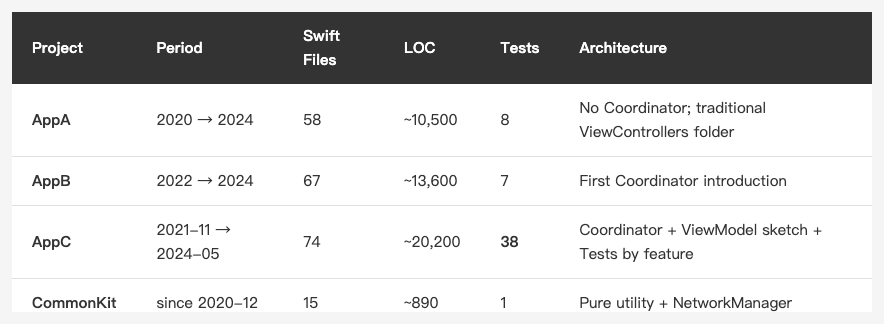

<!-- Tags: iOS, Swift, Software Architecture, Refactoring, Coordinator -->

*(Insert cover image here: cover.png)*

<!-- Gemini prompt: A warm Ghibli-inspired illustration showing ONE continuous winding path through rolling hills under a soft sunrise-to-sunset gradient sky (left side dawn pink, right side golden hour amber). The SAME chibi developer character (brown hair, blue shirt, consistent appearance) appears THREE TIMES along the path — this is the article's core message: one solo developer, three generations, four years.

Bottom-left of path (dawn light): the developer kneels among scattered loose papers and tangled scrolls, scratching his head, looking overwhelmed. Subtle label nearby: "2020 · AppA".

Middle of path (midday light, slightly higher elevation): the SAME developer walks confidently, holding a single neat notebook labeled "Coordinator" under his arm. A small wooden signpost beside him reads "2022 · AppB". A few colorful bubbles ("API", "DB", "Push") float in orderly arcs around him, no longer chaotic.

Top-right of path (golden hour, hilltop): the SAME developer sits at a small outdoor wooden desk with a tidy stack of cards labeled "Tests Passed" (3 green checkmarks floating above). A weathered signpost reads "2024 · AppC · 38 tests". His face is calm, slightly older, contemplative.

In the very bottom-right corner, behind a window frame: a faint translucent silhouette of the present-day developer (same character, slightly older, glasses, looking out) watches the three past selves walking the path — representing "looking back four years later". This is critical: NOT a separate person, it's the narrator-self.

Soft pastel colors, warm Ghibli golden hour palette, gentle green hills, cottages dotting the landscape, 16:9 ratio. Match the visual style of the existing coordinator-evolution.png. The mood: nostalgic, warm, quietly proud — "a late letter to my younger self". -->

# Four Years, Three iOS Apps: The Long Walk From Massive VC to Coordinator

> Looking back at four-year-old code, what I see isn't mistakes — it's a path that grew slowly, step by step. From "as long as it runs" to "at least it's tested."

---

## Introduction

I recently opened a folder I hadn't touched in four years, while organizing old projects into my personal knowledge base. Inside were three generations of iOS apps for the same client and product line, plus a shared SPM library:

```
CommonKit  (since 2020-12, shared SPM, 13 Extensions)
    ↓
AppA (2020 → 2024)
AppB (2022 → 2024)
AppC (2021-11 → 2024-05)
```

Back when I wrote each line, I felt it was the best version I could produce at that moment. Four years later, looking back, I see a clear learning trajectory — the path from "nothing at all" to "at least 38 test files."

This isn't a "best practices" article. It's a delayed reply to the version of me five years ago who first picked up this project.

---

## Three Generations, Side by Side

Let's lay out the data first:

*(Insert image here: table-three-gens-scale-en.png)*

<!--
| Project | Period | Swift Files | LOC | Tests | Architecture |
|---------|--------|------------|-----|-------|--------------|
| **AppA** | 2020 → 2024 | 58 | ~10,500 | 8 | No Coordinator; traditional ViewControllers folder |
| **AppB** | 2022 → 2024 | 67 | ~13,600 | 7 | First Coordinator introduction |
| **AppC** | 2021-11 → 2024-05 | 74 | ~20,200 | **38** | Coordinator + ViewModel sketch + Tests by feature |
| **CommonKit** | since 2020-12 | 15 | ~890 | 1 | Pure utility + NetworkManager |
-->

AppA had 8 test files, AppC has 38 — **test coverage nearly quintupled in four years**. But that growth didn't happen in one big push. It grew commit by commit.

---

## First Generation: AppA (2020) — Nothing at All

AppA was the start of this line. I was just picking up the project. The keywords in my head were "Storyboard," "TableView," "Alamofire," "Realm."

What was inside the ViewController? Everything.

```swift
// A typical AppA-era ViewController (reconstructed)
class FeatureListViewController: UIViewController {
    var items: [Item] = []
    let dbManager = DBManager.shared
    
    override func viewDidLoad() {
        super.viewDidLoad()
        // API call right here
        AF.request("https://api.example.com/items")
            .responseDecodable(of: [Item].self) { response in
                self.items = response.value ?? []
                self.tableView.reloadData()
                
                // Direct write to Realm
                let realm = try! Realm()
                try! realm.write {
                    realm.add(self.items, update: .modified)
                }
                
                // And navigation while we're at it
                if self.items.isEmpty {
                    self.navigationController?.pushViewController(
                        EmptyStateViewController(), animated: true
                    )
                }
            }
    }
}
```

API calls, database writes, navigation — **all stuffed into `viewDidLoad`**. No Service layer, no Coordinator, no tests.

I didn't think anything was wrong, because it "worked." For someone still learning Swift, "it works" was the highest praise.

The lesson of the first generation — **make it run first**. Architectural debate is a luxury at this stage. Shipping is the priority.

---

## Second Generation: AppB — First Encounter With Coordinator

AppB was the second generation. Halfway through, I came across the Coordinator Pattern, and for the first time realized that "navigation logic doesn't have to live inside ViewControllers."

AppB introduced four files in a `Coordinator/` folder:

```swift
// Coordinator.swift (base protocol)
protocol Coordinator: AnyObject {
    var finishDelegate: CoordinatorFinishDelegate? { get set }
    var navigationController: UINavigationController { get set }
    var childCoordinators: [Coordinator] { get set }
    var type: CoordinatorType { get }
    
    func start()
    func finish()
}

protocol CoordinatorFinishDelegate: AnyObject {
    func coordinatorDidFinish(childCoordinator: Coordinator)
}

enum CoordinatorType {
    case app, login, tab, notify
}
```

Plus `AppCoordinator`, `LoginCoordinator`, `TabCoordinator` — one root and two sub-flows.

The biggest sense of accomplishment back then wasn't "the architecture looks nicer." It was **writing code where the VC genuinely doesn't know who comes next, for the first time**.

```swift
// LoginViewController (simplified)
class LoginViewController: UIViewController {
    enum Event {
        case login
        case forgetPassword
        case guest
    }
    
    var didSendEvent: ((Event) -> Void)?
    
    @objc private func loginTapped() {
        // ... validation
        didSendEvent?(.login)  // VC has no idea what happens after
    }
}

// LoginCoordinator
class LoginCoordinator: Coordinator {
    func showLoginVC() {
        let loginVC = LoginViewController(LoginServiceImpl())
        navigationController.setViewControllers([loginVC], animated: false)
        
        loginVC.didSendEvent = { [weak self] event in
            switch event {
            case .login:
                self?.finish()
            case .forgetPassword:
                break
            case .guest:
                self?.finish()
            }
        }
    }
}
```

The lesson of the second generation — **put responsibilities where they belong**. The VC isn't responsible for "what happens after login"; that's the Coordinator's job.

But I still couldn't write tests. I had pulled out the Coordinator, but how was I supposed to test it? I didn't know.

*(Insert image here: coordinator-evolution.png)*

<!-- Gemini prompt: A warm Ghibli-inspired illustration: ONE continuous landscape (rolling hills, cottages, golden hour light) with three scenes flowing left-to-right within the same scenery. The SAME chibi developer character (brown hair, blue shirt, consistent appearance) appears in ALL THREE scenes — this is critical. The article's core message is "one solo developer carrying three generations of the project alone." Do NOT introduce a second person.

Left scene "AppA": the developer stands in a flower meadow, arms spread, overwhelmed expression, surrounded by chaotic colorful floating bubbles labeled "API", "DB", "Push", "Navigation", "Cache", "Logs". Below the scene: "Solo developer juggling everything (Overwhelmed)"

Middle scene "AppB": the SAME developer, calmer, gently hands one bubble labeled "Coordinator" into a glowing abstract organizer — represent it as a floating signpost / control panel / glowing pattern icon, NOT another character. Other bubbles still float but more orderly. Below: "Delegating to a pattern, not a person (Relieved)"

Right scene "AppC": the SAME developer sits at a tidy outdoor table, calmly arranging neatly stacked cards. Three small green checkmark icons float above the scene labeled "Tests Passed". Below: "Same solo developer, organized layers (Sustainable)"

Soft pastel colors, warm Ghibli sunset / golden hour, beige and gentle green background, 16:9 ratio. Match the visual style of the cover image. -->

---

## Third Generation: AppC — Tests, Finally

AppC is the longest-lived generation — started in November 2021, still shipping releases in May 2024. SwiftUI took off, Combine became mainstream, Swift Concurrency landed — and AppC is still UIKit + Coordinator.

Not because I couldn't keep up. **The minimum iOS version was set by the company** and still covered older devices at the time, and I wasn't yet confident enough with SwiftUI or Swift Concurrency to ship them; on top of that, **the entire product line — all three generations — rested on me alone**, so I naturally leaned toward patterns I had personally validated and could realistically maintain solo for years to come.

AppC did three things differently:

### 1. Tests Sliced by Feature

```
AppCTests/
├── FeatureA/
├── FeatureB/
├── FeatureC/
├── FeatureD/
└── TestDouble/
    ├── DBManagerMock.swift
    └── NavigationControllerMock.swift
```

**Production code is still flat (no Vertical Slicing), but tests went vertical first.** I only realized later — tests have no external dependencies, refactoring cost is low, so they're easier to slice before production code.

### 2. Actually Testing Coordinators

```swift
class LoginCoordinatorTests: XCTestCase {
    var sut: LoginCoordinator!
    var navController: NavigationControllerMock!

    override func setUpWithError() throws {
        navController = NavigationControllerMock()
        let app = AppCoordinator(navController)
        app.start()
        sut = app.childCoordinators.first as? LoginCoordinator
            ?? LoginCoordinator(navController)
    }

    func test_start_isLoginVC() {
        sut.start()
        let loginVC = navController.viewControllers.first
        
        XCTAssertNotNil(loginVC)
        XCTAssertTrue(loginVC is LoginViewController)
    }
}
```

`NavigationControllerMock` replaces a real `UINavigationController` — letting Coordinator tests run **in-process**, avoiding the slow XCUITest path.

In the second generation, I didn't know how to test a Coordinator. The third generation's solution is laughably simple: **write a Mock**.

But that "simple" stands on the shoulders of "knowing Mocks exist." I hadn't read Michael Feathers, didn't know about Test Seams — so naturally I couldn't think of it.

### 3. Incremental Refactoring, Proof in the Commits

Reading AppC's git log, I see a fascinating sequence of commits:

```
<hash> refactor: didSendEvent restructure for transitions
       - move events back into the original VC
       - update FeatureA / FeatureB / FeatureC
<hash> feat: FeatureD transition update
       - integrate didSendEvent into the original VC
       - update FeatureD Create/List/Censor VC
```

This is Sprout Method in real life — one feature at a time (FeatureA → B → C → D), always green, one step per commit.

**Nobody told me this was called Sprout Method**. I just felt that "changing too much at once is going to blow up — keep the steps small." Later, when I read *Working Effectively with Legacy Code*, I found out my instinct had a name.

---

## What I Didn't Do, And Now Understand

Looking back four years on, some anti-patterns are glaringly obvious. But I couldn't see them at the time — **anti-patterns are anti-patterns precisely because, at small scale, they look perfectly reasonable**.

### 1. `DBManager.shared` Sprawled Across 17 Files

```swift
// AppCoordinator
var dbManager = DBManager.shared

// FeatureViewController
var dbManager = DBManager.shared

// BaseService
var dbManager = DBManager.shared
```

Classic anti-example of dependency inversion. Every object knows the Singleton; nothing can be tested in isolation.

I thought "this is more convenient" back then. Now I know — **"convenient" is often a synonym for "coupled."**

### 2. Token Hardcoded in Shared SPM

```swift
// CommonKit/Sources/CommonKit/Utility.swift
public static func getApiToken() -> String {
    return "<redacted-32-char-hex>"
}
```

Three apps share the same token. Any leak takes down all three.

I thought "it's a private repo anyway." Now I know — **secrets don't belong in source code, no matter how private the repo is**.

### 3. CommonKit Is a Horizontal Shared Module

13 Extensions + NetworkManager + Utility, all crammed into one SPM module.

I thought "sharing makes sense" at the time. Only later did I realize: **any extension change forces all three apps to recompile**. AppA never used SnapKit, but CommonKit added it → AppA had to link it too.

The line "shared modules are a double-edged sword" only sinks in around year four of maintenance.

---

## Architecture Isn't Learned — It Grows

In the AppA → AppB → AppC line, no stage was a deliberate "let me rewrite the architecture" moment.

Every change came from solving a specific pain:
- While writing AppB, I couldn't stand having LoginVC also know "where to push after login succeeds" → Learned Coordinator
- While writing AppC, the same bug got fixed three times → Started writing tests
- Halfway through tests, I noticed Coordinators weren't testable → Wrote Mocks
- More mocks meant the Tests folder got messy → Sliced by feature

**You can't skip levels on this path.** Without AppA's pain, I wouldn't have introduced Coordinator in AppB. Without AppB's Coordinator, I wouldn't have thought about testing the Coordinator in AppC.

People often ask me "how should I learn architecture?" I used to say "read this book" or "take that course." Now my answer is:

> Take a project that lasts more than two years, and let it force you.

Books and courses give you vocabulary — they let you say "oh, this is called Coordinator" or "this is called Test Seam." But what makes that vocabulary actually settle into your head is the second and third year of maintenance, when you have to face those choices yourself.

---

## Closing

While writing this article, I was doing something else in parallel — feeding four years of code into my personal knowledge base, mapping it concept by concept against the Essential Developer course.

By the fifth concept, I had a strange feeling: **I wasn't learning architecture. I was "recognizing" things I had already done**.

Dependency Inversion, Repository Pattern, Vertical Slicing, Sprout Method, Closure Test Seam — I didn't know any of these names four years ago. But every one of them has a footprint in AppC's commit log.

If you're maintaining a project that's three or more years old, here's a suggestion:

**Look through your own git log. See if any commit message says something like "to make X easier to test, extracted Y."**

If you find one, congratulations — that's your Sprout Method. You don't need to learn it. It's already in your commit history.

---

*(Insert image here: commit-history-as-architecture.png)*

<!-- Gemini prompt: A warm Ghibli-inspired illustration. A chibi developer sits in front of a screen showing a long vertical git log. Each commit message has a small icon next to it: a wrench (refactor), a sprout (sprout method), a green checkmark (tests). Threads of light connect the commits to a glowing book on the desk labeled "Architecture Patterns". The developer's face shows quiet realization — "I was already doing this." Soft pastel colors, warm beige background, 16:9 ratio. -->

---

Thanks for reading. If you've ever revisited your own old code, what stayed with you? Let me know in the comments.

---

## Sources

- The three projects (AppA / AppB / AppC) are real client iOS apps I built and maintained, presented in de-identified form — codename, module names, and feature domains have all been genericized.
- Architectural concepts (Coordinator, Sprout Method, Test Seam, Vertical Slicing) come from the [iOS Lead Essentials](https://www.essentialdeveloper.com/ios-lead-essentials) course and Michael Feathers' *Working Effectively with Legacy Code*.
- Code samples are simplified — structure preserved, business details removed; commit hashes and sensitive strings replaced with placeholders.
