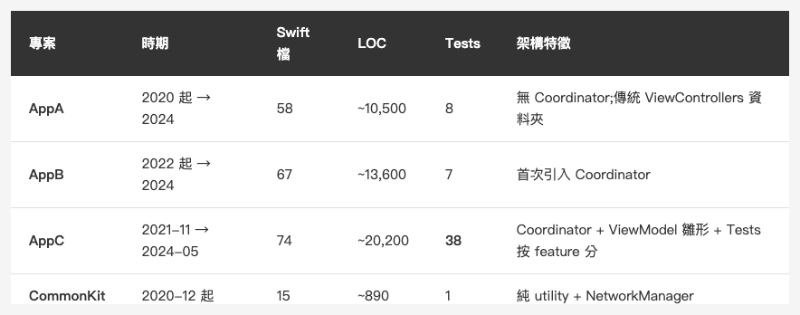

<!-- Tags: iOS, Swift, Software Architecture, Refactoring, Coordinator -->

*(在這裡插入封面圖：cover.png)*

<!-- Gemini prompt: A warm Ghibli-inspired illustration showing ONE continuous winding path through rolling hills under a soft sunrise-to-sunset gradient sky (left side dawn pink, right side golden hour amber). The SAME chibi developer character (brown hair, blue shirt, consistent appearance) appears THREE TIMES along the path — this is the article's core message: one solo developer, three generations, four years.

Bottom-left of path (dawn light): the developer kneels among scattered loose papers and tangled scrolls, scratching his head, looking overwhelmed. Subtle label nearby: "2020 · AppA".

Middle of path (midday light, slightly higher elevation): the SAME developer walks confidently, holding a single neat notebook labeled "Coordinator" under his arm. A small wooden signpost beside him reads "2022 · AppB". A few colorful bubbles ("API", "DB", "Push") float in orderly arcs around him, no longer chaotic.

Top-right of path (golden hour, hilltop): the SAME developer sits at a small outdoor wooden desk with a tidy stack of cards labeled "Tests Passed" (3 green checkmarks floating above). A weathered signpost reads "2024 · AppC · 38 tests". His face is calm, slightly older, contemplative.

In the very bottom-right corner, behind a window frame: a faint translucent silhouette of the present-day developer (same character, slightly older, glasses, looking out) watches the three past selves walking the path — representing "looking back four years later". This is critical: NOT a separate person, it's the narrator-self.

Soft pastel colors, warm Ghibli golden hour palette, gentle green hills, cottages dotting the landscape, 16:9 ratio. Match the visual style of the existing coordinator-evolution.png. The mood: nostalgic, warm, quietly proud — "a late letter to my younger self". -->

# 四年三代 iOS App：那條從 Massive VC 走到 Coordinator 的路

> 重看四年前的 code，看到的不是錯誤，而是一條慢慢長出來的路——從「會動就好」走到「至少能測」。

---

## 前言

最近因為要把舊專案整理進個人知識庫，我打開了一個四年沒碰的資料夾——裡面是同一個客戶、同一條產品線的三代 iOS App，加上一個共用的 SPM 函式庫：

```
CommonKit  (2020-12 起,共用 SPM,13 個 Extension)
    ↓
AppA (2020 起 → 2024)
AppB (2022 起 → 2024)
AppC (2021-11 → 2024-05)
```

當年寫的時候，每一行都覺得是當下能做到的最好版本。四年後回頭看，我才看見一條清楚的學習軌跡——從「什麼都沒有」走到「至少有 38 個測試檔」的那條路。

這不是一篇講「最佳實踐」的文章。這是寫給五年前那個剛開始接這個案子的自己的、一份遲到的回信。

---

## 三代專案的規模對照

先把資料攤開：

*(在這裡插入圖片：table-three-gens-scale.png)*

<!--
| 專案 | 時期 | Swift 檔 | LOC | Tests | 架構特徵 |
|------|------|---------|-----|-------|---------|
| **AppA** | 2020 起 → 2024 | 58 | ~10,500 | 8 | 無 Coordinator;傳統 ViewControllers 資料夾 |
| **AppB** | 2022 起 → 2024 | 67 | ~13,600 | 7 | 首次引入 Coordinator |
| **AppC** | 2021-11 → 2024-05 | 74 | ~20,200 | **38** | Coordinator + ViewModel 雛形 + Tests 按 feature 分 |
| **CommonKit** | 2020-12 起 | 15 | ~890 | 1 | 純 utility + NetworkManager |
-->

AppA 的 8 個測試檔，到 AppC 的 38 個——**測試覆蓋率四年內翻了快五倍**。但這個成長不是某個階段一口氣補上去的，是一個一個 commit 慢慢長出來的。

---

## 第一代：什麼都沒有的 AppA(2020)

AppA 是這條線的起點。當時剛開始接這個案子，腦子裡只有「Storyboard」、「TableView」、「Alamofire」、「Realm」這些關鍵字。

ViewController 裡有什麼？所有東西。

```swift
// AppA 的典型 ViewController(重建版)
class FeatureListViewController: UIViewController {
    var items: [Item] = []
    let dbManager = DBManager.shared
    
    override func viewDidLoad() {
        super.viewDidLoad()
        // 直接打 API
        AF.request("https://api.example.com/items")
            .responseDecodable(of: [Item].self) { response in
                self.items = response.value ?? []
                self.tableView.reloadData()
                
                // 直接寫進 Realm
                let realm = try! Realm()
                try! realm.write {
                    realm.add(self.items, update: .modified)
                }
                
                // 順便 navigate
                if self.items.isEmpty {
                    self.navigationController?.pushViewController(
                        EmptyStateViewController(), animated: true
                    )
                }
            }
    }
}
```

API 呼叫、資料庫寫入、Navigation——**全部塞在 viewDidLoad 裡**。沒有 Service 層、沒有 Coordinator、沒有測試。

當時我沒有覺得這樣有問題，因為它「會動」。對一個還在學 Swift 的我來說，「會動」就是最高評價。

第一代的功課——**先讓東西動起來**。在這個階段討論架構是奢侈的，能交付才是首要。

---

## 第二代：第一次學到 Coordinator(AppB)

AppB 是第二代。寫到一半我接觸到 Coordinator Pattern，第一次知道「Navigation 邏輯不一定要散在 VC 裡」。

AppB 的 `Coordinator/` 資料夾出現了 4 個檔：

```swift
// Coordinator.swift(base protocol)
protocol Coordinator: AnyObject {
    var finishDelegate: CoordinatorFinishDelegate? { get set }
    var navigationController: UINavigationController { get set }
    var childCoordinators: [Coordinator] { get set }
    var type: CoordinatorType { get }
    
    func start()
    func finish()
}

protocol CoordinatorFinishDelegate: AnyObject {
    func coordinatorDidFinish(childCoordinator: Coordinator)
}

enum CoordinatorType {
    case app, login, tab, notify
}
```

加上 `AppCoordinator`、`LoginCoordinator`、`TabCoordinator` —— 一個 root 加兩個子流程。

當時最大的成就感不是「架構變漂亮」，而是**第一次寫出「VC 不知道下一步是誰」的程式碼**。

```swift
// LoginViewController(簡化)
class LoginViewController: UIViewController {
    enum Event {
        case login
        case forgetPassword
        case guest
    }
    
    var didSendEvent: ((Event) -> Void)?
    
    @objc private func loginTapped() {
        // ... 驗證邏輯
        didSendEvent?(.login)  // VC 不知道這之後會怎樣
    }
}

// LoginCoordinator
class LoginCoordinator: Coordinator {
    func showLoginVC() {
        let loginVC = LoginViewController(LoginServiceImpl())
        navigationController.setViewControllers([loginVC], animated: false)
        
        loginVC.didSendEvent = { [weak self] event in
            switch event {
            case .login:
                self?.finish()
            case .forgetPassword:
                break
            case .guest:
                self?.finish()
            }
        }
    }
}
```

第二代的功課——**把職責拿出來放在它該在的地方**。VC 自己不負責「登入後要幹嘛」，那是 Coordinator 的事。

但那時候我還是寫不出測試。Coordinator 是抽出來了，可是要怎麼測？我不知道。

*(在這裡插入圖片：coordinator-evolution.png)*

<!-- Gemini prompt: A warm Ghibli-inspired illustration: ONE continuous landscape (rolling hills, cottages, golden hour light) with three scenes flowing left-to-right within the same scenery. The SAME chibi developer character (brown hair, blue shirt, consistent appearance) appears in ALL THREE scenes — this is critical. The article's core message is "one solo developer carrying three generations of the project alone." Do NOT introduce a second person.

Left scene "AppA": the developer stands in a flower meadow, arms spread, overwhelmed expression, surrounded by chaotic colorful floating bubbles labeled "API", "DB", "Push", "Navigation", "Cache", "Logs". Below the scene: "Solo developer juggling everything (Overwhelmed)"

Middle scene "AppB": the SAME developer, calmer, gently hands one bubble labeled "Coordinator" into a glowing abstract organizer — represent it as a floating signpost / control panel / glowing pattern icon, NOT another character. Other bubbles still float but more orderly. Below: "Delegating to a pattern, not a person (Relieved)"

Right scene "AppC": the SAME developer sits at a tidy outdoor table, calmly arranging neatly stacked cards. Three small green checkmark icons float above the scene labeled "Tests Passed". Below: "Same solo developer, organized layers (Sustainable)"

Soft pastel colors, warm Ghibli sunset / golden hour, beige and gentle green background, 16:9 ratio. Match the visual style of the cover image. -->

---

## 第三代：終於有測試的 AppC

AppC 是時間最長的一代——從 2021 年 11 月開始寫，2024 年 5 月還在發版。中間經歷了 SwiftUI 興起、Combine 普及、Swift Concurrency 上線——但 AppC 還是 UIKit + Coordinator。

不是因為跟不上時代。**最低 iOS 支援版本是公司定的**，當時的範圍仍包含較舊機種，SwiftUI 與 Swift Concurrency 我自己也還沒有把握、沒敢上線用;加上**整條產品線從頭到尾就我一個人扛**，自然會偏向那些已經被我驗證過、未來幾年仍能獨自維護的模式。

AppC 多做了三件事：

### 1. 測試按 feature 切

```
AppCTests/
├── FeatureA/
├── FeatureB/
├── FeatureC/
├── FeatureD/
└── TestDouble/
    ├── DBManagerMock.swift
    └── NavigationControllerMock.swift
```

**Production code 還是 flat(沒有 Vertical Slicing)，但 Tests 端先 vertical 化了**。這個現象後來才意識到——測試沒有外部依賴、重構成本低，比 production code 更容易先切。

### 2. 真的測 Coordinator

```swift
class LoginCoordinatorTests: XCTestCase {
    var sut: LoginCoordinator!
    var navController: NavigationControllerMock!

    override func setUpWithError() throws {
        navController = NavigationControllerMock()
        let app = AppCoordinator(navController)
        app.start()
        sut = app.childCoordinators.first as? LoginCoordinator
            ?? LoginCoordinator(navController)
    }

    func test_start_isLoginVC() {
        sut.start()
        let loginVC = navController.viewControllers.first
        
        XCTAssertNotNil(loginVC)
        XCTAssertTrue(loginVC is LoginViewController)
    }
}
```

`NavigationControllerMock` 取代真 `UINavigationController`——讓 Coordinator 的測試 **in-process 跑**，不走 XCUITest 那條慢路。

第二代的時候我不知道怎麼測 Coordinator。第三代的解法簡單得讓人想笑：**寫一個 Mock**。

但這個「簡單」是站在「已經知道有 Mock 這個東西」的肩膀上。當年沒讀過 Michael Feathers，不知道 Test Seam，自然也想不到。

### 3. 漸進式重構，commit 為證

翻 AppC 的 git log，看到一連串很有意思的 commit：

```
<hash> refactor: 轉場相關 didSendEvent 重構
       - 將事件移回原本的 VC 中
       - update FeatureA / FeatureB / FeatureC
<hash> feat: 更新 FeatureD 相關轉場
       - 將 didSendEvent 整合到原本的 VC 中
       - update FeatureD Create/List/Censor VC
```

這是 Sprout Method 的真實實踐——一次處理一個 feature(FeatureA → B → C → D)，always green，每 commit 一步。

**沒有人告訴我這叫 Sprout Method**。我那時只是覺得「一次改太多會炸，分小一點」。後來讀到 Working Effectively with Legacy Code，才知道這個直覺有名字。

---

## 那些當年沒做、現在懂的事

四年後回頭看，有些反模式很顯眼。但當時的我是看不到的——**反模式之所以是反模式，往往是因為它在小規模時看起來完全合理**。

### 1. `DBManager.shared` 散布在 17 個地方

```swift
// AppCoordinator
var dbManager = DBManager.shared

// FeatureViewController
var dbManager = DBManager.shared

// BaseService
var dbManager = DBManager.shared
```

這是依賴反轉的反例。每個物件都認 Singleton，誰都不能單獨測。

當年覺得「這樣比較方便」。現在知道，**「方便」往往是耦合的代名詞**。

### 2. Token 硬編碼在共用 SPM 裡

```swift
// CommonKit/Sources/CommonKit/Utility.swift
public static func getApiToken() -> String {
    return "<redacted-32-char-hex>"
}
```

三個 App 共用同一個 token，任一外洩全炸。

當年覺得「反正是私 repo」。現在知道，**secret 不該存在 source code 裡，不管 repo 多私**。

### 3. CommonKit 是 Horizontal Shared Module

13 個 Extension + NetworkManager + Utility，全部擠在 single SPM module。

當年覺得「共用很合理」。後來才意識到，**任何一個 extension 改動，三個 App 都要重編**。AppA 用不到 SnapKit，但 CommonKit 加了 → AppA 也得連。

「Shared module 是雙面刃」這句話，要在維護到第四年才會懂。

---

## 架構不是學會的，是長出來的

AppA → AppB → AppC 這條線，沒有任何一個階段是我「決定要重寫架構」的。

每一個改變，都是在解決一個具體的痛：
- 寫 AppB 時，受不了 LoginVC 還要管「登入成功要 push 到哪裡」 → 學 Coordinator
- 寫 AppC 時，被同一個 bug 改三次 → 開始補測試
- 補測試補到一半，發現 Coordinator 沒法測 → 寫 Mock
- Mock 寫多了，發現 Tests 資料夾愈來愈亂 → 按 feature 分子目錄

**這條路無法跳級**。沒有經歷 AppA 的痛，不會在 AppB 引入 Coordinator;沒有 AppB 的 Coordinator，不會在 AppC 想到測 Coordinator。

很多人問我「該怎麼學架構？」我以前回答「讀某某書」、「看某某課程」。現在的答案是：

> 接一個會做超過兩年的案子，然後讓它逼你。

書和課程給你語彙——讓你知道「原來這個叫 Coordinator」、「原來這個叫 Test Seam」。但讓這些語彙真的住進你腦袋裡的，是專案維護到第二年、第三年時，你被迫面對的那些選擇。

---

## 結語

寫這篇文章的時候，我同時在做另一件事——把這四年的程式碼餵進個人知識庫，跟 Essential Developer 課程的概念條目一條一條對照。

對到第五個概念時，我突然有個感覺：**我不是在學架構，是在「認出」自己已經做過的事**。

依賴反轉、Repository Pattern、Vertical Slicing、Sprout Method、Closure Test Seam……這些名詞我四年前都不知道，但 AppC 的 commit log 裡，每一個都有對應的足跡。

如果你也正在維護一個三年以上的案子，我建議做一件事：

**翻翻你自己的 git log，看看有沒有哪個 commit message 寫著「為了讓 X 容易測試，先抽出 Y」之類的話。**

如果有，恭喜你——那就是你的 Sprout Method。它不需要被學會，它已經在你的 commit history 裡。

---

*(在這裡插入圖片：commit-history-as-architecture.png)*

<!-- Gemini prompt: A warm Ghibli-inspired illustration. A chibi developer sits in front of a screen showing a long vertical git log. Each commit message has a small icon next to it: a wrench (refactor), a sprout (sprout method), a green checkmark (tests). Threads of light connect the commits to a glowing book on the desk labeled "Architecture Patterns". The developer's face shows quiet realization — "I was already doing this." Soft pastel colors, warm beige background, 16:9 ratio. -->

---

感謝閱讀。如果你也曾回頭重看自己的舊 code，有什麼讓你印象深刻的瞬間？歡迎留言分享。

---

## 知識來源

- 本文三個專案(AppA / AppB / AppC)為本人實際開發維護的客戶端 iOS App，專案代號、模組名與功能領域均已去識別化呈現。
- 架構概念(Coordinator、Sprout Method、Test Seam、Vertical Slicing)源自 [iOS Lead Essentials](https://www.essentialdeveloper.com/ios-lead-essentials) 課程與 Michael Feathers《Working Effectively with Legacy Code》。
- 程式碼範例為簡化版本，保留結構但去除業務細節;commit hash 與敏感字串均以佔位符替代。
