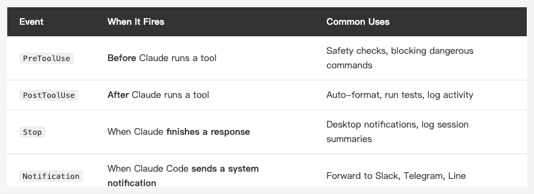
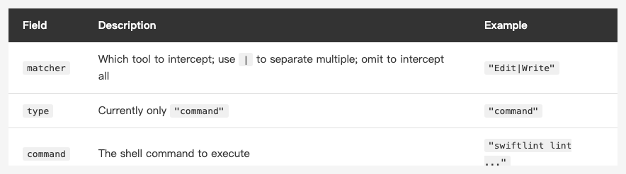
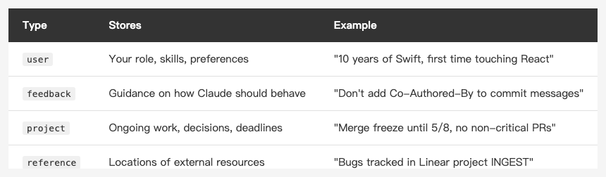
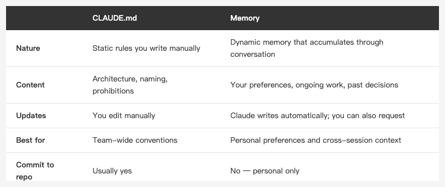
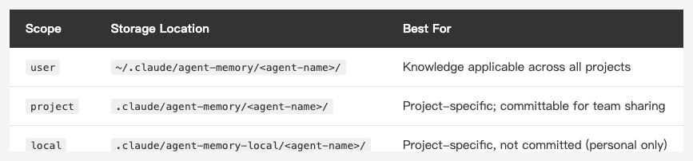

<!-- Tags: Artificial Intelligence, Software Development, Developer Tools, Claude Code, Automation -->

*(Insert cover image here: cover.png)*

<!--
Gemini prompt: A cute Ghibli-inspired soft pastel illustration. A chibi engineer character sits at a desk. On the left, a set of colorful hooks (like fish hooks but friendly) are hanging on a wall, each labeled with small tags: "PreToolUse", "PostToolUse", "Stop". On the right, a small glowing notebook floats in the air labeled "Memory", with tiny sticky notes drifting around it like memories. The character looks content, as if things are running automatically. Soft pastel colors (mint, peach, lavender), white background, clean and simple. 16:9 ratio.
-->

# Hooks + Memory — Automate Claude Code's Reactions and Build Long-Term Memory

> CLAUDE.md tells Claude the rules. Hooks make it act on them automatically. Memory makes it remember you.

---

## Introduction

The previous article covered CLAUDE.md in depth — how to layer it, what to put in it, and what to leave out.

But CLAUDE.md has one fundamental limitation: **it's static**. Rules you write there are always visible to Claude, but Claude doesn't *proactively do things*, and it doesn't *remember what you said last time*.

The two mechanisms in this article address exactly those gaps:

- **Hooks** — trigger specific commands on specific actions, so Claude Code executes them automatically without you asking every time
- **Memory** — let Claude retain information across conversations, building genuine long-term memory

---

## Part 1: Hooks

### What Are Hooks?

Hooks are "auto-triggered commands" you configure in `settings.json`.

When Claude Code performs certain actions — running a Bash command, editing a file, finishing a response — Hooks fire and execute the shell commands you specified.

The most common use case: every time Claude modifies a Swift file, automatically run SwiftLint. No reminder needed. No "remember to run lint" in CLAUDE.md. Edit the file, lint runs.

### Hook Event Types

Claude Code currently supports four Hook events:

*(Insert image here: table-hooks-events-en.png)*

<!--
| Event | When It Fires | Common Uses |
|-------|--------------|-------------|
| `PreToolUse` | **Before** Claude runs a tool | Safety checks, blocking dangerous commands |
| `PostToolUse` | **After** Claude runs a tool | Auto-format, run tests, log activity |
| `Stop` | When Claude **finishes a response** | Desktop notifications, log session summaries |
| `Notification` | When Claude Code **sends a system notification** | Forward to Slack, Telegram, Line |
-->

`PostToolUse` is the most commonly used: wait for Claude to finish something, then automatically run your command.

### Configuration

Hooks are configured in `settings.json` — either the global `~/.claude/settings.json` or the project-level `.claude/settings.json`:

```json
{
  "hooks": {
    "PostToolUse": [
      {
        "matcher": "Edit|Write",
        "hooks": [
          {
            "type": "command",
            "command": "FILE=$(cat | jq -r '.tool_input.file_path // empty'); if [[ \"$FILE\" == *.swift ]]; then swiftlint lint --quiet \"$FILE\" 2>/dev/null; fi"
          }
        ]
      }
    ]
  }
}
```

It looks complex, but the structure is straightforward:

*(Insert image here: table-hooks-config-en.png)*

<!--
| Field | Description | Example |
|-------|-------------|---------|
| `matcher` | Which tool to intercept; use `\|` to separate multiple; omit to intercept all | `"Edit\|Write"` |
| `type` | Currently only `"command"` | `"command"` |
| `command` | The shell command to execute | `"swiftlint lint ..."` |
-->

`matcher` matches Claude Code tool names: `Bash`, `Edit`, `Write`, `Read`, `Glob`, `Grep`, etc. Omitting `matcher` intercepts all tools.

### stdin Data Format

When a Hook fires, Claude Code passes event information as JSON via **stdin** to your command. Read it with `cat`, then parse it with `jq`:

For a `PostToolUse` + `Edit` event, the stdin JSON looks like this:

```json
{
  "hook_event_name": "PostToolUse",
  "tool_name": "Edit",
  "tool_input": {
    "file_path": "/path/to/file.swift",
    "old_string": "...",
    "new_string": "..."
  }
}
```

To extract `file_path`:

```bash
FILE=$(cat | jq -r '.tool_input.file_path // empty')
```

That's why the SwiftLint example parses the stdin JSON to extract `file_path`, then lints that specific file.

A few environment variables are also available — `CLAUDE_PROJECT_DIR` (project root), `CLAUDE_PLUGIN_ROOT`, etc. — but tool data itself only comes through stdin; there are no `CLAUDE_TOOL_INPUT`-style env vars.

### Practical Examples

**1. Auto-run SwiftLint after modifying Swift files**

```json
{
  "hooks": {
    "PostToolUse": [
      {
        "matcher": "Edit|Write",
        "hooks": [
          {
            "type": "command",
            "command": "FILE=$(cat | jq -r '.tool_input.file_path // empty'); if [[ \"$FILE\" == *.swift ]]; then swiftlint lint --quiet \"$FILE\" 2>/dev/null; fi"
          }
        ]
      }
    ]
  }
}
```

**2. Log every Bash command Claude executes**

```json
{
  "hooks": {
    "PostToolUse": [
      {
        "matcher": "Bash",
        "hooks": [
          {
            "type": "command",
            "command": "CMD=$(cat | jq -r '.tool_input.command // empty'); echo \"[$(date)] $CMD\" >> ~/.claude/bash_history.log"
          }
        ]
      }
    ]
  }
}
```

**3. Desktop notification when Claude finishes (macOS)**

```json
{
  "hooks": {
    "Stop": [
      {
        "hooks": [
          {
            "type": "command",
            "command": "osascript -e 'display notification \"Claude Code finished\" with title \"Claude Code\"'"
          }
        ]
      }
    ]
  }
}
```

**4. Forward notifications to Telegram via Notification Hook**

If you have a Claude Code Telegram bot set up, you can forward notifications like this:

```json
{
  "hooks": {
    "Notification": [
      {
        "hooks": [
          {
            "type": "command",
            "command": "MSG=$(cat | jq -r '.message // empty'); curl -s -X POST \"https://api.telegram.org/bot$TELEGRAM_BOT_TOKEN/sendMessage\" -d \"chat_id=$TELEGRAM_CHAT_ID&text=$(python3 -c 'import sys,urllib.parse; print(urllib.parse.quote(sys.stdin.read()))' <<< \"$MSG\")\" > /dev/null"
          }
        ]
      }
    ]
  }
}
```

### PreToolUse: Intercept Before Claude Acts

*(Insert image here: pretooluse.png)*

<!--
Gemini prompt: A cute Ghibli-inspired soft pastel illustration. A chibi Claude character is about to press a big red button labeled "rm -rf". But a small chibi guard character in a helmet steps in front, holding up a STOP sign, blocking the action. The guard looks firm but friendly. A warning sign floats nearby with "⛔ 危險指令". Soft pastel colors (mint, peach, coral, lavender), white background, clean and simple. 16:9 ratio.
-->

`PreToolUse` has a special behavior: if the hook command exits with code **2**, Claude Code **cancels** that tool call and feeds the hook's stderr back to Claude as an error message. (Other non-zero exit codes are non-blocking errors — the tool still runs.)

This lets you build a safety gatekeeper:

```json
{
  "hooks": {
    "PreToolUse": [
      {
        "matcher": "Bash",
        "hooks": [
          {
            "type": "command",
            "command": "CMD=$(cat | jq -r '.tool_input.command // empty'); if echo \"$CMD\" | grep -qE '(rm -rf|DROP TABLE|DELETE FROM)'; then echo '⛔ Dangerous command blocked. Please confirm and run manually.' >&2; exit 2; fi"
          }
        ]
      }
    ]
  }
}
```

This hook intercepts Bash commands containing `rm -rf`, `DROP TABLE`, or `DELETE FROM`, forcing Claude to reconsider.

### The Recommended Way to Configure Hooks

Rather than editing `settings.json` by hand, just describe what you want in natural language:

```
Add a PostToolUse hook that automatically runs SwiftLint after Claude modifies Swift files
```

Claude handles JSON formatting, path escaping, and quote escaping correctly — far fewer mistakes than writing it manually.

---

## Part 2: Memory

### What Is Memory?

CLAUDE.md solves "making Claude aware of project conventions," but it has a blind spot: **whatever you tell Claude in one conversation, it forgets by the next one.**

"You said not to add Co-Authored-By last time."
"Didn't I already say no force unwraps?"
"You just fixed this bug yesterday."

The Memory system addresses this. It lets Claude save important information to persistent files that are read automatically at the start of the next conversation — building genuine cross-session memory.

### Where Memory Is Stored

Claude Code's Auto Memory lives at:

```
~/.claude/projects/{project-path}/memory/
```

Each memory entry is an individual `.md` file, indexed through `MEMORY.md`.

### Four Memory Types

*(Insert image here: table-memory-types-en.png)*

<!--
| Type | Stores | Example |
|------|--------|---------|
| `user` | Your role, skills, preferences | "10 years of Swift, first time touching React" |
| `feedback` | Guidance on how Claude should behave | "Don't add Co-Authored-By to commit messages" |
| `project` | Ongoing work, decisions, deadlines | "Merge freeze until 5/8, no non-critical PRs" |
| `reference` | Locations of external resources | "Bugs tracked in Linear project INGEST" |
-->

**user memory**: Helps Claude understand who you are, so it adjusts explanation depth and communication style. A seasoned iOS developer doesn't need `@StateObject` explained; someone writing Swift for the first time does.

**feedback memory**: The most important type. Every time you correct Claude's behavior, it should save a feedback memory — so you don't have to repeat yourself next time.

**project memory**: Records what's happening right now, context, and time-sensitive information. A current merge freeze, the root cause of a bug, an upcoming release next week.

**reference memory**: Remembers *where information lives*, not the information itself. Linear project keys, monitoring dashboard URLs, design file locations.

### Memory File Format

Each memory file looks like this:

```markdown
---
name: commit message preference
description: No Co-Authored-By, no English commits
type: feedback
---

Write commit messages in Traditional Chinese. Do not add a `Co-Authored-By` line.

**Why:** User explicitly stated they don't want Co-Authored-By, and prefers Chinese commit messages.
**How to apply:** Follow this on every git commit, including amends.
```

`feedback` and `project` type memories especially benefit from **Why** and **How to apply** paragraphs. They provide context that helps Claude make judgment calls in edge cases, rather than blindly following a rule.

### The MEMORY.md Index

After writing a memory file, add a pointer in `MEMORY.md`:

```markdown
- [commit message preference](feedback_commit.md) — no Co-Authored-By, Traditional Chinese
- [user profile](user_profile.md) — iOS developer, Swift expert, new to React
- [Claude Code article schedule](project_article_schedule.md) — weekly Fridays, 5/8 Hooks+Memory
```

`MEMORY.md` is automatically loaded at the start of each session (first 200 lines or 25KB, whichever comes first). Claude uses it to decide which memories are relevant to the current task, then reads individual files as needed.

### Asking Claude to Remember Things

You can tell Claude directly what to save:

```
Remember: all API keys in this project go in Keychain, not UserDefaults
```

```
Remember: this feature needs to be done by 5/15 — UI this week, API next week
```

You can also ask it to forget:

```
Forget the merge freeze memory, the freeze has been lifted
```

Claude will find the corresponding memory file, delete it, and update MEMORY.md.

### Memory vs. CLAUDE.md

These two mechanisms are easy to confuse, but their roles are clear:

*(Insert image here: table-vs-claudemd-en.png)*

<!--
| | CLAUDE.md | Memory |
|---|-----------|--------|
| **Nature** | Static rules you write manually | Dynamic memory that accumulates through conversation |
| **Content** | Architecture, naming, prohibitions | Your preferences, ongoing work, past decisions |
| **Updates** | You edit it manually | Claude writes automatically; you can also request |
| **Best for** | Team-wide conventions | Personal preferences and cross-session context |
| **Commit to repo** | Usually yes | No — personal only |
-->

The short version: **CLAUDE.md is rules for everyone. Memory is personal to you.**

### What's Worth Saving?

*(Insert image here: memory-worth.png)*

<!--
Gemini prompt: A cute Ghibli-inspired soft pastel illustration. A chibi engineer character stands in front of two baskets. The left basket glows warmly and is labeled "✅ 值得存" — it contains floating notes like "個人偏好", "工作背景", "外部連結". The right basket is crossed out and labeled "❌ 不用存" — it has floating notes like "程式碼", "git log", "一次性資訊". The character is thoughtfully deciding which note to put where. Soft pastel colors (mint, peach, lavender), white background, clean and simple. 16:9 ratio.
-->

Not everything should go into memory. Here's the decision framework:

**Worth saving:**
- You corrected Claude's behavior, but the correction isn't visible in code (e.g. "don't add a summary at the end of every response")
- Current work context that doesn't appear in git log (e.g. "this refactor is a legal requirement, not tech debt")
- Locations of external resources (e.g. "this project's designs are in the Figma Team Library")

**Not worth saving:**
- Things derivable from code (architecture, naming conventions → put in CLAUDE.md)
- Things in git history (who changed what and why → use git log)
- Temporary information useful only in this conversation

---

## Sub-agent Independent Memory

Everything so far has been about main Claude's auto memory. If you use sub-agents, each agent can have its **own completely isolated memory directory**.

Enable it by setting the `memory` field in the agent's frontmatter:

```yaml
---
name: code-reviewer
description: Review code quality and best practices
memory: user
---

You are a code reviewer. After each review, record the patterns, conventions, and common issues you find in your memory.
```

Three scopes are available:

*(Insert image here: table-agent-memory-scopes-en.png)*

<!--
| Scope | Storage Location | Best For |
|-------|-----------------|----------|
| `user` | `~/.claude/agent-memory/<agent-name>/` | Knowledge applicable across all projects |
| `project` | `.claude/agent-memory/<agent-name>/` | Project-specific; can be committed so the team shares it |
| `local` | `.claude/agent-memory-local/<agent-name>/` | Project-specific but not committed (personal only) |
-->

The official recommendation is to default to `project`, so what the agent learns can be shared with the team via git.

### Each Agent Is Fully Isolated

Agents with different names have completely separate memory directories. Knowledge accumulated by a `code-reviewer` never mixes with `ios-auditor`. Each agent has its own notebook — they don't interfere with each other.

Main Claude's auto memory (`~/.claude/projects/<project>/memory/`) is an entirely separate system with no connection to agent memory.

### Having an Agent Maintain Its Own Memory

You can write memory instructions directly into the agent's system prompt:

```markdown
After completing each review, record the codebase patterns, architectural decisions,
and common issues you found in your memory. Write concise notes on what you found and where.
This way you'll have accumulated background knowledge to reference in future reviews.
```

Or ask directly in conversation:

```
Use the code-reviewer agent to review this PR, and after the review save what you learned to your memory
```

---

## Combining Hooks + Memory

Both mechanisms work well independently, but together they enable more interesting workflows.

**Example: Automatically log important decisions Claude makes**

```json
{
  "hooks": {
    "Stop": [
      {
        "hooks": [
          {
            "type": "command",
            "command": "echo 'Stop hook triggered' >> ~/.claude/session.log"
          }
        ]
      }
    ]
  }
}
```

Combine with asking Claude to summarize key decisions at the end of a session, saving them automatically to project memory.

**Example: Get notified when work is done**

```json
{
  "hooks": {
    "Stop": [
      {
        "hooks": [
          {
            "type": "command",
            "command": "osascript -e 'display notification \"Task complete, come back and check\" with title \"Claude Code\" sound name \"Glass\"'"
          }
        ]
      }
    ]
  }
}
```

Walk away from your screen, do something else, and come back when the notification fires.

---

## FAQ

**Q: What happens if a Hook command fails?**

For `PostToolUse` and `Stop`, if the hook fails (non-zero exit code), Claude Code logs the error but **does not affect the main flow**. For `PreToolUse`, only exit code **2** blocks the tool from executing — other non-zero exit codes are non-blocking errors and the tool still runs.

**Q: Does Memory consume context window?**

The `MEMORY.md` index is always in context, but individual memory files are only read when judged relevant. Keep the index concise (one entry per line, under 150 characters) — the length of individual memory files matters much less.

**Q: Can multiple hooks fire for the same event?**

Yes. You can configure multiple hook objects under the same event; they execute in order.

**Q: Can hook commands span multiple lines?**

Not directly in JSON. Use `&&` or `;` to chain commands, or extract the logic into a shell script and call that.

---

## Summary

Hooks and Memory are the two pieces that upgrade Claude Code from "a smart assistant" to "a work partner that truly understands you":

- **Hooks** — you don't have to ask every time; it acts automatically. SwiftLint, notifications, safety guards — configure once, works forever
- **Memory** — you don't have to explain every time; it remembers. Personal preferences, work context, past decisions — all there across sessions

Combined with CLAUDE.md from the previous article, you now have a complete three-layer configuration system:

- **CLAUDE.md** — permanent rules; tells Claude the conventions
- **Hooks** — automatic triggers; makes the rules enforced
- **Memory** — long-term memory; helps Claude understand you

The next article goes into **MCP (Model Context Protocol) in practice** — how to connect Claude Code to external tools, directly querying databases, calling APIs, reading Figma designs.

Thanks for reading.

---

## References

- [Claude Code Docs — Hooks](https://docs.anthropic.com/en/docs/claude-code/hooks) — Complete official Hooks documentation, all event types and environment variables
- [Claude Code Docs — Memory](https://docs.anthropic.com/en/docs/claude-code/memory) — Memory system overview, MEMORY.md format and memory types
- [Claude Code Docs — Sub-agents (Persistent Memory section)](https://docs.anthropic.com/en/docs/claude-code/sub-agents#enable-persistent-memory) — Sub-agent memory scope configuration, directory structure, and usage recommendations
- [Claude Code Docs — Settings](https://docs.anthropic.com/en/docs/claude-code/settings) — Complete settings.json reference
