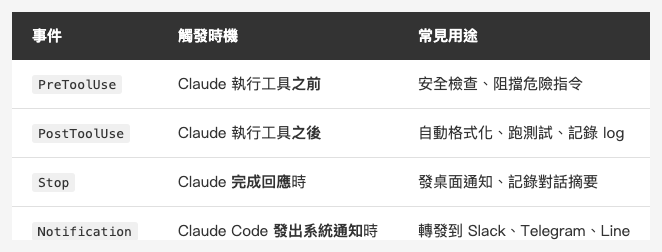
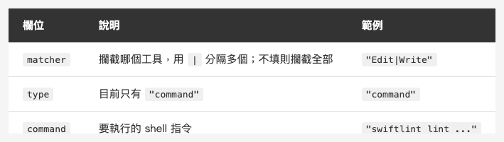
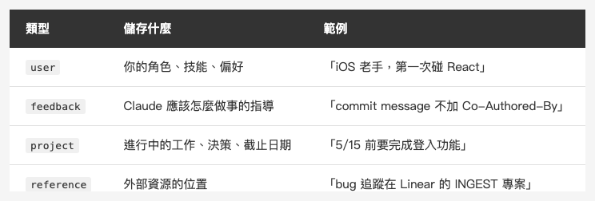
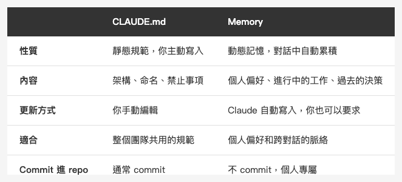
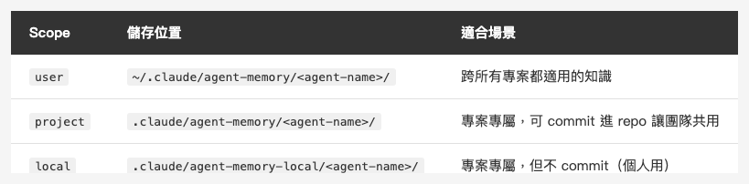

<!-- Tags: Artificial Intelligence, Software Development, Developer Tools, Claude Code, Automation -->

*(在這裡插入封面圖：cover.png)*

<!--
Gemini prompt: A cute Ghibli-inspired soft pastel illustration. A chibi engineer character sits at a desk. On the left, a set of colorful hooks (like fish hooks but friendly) are hanging on a wall, each labeled with small tags: "PreToolUse", "PostToolUse", "Stop". On the right, a small glowing notebook floats in the air labeled "Memory", with tiny sticky notes drifting around it like memories. The character looks content, as if things are running automatically. Soft pastel colors (mint, peach, lavender), white background, clean and simple. 16:9 ratio.
-->

# Hooks + Memory — 讓 Claude Code 自動反應、長期記憶

> CLAUDE.md 告訴 Claude 規則是什麼，Hooks 讓它自動執行，Memory 讓它記住你。

---

## 前言

上一篇把 CLAUDE.md 講清楚了 — 怎麼分層、放什麼、不放什麼。

但 CLAUDE.md 有一個本質限制：**它是靜態的**。你寫進去的規則，每次 Claude 都會看到，但 Claude 不會「主動做事」，也不會「記住上次說了什麼」。

這篇要介紹的兩個機制，解決的就是這兩件事：

- **Hooks** — 讓特定動作觸發特定指令，Claude Code 自動執行，不用你每次說
- **Memory** — 讓 Claude 在對話之間保留資訊，建立起真正的長期記憶

---

## Part 1：Hooks

### 什麼是 Hooks？

Hooks 是你設定在 `settings.json` 裡的「自動觸發指令」。

當 Claude Code 做某些動作（例如執行 Bash 指令、編輯檔案、結束對話），Hooks 就會被觸發，自動執行你指定的 shell 指令。

舉個最常見的用途：每次 Claude 修改了 Swift 檔案，自動跑 SwiftLint。不用每次提醒它，不用在 CLAUDE.md 裡寫「記得跑 lint」。改了就自動跑。

### Hooks 的類型

Claude Code 目前支援四種 Hook 事件：

*(在這裡插入圖片：table-hooks-events.png)*

<!--
| 事件 | 觸發時機 | 常見用途 |
|------|---------|---------|
| `PreToolUse` | Claude 執行工具**之前** | 安全檢查、記錄將要做的事 |
| `PostToolUse` | Claude 執行工具**之後** | 自動格式化、跑測試、通知 |
| `Stop` | Claude **完成回應**時 | 發送完成通知、記錄對話摘要 |
| `Notification` | Claude Code **發出系統通知**時 | 轉發通知到 Slack、Line、Telegram |
-->

最常用的是 `PostToolUse`：等 Claude 做完某件事，再接著自動執行你的指令。

### 設定方式

Hooks 設定在 `settings.json`（可以是全域的 `~/.claude/settings.json`，也可以是專案的 `.claude/settings.json`）：

```json
{
  "hooks": {
    "PostToolUse": [
      {
        "matcher": "Edit|Write",
        "hooks": [
          {
            "type": "command",
            "command": "FILE=$(cat | jq -r '.tool_input.file_path // empty'); if [[ \"$FILE\" == *.swift ]]; then swiftlint lint --quiet \"$FILE\" 2>/dev/null; fi"
          }
        ]
      }
    ]
  }
}
```

看起來有點複雜，但結構其實很清楚：

*(在這裡插入圖片：table-hooks-config.png)*

<!--
| 欄位 | 說明 | 範例 |
|------|------|------|
| `matcher` | 要攔截哪個工具（用 `\|` 分隔多個） | `"Edit\|Write"` |
| `type` | 目前只有 `"command"` | `"command"` |
| `command` | 要執行的 shell 指令 | `"swiftlint lint ..."` |
-->

`matcher` 對應的是 Claude Code 的工具名稱：`Bash`、`Edit`、`Write`、`Read`、`Glob`、`Grep` 等。不填 `matcher` 就是攔截所有工具。

### stdin 資料格式

Hook 執行時，Claude Code 透過 **stdin** 把事件資訊以 JSON 傳入你的指令。用 `cat` 讀取，再用 `jq` 解析：

以 `PostToolUse` + `Edit` 為例，stdin 收到的 JSON 長這樣：

```json
{
  "hook_event_name": "PostToolUse",
  "tool_name": "Edit",
  "tool_input": {
    "file_path": "/path/to/file.swift",
    "old_string": "...",
    "new_string": "..."
  }
}
```

讀取 `file_path`：

```bash
FILE=$(cat | jq -r '.tool_input.file_path // empty')
```

所以前面那個 SwiftLint 指令，是把 stdin JSON 解析出 `file_path`，再針對那個檔案跑 lint。

另外也有幾個環境變數可用：`CLAUDE_PROJECT_DIR`（專案根目錄）、`CLAUDE_PLUGIN_ROOT` 等；但工具資料本身只走 stdin。

### 實用範例

**1. 修改 Swift 檔案後自動跑 SwiftLint**

```json
{
  "hooks": {
    "PostToolUse": [
      {
        "matcher": "Edit|Write",
        "hooks": [
          {
            "type": "command",
            "command": "FILE=$(cat | jq -r '.tool_input.file_path // empty'); if [[ \"$FILE\" == *.swift ]]; then swiftlint lint --quiet \"$FILE\" 2>/dev/null; fi"
          }
        ]
      }
    ]
  }
}
```

**2. 執行完 Bash 指令後記錄 log**

```json
{
  "hooks": {
    "PostToolUse": [
      {
        "matcher": "Bash",
        "hooks": [
          {
            "type": "command",
            "command": "CMD=$(cat | jq -r '.tool_input.command // empty'); echo \"[$(date)] $CMD\" >> ~/.claude/bash_history.log"
          }
        ]
      }
    ]
  }
}
```

**3. Claude 完成時發桌面通知（macOS）**

```json
{
  "hooks": {
    "Stop": [
      {
        "hooks": [
          {
            "type": "command",
            "command": "osascript -e 'display notification \"Claude Code 已完成\" with title \"Claude Code\"'"
          }
        ]
      }
    ]
  }
}
```

**4. 用 Notification Hook 把通知轉發到 Telegram**

如果你有設定 Claude Code 的 Telegram bot，可以這樣把通知轉發：

```json
{
  "hooks": {
    "Notification": [
      {
        "hooks": [
          {
            "type": "command",
            "command": "MSG=$(cat | jq -r '.message // empty'); curl -s -X POST \"https://api.telegram.org/bot$TELEGRAM_BOT_TOKEN/sendMessage\" -d \"chat_id=$TELEGRAM_CHAT_ID&text=$(python3 -c 'import sys,urllib.parse; print(urllib.parse.quote(sys.stdin.read()))' <<< \"$MSG\")\" > /dev/null"
          }
        ]
      }
    ]
  }
}
```

### PreToolUse：在 Claude 動手之前介入

*(在這裡插入圖片：pretooluse.png)*

<!--
Gemini prompt: A cute Ghibli-inspired soft pastel illustration. A chibi Claude character is about to press a big red button labeled "rm -rf". But a small chibi guard character in a helmet steps in front, holding up a STOP sign, blocking the action. The guard looks firm but friendly. A warning sign floats nearby with "⛔ 危險指令". Soft pastel colors (mint, peach, coral, lavender), white background, clean and simple. 16:9 ratio.
-->

`PreToolUse` 有個特殊之處：如果 hook 指令的 exit code 為 **2**，Claude Code 會**中止**那個工具呼叫，並把 hook 的 stderr 當成錯誤訊息反饋給 Claude。（其他非 0 exit code 只是非阻擋性錯誤，不會中止工具。）

這讓你可以做「安全守門員」：

```json
{
  "hooks": {
    "PreToolUse": [
      {
        "matcher": "Bash",
        "hooks": [
          {
            "type": "command",
            "command": "CMD=$(cat | jq -r '.tool_input.command // empty'); if echo \"$CMD\" | grep -qE '(rm -rf|DROP TABLE|DELETE FROM)'; then echo '⛔ 危險指令，已阻擋。請確認後手動執行。' >&2; exit 2; fi"
          }
        ]
      }
    ]
  }
}
```

這個 hook 會攔截帶有 `rm -rf`、`DROP TABLE`、`DELETE FROM` 的 Bash 指令，強制讓 Claude 重新考慮。

### 設定 Hooks 的建議方式

比起手動編輯 `settings.json`，更推薦直接用自然語言告訴 Claude 你要的效果：

```
幫我加一個 PostToolUse hook，當 Claude 修改 Swift 檔案後自動跑 SwiftLint
```

Claude 會正確處理 JSON 格式、路徑、引號跳脫等細節，比手寫少犯錯。

---

## Part 2：Memory

### 什麼是 Memory？

CLAUDE.md 解決的是「讓 Claude 知道專案規範」，但它有個盲點：**你跟 Claude 說過的話，下次對話它就忘了。**

「上次你說不用加 Co-Authored-By 的」
「我不是已經說過不要用 force unwrap 嗎」
「這個 bug 你昨天才修過啊」

Memory 系統就是解決這個問題的。它讓 Claude 可以把重要資訊存到持久化的檔案裡，下次對話開始時自動讀取，建立真正的跨對話記憶。

### 記憶的儲存位置

Claude Code 的 Auto Memory 存放在：

```
~/.claude/projects/{project-path}/memory/
```

每條記憶是一個獨立的 `.md` 檔案，並透過 `MEMORY.md` 作為索引。

### 四種記憶類型

*(在這裡插入圖片：table-memory-types.png)*

<!--
| 類型 | 儲存什麼 | 範例 |
|------|---------|------|
| `user` | 使用者的角色、技能、偏好 | 「熟悉 Swift 十年，第一次接觸 React」 |
| `feedback` | Claude 該怎麼做事的指導 | 「commit message 不要加 Co-Authored-By，因為用戶不喜歡」 |
| `project` | 進行中的工作、決策、截止日期 | 「5/8 合併凍結，不要送非緊急 PR」 |
| `reference` | 外部資源的位置 | 「bug 追蹤在 Linear 的 INGEST 專案」 |
-->

**user 記憶**：讓 Claude 了解你是誰，調整它的解釋深度和溝通方式。iOS 老手不需要解釋什麼是 `@StateObject`；第一次寫 Swift 的人則需要。

**feedback 記憶**：這是最重要的一種。每次你糾正 Claude 的行為，它都應該存一條 feedback 記憶，這樣下次就不用再重複說一遍。

**project 記憶**：記錄正在進行的事、背景脈絡、時效性資訊。例如目前有個合併凍結、某個 bug 的根本原因、下週要發版等。

**reference 記憶**：記住「資訊放在哪裡」，而不是記住資訊本身。Linear 的 project key、監控 dashboard 的 URL、設計稿的位置等。

### 記憶的格式

每個記憶檔案長這樣：

```markdown
---
name: commit message 偏好
description: 不要加 Co-Authored-By，不要用英文 commit
type: feedback
---

commit message 請使用繁體中文，不要加 `Co-Authored-By` 行。

**Why:** 用戶明確表示不希望出現 Co-Authored-By，也偏好中文 commit。
**How to apply:** 每次 git commit 都要遵守，包括 amend。
```

`feedback` 和 `project` 類型的記憶特別建議用 **Why** 和 **How to apply** 兩個段落補充脈絡，讓下次讀到時能判斷邊界情況，而不只是盲目遵守一條規則。

### MEMORY.md 索引

記憶檔案寫好之後，還需要在 `MEMORY.md` 裡加一行指標：

```markdown
- [commit message 偏好](feedback_commit.md) — 不加 Co-Authored-By，用繁體中文
- [用戶背景](user_profile.md) — iOS 開發者，熟悉 Swift，新接觸 React
- [Claude Code 文章排程](project_article_schedule.md) — 每週五發文，5/8 Hooks+Memory
```

`MEMORY.md` 在每次 session 開始時自動載入（前 200 行或 25KB，以先達到者為準）。Claude 靠它決定哪些記憶跟當前任務相關，需要的時候再去讀個別的完整檔案。

### 讓 Claude 主動記憶

你可以直接告訴 Claude 要記住什麼：

```
記住：我們這個專案的 API key 都存在 Keychain，不要用 UserDefaults
```

```
記住：這個功能在 5/15 之前要完成，這週先做 UI，下週再接 API
```

也可以要求它刪除記憶：

```
忘掉關於合併凍結的記憶，已經解凍了
```

Claude 會自動找到對應的記憶檔案並刪除，同時更新 MEMORY.md。

### Memory 跟 CLAUDE.md 的差異

這兩個機制很容易搞混，但分工其實很清楚：

*(在這裡插入圖片：table-vs-claudemd.png)*

<!--
| | CLAUDE.md | Memory |
|---|-----------|--------|
| **性質** | 靜態規範，你主動寫入 | 動態記憶，對話中自動累積 |
| **內容** | 架構、命名、禁止事項 | 你的偏好、進行中的工作、過去的決策 |
| **更新方式** | 你手動編輯 | Claude 自動寫入，你也可以要求 |
| **適合** | 整個團隊共用的規範 | 個人偏好和跨對話的脈絡 |
| **commit** | 通常 commit 進 repo | 不 commit，個人專屬 |
-->

簡單記：**CLAUDE.md 是寫給所有人的規則，Memory 是屬於你個人的記憶。**

### 什麼值得存入記憶？

*(在這裡插入圖片：memory-worth.png)*

<!--
Gemini prompt: A cute Ghibli-inspired soft pastel illustration. A chibi engineer character stands in front of two baskets. The left basket glows warmly and is labeled "✅ 值得存" — it contains floating notes like "個人偏好", "工作背景", "外部連結". The right basket is crossed out and labeled "❌ 不用存" — it has floating notes like "程式碼", "git log", "一次性資訊". The character is thoughtfully deciding which note to put where. Soft pastel colors (mint, peach, lavender), white background, clean and simple. 16:9 ratio.
-->

不是什麼都該存。以下是判斷標準：

**值得存：**
- 你糾正過 Claude 的行為，但這個糾正跟程式碼無關（例如：「不要在回答結尾加總結」）
- 現在的工作背景，但這個資訊在 git log 裡看不到（例如：「這個重構是因為 legal 要求，不是技術 debt」）
- 外部資源的位置（例如：「這個專案的設計稿在 Figma 的 Team Library 裡」）

**不值得存：**
- 可以從程式碼推斷的事（架構、命名規範 → 放 CLAUDE.md）
- Git 歷史裡有的事（誰改了什麼、為什麼改 → 看 git log）
- 只在這次對話有用的暫時資訊

---

## Sub-agent 的獨立 Memory

到目前為止說的都是主 Claude 的 auto memory。但如果你有用 sub-agent，每個 agent 也可以有**自己完全獨立的 memory 目錄**。

在 agent 的 frontmatter 設定 `memory` 欄位就能啟用：

```yaml
---
name: code-reviewer
description: 審查程式碼品質與 best practices
memory: user
---

你是 code reviewer。每次審查時，把發現的 patterns、慣例、常見問題記錄進你的 memory。
```

有三種 scope 可選：

*(在這裡插入圖片：table-agent-memory-scopes.png)*

<!--
| Scope | 儲存位置 | 適合場景 |
|-------|---------|---------|
| `user` | `~/.claude/agent-memory/<agent-name>/` | 跨所有專案都適用的知識 |
| `project` | `.claude/agent-memory/<agent-name>/` | 專案專屬，可 commit 進 repo 讓團隊共用 |
| `local` | `.claude/agent-memory-local/<agent-name>/` | 專案專屬，但不 commit（個人用） |
-->

官方建議預設用 `project`，讓 agent 學到的東西可以透過 git 跟團隊共用。

### 每個 agent 各自獨立

名字不同的 agent，memory 目錄就完全隔離。一個 `code-reviewer` 累積的知識不會跟 `ios-auditor` 混在一起。每個 agent 就像有自己的筆記本，互不干擾。

主 Claude 的 auto memory（`~/.claude/projects/<project>/memory/`）是另一套系統，跟 agent memory 互不相關。

### 讓 agent 主動維護 memory

可以直接在 agent 的 system prompt 裡寫進記憶指令：

```markdown
每次完成審查後，把發現的 codebase patterns、架構決策、常見問題
記錄進你的 memory。用簡潔的筆記寫下發現了什麼、在哪裡。
這樣下次審查時，你就有累積的背景知識可以參考。
```

也可以在對話裡直接要求：

```
用 code-reviewer agent 審查這個 PR，審查完後請把學到的東西存進你的 memory
```

---

## Hooks + Memory 的搭配

這兩個機制單獨用都很好，但搭配起來能做更有意思的事。

**例子：自動記錄 Claude 做了什麼重大決策**

```json
{
  "hooks": {
    "Stop": [
      {
        "hooks": [
          {
            "type": "command",
            "command": "echo 'Stop hook triggered' >> ~/.claude/session.log"
          }
        ]
      }
    ]
  }
}
```

配合在對話結束時請 Claude 整理這次的重要決策，自動存進 project 記憶。

**例子：自動在工作完成後發通知**

```json
{
  "hooks": {
    "Stop": [
      {
        "hooks": [
          {
            "type": "command",
            "command": "osascript -e 'display notification \"任務完成，可以回來看了\" with title \"Claude Code\" sound name \"Glass\"'"
          }
        ]
      }
    ]
  }
}
```

讓你可以離開螢幕做別的事，等通知響了再回來確認。

---

## 常見問題

**Q：Hooks 的 shell 指令失敗了會怎樣？**

`PostToolUse` 和 `Stop` 的 hook 失敗（exit code 非 0），Claude Code 會記錄錯誤但**不會影響主要流程**。`PreToolUse` 只有 exit code **2** 才會阻擋工具執行；其他非 0 exit code 只是非阻擋性錯誤，工具仍會繼續執行。

**Q：Memory 的記憶會佔掉 context 嗎？**

`MEMORY.md` 索引永遠在 context 裡，但個別記憶檔案只有在被判斷相關時才會讀入。所以索引要保持簡短（每行一條，不超過 150 字），記憶本身的長度影響不大。

**Q：可以有多個 hook 觸發同一個事件嗎？**

可以。同一個事件底下可以設多個 hook 物件，會依序執行。

**Q：Hook 的指令可以有換行嗎？**

JSON 裡不能直接換行，需要用 `&&` 或 `;` 串接，或者把邏輯寫成 shell script 再呼叫。

---

## 總結

Hooks 和 Memory 是讓 Claude Code 從「聰明的助手」升級成「真正理解你的工作夥伴」的兩塊拼圖：

- **Hooks** — 你不用每次說，它自動做。SwiftLint、通知、安全守衛，設定一次，持續生效
- **Memory** — 你不用每次解釋，它記得住。個人偏好、工作背景、過去的決策，跨對話都在

配合上一篇的 CLAUDE.md，現在你有了完整的三層設定機制：

- **CLAUDE.md** — 永久規範，告訴 Claude 規則
- **Hooks** — 自動觸發，讓規則被執行
- **Memory** — 長期記憶，讓 Claude 了解你

下一篇會進入 **MCP（Model Context Protocol）實戰** — 怎麼讓 Claude Code 連接外部工具，直接操作資料庫、打 API、讀 Figma 設計稿。

感謝閱讀。

---

## 參考資料

- [Claude Code Docs — Hooks](https://docs.anthropic.com/en/docs/claude-code/hooks) — Hooks 完整官方文件，包含所有事件類型和環境變數
- [Claude Code Docs — Memory](https://docs.anthropic.com/en/docs/claude-code/memory) — Memory 系統說明，包含 MEMORY.md 格式和記憶類型
- [Claude Code Docs — Sub-agents（Persistent Memory 章節）](https://docs.anthropic.com/en/docs/claude-code/sub-agents#enable-persistent-memory) — Sub-agent memory 的 scope 設定、目錄結構、使用建議
- [Claude Code Docs — Settings](https://docs.anthropic.com/en/docs/claude-code/settings) — settings.json 完整設定說明
