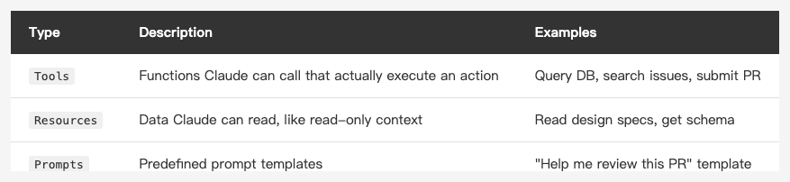
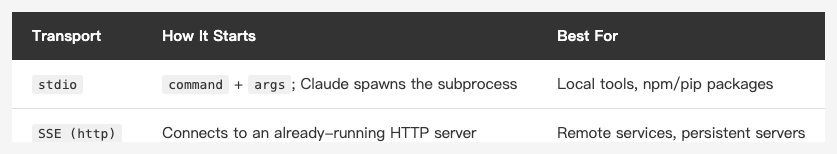

<!-- Tags: Claude Code, MCP, Developer Tools, API Integration, Productivity -->

*(Insert cover image here: cover.png)*

<!--
Gemini prompt: A cute Ghibli-inspired soft pastel illustration. A chibi engineer character sits at a desk with a laptop. Around the laptop, several colorful cables are plugging into different floating icons: a database cylinder, a GitHub Octocat, a Figma logo, a browser window, and a small robot. The cables all converge into the laptop like a hub. The character looks amazed. Soft pastel colors (mint, peach, lavender, sky blue), white background, clean and simple. 16:9 ratio.
-->

# MCP in Practice — Let Claude Code Query Your Database, Call APIs, and Read Figma

> MCP lets Claude do more than read your code — it can operate every tool in your workflow.

---

## Introduction

The previous two articles covered Claude Code's internal mechanisms: CLAUDE.md for conventions, Hooks for automatic triggers, and Memory for cross-session retention.

This article looks outward: **MCP (Model Context Protocol)**.

MCP is an open protocol from Anthropic that lets Claude connect to external tools and data sources. Once configured, Claude can search GitHub issues, read Figma designs, fetch any webpage, or call tools you write yourself.

No copy-pasting. No manually switching windows. No feeding content to Claude. **Claude goes and gets it.**

---

## Part 1: What Is MCP?

### A Protocol, Not a Plugin

MCP is an open protocol that defines how AI models communicate with external tools. Anyone can implement an MCP Server following this protocol and expose tools for Claude to use.

The architecture is simple:

```
Claude Code (MCP Host)
    ↕ MCP Protocol
MCP Server (middleware)
    ↕ Native API / SDK
External tool (database, GitHub, Figma…)
```

Claude Code is the **Host** — it initiates requests. The MCP Server is a process you start; it communicates with the external tool and returns results to Claude.

### Three Things an MCP Server Can Provide

*(Insert image here: table-mcp-capabilities-en.png)*

<!--
| Type | Description | Examples |
|------|-------------|---------|
| `Tools` | Functions Claude can call that actually execute an action | Query DB, search issues, submit PR |
| `Resources` | Data Claude can read, like read-only context | Read design specs, get schema |
| `Prompts` | Predefined prompt templates | "Help me review this PR" template |
-->

In practice, **Tools** are used most often — Claude calls them automatically when needed. You don't have to say "go check the database" every time.

---

## Part 2: Configuring MCP Servers

### Basic Configuration Format

MCP Servers are configured in the `mcpServers` field of `settings.json`:

```json
{
  "mcpServers": {
    "server-name": {
      "command": "npx",
      "args": ["-y", "@modelcontextprotocol/server-filesystem", "/Users/mike/projects"]
    }
  }
}
```

- `command`: the executable to start the server (`npx`, `node`, `python3`, `uvx`, etc.)
- `args`: arguments passed to the command
- `server-name`: a custom identifier; Claude uses this name to find tools

Like Hooks, this can go in the global `~/.claude/settings.json` or a project-level `.claude/settings.json`.

### Transport Types

*(Insert image here: table-mcp-transport-en.png)*

<!--
| Transport | How It Starts | Best For |
|-----------|--------------|----------|
| `stdio` | `command` + `args`; Claude spawns the subprocess | Local tools, npm/pip packages |
| `SSE (http)` | Connects to an already-running HTTP server | Remote services, persistent servers |
-->

Most tools use **stdio** — Claude Code spawns and manages the process lifecycle for you.

SSE is for services you deploy yourself. Add a `url` field instead:

```json
{
  "mcpServers": {
    "my-service": {
      "url": "http://localhost:3000/mcp"
    }
  }
}
```

### Passing Environment Variables

Many servers need API keys. Pass them via the `env` field to avoid putting secrets directly in `args`:

```json
{
  "mcpServers": {
    "filesystem": {
      "command": "npx",
      "args": ["-y", "@modelcontextprotocol/server-filesystem", "/Users/mike/projects"],
      "env": {
        "SOME_API_KEY": "your_key_here"
      }
    }
  }
}
```

---

## Part 3: Common MCP Servers in Practice

### 1. Filesystem — Read and Write Any Directory

```json
{
  "mcpServers": {
    "filesystem": {
      "command": "npx",
      "args": [
        "-y",
        "@modelcontextprotocol/server-filesystem",
        "/Users/mike/Documents",
        "/Users/mike/Downloads"
      ]
    }
  }
}
```

Once configured, Claude can read and write any directory you specify — including locations outside Claude Code's working directory. Read config files from another repo, inspect a CSV in Downloads — no manual copy-pasting required.

### 2. GitHub — Search Issues, Read PRs, Query Repos

GitHub has migrated its official MCP server to a standalone repo, now distributed as a Docker image (Docker must be installed):

```json
{
  "mcpServers": {
    "github": {
      "command": "docker",
      "args": [
        "run", "-i", "--rm",
        "-e", "GITHUB_PERSONAL_ACCESS_TOKEN",
        "ghcr.io/github/github-mcp-server"
      ],
      "env": {
        "GITHUB_PERSONAL_ACCESS_TOKEN": "ghp_xxxxxxxxxxxx"
      }
    }
  }
}
```

Ask Claude directly:

```
Search anthropics/claude-code for issues related to hooks
```

```
List the 5 most recent open PRs
```

Claude calls the GitHub API itself — no need to run `gh` commands and paste the results.

### 3. Fetch — Retrieve Any Webpage

```json
{
  "mcpServers": {
    "fetch": {
      "command": "uvx",
      "args": ["mcp-server-fetch"]
    }
  }
}
```

Lets Claude fetch any webpage directly. Common uses:

```
Read this GitHub issue and tell me what the current workaround is
```

```
Fetch https://api.example.com/docs and write me code to call the /users endpoint
```

### 4. Figma — Read Design Files

Figma MCP lets Claude read a Figma file's structure, component names, color values, and spacing — then write SwiftUI or HTML/CSS directly from the design.

The currently recommended server is [Figma MCP Server](https://github.com/GLips/Figma-Context-MCP):

```json
{
  "mcpServers": {
    "figma": {
      "command": "npx",
      "args": ["-y", "figma-developer-mcp", "--figma-api-key=YOUR_TOKEN", "--stdio"]
    }
  }
}
```

Then ask:

```
Based on the LoginScreen component in Figma, implement this screen in SwiftUI
```

Claude reads the design structure and maps it directly to SwiftUI's VStack, HStack, Text, etc., with colors, fonts, and spacing pulled from the design file.

### Other Servers Worth Knowing

**[Chrome DevTools MCP](https://github.com/ChromeDevTools/chrome-devtools-mcp)** (official from Google): Lets Claude access console errors, network requests, and performance traces — and connect directly to your already-open browser session for debugging without re-authenticating. Great if you do web development.

---

## Part 4: How to Install MCP Servers

Installation method depends on the server's language:

```bash
# Node.js (most common): use npx directly, no prior npm install needed
npx -y @modelcontextprotocol/server-filesystem

# Python: use uvx (recommended) or pipx
uvx mcp-server-fetch

# Or install with pip and run directly
pip install mcp-server-fetch
mcp-server-fetch
```

`npx -y` downloads and runs automatically. `uvx` is the Python equivalent (requires `uv` to be installed first).

---

## Part 5: Let Claude Configure MCP for You

Just like with Hooks, you can skip editing `settings.json` by hand and just tell Claude:

```
Set up the GitHub MCP server, my token is ghp_xxxx
```

Claude writes the JSON, puts it in the right location, and handles escaping and formatting correctly.

---

## Part 6: Building a Custom MCP Server (Advanced)

If existing servers don't cover your needs, you can write your own. The MCP SDK supports TypeScript and Python:

```typescript
import { Server } from "@modelcontextprotocol/sdk/server/index.js";
import { StdioServerTransport } from "@modelcontextprotocol/sdk/server/stdio.js";

const server = new Server({ name: "my-tool", version: "1.0.0" });

server.tool("get_sprint_tasks", "Get current sprint task list", {}, async () => {
  const tasks = await fetchFromJira(); // your own logic
  return { content: [{ type: "text", text: JSON.stringify(tasks) }] };
});

const transport = new StdioServerTransport();
await server.connect(transport);
```

Then configure it:

```json
{
  "mcpServers": {
    "my-tool": {
      "command": "node",
      "args": ["/path/to/my-tool/index.js"]
    }
  }
}
```

Any tool you can express in code can be exposed to Claude through MCP.

---

## FAQ

**Q: How do I troubleshoot an MCP Server that fails to start?**

Run the server command manually in your terminal (e.g. `npx -y @modelcontextprotocol/server-filesystem`) and watch for error output. Common causes: Node.js version too old, missing environment variables, network issues.

**Q: Does running multiple MCP Servers cause performance issues?**

stdio servers only start when Claude needs them — they don't run in the background consuming resources. SSE servers are your responsibility to manage.

**Q: How does Claude know when to call an MCP tool?**

Claude infers from context. Ask "check the users table in the database" and it looks for an available DB tool. You can also be explicit: "use the github MCP to search for issues."

**Q: What's the difference between MCP and Claude Code's Bash tool?**

The Bash tool runs shell commands directly on your machine — extremely flexible but unstructured. MCP Servers provide a structured interface (function name, parameters, return value) that Claude understands more precisely, and they can connect to remote services beyond your local machine.

---

## Summary

MCP is the extension interface for the Claude Code ecosystem:

- **Filesystem** — breaks Claude out of the working directory, reads and writes anywhere
- **GitHub** — lets Claude operate issues, PRs, and repos directly without manual lookups
- **Fetch** — lets Claude retrieve docs, API specs, and webpages on its own
- **Figma** — lets Claude write code directly from design files

Combined with the CLAUDE.md, Hooks, and Memory from previous articles, Claude Code can now:

- Know your conventions (CLAUDE.md)
- Execute repetitive actions automatically (Hooks)
- Remember your preferences (Memory)
- Connect to every tool in your workflow (MCP)

The next article covers **Git workflows** — how to integrate Claude Code into your actual git process: code reviews, branch management, and commit messages, rather than just editing code and handing it back to you.

Thanks for reading.

---

## References

- [Claude Code Docs — MCP](https://docs.anthropic.com/en/docs/claude-code/mcp) — MCP configuration reference for Claude Code
- [MCP Official Site](https://modelcontextprotocol.io) — Full Model Context Protocol specification and official server list
- [MCP Servers (GitHub)](https://github.com/modelcontextprotocol/servers) — Official server collection: filesystem, GitHub, fetch, and more
- [Figma MCP Server](https://github.com/GLips/Figma-Context-MCP) — Third-party Figma MCP; lets Claude read design files
- [Chrome DevTools MCP (GitHub)](https://github.com/ChromeDevTools/chrome-devtools-mcp) — Official from the Google Chrome DevTools team; gives Claude access to console, network, and performance traces
- [Chrome for Developers — Chrome DevTools MCP](https://developer.chrome.com/blog/chrome-devtools-mcp) — Official announcement and overview
