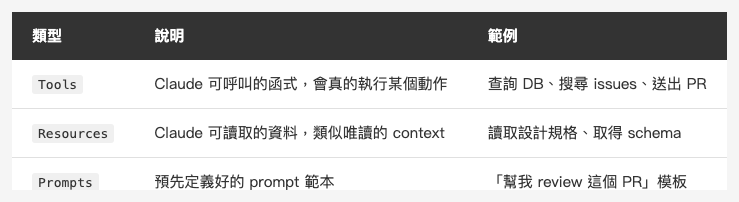
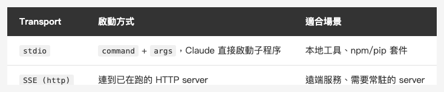

<!-- Tags: Claude Code, MCP, Developer Tools, API Integration, Productivity -->

*(在這裡插入封面圖：cover.png)*

<!--
Gemini prompt: A cute Ghibli-inspired soft pastel illustration. A chibi engineer character sits at a desk with a laptop. Around the laptop, several colorful cables are plugging into different floating icons: a database cylinder, a GitHub Octocat, a Figma logo, a browser window, and a small robot. The cables all converge into the laptop like a hub. The character looks amazed. Soft pastel colors (mint, peach, lavender, sky blue), white background, clean and simple. 16:9 ratio.
-->

# MCP 實戰 — 讓 Claude Code 直接操作資料庫、打 API、讀 Figma

> MCP 讓 Claude 不只是讀你的程式碼，而是真的能操作你工作中的每一個工具。

---

## 前言

前兩篇談的是 Claude Code 內部的機制：CLAUDE.md 設定規範、Hooks 自動觸發、Memory 跨對話記憶。

這篇要往外看：**MCP（Model Context Protocol）**。

MCP 是 Anthropic 開放的協定，讓 Claude 可以連接外部工具和資料來源。設定好之後，Claude 可以直接搜尋 GitHub issues、讀取 Figma 設計稿、抓任意網頁，甚至呼叫你自己寫的工具。

不用複製貼上，不用手動切換視窗，不用把內容餵給 Claude。**Claude 自己去拿。**

---

## Part 1：MCP 是什麼

### 協定，不是插件

MCP 是一個開放協定，定義了 AI 模型跟外部工具之間溝通的標準。任何人都可以依照這個協定實作 MCP Server，暴露工具給 Claude 使用。

架構很簡單：

```
Claude Code（MCP Host）
    ↕ MCP Protocol
MCP Server（中介層）
    ↕ 原生 API / SDK
外部工具（資料庫、GitHub、Figma…）
```

Claude Code 是 **Host**，負責發起請求。MCP Server 是你啟動的程序，負責跟外部工具溝通，再把結果回傳給 Claude。

### MCP Server 能提供三種東西

*(在這裡插入圖片：table-mcp-capabilities.png)*

<!--
| 類型 | 說明 | 範例 |
|------|------|------|
| `Tools` | Claude 可呼叫的函式，會真的執行某個動作 | 查詢 DB、搜尋 issues、送出 PR |
| `Resources` | Claude 可讀取的資料，類似唯讀的 context | 讀取設計規格、取得 schema |
| `Prompts` | 預先定義好的 prompt 範本 | 「幫我 review 這個 PR」模板 |
-->

實務上最常用的是 **Tools** — Claude 判斷需要時自動呼叫，你不用每次說「去查資料庫」。

---

## Part 2：設定 MCP Server

### 基本設定格式

MCP Server 設定在 `settings.json` 的 `mcpServers` 欄位：

```json
{
  "mcpServers": {
    "server-name": {
      "command": "npx",
      "args": ["-y", "@modelcontextprotocol/server-filesystem", "/Users/mike/projects"]
    }
  }
}
```

- `command`：啟動 server 的可執行檔（`npx`、`node`、`python3`、`uvx` 等）
- `args`：傳給 command 的參數
- `server-name`：自訂的識別名稱，Claude 會用這個名稱來找工具

跟 Hooks 一樣，可以放在全域（`~/.claude/settings.json`）或專案（`.claude/settings.json`）。

### Transport 類型

*(在這裡插入圖片：table-mcp-transport.png)*

<!--
| Transport | 啟動方式 | 適合場景 |
|-----------|---------|---------|
| `stdio` | `command` + `args`，Claude 直接啟動子程序 | 本地工具、npm/pip 套件 |
| `SSE (http)` | 連到已在跑的 HTTP server | 遠端服務、需要常駐的 server |
-->

大多數工具用 **stdio**，Claude Code 幫你啟動、管理生命週期，不用自己跑程序。

SSE 適合有自己部署的服務，設定多一個 `url` 欄位：

```json
{
  "mcpServers": {
    "my-service": {
      "url": "http://localhost:3000/mcp"
    }
  }
}
```

### 環境變數傳入

許多 server 需要 API key，透過 `env` 欄位傳入，避免把 secret 直接寫進 args：

```json
{
  "mcpServers": {
    "filesystem": {
      "command": "npx",
      "args": ["-y", "@modelcontextprotocol/server-filesystem", "/Users/mike/projects"],
      "env": {
        "SOME_API_KEY": "your_key_here"
      }
    }
  }
}
```

---

## Part 3：常用 MCP Server 實戰

### 1. Filesystem — 讀寫任意目錄

```json
{
  "mcpServers": {
    "filesystem": {
      "command": "npx",
      "args": [
        "-y",
        "@modelcontextprotocol/server-filesystem",
        "/Users/mike/Documents",
        "/Users/mike/Downloads"
      ]
    }
  }
}
```

設定好之後，Claude 可以直接讀寫你指定的目錄——包括 Claude Code 工作目錄以外的地方。例如讀取另一個 repo 的設定檔、查看 Downloads 裡的 CSV，都不用你先手動貼進來。

### 2. GitHub — 搜尋 issues、讀 PR、查 repo

GitHub 官方已將 MCP server 遷移至獨立 repo，改以 Docker 方式執行（需先安裝 Docker）：

```json
{
  "mcpServers": {
    "github": {
      "command": "docker",
      "args": [
        "run", "-i", "--rm",
        "-e", "GITHUB_PERSONAL_ACCESS_TOKEN",
        "ghcr.io/github/github-mcp-server"
      ],
      "env": {
        "GITHUB_PERSONAL_ACCESS_TOKEN": "ghp_xxxxxxxxxxxx"
      }
    }
  }
}
```

可以直接問 Claude：

```
幫我搜尋 anthropics/claude-code 裡面關於 hooks 的 issues
```

```
列出最近 5 個還沒 merge 的 PR
```

Claude 會自己呼叫 GitHub API，不需要你先用 `gh` 指令查好再貼給它。

### 3. Fetch — 抓任意網頁

```json
{
  "mcpServers": {
    "fetch": {
      "command": "uvx",
      "args": ["mcp-server-fetch"]
    }
  }
}
```

讓 Claude 可以直接抓網頁內容。常見用途：

```
幫我看一下這個 GitHub issue 的討論，然後告訴我目前的 workaround 是什麼
```

```
抓 https://api.example.com/docs 的 API 文件，然後幫我寫呼叫 /users 的程式碼
```

### 4. Figma — 讀取設計稿

Figma MCP 讓 Claude 可以直接讀取 Figma 設計稿的結構、元件名稱、顏色值、間距等，再根據設計稿直接寫 SwiftUI 或 HTML/CSS。

目前社群廣泛使用的是 [Figma MCP Server](https://github.com/GLips/Figma-Context-MCP)：

```json
{
  "mcpServers": {
    "figma": {
      "command": "npx",
      "args": ["-y", "figma-developer-mcp", "--figma-api-key=YOUR_TOKEN", "--stdio"]
    }
  }
}
```

設定好後：

```
根據 Figma 裡的 LoginScreen 元件，幫我用 SwiftUI 實作這個畫面
```

Claude 會讀取 Figma 的設計結構，直接對應成 SwiftUI 的 VStack、HStack、Text 等元件，顏色、字體、間距都從設計稿來。

### 其他值得一提的 Server

**[Chrome DevTools MCP](https://github.com/ChromeDevTools/chrome-devtools-mcp)**（Google 官方）：讓 Claude 直接存取 console errors、network 請求、performance trace，還能接管你已開啟的瀏覽器 session debug，不需要重新登入。做 Web 開發的值得一試。

---

## Part 4：安裝 MCP Server 的方式

依照 server 的實作語言，安裝方式不同：

```bash
# Node.js（最多）：用 npx 直接執行，不需要事先 npm install
npx -y @modelcontextprotocol/server-filesystem

# Python：用 uvx（推薦）或 pipx
uvx mcp-server-fetch

# 或用 pip 安裝後直接執行
pip install mcp-server-fetch
mcp-server-fetch
```

`npx -y` 會自動下載並執行，不需要先安裝。`uvx` 是 Python 版的類似工具（需先安裝 `uv`）。

---

## Part 5：透過 Claude 設定 MCP

跟設定 Hooks 一樣，比起手動編輯 `settings.json`，可以直接告訴 Claude：

```
幫我設定 GitHub MCP server，token 是 ghp_xxxx
```

Claude 會幫你寫好 JSON、放在正確位置、處理引號和格式問題。

---

## Part 6：自訂 MCP Server（進階）

如果現有的 server 不夠用，你可以自己寫。MCP SDK 支援 TypeScript 和 Python：

```typescript
import { Server } from "@modelcontextprotocol/sdk/server/index.js";
import { StdioServerTransport } from "@modelcontextprotocol/sdk/server/stdio.js";

const server = new Server({ name: "my-tool", version: "1.0.0" });

server.tool("get_sprint_tasks", "取得目前 sprint 的任務列表", {}, async () => {
  const tasks = await fetchFromJira(); // 你自己的邏輯
  return { content: [{ type: "text", text: JSON.stringify(tasks) }] };
});

const transport = new StdioServerTransport();
await server.connect(transport);
```

然後設定：

```json
{
  "mcpServers": {
    "my-tool": {
      "command": "node",
      "args": ["/path/to/my-tool/index.js"]
    }
  }
}
```

任何可以用程式表達的工具，都可以透過 MCP 暴露給 Claude。

---

## 常見問題

**Q：MCP Server 啟動失敗怎麼排查？**

先在終端機手動執行 server 指令（例如 `npx -y @modelcontextprotocol/server-filesystem`），看是否有錯誤輸出。常見問題：Node.js 版本不夠、環境變數沒設、網路問題。

**Q：設定多個 MCP Server 有效能問題嗎？**

stdio transport 的 server 只有在 Claude 需要時才會啟動，不會常駐佔用資源。SSE server 需要你自己管理。

**Q：Claude 怎麼知道什麼時候要呼叫 MCP 工具？**

Claude 會根據對話內容自動判斷。如果你問「查一下資料庫的 users 表」，它會找有沒有 DB 相關的 MCP tool 可用。你也可以明確說「用 github MCP 幫我搜尋 issues」。

**Q：MCP 跟 Claude Code 的 Bash 工具有什麼差？**

Bash 工具直接在你的機器執行 shell 指令，能做的事情非常廣但沒有結構。MCP Server 提供結構化的介面（函式名稱、參數、回傳值），Claude 更容易理解和呼叫，且可以連接到你機器以外的遠端服務。

---

## 總結

MCP 是 Claude Code 生態系的「擴充介面」：

- **Filesystem** — 讓 Claude 跨越工作目錄的限制，讀寫任意檔案
- **GitHub** — 讓 Claude 直接操作 issues、PR、repo，不用你手動查
- **Fetch** — 讓 Claude 自己抓文件、API spec、網頁內容
- **Figma** — 讓 Claude 從設計稿直接寫程式

配合前幾篇的 CLAUDE.md、Hooks、Memory，現在 Claude Code 已經能夠：

- 知道你的規範（CLAUDE.md）
- 自動執行重複動作（Hooks）
- 記住你的偏好（Memory）
- 連接你工作中的所有工具（MCP）

下一篇會進入 **Git 工作流** — 怎麼讓 Claude Code 真正融入你的 git 流程，做 code review、管理 branch、寫 commit message，而不只是改完程式碼丟給你。

感謝閱讀。

---

## 參考資料

- [Claude Code Docs — MCP](https://docs.anthropic.com/en/docs/claude-code/mcp) — Claude Code 的 MCP 設定說明
- [MCP 官方網站](https://modelcontextprotocol.io) — Model Context Protocol 完整規格、官方 server 列表
- [MCP Server 官方列表（GitHub）](https://github.com/modelcontextprotocol/servers) — 官方維護的 server 集合，含 filesystem、GitHub、fetch 等
- [Figma MCP Server](https://github.com/GLips/Figma-Context-MCP) — 第三方 Figma MCP，讓 Claude 讀取設計稿
- [Chrome DevTools MCP（GitHub）](https://github.com/ChromeDevTools/chrome-devtools-mcp) — Google Chrome DevTools 官方團隊出品，讓 Claude 直接存取 console、network、performance trace
- [Chrome for Developers — Chrome DevTools MCP](https://developer.chrome.com/blog/chrome-devtools-mcp) — 官方介紹文章
