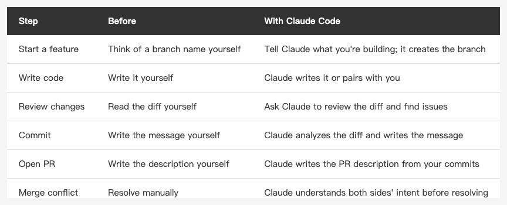

<!-- Tags: Claude Code, Git, Developer Tools, Version Control, Software Development -->

*(Insert cover image here: cover.png)*

<!--
Gemini prompt: A cute Ghibli-inspired soft pastel illustration. A chibi engineer character stands in front of a giant glowing git branch tree. The branches are colorful and neatly organized. The character is holding a small magnifying glass and pointing at one of the branches happily. Some branches have small tags like "main", "feature", "fix". Soft pastel colors (mint, peach, lavender), white background, clean and simple. 16:9 ratio.
-->

# Git Workflow — Making Claude Code a True Part of Your Version Control

> Editing code is just the beginning. Commits, reviews, PRs — Claude can be part of every step.

---

## Introduction

The previous articles covered Claude Code's internal mechanisms (CLAUDE.md, Hooks, Memory) and external integrations (MCP).

But there's something I haven't addressed: **what happens after Claude Code finishes editing your code?**

Most people's workflow is: let Claude make changes, then manually run `git add`, `git commit`, and open a PR themselves. Claude is just a smart code generator — the git workflow is still entirely on you.

This article changes that.

Claude Code has complete context about your codebase. It knows what changed, why it changed, and what's affected. Bring it into the git workflow, and it can do far more than "help you type a commit message."

---

## Part 1: Commit Messages

### Why You Shouldn't Write Commit Messages Yourself

Not because you're lazy. Because Claude knows more than you do.

When you write a commit message, you're thinking about what you just did. Claude simultaneously knows: which files changed, why they changed (because it made the changes), which problem this solves, and whether there are any potential side effects.

Put all of that into a commit message, and future-you — and your teammates — will be grateful.

### Just Ask Claude to Write It

The simplest approach:

```
Write a commit message for this change
```

Claude runs `git diff --staged`, analyzes the changes, and produces a concise message. For better results, give it more context:

```
Write a commit message — this fixes the issue where the keyboard covers the login fields on iPad in landscape mode
```

### Let the /commit Skill Handle the Full Flow

If you have the `/commit` skill configured in Claude Code, you can run the entire commit workflow in one shot:

1. Run `git status` and `git diff` to show current changes
2. Perform a code review to catch potential issues
3. Confirm which files to exclude
4. Ask for the ticket number
5. Write the commit message and execute the commit

Every commit goes through a quality check — no more lazy "fix bug" messages.

### What Separates a Good Commit Message from a Bad One

```bash
# Bad
git commit -m "fix"
git commit -m "update login"
git commit -m "wip"

# What Claude writes
git commit -m "Fix keyboard covering login fields on iPad landscape

On iPad in landscape mode, the software keyboard covers the email/password
fields at the bottom of LoginView when it appears. Switched to
.ignoresSafeArea(.keyboard) with ScrollView so the fields scroll
above the keyboard."
```

---

## Part 2: Code Review

*(Insert image here: review.png)*

<!--
Gemini prompt: A cute Ghibli-inspired soft pastel illustration. A chibi engineer character sits at a desk holding a large magnifying glass, carefully inspecting a glowing scroll of code. Around the scroll, small floating icons appear: a bug icon with an X, a shield (security), a lightning bolt (performance), and a book (readability). The character looks focused and thoughtful. Soft pastel colors (mint, peach, lavender), white background, clean and simple. 16:9 ratio.
-->

### Let Claude Review Your Changes Before Committing

```
Review this git diff and find any potential bugs or issues
```

Claude reads `git diff --staged` (or `git diff HEAD`) and analyzes from multiple angles:

- **Correctness**: Is the logic right? Are there unhandled edge cases?
- **Security**: Any SQL injection, XSS, or unsafe data handling?
- **Performance**: Obvious performance issues? (N+1 queries, unnecessary loops)
- **Readability**: Are names clear? Is there complex logic that needs a comment?

### Targeted Reviews

You can ask more specific questions:

```
In this diff, is there any way the API token could end up in the logs?
```

```
Review the Core Data migration in this PR — any risk of data loss?
```

```
Is the new async code using Swift concurrency correctly?
```

Claude has full context about your codebase. The review quality is on par with a human reviewer who knows the repo well.

### Reviewing Someone Else's PR

It works for other people's changes too:

```
Review this PR diff (paste the diff content)
```

Or if you have GitHub MCP configured:

```
Review PR #142, focus on the authentication section
```

---

## Part 3: Branch Management

### Let Claude Create the Right Branch

```
I'm starting the iPad keyboard fix for the login page — create a branch for me
```

Claude follows the branch naming conventions in your CLAUDE.md (if defined) or common conventions:

```bash
git checkout -b fix/login-ipad-keyboard-overlap
```

### Cleaning Up a Messy Branch List

```
List all branches that have already been merged into main, then ask me which ones to delete
```

```
What did each of these branches do? Give me an overview
```

Claude runs `git log` on each branch, analyzes the changes, and gives you a clear summary before you decide what to clean up.

---

## Part 4: PR Descriptions

### Let Claude Write the PR Description

```
Write a PR description based on the commits in this branch
```

A good PR description should cover:
- What problem this PR solves
- How it solves it (technical decisions)
- How to test it (test plan)
- Anything reviewers should watch out for

Claude knows what you changed and can write all of this clearly — no need to reconstruct it yourself.

### Open a PR Directly with GitHub MCP

If you have GitHub MCP configured:

```
Open a PR to main based on the current commits, base branch is develop
```

Claude analyzes the commit history, writes a title and description, then calls the GitHub API to create the PR directly.

---

## Part 5: Querying Git History

### Understanding What a Commit Did

```
Explain what commit a3f9c2b did and why the change was made
```

Claude reads `git show a3f9c2b` and gives you a plain-language explanation — not just a list of changed files.

### Finding When a Bug Was Introduced

```
When might this issue in LoginView have been introduced? Check the git log
```

Claude uses `git log --all -p -- LoginView.swift` and the concept of `git bisect` to narrow down the suspicious commit range.

### Making Sense of Complex History

```
What changed in the auth module over the past two weeks? Summarize it for me
```

```
Who wrote this file and why is it designed this way? Look through git blame for clues
```

---

## Part 6: Resolving Merge Conflicts

*(Insert image here: conflict.png)*

<!--
Gemini prompt: A cute Ghibli-inspired soft pastel illustration. Two chibi engineer characters stand on opposite sides, each pulling on a glowing rope (representing a git branch), looking frustrated. In the middle, a calm chibi Claude character gently holds both ropes together, smiling and mediating. Above each character, small scrolls float showing different code changes. Soft pastel colors (mint, peach, lavender, coral), white background, clean and simple. 16:9 ratio.
-->

Merge conflicts are one of the most painful parts of development. Claude is particularly useful here because it can understand the **intent** behind both versions simultaneously.

```
Resolve this merge conflict
```

Claude reads the conflict markers (`<<<<<<<`, `=======`, `>>>>>>>`), analyzes what each side is trying to do, and decides how to merge them correctly.

Faster than resolving manually. More correct than just picking one side. Especially useful when you didn't write one side and have no idea what it was trying to do.

### Understand Before You Resolve

```
How did this conflict happen? What did each side change?
```

Have Claude explain the situation first, then decide how to merge. Safer than jumping straight to resolution.

---

## Part 7: Recommended Daily Workflow

*(Insert image here: table-git-workflow-en.png)*

<!--
| Step | Before | With Claude Code |
|------|--------|-----------------|
| Start a feature | Think of a branch name yourself | Tell Claude what you're building; it creates the branch |
| Write code | Write it yourself | Claude writes it or pairs with you |
| Review changes | Read the diff yourself | Ask Claude to review the diff and find issues |
| Commit | Write the message yourself | Claude analyzes the diff and writes the message |
| Open PR | Write the description yourself | Claude writes the PR description from your commits |
| Merge conflict | Resolve manually | Claude understands both sides' intent before resolving |
-->

Claude can be with you at every step of a complete feature cycle — not just the "write the code" step.

---

## FAQ

**Q: Is it safe to let Claude commit on its own?**

Before running `git commit`, Claude typically shows you what it's about to commit for confirmation. If your CLAUDE.md or settings require confirmation, it won't proceed automatically. Get in the habit of taking a quick look before each commit — same as you'd do when reviewing your own changes.

**Q: Could Claude accidentally add files that shouldn't be committed?**

It only runs `git add` on files you specified, or files you explicitly confirmed when using the `/commit` skill. As long as `.env`, credentials, and other sensitive files are in `.gitignore`, Claude won't touch them.

**Q: What if my commit message format has specific requirements (like Conventional Commits)?**

Just spell it out in CLAUDE.md or Memory:

```
Remember: commit message format is Conventional Commits,
e.g. feat(login): fix keyboard overlap on iPad
```

Claude will follow this every time going forward.

---

## Summary

The git workflow is the most overlooked use case for Claude Code — and the one with the most sustained value:

- **Commit messages** — context-rich messages that future-you will appreciate
- **Code review** — an extra safety net before every push
- **PR descriptions** — saves writing time and the quality is better
- **Merge conflicts** — understand both sides' intent before resolving
- **History queries** — understand git log through conversation

Claude's strength is **understanding context**. The git workflow is full of context — the reason for a change, the background, the impact. Let Claude participate, not just write code.

The next article covers **CI/CD + Cost Management** — how to use Claude Code in automated pipelines, and how to control token usage to avoid bill shock.

Thanks for reading.

---

## References

- [Claude Code Docs — CLI Usage](https://docs.anthropic.com/en/docs/claude-code/cli-usage) — Full CLI reference for Claude Code, including git-related operations
- [Claude Code Docs — Settings](https://docs.anthropic.com/en/docs/claude-code/settings) — Settings options related to git behavior
- [Conventional Commits](https://www.conventionalcommits.org) — Commit message format specification; reference it in your CLAUDE.md
