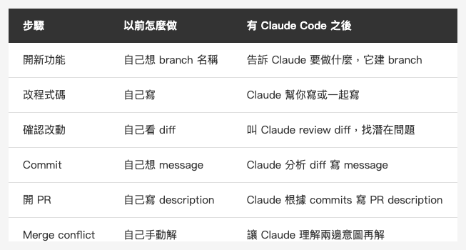

<!-- Tags: Claude Code, Git, Developer Tools, Version Control, Software Development -->

*(在這裡插入封面圖：cover.png)*

<!--
Gemini prompt: A cute Ghibli-inspired soft pastel illustration. A chibi engineer character stands in front of a giant glowing git branch tree. The branches are colorful and neatly organized. The character is holding a small magnifying glass and pointing at one of the branches happily. Some branches have small tags like "main", "feature", "fix". Soft pastel colors (mint, peach, lavender), white background, clean and simple. 16:9 ratio.
-->

# Git 工作流 — 讓 Claude Code 真正融入你的版本控制

> 改完程式碼只是開始。commit、review、PR — Claude 每一步都能參與。

---

## 前言

前幾篇把 Claude Code 的內部機制（CLAUDE.md、Hooks、Memory）和外部整合（MCP）都講完了。

但有一件事我一直沒說：**Claude Code 改完程式碼之後呢？**

大多數人的用法是：讓 Claude 改好，自己再去跑 `git add`、`git commit`、開 PR。Claude 只是個聰明的程式碼產生器，git 流程還是全靠自己。

這篇要改變這件事。

Claude Code 對你的 codebase 有完整的上下文，它知道這次改了什麼、為什麼改、影響哪裡。把它帶進 git 流程，能做到的遠不只是「幫你打 commit message」。

---

## Part 1：Commit Message

### 為什麼不要自己打 commit message

不是因為懶。是因為 Claude 知道的比你多。

你打 commit message 的時候，腦子裡想的是剛剛做了什麼。Claude 同時知道：改了哪些檔案、改動的目的是什麼（因為它幫你改的）、這次改動解決了哪個問題、有沒有潛在的副作用。

這些資訊放進 commit message，未來的你（和你的同事）會很感謝。

### 直接問 Claude 寫

最簡單的方式：

```
幫我寫 commit message
```

Claude 會跑 `git diff --staged`，分析改動，產出一條簡潔的訊息。但如果你想要更好的結果，給多一點 context：

```
幫我寫 commit message，這次是修復登入頁面在 iPad 橫向時 keyboard 擋住輸入框的問題
```

### 讓 /commit skill 處理完整流程

如果你的 Claude Code 有設定 `/commit` skill，可以一次跑完整個 commit 流程：

1. 跑 `git status` 和 `git diff` 顯示目前變更
2. 進行 code review，找出潛在問題
3. 確認要排除的檔案
4. 詢問工單號
5. 寫好 commit message，執行 commit

這樣每次 commit 都有品質保證，不只是一行「fix bug」。

### Commit message 的好壞差在哪

```bash
# 差的
git commit -m "fix"
git commit -m "update login"
git commit -m "wip"

# Claude 會寫的
git commit -m "修復 iPad 橫向時鍵盤遮蔽登入輸入框問題

在 iPad 橫向模式下，軟鍵盤彈出後會覆蓋 LoginView 底部的
email/password 輸入框。改用 .ignoresSafeArea(.keyboard) 配合
ScrollView 讓輸入框可以被滾動到鍵盤上方。"
```

---

## Part 2：Code Review

*(在這裡插入圖片：review.png)*

<!--
Gemini prompt: A cute Ghibli-inspired soft pastel illustration. A chibi engineer character sits at a desk holding a large magnifying glass, carefully inspecting a glowing scroll of code. Around the scroll, small floating icons appear: a bug icon with an X, a shield (security), a lightning bolt (performance), and a book (readability). The character looks focused and thoughtful. Soft pastel colors (mint, peach, lavender), white background, clean and simple. 16:9 ratio.
-->

### 在 commit 之前，讓 Claude review 你的改動

```
幫我 review 這次的 git diff，找出潛在的 bug 或問題
```

Claude 會讀 `git diff --staged`（或 `git diff HEAD`），從以下幾個角度分析：

- **Correctness**：邏輯對不對，有沒有 edge case 沒處理
- **Security**：有沒有 SQL injection、XSS、不安全的資料處理
- **Performance**：有沒有明顯的效能問題（N+1 query、不必要的 loop）
- **Readability**：命名清不清楚、有沒有需要補 comment 的複雜邏輯

### 針對性的 review

也可以問更具體的問題：

```
這次的 diff 裡面，API token 有沒有可能被 log 出去？
```

```
review 這個 PR 的 Core Data migration，有沒有資料遺失的風險？
```

```
這次新增的 async 程式碼，Swift concurrency 有沒有用對？
```

Claude 對你的 codebase 有完整的上下文，review 品質不亞於一個熟悉這個 repo 的人工 reviewer。

### 讓 Claude review 別人的 PR

不只是自己的改動，別人的 PR 也可以：

```
幫我 review 這個 PR 的 diff（貼上 diff 內容）
```

或者如果有設定 GitHub MCP：

```
幫我 review PR #142，特別看一下 authentication 的部分
```

---

## Part 3：Branch 管理

### 讓 Claude 建立正確的 branch

```
我要開始做登入頁面的 iPad 修復，幫我建一個 branch
```

Claude 會根據你的 CLAUDE.md 規範（如果有定義 branch 命名規則）或常見慣例，建立適合的 branch：

```bash
git checkout -b fix/login-ipad-keyboard-overlap
```

### 整理凌亂的 branch

```
幫我列出所有已經 merge 進 main 的 branch，然後問我哪些可以刪掉
```

```
這些 branch 都做了什麼？幫我整理一下
```

Claude 會逐一跑 `git log` 分析每個 branch 的改動，給你一個清楚的概覽再決定怎麼整理。

---

## Part 4：PR 描述

### 讓 Claude 寫 PR description

```
幫我根據這次的 commits 寫一份 PR description
```

好的 PR description 應該包含：
- 這個 PR 解決了什麼問題
- 怎麼解決的（技術決策）
- 怎麼測試（test plan）
- 有沒有需要特別注意的地方

Claude 知道你改了什麼，可以把這些都寫清楚，不用你再想一遍。

### 配合 GitHub MCP 直接開 PR

如果有設定 GitHub MCP：

```
幫我根據目前的 commits，開一個 PR 到 main，base branch 是 develop
```

Claude 會分析 commit 歷史，寫好 title 和 description，然後呼叫 GitHub API 直接建立 PR。

---

## Part 5：查詢 Git 歷史

### 理解某個 commit 做了什麼

```
幫我解釋一下 commit a3f9c2b 做了什麼，為什麼要這樣改
```

Claude 會讀 `git show a3f9c2b`，給你一個用人話解釋的說明，不是只列檔案清單。

### 找 bug 是什麼時候進來的

```
LoginView 的這個問題可能是什麼時候引入的？幫我查一下 git log
```

Claude 會搭配 `git log --all -p -- LoginView.swift`、`git bisect` 的概念，縮小可疑的 commit 範圍。

### 理解一段複雜的歷史

```
過去這兩週 auth 模組改了什麼？幫我整理一下
```

```
這個檔案是誰寫的、為什麼這樣設計？幫我從 git blame 找線索
```

---

## Part 6：解決 Merge Conflict

*(在這裡插入圖片：conflict.png)*

<!--
Gemini prompt: A cute Ghibli-inspired soft pastel illustration. Two chibi engineer characters stand on opposite sides, each pulling on a glowing rope (representing a git branch), looking frustrated. In the middle, a calm chibi Claude character gently holds both ropes together, smiling and mediating. Above each character, small scrolls float showing different code changes. Soft pastel colors (mint, peach, lavender, coral), white background, clean and simple. 16:9 ratio.
-->

Merge conflict 是最讓人頭痛的事情之一。Claude 在這裡特別有用，因為它能同時理解兩個版本的**意圖**。

```
幫我解這個 merge conflict
```

Claude 會讀取衝突標記（`<<<<<<<`、`=======`、`>>>>>>>`），分析兩邊各自在做什麼，再決定怎麼合併。

比手動解衝突快，比只選一邊更正確。特別適合不是你寫的那邊，你根本不知道對方想做什麼的情況。

### 解衝突前先理解

```
這個 conflict 是怎麼發生的？兩邊分別改了什麼？
```

先讓 Claude 解釋清楚，再決定怎麼合，比直接叫它解更安全。

---

## Part 7：推薦的日常工作流

*(在這裡插入圖片：table-git-workflow.png)*

<!--
| 步驟 | 以前怎麼做 | 有 Claude Code 之後 |
|------|----------|-------------------|
| 開新功能 | 自己想 branch 名稱 | 告訴 Claude 要做什麼，它建 branch |
| 改程式碼 | 自己寫 | Claude 幫你寫或一起寫 |
| 確認改動 | 自己看 diff | 叫 Claude review diff，找潛在問題 |
| Commit | 自己想 message | Claude 分析 diff 寫 message |
| 開 PR | 自己寫 description | Claude 根據 commits 寫 PR description |
| Merge conflict | 自己手動解 | 讓 Claude 理解兩邊意圖再解 |
-->

一個完整的功能週期，Claude 可以從頭陪到尾，而不只是在「改程式碼」那個步驟出現。

---

## 常見問題

**Q：讓 Claude 自己 commit，安全嗎？**

Claude 在執行 `git commit` 之前，通常會先顯示要 commit 的內容讓你確認。如果你的 CLAUDE.md 或 settings 有設定要求確認，它不會直接送出。養成習慣在 commit 前看一眼，就跟你平常 review 自己的改動一樣。

**Q：Claude 會不會把不該 commit 的東西加進去？**

它只會 `git add` 你告訴它要加的檔案，或者你用 `/commit` skill 時明確確認過的檔案。`.env`、credential 等敏感檔案只要在 `.gitignore` 裡，Claude 就不會碰。

**Q：如果 commit message 格式有特殊要求（例如 Conventional Commits）？**

在 CLAUDE.md 或 Memory 裡說清楚就好：

```
記住：commit message 格式是 Conventional Commits，
例如 feat(login): fix keyboard overlap on iPad
```

Claude 之後每次都會遵守。

---

## 總結

git 工作流是 Claude Code 最容易被忽略的應用場景，但也是最有持續價值的：

- **Commit message** — 有 context 的 message，未來的你會感謝
- **Code review** — 在 push 之前多一道安全網
- **PR description** — 省下寫說明的時間，品質還更好
- **Merge conflict** — 理解兩邊意圖再解，比手動解更正確
- **歷史查詢** — 用對話的方式理解 git log

Claude 的強項是**理解 context**。git 工作流裡到處都是 context——改動的原因、背景、影響——讓 Claude 參與，而不是只讓它改程式碼。

下一篇會進入 **CI/CD + Cost 管理** — 怎麼在自動化流程裡使用 Claude Code，以及怎麼控制 token 用量、避免帳單失控。

感謝閱讀。

---

## 參考資料

- [Claude Code Docs — CLI Usage](https://docs.anthropic.com/en/docs/claude-code/cli-usage) — Claude Code CLI 完整指令說明，包含 git 相關操作
- [Claude Code Docs — Settings](https://docs.anthropic.com/en/docs/claude-code/settings) — 設定 git 行為的相關選項
- [Conventional Commits](https://www.conventionalcommits.org) — commit message 格式規範，可以在 CLAUDE.md 裡引用
