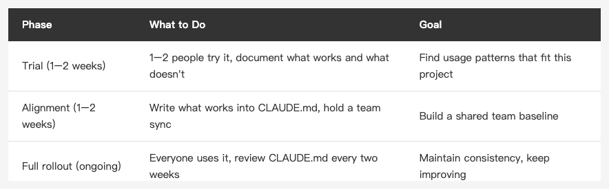

<!-- Tags: Claude Code, Team Collaboration, Developer Tools, AI Adoption, Software Development -->

*(Insert cover image here: cover.png)*

<!--
Gemini prompt: A cute Ghibli-inspired soft pastel illustration. Five chibi engineer characters sit around a round table, each with a laptop. In the center of the table, a glowing holographic Claude logo floats above a shared document. The characters are pointing at each other's screens and smiling, clearly collaborating. One whiteboard in the background shows a simple checklist. Soft pastel colors (mint, peach, lavender), white background, clean and simple. 16:9 ratio.
-->

# Team Adoption — Getting Your Whole Team to Trust Claude Code

> Getting it working for yourself is the easy part. The hard part is building shared trust and consistency across the team.

---

## Introduction

The earlier articles in this series focused on individual use: setting up CLAUDE.md, automating with Hooks, integrating MCP, bringing Claude into the Git workflow.

But real work happens in teams, not in isolation.

Something working well for one person doesn't mean it will work smoothly for everyone. Team adoption brings different challenges: some people don't trust AI-generated code, some worry about inconsistency when everyone uses it differently, some wonder if Claude will replace their job.

This is the final article in the series. It's about turning Claude Code from a personal tool into a team standard.

---

## Part 1: Individual Use vs. Team Use

*(Insert image here: gap.png)*

<!--
Gemini prompt: A cute Ghibli-inspired soft pastel illustration. On the left, one chibi engineer sits alone at a desk with a glowing laptop, looking happy and productive. On the right, five chibi engineers sit separately at desks, each with different colored screens showing different outputs — slightly chaotic. In the middle, a small bridge labeled "CLAUDE.md" connects the two sides. Soft pastel colors (mint, peach, lavender), white background, clean and simple. 16:9 ratio.
-->

For individual use, "it works for me" is enough.

For team use, the bar is higher:

- **Consistency**: When different people ask Claude to do the same thing, the results should be close enough
- **Trustworthiness**: Team members can review AI-generated code and know how to evaluate it
- **Maintainability**: The configuration (CLAUDE.md, Hooks) needs someone to own it — it can't live only in one person's head

A good CLAUDE.md combined with a clear review process addresses most of these.

---

## Part 2: Rollout in Phases

*(Insert image here: table-rollout-phases-en.png)*

<!--
| Phase | What to Do | Goal |
|-------|-----------|------|
| Trial (1–2 weeks) | 1–2 people try it, document what works and what doesn't | Find the usage patterns that fit this project |
| Alignment (1–2 weeks) | Write what works into CLAUDE.md, hold a team sync | Build a shared team baseline |
| Full rollout (ongoing) | Everyone uses it, review CLAUDE.md regularly | Maintain consistency, keep improving |
-->

### Trial Phase: Start with 1–2 People

Don't push it to everyone at once. Let the people most interested in AI tools try it for 1–2 weeks and document:

- Which tasks Claude handles well (writing tests, refactoring, explaining code)
- Which tasks Claude tends to get wrong (complex business logic, code with heavy external dependencies)
- Which prompts produce the best results

These observations become the raw material for your team CLAUDE.md.

### Alignment Phase: Write What Works into CLAUDE.md

After the trial run, distill the findings into a team CLAUDE.md:

```markdown
# Team Claude Code Configuration

## Good tasks for Claude
- Writing unit tests
- Refactoring existing code
- Explaining unfamiliar code sections
- Generating commit messages and PR descriptions

## Requires human verification
- Changes touching API contracts
- Database migrations
- Auth and security logic

## Commit message format
Conventional Commits: feat / fix / refactor / test / docs
```

Share this in a short meeting where everyone can understand it and weigh in. This isn't announcing a policy — it's building shared agreement.

### Full Rollout: Use, Observe, Adjust

Once everyone's using it, revisit CLAUDE.md every two weeks:

- Any new effective patterns worth adding?
- Any rules that no longer apply?
- Anyone hit a new edge case worth noting?

CLAUDE.md isn't a spec written once. It's the team's evolving institutional memory.

---

## Part 3: Code Review Standards

*(Insert image here: review.png)*

<!--
Gemini prompt: A cute Ghibli-inspired soft pastel illustration. Two chibi engineer characters sit side by side at a desk. One holds a magnifying glass inspecting a glowing code scroll. The scroll has small icons floating around it: a shield (security), a gear (logic), a bug with an X. The other character takes notes on a clipboard. They look focused but calm. Soft pastel colors (mint, peach, lavender), white background, clean and simple. 16:9 ratio.
-->

AI-generated code needs review — same as human-written code. The focus areas are slightly different.

### What to Look For

**Logic correctness**
Claude understands your description, but not necessarily your business context. Verify the logic matches the actual requirement, not just "looks right."

**Edge cases**
Claude handles the happy path well. Edge cases — nulls, out-of-range values, concurrency — are more likely to be missed. Pay extra attention.

**Security**
Code touching user input, API tokens, or database operations deserves the same scrutiny as any other code. Don't relax the bar because Claude wrote it.

**Test coverage**
Claude's tests sometimes only cover the happy path. Check whether edge cases have corresponding tests.

### You Don't Need to Read Every Line

AI-generated code doesn't need stricter review than human-written code — and it doesn't deserve more lenient review either. Apply the same standard.

The difference: when you're unsure about a piece of logic, you can ask Claude directly:

```
Why is this written this way? Could it break under X condition?
```

Claude has full context for code it generated and can explain it clearly.

---

## Part 4: Common Concerns

**Q: Will Claude replace my job?**

Claude is very good at executing well-defined tasks. But "deciding what to build," "judging whether this is the right approach," "understanding the business context" — those are still human work.

A more useful frame: Claude is like a highly capable junior engineer. You're the lead. Your job shifts from "getting things done" to "deciding what to do and verifying it's right."

**Q: Won't everyone use it differently, making the codebase inconsistent?**

That's exactly what CLAUDE.md is for. Write your style standards into it, and Claude will follow them. What matters isn't that everyone uses the same prompt — it's that Claude produces consistent output for everyone.

**Q: Is AI-generated code safe?**

Same answer as for human-written code: it needs review, and you can't blindly trust it. Claude won't deliberately introduce vulnerabilities, but it may not account for risks specific to your system. Security review is still a human responsibility.

**Q: What if Claude writes something wrong?**

Same as any other code — find it, fix it, understand why it happened. If the root cause was an unclear rule in CLAUDE.md, add the clarification. Every correction is an opportunity to make the spec more precise.

---

## Summary

Bringing Claude Code into a team comes down to two things:

**Build shared agreement:**
- Roll out in phases — use the trial period to find what works
- Write effective patterns into CLAUDE.md and align the team on them
- Review and update regularly so CLAUDE.md stays current

**Build trust:**
- Review AI-generated code with the same standard as any other code
- When logic is unclear, ask Claude to explain it
- Treat every correction as an opportunity to improve the standard

The tool itself isn't the hard part. The hard part is getting everyone to feel confident using it — knowing what to trust, what to question, and how to course-correct. That takes time and deliberate effort. But once it's established, that trust becomes a shared team asset.

Thanks for reading this series.

---

## References

- [Claude Code Docs — Memory](https://docs.anthropic.com/en/docs/claude-code/memory) — Full CLAUDE.md documentation
- [Claude Code Docs — Settings](https://docs.anthropic.com/en/docs/claude-code/settings) — Team configuration options
