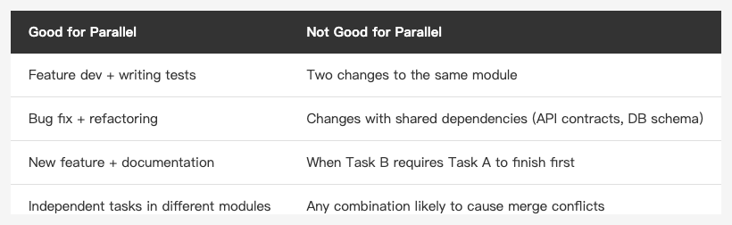

<!-- Tags: Claude Code, Parallel Development, Developer Tools, Productivity, Software Engineering -->

*(Insert cover image here: cover.png)*

<!--
Gemini prompt: A cute Ghibli-inspired soft pastel illustration. Three identical chibi Claude robot characters sit at separate desks side by side, each focused on their own glowing laptop. Each desk has a different color label floating above it: "feature/auth", "fix/api", "test/ui" — styled like git branch tags. They look busy and productive but not stressed. Soft pastel colors (mint, peach, lavender), white background, clean and simple. 16:9 ratio.
-->

# Parallel Workflows — Running Three Claudes at the Same Time

> Most people run one Claude at a time. You can run three.

---

## Introduction

After using Claude Code for a while, most people hit the same bottleneck:

One task is running and you're waiting. You want to work on something else, but context-switching is painful.

Boris Cherny (one of the engineers behind Claude Code) lists "parallel sessions" as the single most effective technique in his personal workflow. The idea is simple: use `git worktree` to create multiple independent working directories, run a separate Claude instance in each, and handle different tasks simultaneously.

This article explains how, and which situations actually make it worthwhile.

---

## Part 1: Why Not Just Open Two Terminals?

*(Insert image here: conflict.png)*

<!--
Gemini prompt: A cute Ghibli-inspired soft pastel illustration. Two chibi engineer characters are both pulling on the same glowing file icon from opposite directions, looking frustrated. The file icon shows a warning symbol. Above each character, a speech bubble shows a different git branch name. Soft pastel colors (mint, peach, lavender, coral), white background, clean and simple. 16:9 ratio.
-->

If you open two Claude sessions in the same directory, the problem is: **both Claudes are editing the same files**.

Even if the tasks don't overlap, there's only one working tree in a single directory. Claude A modifies `LoginView.swift`; Claude B might read that half-finished version in some later step. The result: conflicts, a messy git status, and hard-to-trace errors.

`git worktree` solves this.

---

## Part 2: git worktree Basics

`git worktree` lets you check out multiple independent working directories from the same repo, each on its own branch.

```bash
# Create a second working directory on a new branch
git worktree add ../myapp-auth feature/auth

# Create a third
git worktree add ../myapp-tests test/add-login-tests

# List all worktrees
git worktree list

# Clean up when done
git worktree remove ../myapp-auth
```

Each directory is an independent working tree with its own branch and commit history. The main directory is untouched.

### Pairing with Claude Code

```bash
# Terminal 1 (main directory)
cd ~/projects/myapp
claude  # Claude handling the main task

# Terminal 2 (auth worktree)
cd ~/projects/myapp-auth
claude  # Another Claude working on auth

# Terminal 3 (test worktree)
cd ~/projects/myapp-tests
claude  # Third Claude writing tests
```

Three Claudes, three independent working trees, no interference.

---

## Part 3: What Works Well in Parallel?

*(Insert image here: table-parallel-tasks-en.png)*

<!--
| Good for Parallel | Not Good for Parallel |
|------------------|----------------------|
| Feature dev + writing tests | Two changes to the same module |
| Bug fix + refactoring | Changes with shared dependencies (API contracts, DB schema) |
| New feature + documentation | When Task B requires Task A to finish first |
| Independent tasks in different modules | Any combination likely to cause merge conflicts |
-->

### The Decision Rule

**Good for parallel when:**
- Tasks have no dependencies on each other
- File changes don't overlap
- Each task has a clear endpoint (can be committed independently)

**Not suitable for parallel when:**
- Task B needs the output of Task A
- Both tasks touch a shared API contract or schema
- A task is already complex enough to require focused attention to track

---

## Part 4: Real Workflow Examples

### Scenario: Fix a bug while writing tests for that same feature

```bash
# Open two worktrees
git worktree add ../myapp-fix fix/login-keyboard-bug
git worktree add ../myapp-tests test/login-keyboard-tests

# Terminal 1: fix the bug
cd ../myapp-fix
claude
# Prompt: "Fix the issue where the keyboard covers input fields in LoginView on iPad landscape"

# Terminal 2: write the tests
cd ../myapp-tests
claude
# Prompt: "Add UI tests for keyboard avoidance behavior in LoginView"
```

Both Claudes run simultaneously. When the fix branch is done, the test branch can cherry-pick the changes to validate them.

### Scenario: Build a new feature while cleaning up old code

```bash
git worktree add ../myapp-feature feature/push-notifications
git worktree add ../myapp-refactor refactor/clean-notification-manager
```

New features and refactors typically touch different parts of the codebase. Run them in parallel and merge both back to main when done.

---

## Part 5: Things to Watch Out For

**Worktrees share the `.git` directory**

All worktrees share a single `.git`, which means:
- Commits are independent (on their own branches)
- Stashes are shared (a stash created in one worktree is visible in another)

This rarely causes issues in normal use, but if you rely on stashes, use named stashes to avoid confusion.

**Claude doesn't know what other sessions are doing**

Each Claude only has context from its own worktree. If tasks have dependencies, you need to pass information between sessions manually.

**Merge promptly, don't let worktrees live too long**

Too many open worktrees — or ones that live for too long — create the same merge headaches you were trying to avoid. Parallel work is meant to speed you up, not multiply your branches.

---

## Summary

The point of parallel workflows isn't "making Claude faster" — it's **eliminating your own waiting time**.

While one Claude session is handling a complex task, you can put that time to use with another Claude working on something else, instead of watching output scroll past.

Three steps to remember:
1. `git worktree add` to create an independent directory
2. Open a separate Claude session in each directory
3. When tasks are done, commit independently, then merge

You don't need to do this every time. But when two independent tasks are both blocking you simultaneously, parallel workflows turn waiting time into productivity.

---

## References

- [How Boris Uses Claude Code](https://howborisusesclaudecode.com) — Boris Cherny (Claude Code engineer at Anthropic) shares his personal workflow; parallel sessions is his top tip
- [Git Worktree Documentation](https://git-scm.com/docs/git-worktree) — Full `git worktree` command reference
- [Claude Code Docs — Common workflows](https://docs.anthropic.com/en/docs/claude-code/common-workflows) — Official recommended multi-agent workflows
