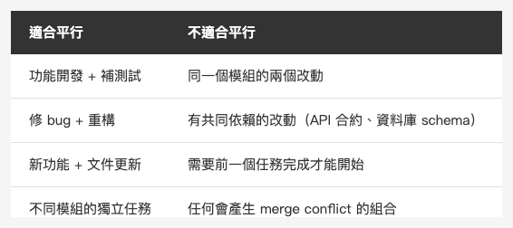

<!-- Tags: Claude Code, Parallel Development, Developer Tools, Productivity, Software Engineering -->

*(在這裡插入封面圖：cover.png)*

<!--
Gemini prompt: A cute Ghibli-inspired soft pastel illustration. Three identical chibi Claude robot characters sit at separate desks side by side, each focused on their own glowing laptop. Each desk has a different color label floating above it: "feature/auth", "fix/api", "test/ui" — styled like git branch tags. They look busy and productive but not stressed. Soft pastel colors (mint, peach, lavender), white background, clean and simple. 16:9 ratio.
-->

# 平行工作流 — 讓三個 Claude 同時幫你工作

> 大多數人一次只跑一個 Claude。但你可以同時跑三個。

---

## 前言

用 Claude Code 一段時間後，很多人會遇到同一個瓶頸：

一個任務在跑，你只能等。想同時處理別的事，但切換上下文又很痛。

Boris Cherny（Claude Code 的開發者之一）把「平行 session」列為他個人使用上最有效的技巧。概念很簡單：用 `git worktree` 開出多個獨立的工作目錄，每個目錄跑一個 Claude 實例，同時處理不同的任務。

這篇說明怎麼做，以及哪些情況真的值得這樣用。

---

## Part 1：為什麼不能直接開兩個終端機？

*(在這裡插入圖片：conflict.png)*

<!--
Gemini prompt: A cute Ghibli-inspired soft pastel illustration. Two chibi engineer characters are both pulling on the same glowing file icon from opposite directions, looking frustrated. The file icon shows a warning symbol. Above each character, a speech bubble shows a different git branch name. Soft pastel colors (mint, peach, lavender, coral), white background, clean and simple. 16:9 ratio.
-->

在同一個目錄開兩個 Claude session，問題是：**兩個 Claude 會改同一批檔案**。

即使任務不重疊，同一個目錄只有一個 working tree。Claude A 修改 `LoginView.swift`，Claude B 也可能在某個步驟讀到 Claude A 改到一半的版本。結果：衝突、亂掉的 git status、難以追蹤的錯誤。

`git worktree` 解決這個問題。

---

## Part 2：git worktree 基本用法

`git worktree` 讓你從同一個 repo 開出多個獨立的工作目錄，每個目錄對應一個 branch。

```bash
# 開出第二個工作目錄，對應新 branch
git worktree add ../myapp-auth feature/auth

# 開出第三個
git worktree add ../myapp-tests test/add-login-tests

# 列出所有 worktree
git worktree list

# 結束後移除
git worktree remove ../myapp-auth
```

每個目錄都是獨立的 working tree，有自己的 branch，可以各自 commit。主目錄不受影響。

### 搭配 Claude Code

```bash
# 終端機 1（主目錄）
cd ~/projects/myapp
claude  # 跑 Claude，處理主線任務

# 終端機 2（auth worktree）
cd ~/projects/myapp-auth
claude  # 另一個 Claude，處理 auth 功能

# 終端機 3（test worktree）
cd ~/projects/myapp-tests
claude  # 第三個 Claude，補測試
```

三個 Claude，三個獨立的 working tree，互不干擾。

---

## Part 3：哪些任務適合平行？

*(在這裡插入圖片：table-parallel-tasks.png)*

<!--
| 適合平行 | 不適合平行 |
|---------|-----------|
| 功能開發 + 補測試 | 同一個模組的兩個改動 |
| 修 bug + 重構 | 有共同依賴的改動（API 合約、資料庫 schema）|
| 新功能 + 文件更新 | 需要前一個任務完成才能開始 |
| 不同模組的獨立任務 | 任何會產生 merge conflict 的組合 |
-->

### 判斷原則

**適合平行的條件：**
- 任務之間沒有依賴關係
- 改動的檔案不重疊
- 每個任務都有明確的結束點（可以獨立 commit）

**不適合平行的情況：**
- Task B 需要 Task A 完成後的結果
- 兩個任務會動到同一份 API 合約或 schema
- 任務本身已經很複雜，需要集中注意力追蹤

---

## Part 4：實際工作流範例

### 情境：修一個 bug，同時補這個功能的測試

```bash
# 開兩個 worktree
git worktree add ../myapp-fix fix/login-keyboard-bug
git worktree add ../myapp-tests test/login-keyboard-tests

# 終端機 1：修 bug
cd ../myapp-fix
claude
# 告訴 Claude：「修 LoginView 在 iPad 橫屏時鍵盤蓋住輸入欄的問題」

# 終端機 2：補測試
cd ../myapp-tests
claude
# 告訴 Claude：「幫 LoginView 補 keyboard avoidance 的 UI tests」
```

兩個 Claude 同時跑。fix 那個 branch 跑完後，測試那個 branch 的 Claude 可以直接 cherry-pick 過來驗證。

### 情境：開發新功能，同時整理舊程式碼

```bash
git worktree add ../myapp-feature feature/push-notifications
git worktree add ../myapp-refactor refactor/clean-notification-manager
```

新功能和重構通常改不同的地方，但最終都會 merge 回 main。平行跑，最後統一整合。

---

## Part 5：注意事項

**Worktree 之間共用 `.git` 目錄**

所有 worktree 共用同一個 `.git`，這表示：
- commit 是獨立的（在各自的 branch 上）
- stash 是共用的（在一個 worktree 裡 stash 的東西，另一個可以看到）

一般使用不會踩到這個問題，但如果你習慣用 stash，要注意命名。

**Claude 不知道其他 session 在做什麼**

每個 Claude 只有自己 worktree 的上下文。如果兩個任務有依賴，你需要手動在 session 之間傳遞資訊。

**適時合併，不要讓 worktree 活太久**

worktree 開太多或活太久，最後合併時一樣很麻煩。平行的目的是加速，不是製造更多 branch。

---

## 總結

平行工作流的核心不是「讓 Claude 更快」——而是**消除你自己的等待時間**。

一個 Claude session 在處理複雜任務時，你可以用這段時間讓另一個 Claude 做別的事，而不是盯著輸出等待。

三個步驟記住：
1. `git worktree add` 開獨立目錄
2. 在每個目錄開一個 Claude session
3. 任務完成後，各自 commit，統一 merge

不需要每次都這樣做。但遇到「兩個獨立任務同時卡著你」的情況，這個方法可以讓你把等待時間變成生產力。

---

## 參考資料

- [How Boris Uses Claude Code](https://howborisusesclaudecode.com) — Boris Cherny（Claude Code 開發者）分享的使用技巧，平行 session 是他列為最有效的技巧之一
- [Git Worktree 官方文件](https://git-scm.com/docs/git-worktree) — `git worktree` 完整指令說明
- [Claude Code Docs — Common workflows](https://docs.anthropic.com/en/docs/claude-code/common-workflows) — 官方建議的多 agent 工作流
