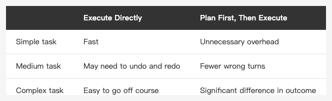
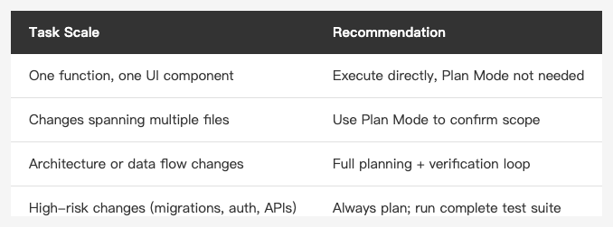
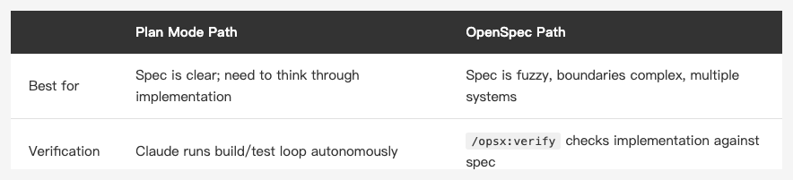

<!-- Tags: Claude Code, Plan Mode, AI Coding, Developer Tools, Software Development -->

*(Insert cover image here: cover.png)*

<!--
Gemini prompt: A cute Ghibli-inspired soft pastel illustration. A chibi engineer character stands in front of a large glowing whiteboard covered in a detailed plan with arrows, checkboxes, and diagrams. The character looks thoughtful, holding a marker, studying the plan carefully before starting. A small chibi Claude robot stands beside them, pointing at one section of the plan with a smile. Soft pastel colors (mint, peach, lavender), white background, clean and simple. 16:9 ratio.
-->

# Plan Mode + Verification Loop — Getting Claude to Think Before It Acts

> Put energy into the plan, and the execution mostly takes care of itself.

---

## Introduction

Most people give Claude a task, and Claude starts editing files immediately. That's fine for simple tasks. But for anything moderately complex, the problem shows up fast: Claude gets halfway through and realizes the direction is wrong, then has to undo everything and start over.

Boris Cherny's advice is straightforward: **use Plan Mode to invest upfront in planning**, confirm the approach is right, then execute.

A plan isn't overhead — it's the thing that makes the execution faster and more accurate.

---

## Part 1: What Is Plan Mode?

Plan Mode is an operating mode in Claude Code. While in Plan Mode, Claude only reads and analyzes — **it won't modify any files**.

How to activate:

```
Shift + Tab (cycles through modes — keep pressing until you reach plan)
```

Or just be explicit in your prompt:

```
Don't touch any code yet — help me think through how to approach this
```

In Plan Mode, you can ask Claude to:
- Understand the existing code structure
- Identify what needs to change
- Lay out the execution steps
- Anticipate risks and edge cases

Once you've confirmed the plan makes sense, switch back to execution mode.

---

## Part 2: Put Energy Into the Plan

*(Insert image here: table-plan-mode-en.png)*

<!--
| | Execute Directly | Plan First, Then Execute |
|---|----------------|--------------------------|
| Simple task | Fast | Unnecessary overhead |
| Medium task | May need to undo and redo | Fewer wrong turns |
| Complex task | Easy to go off course | Significant difference in outcome |
-->

Boris Cherny puts it this way: "Pour energy into the plan — the execution almost happens by itself."

"Energy" here doesn't mean time you spend — it means how much background and context you give Claude in your prompt:

**Tell Claude the constraints:**
```
The auth module lives in AuthManager.swift.
We can't change the API contract (the backend isn't ours).
The goal is to make token refresh run automatically in the background.
```

**Ask Claude to lay out the exact steps:**
```
Before touching anything, tell me which files you plan to change,
in what order, and whether any other modules might be affected.
```

**Confirm the plan, then go:**
```
That approach looks good. Start executing.
```

The more specific the plan, the lower the chance Claude drifts off course during execution.

---

## Part 3: The Verification Loop

*(Insert image here: loop.png)*

<!--
Gemini prompt: A cute Ghibli-inspired soft pastel illustration. A chibi Claude robot character sits at a desk in a loop diagram: an arrow flows from "Write Code" → "Run Tests" → "Check Result" → back to "Write Code". The character looks focused and systematic, not stressed. Each step in the loop has a small glowing icon. Soft pastel colors (mint, peach, lavender), white background, clean and simple. 16:9 ratio.
-->

After planning comes execution. The most important thing in the execution phase: **give Claude a way to verify its own work**.

### Why Does This Matter?

Claude is very good at writing code that *looks* correct. But "looks correct" and "actually runs without issues" are two different things.

If Claude can run tests, build, or lint on its own, it can catch problems and fix them before you even see the output. That's much faster than waiting for Claude to finish, running the tests yourself, and pasting the error back in.

### Give Claude a Verification Tool

Tell Claude how to verify in the prompt:

```
After you're done, run swift test. Make sure all tests pass before reporting back.
```

```
After the changes, run swiftlint. Fix any warnings before you're done.
```

```
After building, confirm there are no new compiler warnings.
```

```
After changing each function, run its corresponding unit test to check for regressions.
```

### The Full Verification Cycle

```
You (plan) → Claude (execute) → Claude (verify) → You (confirm)
```

1. You confirm the plan in Plan Mode
2. Claude executes the changes
3. Claude runs tests or builds on its own
4. Tests pass → Claude reports the result to you
5. Tests fail → Claude fixes, runs verification again
6. What you see is **verified output**, not a first draft

---

## Part 4: Full Workflow Example

### Task: Convert synchronous database operations to async

**Step 1: Plan in Plan Mode**

```
(Plan Mode)
I have a DataStore.swift where fetchUser / saveUser are synchronous.
They run on the main thread and cause UI stuttering.
The goal is to convert them to async/await, but without changing
the callers' interface — other code calls these functions directly.

Read the file first, then tell me:
1. How you plan to make the change
2. Which other parts of the codebase might be affected
3. What risks you see
```

**Step 2: Confirm the Plan**

After Claude lays out the plan, you review and confirm:

```
The UserProfileView mentioned in point 2 needs attention —
there's a @MainActor constraint there.
Everything else looks fine. Start executing.
```

**Step 3: Execute + Verify**

```
Start making the changes. After each function, run swift build
to confirm it compiles before continuing.
When everything is done, run swift test.
Fix any failures, then report back when everything passes.
```

Claude executes, runs builds, runs tests, fixes issues — and you receive a "all tests passing" report.

---

## When Is This Worth the Effort?

Not every task needs the full Plan + Verification Loop.

*(Insert image here: table-when-to-use-en.png)*

<!--
| Task Scale | Recommendation |
|-----------|---------------|
| One function, one UI component | Execute directly, Plan Mode not needed |
| Changes spanning multiple files | Use Plan Mode to confirm scope |
| Architecture or data flow changes | Full planning + verification loop |
| High-risk changes (migrations, auth, APIs) | Always plan; run complete test suite |
-->

### When the Task Is Large and the Boundaries Aren't Clear: Use OpenSpec Instead

The choice comes down to one question: **do you know what you're building?**

Not yet → Start with OpenSpec. Clarify the spec and boundaries before touching any code.
Already clear → Go straight to Plan Mode. Let Claude think through how to implement it.

*(Insert image here: table-path-comparison-en.png)*

<!--
| | Plan Mode Path | OpenSpec Path |
|---|---|---|
| Best for | Spec is clear; need to think through implementation | Spec is fuzzy, boundaries are complex, multiple systems involved |
| Verification | Claude runs build/test loop autonomously | `/opsx:verify` checks implementation against spec |
-->

The full OpenSpec workflow:

```
/opsx:explore  →  /opsx:new + /opsx:ff  →  /opsx:apply  →  /opsx:verify  →  /opsx:archive
(clarify the     (generate proposal/         (execute)       (verify impl        (archive)
problem)          specs/design/tasks)                         covers all spec)
```

`/opsx:explore` is a pure thinking space — it creates no artifacts. It's for clarifying direction before committing to anything. After that, `/opsx:ff` generates four spec documents in one shot: why (proposal), Given/When/Then requirements, technical design, and a checkable task list. After execution, `/opsx:verify` checks that the implementation covers all spec items — not a build/test loop, but a coverage check: "did we actually implement everything the spec required?"

For a detailed walkthrough of OpenSpec, see: [Align Before You Build — OpenSpec, OPSX, Prompt Engineering and RAG](https://medium.com/@n913239/align-before-you-build-openspec-opsx-prompt-engineering-and-rag-a995f1f5d379).

---

## Summary

Plan Mode and the verification loop solve the same problem: **let Claude find issues itself before you see the results**.

Two habits to build:
1. For complex tasks, open Plan Mode first — confirm direction and scope
2. During execution, tell Claude how to verify — let it confirm its own work

What you get back isn't a first draft. It's a result that's already been verified and is ready to review.

---

## References

- [How Boris Uses Claude Code](https://howborisusesclaudecode.com) — Boris Cherny (Claude Code engineer at Anthropic) shares his workflow; Plan Mode and the verification loop are among his core recommendations
- [Claude Code Docs — Common workflows](https://docs.anthropic.com/en/docs/claude-code/common-workflows) — Official guidance on Plan Mode and verification workflows
- [Claude Code Docs — CLI Usage](https://docs.anthropic.com/en/docs/claude-code/cli-usage) — How to operate Plan Mode
