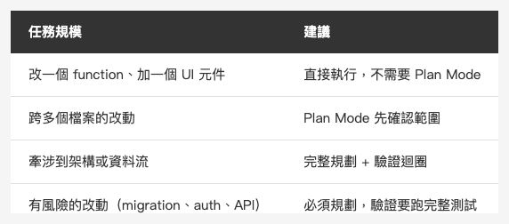

<!-- Tags: Claude Code, Plan Mode, AI Coding, Developer Tools, Software Development -->

*(在這裡插入封面圖：cover.png)*

<!--
Gemini prompt: A cute Ghibli-inspired soft pastel illustration. A chibi engineer character stands in front of a large glowing whiteboard covered in a detailed plan with arrows, checkboxes, and diagrams. The character looks thoughtful, holding a marker, studying the plan carefully before starting. A small chibi Claude robot stands beside them, pointing at one section of the plan with a smile. Soft pastel colors (mint, peach, lavender), white background, clean and simple. 16:9 ratio.
-->

# Plan Mode + 驗證迴圈 — 讓 Claude 在動手前先想清楚

> 把時間花在規劃上，執行的品質會好很多。

---

## 前言

大部分人給 Claude 一個任務，Claude 就直接開始改程式碼。這在簡單的任務上沒問題。但任務稍微複雜一點，問題就來了：Claude 做了一半才發現方向不對，整個 undo 又重來。

Boris Cherny 的建議很直接：**在 Plan Mode 裡把精力花在規劃上**，確認方向對了再動手。

計劃不是負擔，是讓後面的執行更快、更準的前置作業。

---

## Part 1：Plan Mode 是什麼

Plan Mode 是 Claude Code 的一個操作模式。進入 Plan Mode 後，Claude 只會讀取和分析，**不會修改任何檔案**。

開啟方式：

```
Shift + Tab（循環切換模式，按到 plan 為止）
```

或是在 prompt 開頭說清楚：

```
先不要動程式碼，幫我想清楚怎麼做
```

在 Plan Mode 裡，你可以要求 Claude：
- 讀懂現有的程式碼結構
- 找出需要改動的地方
- 列出執行步驟
- 預測可能的風險和 edge case

確認計劃可行，再切換回執行模式。

---

## Part 2：把精力花在規劃上

*(在這裡插入圖片：table-plan-mode.png)*

<!--
| | 直接執行 | 先規劃再執行 |
|---|---------|------------|
| 簡單任務 | 快 | 多餘 |
| 中等任務 | 可能要 undo 重來 | 少走彎路 |
| 複雜任務 | 容易走錯方向 | 差距很大 |
-->

Boris Cherny 的說法是：「把精力投入規劃，執行幾乎是自動完成的。」

這裡說的「精力」不是你花多久——而是你在 prompt 裡給 Claude 多少背景和約束：

**告訴 Claude 你的背景和限制：**
```
這個 app 的 auth 模組在 AuthManager.swift，
不能動 API 合約（後端不在我們這邊），
目標是讓 token refresh 在背景自動跑
```

**要求 Claude 列出具體的執行步驟：**
```
先告訴我你打算改哪些地方，改的順序是什麼，
有沒有可能影響到其他模組
```

**確認計劃，再開始：**
```
這個方向沒問題，開始執行
```

計劃越具體，執行階段 Claude 走偏的機率越低。

---

## Part 3：驗證迴圈

*(在這裡插入圖片：loop.png)*

<!--
Gemini prompt: A cute Ghibli-inspired soft pastel illustration. A chibi Claude robot character sits at a desk in a loop diagram: an arrow flows from "Write Code" → "Run Tests" → "Check Result" → back to "Write Code". The character looks focused and systematic, not stressed. Each step in the loop has a small glowing icon. Soft pastel colors (mint, peach, lavender), white background, clean and simple. 16:9 ratio.
-->

規劃之後是執行。執行階段最重要的一件事：**給 Claude 一個可以自我驗證的方法**。

### 為什麼需要驗證迴圈？

Claude 很擅長「寫出看起來正確的程式碼」。但「看起來正確」和「實際跑起來沒問題」是兩件事。

如果 Claude 可以自己跑測試、build、或 lint，它就能在你看到結果之前，自己發現問題、自己修正。這比你每次手動跑完再貼錯誤訊息回去，快很多。

### 給 Claude 驗證工具

在 prompt 裡告訴 Claude 怎麼驗證：

```
做完後跑 swift test，確認所有測試都過了再告訴我
```

```
改完後執行 swiftlint，有 warning 就先修掉
```

```
build 完後確認沒有新的 compiler warning
```

```
每改一個函數就跑一次對應的 unit test，確認沒有 regression
```

### 驗證迴圈的完整週期

```
你（規劃）→ Claude（執行）→ Claude（驗證）→ 你（確認）
```

1. 你在 Plan Mode 確認計劃
2. Claude 執行改動
3. Claude 自己跑測試或 build
4. 測試通過 → 告知你結果
5. 有錯誤 → Claude 自己修，再驗證一次
6. 你看到的是「已驗證的結果」，不是「剛寫完的草稿」

---

## Part 4：完整流程範例

### 任務：把同步的資料庫操作改成 async

**Step 1：在 Plan Mode 規劃**

```
（Plan Mode）
我有一個 DataStore.swift，裡面的 fetchUser / saveUser 是同步的，
在主執行緒上跑導致 UI 卡頓。
目標是改成 async/await，但不能改 caller 的介面（其他地方直接呼叫這兩個函數）。

先讀這個檔案，告訴我：
1. 你打算怎麼改
2. 可能影響哪些其他地方
3. 有什麼風險
```

**Step 2：確認計劃**

Claude 列出計劃後，你確認：

```
第二點的 UserProfileView 那邊要注意，那邊有個 @MainActor 的限制。
其他沒問題，開始執行。
```

**Step 3：執行 + 驗證**

```
開始改動。每改一個函數後跑 swift build，確認 build 成功再繼續。
全部改完後跑 swift test，有失敗就先修掉，都過了再告訴我。
```

Claude 執行、自己 build、自己跑測試、自己修 → 你收到「全部通過」的報告。

---

## 什麼時候值得這樣做？

不是每個任務都需要走完整的 Plan + 驗證迴圈。

*(在這裡插入圖片：table-when-to-use.png)*

<!--
| 任務規模 | 建議 |
|---------|------|
| 改一個 function、加一個 UI 元件 | 直接執行，不需要 Plan Mode |
| 跨多個檔案的改動 | Plan Mode 先確認範圍 |
| 牽涉到架構或資料流 | 完整規劃 + 驗證迴圈 |
| 有風險的改動（migration、auth、API）| 必須規劃，驗證要跑完整測試 |
-->

### 任務很大、邊界不清楚時：改用 OpenSpec

選哪條路，取決於一個問題：**「要做什麼」清楚了嗎？**

還不清楚 → 先走 OpenSpec，把規格和邊界定清楚再動手。
已經清楚 → 直接進 Plan Mode，讓 Claude 想清楚怎麼實作。

*(在這裡插入圖片：table-path-comparison.png)*

<!--
| | Plan Mode 路徑 | OpenSpec 路徑 |
|---|---|---|
| 適合情境 | 規格清楚，需要想清楚實作步驟 | 規格模糊、邊界複雜、跨多個系統 |
| 驗證方式 | Claude 自己跑 build／test 迴圈 | `/opsx:verify` 對照 spec 確認實作完整性 |
-->

OpenSpec 的完整流程：

```
/opsx:explore  →  /opsx:new + /opsx:ff  →  /opsx:apply  →  /opsx:verify  →  /opsx:archive
（釐清問題）       （產 proposal/specs/      （執行）          （驗證實作          （封存）
                   design/tasks）                             符合規格）
```

`/opsx:explore` 是純思考空間，不會建立任何文件，專門用來釐清問題方向。確認方向後，`/opsx:ff` 一次產出四份規格文件：why、Given/When/Then 需求、技術設計、可勾選的實作清單。執行完用 `/opsx:verify` 對照 spec 確認完整性——這就是大任務路徑的驗證，不是 build/test 迴圈，而是「實作有沒有覆蓋到所有規格」。

關於 OpenSpec 的詳細用法，可以參考：[Align Before You Build — OpenSpec, OPSX, Prompt Engineering and RAG](https://medium.com/@n913239/align-before-you-build-openspec-opsx-prompt-engineering-and-rag-a995f1f5d379)。

---

## 總結

Plan Mode 和驗證迴圈解決的是同一個問題：**讓 Claude 在你看到結果之前，先自己把問題找出來**。

兩個習慣：
1. 複雜任務先進 Plan Mode，確認方向和範圍
2. 執行時告訴 Claude 怎麼驗證，讓它跑完自己確認

這樣你拿到的不是「第一版草稿」，而是「已經過驗證、可以直接 review 的結果」。

---

## 參考資料

- [How Boris Uses Claude Code](https://howborisusesclaudecode.com) — Boris Cherny（Claude Code 開發者）分享的使用技巧，Plan Mode 和驗證迴圈是他強調的核心做法
- [Claude Code Docs — Common workflows](https://docs.anthropic.com/en/docs/claude-code/common-workflows) — 官方建議的 Plan Mode 和 verification 工作流
- [Claude Code Docs — CLI Usage](https://docs.anthropic.com/en/docs/claude-code/cli-usage) — Plan Mode 的操作方式
