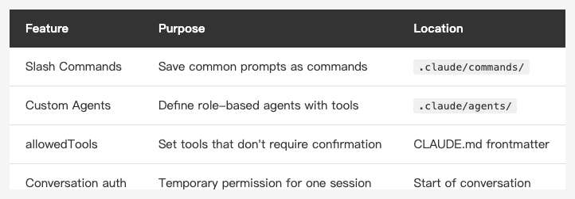

<!-- Tags: Claude Code, Slash Commands, AI Agents, Developer Tools, Workflow Automation -->

*(Insert cover image here: cover.png)*

<!--
Gemini prompt: A cute Ghibli-inspired soft pastel illustration. A chibi engineer character stands at a glowing command terminal. Above the terminal, several colorful floating cards appear, each showing a different slash command: "/review", "/standup", "/deploy". The character is smiling and pointing at one of the cards confidently. Small chibi robot agents float around each card, ready to work. Soft pastel colors (mint, peach, lavender), white background, clean and simple. 16:9 ratio.
-->

# Slash Commands + Custom Agents — Turn Your Workflow into Commands

> Stop re-explaining the same things. Turn your common workflows into commands and run them with one keystroke.

---

## Introduction

After using Claude Code for a while, you'll notice a pattern: certain prompts keep repeating.

"Run a full precommit check before I push." "Write a PR description based on the commits in this branch." "Summarize what I did today in standup format." — These are things you say every day.

Claude Code provides two mechanisms to solve this: **Slash Commands** (custom commands) and **Custom Agents** (custom agents). Turn repetitive workflows into commands, then just type `/precommit` to execute them.

This article also covers **Auto Mode and permission management** — the configuration that lets agents run autonomously.

---

## Part 1: Slash Commands — Custom /Commands

### What Are Slash Commands?

Create a Markdown file under `.claude/commands/` and it becomes a custom command. Invoke it with `/command-name`.

```
your-project/
└── .claude/
    └── commands/
        ├── precommit.md
        ├── pr.md
        └── standup.md
```

### Creating Your First Command

**`.claude/commands/precommit.md`**

```markdown
Run a full check before committing.

Steps:
1. Read the currently staged git diff
2. Check for:
   - Any leftover debug print / log statements?
   - Any hardcoded API keys or passwords?
   - Do tests cover the main edge cases?
3. List any issues that need fixing. If everything looks clean, say "Ready to commit".
```

Now type `/precommit` in Claude Code and this entire prompt executes.

### Commands with Arguments

Use `$ARGUMENTS` to accept text typed after the command name:

**`.claude/commands/explain.md`**

```markdown
Explain what the following code does and how it works:

$ARGUMENTS
```

Usage:

```
/explain func (u *UserStore) FindByEmail(email string) (*User, error)
```

### Useful Built-in Variables

| Variable | Description |
|----------|-------------|
| `$ARGUMENTS` | All text typed after the command name |
| `$ARGUMENTS[0]`, `$0` | Access individual arguments by position (0-based); `$N` is shorthand for `$ARGUMENTS[N]` |
| `${CLAUDE_SESSION_ID}` | Unique ID for the current session |

---

## Part 2: Custom Agents — Agents with Dedicated Tools

*(Insert image here: agents.png)*

<!--
Gemini prompt: A cute Ghibli-inspired soft pastel illustration. Three small chibi robot characters stand in a row, each wearing a different colored vest with a label: "Reviewer", "Tester", "Writer". Each robot holds a small tool that matches their role: a magnifying glass, a checklist, a pencil. They look ready and eager to help. Soft pastel colors (mint, peach, lavender), white background, clean and simple. 16:9 ratio.
-->

Slash Commands are "saved prompts." Custom Agents go further: **define an agent with its own dedicated tools and behavior**.

### Creating an Agent

Create a Markdown file under `.claude/agents/`:

```
your-project/
└── .claude/
    └── agents/
        ├── tech-writer.md
        └── test-writer.md
```

**`.claude/agents/tech-writer.md`**

```markdown
---
name: tech-writer
description: Technical writing agent for README, API docs, and changelogs
tools: Read, Glob, Grep
---

You are the tech writer for this project.

Your workflow:
1. Read the specified code or module
2. Understand its purpose, inputs, outputs, and edge cases
3. Produce the requested documentation:
   - README: purpose, installation, usage examples
   - API doc: parameters, return values, error codes for each endpoint
   - Changelog: summarize version changes from commit history

Project conventions:
- Code examples must be real, runnable snippets — no placeholder data
```

### Agents vs Slash Commands

| | Slash Commands | Custom Agents |
|---|---|---|
| Purpose | Save common prompts | Define role-based agents with dedicated tools |
| Setup complexity | Low (just Markdown) | Medium (frontmatter config required) |
| Best for | One-off tasks | Recurring role-based work |
| How to invoke | `/command-name` | Name the agent in your prompt |

---

## Part 3: Auto Mode and Permission Management

*(Insert image here: permissions.png)*

<!--
Gemini prompt: A cute Ghibli-inspired soft pastel illustration. A chibi engineer character stands at a control panel with several glowing toggle switches. Each switch has a label: "Run Tests ✓", "Edit Files ✓", "Git Commit ✓", "Deploy ✗". The character is carefully considering which switches to turn on, looking thoughtful. Soft pastel colors (mint, peach, lavender), white background, clean and simple. 16:9 ratio.
-->

Custom Agents and automated workflows need Claude to act autonomously — it can't pause for confirmation at every step. That's what **Auto Mode** and permission management are for.

### Default Behavior

By default, Claude Code asks for confirmation before "potentially impactful" actions:
- Running shell commands
- Writing or deleting files
- Running git commit

In automated workflows, this becomes an obstacle.

### Declare Allowed Tools in settings.json

In your project's `.claude/settings.json`, declare which tools Claude can run without asking:

```json
{
  "permissions": {
    "allow": [
      "Bash(swift build)",
      "Bash(swift test)",
      "Read",
      "Edit",
      "Glob",
      "Grep"
    ]
  }
}
```

You can scope `Bash` to specific commands — `Bash(swift *)` only allows commands starting with `swift`. Only allow what you actually need; don't open everything at once.

### Quick Authorization in a Conversation

If you don't want to edit CLAUDE.md, you can state it at the start of a conversation:

```
For this conversation, you can run bash commands and edit files directly
without asking me each time.
Still ask before git commit or git push.
```

Claude will follow this for the scope of the current conversation.

### What Should Always Require Confirmation?

Even with Auto Mode, some actions should stay protected:

- `git push` (affects remote, irreversible)
- Deleting files or directories
- Running migrations
- Anything that affects production

Call these out explicitly in CLAUDE.md or at the start of a conversation so automation runs within boundaries you've set.

---

## Part 4: Putting It Together — Real Examples

### Example: Daily Standup Prep

**`.claude/commands/standup.md`**

```markdown
Help me prepare today's standup.

Steps:
1. Run `git log --since="yesterday" --author="$(git config user.name)" --oneline`
2. Summarize yesterday's work based on the commits
3. If there are any unmerged branches, list the current PR status
4. Format:
   - Yesterday: (bullet points)
   - Today's plan: (leave blank for me to fill in)
   - Blockers: (if any)
```

Type `/standup` in the morning. Thirty seconds later, you have a ready-to-paste standup.

### Example: Full Feature Development Flow

```
Using the tech-writer agent and test-writer agent, help me build this feature:

Requirement: Add a "Change Password" button to the UserProfile page
that opens a modal when clicked.

Workflow:
1. Have test-writer write tests based on the requirement
2. Implement the feature to make the tests pass
3. Have tech-writer update the README section for this page
4. Write a commit message
```

---

## Summary

*(Insert image here: table-commands-agents-en.png)*

<!--
| Feature | Purpose | Location |
|---------|---------|---------|
| Slash Commands | Save common prompts as commands | .claude/commands/ |
| Custom Agents | Define role-based agents with tools | .claude/agents/ |
| allowedTools | Set tools that don't require confirmation | CLAUDE.md frontmatter |
| Conversation auth | Temporary permission for one session | Start of conversation |
-->

Three levels of automation:
1. **Slash Commands** — save repetitive prompts; run with `/command`
2. **Custom Agents** — define role-based agents with dedicated tools for recurring tasks
3. **Auto Mode + permissions** — decide what runs automatically and what still needs you

You don't need to set all of this up at once. Start by finding the prompt you repeat most often each week and turning it into one Slash Command — that alone is worth it.

---

## References

- [How Boris Uses Claude Code](https://howborisusesclaudecode.com) — Boris Cherny (Claude Code engineer at Anthropic) shares his workflow; the slash commands and custom agents practices in this article are inspired by his tips
- [Claude Code Docs — Slash Commands](https://docs.anthropic.com/en/docs/claude-code/slash-commands) — Full slash commands documentation
- [Claude Code Docs — Sub-agents](https://docs.anthropic.com/en/docs/claude-code/sub-agents) — How to configure custom agents
- [Claude Code Docs — Settings](https://docs.anthropic.com/en/docs/claude-code/settings) — allowedTools and other permission settings
