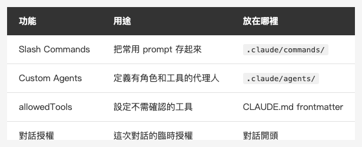

<!-- Tags: Claude Code, Slash Commands, AI Agents, Developer Tools, Workflow Automation -->

*(在這裡插入封面圖：cover.png)*

<!--
Gemini prompt: A cute Ghibli-inspired soft pastel illustration. A chibi engineer character stands at a glowing command terminal. Above the terminal, several colorful floating cards appear, each showing a different slash command: "/review", "/standup", "/deploy". The character is smiling and pointing at one of the cards confidently. Small chibi robot agents float around each card, ready to work. Soft pastel colors (mint, peach, lavender), white background, clean and simple. 16:9 ratio.
-->

# Slash Commands + Custom Agents — 把你的工作流程變成指令

> 不用每次都重新說明。把常用的流程做成指令，一鍵執行。

---

## 前言

用了一段時間 Claude Code，你大概會注意到：某些 prompt 一直在重複。

「提交前幫我做一次完整的 precommit 檢查」、「根據這個 branch 的 commits 寫 PR description」、「整理一下今天做了什麼，用 standup 格式」——這些是你每天都在說的話。

Claude Code 提供兩個機制來解決這個問題：**Slash Commands**（自訂指令）和 **Custom Agents**（自訂代理人）。把重複的流程做成指令，之後只要打 `/precommit` 就能執行。

這篇也會說明 **Auto Mode 和權限管理**——讓 Agent 自動跑起來的前提設定。

---

## Part 1：Slash Commands — 自訂 /指令

### 什麼是 Slash Commands？

在 `.claude/commands/` 目錄下建立 Markdown 檔，就是一個自訂指令。執行時用 `/指令名稱` 呼叫。

```
your-project/
└── .claude/
    └── commands/
        ├── precommit.md
        ├── pr.md
        └── standup.md
```

### 建立第一個指令

**`.claude/commands/precommit.md`**

```markdown
幫我在提交前做一次完整檢查。

步驟：
1. 讀取目前 staged 的 git diff
2. 確認以下幾點：
   - 有沒有遺留的 debug 用 print / log？
   - 有沒有 hardcode 的 API key 或密碼？
   - 測試有沒有覆蓋到主要的 edge case？
3. 列出需要修正的問題，沒問題就說「可以 commit」。
```

之後在 Claude Code 輸入 `/precommit`，就會執行這整段 prompt。

### 帶參數的指令

用 `$ARGUMENTS` 接收你在指令後面輸入的文字：

**`.claude/commands/explain.md`**

```markdown
請解釋以下這段程式碼的用途和運作方式，用繁體中文回答：

$ARGUMENTS
```

呼叫方式：

```
/explain func (u *UserStore) FindByEmail(email string) (*User, error)
```

### 實用的內建變數

| 變數 | 說明 |
|------|------|
| `$ARGUMENTS` | 指令後面接的文字 |
| `$ARGUMENTS[0]`、`$0` | 按位置取個別參數（0-based），`$N` 是 `$ARGUMENTS[N]` 的簡寫 |
| `${CLAUDE_SESSION_ID}` | 目前 session 的唯一 ID |

---

## Part 2：Custom Agents — 有專屬工具的代理人

*(在這裡插入圖片：agents.png)*

<!--
Gemini prompt: A cute Ghibli-inspired soft pastel illustration. Three small chibi robot characters stand in a row, each wearing a different colored vest with a label: "Reviewer", "Tester", "Writer". Each robot holds a small tool that matches their role: a magnifying glass, a checklist, a pencil. They look ready and eager to help. Soft pastel colors (mint, peach, lavender), white background, clean and simple. 16:9 ratio.
-->

Slash Commands 是「把 prompt 存起來」。Custom Agents 更進一步：**定義一個有專屬工具和行為的代理人**。

### 建立 Agent

在 `.claude/agents/` 目錄下建立 Markdown 檔：

```
your-project/
└── .claude/
    └── agents/
        ├── tech-writer.md
        └── test-writer.md
```

**`.claude/agents/tech-writer.md`**

```markdown
---
name: tech-writer
description: 負責產生技術文件的代理人，包含 README、API doc、changelog
tools: Read, Glob, Grep
---

你是這個專案的 tech writer。

你的工作流程：
1. 讀取指定的程式碼或模組
2. 理解它的用途、輸入輸出、邊界條件
3. 依照要求產出對應文件：
   - README：說明用途、安裝、使用範例
   - API doc：每個 endpoint 的參數、回傳值、錯誤碼
   - Changelog：根據 commit 記錄整理版本異動

這個專案的規範：
- 用繁體中文撰寫
- 程式碼範例用實際可執行的片段，不用虛構資料
```

### Agents vs Slash Commands

| | Slash Commands | Custom Agents |
|---|---|---|
| 用途 | 把常用 prompt 存起來 | 定義有角色和工具的代理人 |
| 設定複雜度 | 低（只是 Markdown）| 中（有 frontmatter 設定）|
| 適合情境 | 單次任務 | 重複性的角色任務 |
| 呼叫方式 | `/指令名稱` | 在 prompt 裡指名 |

---

## Part 3：Auto Mode 和權限管理

*(在這裡插入圖片：permissions.png)*

<!--
Gemini prompt: A cute Ghibli-inspired soft pastel illustration. A chibi engineer character stands at a control panel with several glowing toggle switches. Each switch has a label: "Run Tests ✓", "Edit Files ✓", "Git Commit ✓", "Deploy ✗". The character is carefully considering which switches to turn on, looking thoughtful. Soft pastel colors (mint, peach, lavender), white background, clean and simple. 16:9 ratio.
-->

Custom Agents 和自動化流程需要 Claude 能自主執行指令，不能每個步驟都等你確認。這就是 **Auto Mode** 和權限管理要解決的問題。

### 預設行為

預設情況下，Claude Code 在執行「可能有影響」的動作前會詢問確認：
- 執行 shell 指令
- 寫入或刪除檔案
- 執行 git commit

在自動化流程裡，這會變成障礙。

### 在 settings.json 裡設定允許的工具

在專案的 `.claude/settings.json` 宣告允許自動執行的工具，不需要每次詢問：

```json
{
  "permissions": {
    "allow": [
      "Bash(swift build)",
      "Bash(swift test)",
      "Read",
      "Edit",
      "Glob",
      "Grep"
    ]
  }
}
```

`allow` 裡可以精確限制指令範圍，例如 `Bash(swift *)` 只允許執行 swift 開頭的指令。只開放你實際需要的，不要一次全開。

### 對話裡的快速授權

不想改 settings.json，也可以在對話開始時直接說：

```
這次對話裡，你可以直接執行 bash 指令和修改檔案，不用每次問我確認。
遇到 git commit 或 git push 前還是要問我。
```

Claude 會在這次對話的範圍內遵守這個規則。

### 什麼應該永遠要求確認？

即使開了 Auto Mode，有些動作仍然建議保留確認步驟：

- `git push`（影響遠端，不可逆）
- 刪除檔案或目錄
- 執行 migration
- 任何會影響 production 環境的操作

在 CLAUDE.md 或對話開頭明確說明這些例外，讓自動化在你設定的邊界內跑。

---

## Part 4：組合使用的實際範例

### 範例：每天早上的 standup 準備

**`.claude/commands/standup.md`**

```markdown
幫我準備今天的 standup 內容。

步驟：
1. 執行 `git log --since="yesterday" --author="$(git config user.name)" --oneline`
2. 根據 commit 內容整理出「昨天做了什麼」
3. 如果有任何未 merge 的 branch，列出目前的 PR 狀態
4. 格式：
   - 昨天：（條列）
   - 今天計畫：（留空，讓我自己填）
   - 卡點：（如果有的話）
```

早上打 `/standup`，30 秒拿到整理好的內容。

### 範例：新功能的完整開發流程

```
使用 tech-writer agent 和 test-writer agent，幫我完成這個功能：

需求：在 UserProfile 頁面加上「修改密碼」按鈕，點擊後彈出 modal。

流程：
1. 先讓 test-writer 根據需求寫測試
2. 實作功能讓測試通過
3. 讓 tech-writer 更新這個頁面對應的 README 區塊
4. 幫我產生 commit message
```

---

## 總結

*(在這裡插入圖片：table-commands-agents.png)*

<!--
| 功能 | 用途 | 放在哪裡 |
|------|------|---------|
| Slash Commands | 把常用 prompt 存起來 | .claude/commands/ |
| Custom Agents | 定義有角色和工具的代理人 | .claude/agents/ |
| permissions.allow | 設定不需確認的工具 | .claude/settings.json |
| 對話授權 | 這次對話的臨時授權 | 對話開頭 |
-->

三個層次的自動化：
1. **Slash Commands** — 把重複的 prompt 存起來，`/指令` 一鍵執行
2. **Custom Agents** — 定義有角色、有工具的代理人，處理重複性的角色任務
3. **Auto Mode + 權限管理** — 決定哪些動作可以自動執行，哪些還是要人確認

不需要把全部都設定起來。先找出你每週重複最多次的 prompt，做成一個 Slash Command——光是這個就已經值得了。

---

## 參考資料

- [How Boris Uses Claude Code](https://howborisusesclaudecode.com) — Boris Cherny（Claude Code 開發者）分享的使用技巧，Slash Commands 和 Custom Agents 的實踐靈感來自此處
- [Claude Code Docs — Slash Commands](https://docs.anthropic.com/en/docs/claude-code/slash-commands) — 自訂指令完整說明
- [Claude Code Docs — Sub-agents](https://docs.anthropic.com/en/docs/claude-code/sub-agents) — Custom Agents 設定方式
- [Claude Code Docs — Settings](https://docs.anthropic.com/en/docs/claude-code/settings) — permissions.allow 等權限設定
