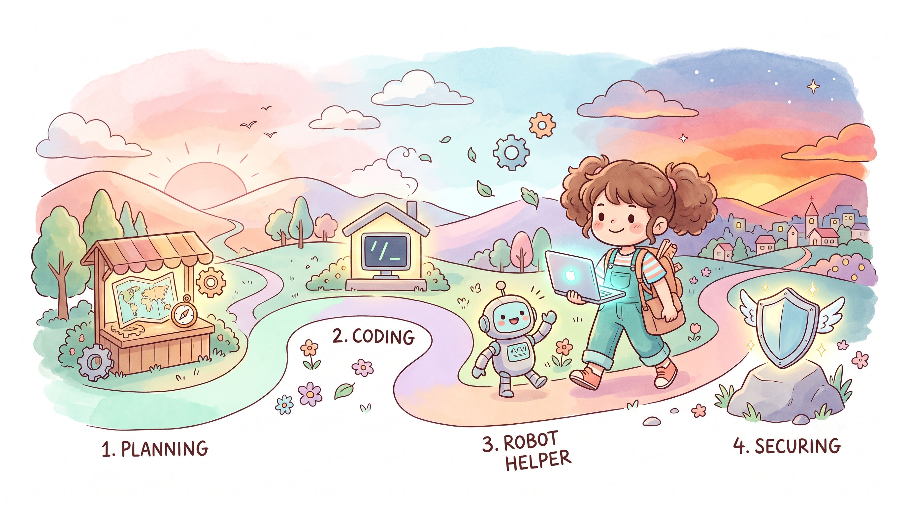
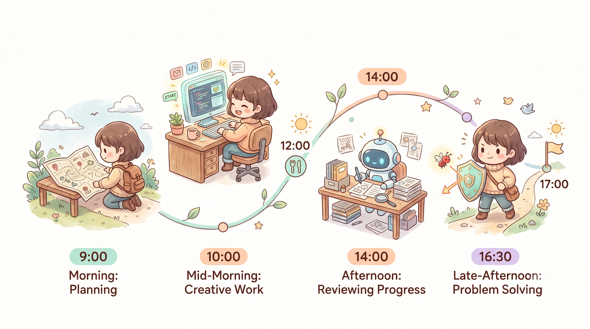
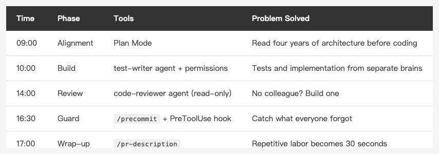

<!-- Tags: Claude Code, AI Agents, iOS Development, Developer Tools, Workflow Automation -->

*(Insert cover image here: cover.png)*

<!--
Gemini prompt: A cute Ghibli-inspired soft pastel illustration. A chibi engineer character walks along a winding path that represents one workday, from a sunrise on the left to a sunset on the right. Along the path stand four small glowing checkpoints: a map (planning), a command card with "/", a small robot helper, and a shield. The character carries a laptop and looks determined but happy. Soft pastel colors (mint, peach, lavender), white background, clean and simple. 16:9 ratio.
-->

# From Demos to Production — One Day Shipping a Feature with Claude Code

> Each feature looks cool on its own. This piece connects them: one real requirement, one workday, from issue to PR.

---

## Introduction

Throughout this series, Slash Commands, Custom Agents, Hooks, Plan Mode, and MCP each got their own article. And the most common question in the comments has been the same one:

"So... how do these actually fit together in real work?"

This article is the answer. No new features — just **composition**. One real requirement, walked through from reading the issue in the morning to opening the PR in the evening.

The requirement is one no iOS developer can avoid: **account deletion**. Apple requires that any app with account registration must offer users a way to delete their account. The flow touches UI, a confirmation dialog, an API call, local data cleanup, and logout navigation — just the right size to exercise every part of the workflow.

Some context first: I'm a solo iOS developer maintaining a four-year-old production app (Coordinator architecture + a shared SPM module), with no team to back me up. **When the AI makes a mistake, nobody catches it for me.** That's why every step below looks the way it does.

> *Note: to protect the project's privacy, the feature scenario and class/module names in this article are anonymized and differ from the real project; the workflow and the agent/hook/command setup described are all real, working versions, and the project's tests were actually run and passed on the real project.*

---

## 09:00 — Plan Mode: Think First, Then Build

*(Insert image here: timeline.png)*

<!--
Gemini prompt: A cute Ghibli-inspired soft pastel illustration. A horizontal timeline of one workday from 9:00 to 17:00. Four chibi scenes along the timeline: a character reading a map at 9:00, typing at a glowing terminal at 10:00, a small robot reviewing papers at 14:00, and a shield blocking a red bug at 16:30. Soft pastel colors (mint, peach, lavender), white background, clean and simple. 16:9 ratio.
-->

Account deletion is not "add a button." At minimum it involves:

- An entry point in Settings (UI + Coordinator navigation)
- A confirmation step (prevents accidental taps; App Review checks this)
- A backend API call (through the NetworkManager in my shared module)
- Local data cleanup (UserDefaults, Keychain, caches)
- Logging out and navigating back to the login screen on success

For a task where changes scatter across multiple layers, letting the AI start coding immediately is how disasters begin. So step one is Shift+Tab into **Plan Mode**:

```
Requirement: add a "Delete Account" feature to the Settings page,
compliant with Apple's account deletion guidelines.

Do not write any code yet. Please:
1. Read SettingsViewController, SettingsCoordinator,
   and NetworkManager in CommonKit
2. List the files that need to change, and why
3. Point out where you think this is most likely to go wrong
```

The plan that came back a few minutes later included one item I hadn't thought of: **on logout, every child coordinator needs to be told to clean up, or the old navigation stack lingers**. That's exactly the value of Plan Mode — it read four years of my navigation architecture first, instead of coding from imagination.

Only after I approved the plan did any code get written. This step took 20 minutes. It saved two hours of my afternoon.

> Full details in an earlier entry in this series: [Plan Mode + the Verification Loop](https://medium.com/@n913239/plan-mode-verification-loop-getting-claude-to-think-before-it-acts-150f1e485764)

---

## 10:00 — Building: Implementation + the test-writer Agent

Once the plan was settled, the implementation itself was the least eventful part of the day. What's worth describing is the division of labor:

```
Implement according to the plan. Process:
1. Have the test-writer agent write tests from the plan first
   (failing tests first)
2. Implement until the tests pass
3. You may run xcodebuild's build and test directly without asking
```

`test-writer` is a Custom Agent I defined in `.claude/agents/`. It knows this project's testing conventions: test files organized by feature, names following `test_scenario_expectedResult`, and the network layer always mocked — never hitting real APIs.

Why an agent instead of letting the main conversation write the tests? Because **tests and implementation written by the same brain make compromises for each other**. If the implementation misses an edge case, the tests miss it too. Split into two roles, the tests grow out of the *requirement* — not copied from the code that was just written.

I spent most of this phase doing other things, checking in occasionally. Permissions were set up in advance in `.claude/settings.json`:

```json
{
  "permissions": {
    "allow": [
      "Bash(xcodebuild:*)",
      "Bash(xcrun simctl:*)",
      "Read", "Edit", "Glob", "Grep"
    ],
    "ask": [
      "Bash(git commit:*)",
      "Bash(git push:*)"
    ]
  }
}
```

Build and test (`xcodebuild`, the simulator) run freely. **`git commit` and `git push` go in `ask` — they always go through me.** (`Bash(xxx:*)` is a prefix match — it only allows commands starting with `xcodebuild`, not all of Bash.)

---

## 14:00 — The code-reviewer Agent: No Colleague? Build One

Implementation done, tests green. On a team, this is where you'd open a PR and wait for a colleague to review. I don't have colleagues — so that role is defined too:

```
Review these changes with the code-reviewer agent.
```

`code-reviewer` is deliberately configured as the opposite of `test-writer`: **read-only** (its tools are just Read, Glob, Grep). Its system prompt casts it as a strict senior iOS engineer focused on memory leaks, retain cycles, main-thread violations, and whether the change stays consistent with the project's existing conventions.

This time it caught two things:

1. The confirmation dialog's completion handler captured `self` without `[weak self]` — a classic retain cycle candidate
2. The account deletion API call inherited the default retry logic from regular requests — **account deletion is not something you silently retry**

The second one is the kind that matters most: it's not a syntax issue, it's a **business logic judgment**. No linter will ever catch it.

> Full agent setup in: [Specialized Roles in Claude Code — Agents: The Complete Guide](https://medium.com/@n913239/specialized-roles-in-claude-code-agents-the-complete-guide-a635d8039cd7)

---

## 16:30 — /precommit + Hooks: Catching What You Forgot to Check

Review issues fixed, ready to wrap up. Before committing, one command:

```
/precommit
```

That's a Slash Command stored in `.claude/commands/precommit.md` — the exact prompt I used to type manually before every commit: check for debug prints, hardcoded tokens, test coverage. Any prompt I've typed more than three times becomes a command. That's my threshold.

But `/precommit` only works **if I remember to type it**. The last line of defense is a **Hook** — it doesn't need me to remember:

```json
{
  "hooks": {
    "PreToolUse": [{
      "matcher": "Bash",
      "hooks": [{ "type": "command", "command": "\"$CLAUDE_PROJECT_DIR/scripts/precommit-guard.sh\"" }]
    }]
  }
}
```

Here's an easy trap: **`matcher` matches the *tool name* (`Bash`), not the command text** — there's no `Bash(git commit*)` matcher (that's `permissions` syntax, not hook syntax). So the hook fires before *every* Bash command, and the script itself reads the JSON from stdin, pulls out `.tool_input.command`, and decides whether this is a `git commit`: if not, it passes through; if so, it greps the staged diff for leftover `print(`, `// TODO: remove`, and anything shaped like a token. If it finds one, it blocks the commit with exit code 2 and reports the reason back to Claude.

It actually fired once that day. Mid-implementation, chasing an async ordering issue, I'd had Claude add a few lines of `print("🔍 deletion flow:")` to watch the execution order — and then we both forgot about them. Tests wouldn't catch it (the feature works). Review missed it (buried in a corner of the diff). The hook caught it.

**Tests verify what you remember to check. Hooks watch what you forget.**

---

## 17:00 — /pr-description, Done for the Day

The last step:

```
/pr-description
```

It reads every commit on the branch and generates a PR description following my fixed template (motivation / what changed / how it was tested). This used to take 15 reluctant minutes every time. Now it's 30 seconds.

Open the PR, glance at CI on my phone before bed. That's one feature, one day.

---

## Conclusion: Better Models Won't Save You. Structure Will.

*(Insert image here: table-one-day-en.png)*

<!--
| Time | Phase | Tools | Problem Solved |
|------|-------|-------|----------------|
| 09:00 | Alignment | Plan Mode | Read four years of architecture before coding |
| 10:00 | Build | test-writer agent + permissions | Tests and implementation from separate brains |
| 14:00 | Review | code-reviewer agent (read-only) | No colleague? Build one |
| 16:30 | Guard | /precommit + PreToolUse hook | Catch what everyone forgot |
| 17:00 | Wrap-up | /pr-description | Repetitive labor becomes 30 seconds |
-->

Looking back at the day, every phase was doing the same thing:

- **Slash Commands** encode repetition
- **Custom Agents** encode specialization
- **Hooks** encode guardrails
- **Plan Mode** encodes think-before-you-build

What they collectively replace is my **self-discipline**. The biggest risk of working alone was never lack of skill — it's that nobody reminds you which step you skipped today. Turn discipline into structure, and it stops depending on what kind of day you're having.

AI coding tools become production-grade not because of better models, but because of the structure you build around them. For a team, structure is a bonus. **For a solo developer, structure is survival.**

---

## References

- [Claude Code Docs — Slash Commands](https://docs.anthropic.com/en/docs/claude-code/slash-commands)
- [Claude Code Docs — Sub-agents](https://docs.anthropic.com/en/docs/claude-code/sub-agents)
- [Claude Code Docs — Hooks](https://docs.anthropic.com/en/docs/claude-code/hooks)
- [Apple — Offering Account Deletion in Your App](https://developer.apple.com/support/offering-account-deletion-in-your-app/)
- Earlier entries in this series: Plan Mode, Agents, Hooks, and Slash Commands each have a full article → [@n913239](https://medium.com/@n913239)
