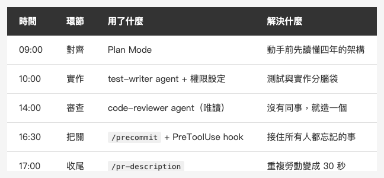

<!-- Tags: Claude Code, AI Agents, iOS Development, Developer Tools, Workflow Automation -->

*(在這裡插入封面圖：cover.png)*

<!--
Gemini prompt: A cute Ghibli-inspired soft pastel illustration. A chibi engineer character walks along a winding path that represents one workday, from a sunrise on the left to a sunset on the right. Along the path stand four small glowing checkpoints: a map (planning), a command card with "/", a small robot helper, and a shield. The character carries a laptop and looks determined but happy. Soft pastel colors (mint, peach, lavender), white background, clean and simple. 16:9 ratio.
-->

# 從 Demo 到 Production — 我用 Claude Code 產出一個功能的一天

> 單篇看完每個功能都很酷。這篇把它們串起來：一個真實需求、一個工作天、從 issue 到 PR。

---

## 前言

這個系列寫到現在，Slash Commands、Custom Agents、Hooks、Plan Mode、MCP 各自都有一篇。每篇的留言裡最常出現的問題是同一個：

「所以……實際工作的時候，這些東西是怎麼搭在一起的？」

這篇就是答案。不講新功能，講**組合**——拿一個真實需求，從早上看到 issue，到傍晚開出 PR，完整走一遍我的一天。

需求是 iOS 開發者都躲不掉的那種：**帳號刪除**。Apple 規定上架的 App 只要有註冊功能，就必須提供使用者刪除帳號的途徑。流程牽涉 UI、確認彈窗、API 呼叫、本地資料清除、登出導航——剛好大小適中，能把每個環節都走到。

先說背景：我是獨立 iOS 開發者，專案是維護了四年的 production App（Coordinator 架構 + 共用 SPM 模組），沒有團隊幫我把關。**AI 犯的錯，沒有人替我接住。** 這就是為什麼接下來每個步驟都長那個樣子。

> *說明：為保護專案隱私，文中的功能情境與類別／模組名稱均為化名，與實際專案不同；但所描述的工作流程與 agent／hook／指令設定都是真實、可運作的版本，文中的專案測試也在真實專案上實際跑過並通過。*

---

## 09:00 — Plan Mode：先想清楚，再動手

*(在這裡插入圖片：timeline.png)*

<!--
Gemini prompt: A cute Ghibli-inspired soft pastel illustration. A horizontal timeline of one workday from 9:00 to 17:00. Four chibi scenes along the timeline: a character reading a map at 9:00, typing at a glowing terminal at 10:00, a small robot reviewing papers at 14:00, and a shield blocking a red bug at 16:30. Soft pastel colors (mint, peach, lavender), white background, clean and simple. 16:9 ratio.
-->

刪除帳號不是「加一顆按鈕」。它至少牽涉：

- 設定頁的進入點（UI + Coordinator 導航）
- 二次確認（防誤觸，Apple 審查會看）
- 後端 API 呼叫（共用模組裡的 NetworkManager）
- 本地資料清除（UserDefaults、Keychain、快取）
- 成功後登出、導回登入頁

這種「改動會散在好幾層」的任務，直接讓 AI 動手是災難的開始。所以第一步是 Shift+Tab 切進 **Plan Mode**：

```
需求：在設定頁加上「刪除帳號」功能，符合 Apple 的帳號刪除規範。

先不要寫任何 code。請：
1. 讀過 SettingsViewController、SettingsCoordinator、
   CommonKit 的 NetworkManager
2. 列出需要動到的檔案和原因
3. 指出你認為最容易出錯的地方
```

幾分鐘後拿到的計畫裡，有一條是我自己沒想到的：**登出時要通知所有 child coordinator 收尾，不然舊的 navigation stack 會殘留**。這正是 Plan Mode 的價值——它先讀過了我四年來的導航架構，而不是憑想像寫 code。

計畫確認後才放行動手。這一步花了 20 分鐘，省下的是下午的兩小時。

> 詳細用法在系列前篇：[Plan Mode + 驗證迴圈](https://medium.com/@n913239/plan-mode-%E9%A9%97%E8%AD%89%E8%BF%B4%E5%9C%88-%E8%AE%93-claude-%E5%9C%A8%E5%8B%95%E6%89%8B%E5%89%8D%E5%85%88%E6%83%B3%E6%B8%85%E6%A5%9A-0472ae478367)

---

## 10:00 — 動手：實作 + test-writer agent

計畫拍板後，實作反而是一天裡最平淡的部分。真正值得講的是分工方式：

```
照剛才的計畫實作。流程：
1. 先讓 test-writer agent 根據計畫寫測試（先寫失敗的測試）
2. 實作到測試通過
3. 過程中可以直接執行 xcodebuild 的 build 和 test，不用問我
```

`test-writer` 是我定義在 `.claude/agents/` 的 Custom Agent，它知道這個專案的測試慣例：測試檔按 feature 分資料夾、命名跟著 `test_情境_預期結果` 走、network 層一律用 mock 不打真 API。

為什麼用 agent 而不是直接叫主對話寫測試？因為**測試和實作由同一個腦袋寫，會互相將就**。實作漏了 edge case，測試就跟著漏。分成兩個角色，測試是從「需求」長出來的，不是從「剛寫好的 code」抄出來的。

這個階段我大部分時間在做別的事，偶爾回來看一眼進度。權限事先在 `.claude/settings.json` 開好了：

```json
{
  "permissions": {
    "allow": [
      "Bash(xcodebuild:*)",
      "Bash(xcrun simctl:*)",
      "Read", "Edit", "Glob", "Grep"
    ],
    "ask": [
      "Bash(git commit:*)",
      "Bash(git push:*)"
    ]
  }
}
```

build 和 test（`xcodebuild`、模擬器）可以自己跑，**`git commit` 和 `git push` 放進 `ask`，永遠要過我這關**。（`Bash(xxx:*)` 是前綴比對——只放行 `xcodebuild` 開頭的指令，不是整個 Bash 全開。）

---

## 14:00 — code-reviewer agent：沒有同事，就造一個

實作完成、測試全綠。在團隊裡，這時候會開 PR 等同事 review。我沒有同事，所以這個角色也是定義出來的：

```
用 code-reviewer agent 審查這次的改動。
```

`code-reviewer` 的設定刻意跟 `test-writer` 相反：**只能讀，不能寫**（tools 只給 Read、Glob、Grep）。它的 system prompt 要求它扮演一個嚴格的 iOS 資深工程師，重點看記憶體洩漏、retain cycle、主執行緒違規、還有「這個改動跟專案既有慣例一不一致」。

這次它抓到兩件事：

1. 確認彈窗的 completion handler 裡用了 `self` 沒加 `[weak self]`——典型的 retain cycle 候選人
2. 刪除帳號的 API 錯誤處理沿用了一般請求的 retry 邏輯——**刪除帳號這種事不應該自動重試**

第二點尤其值得：它不是語法問題，是**業務邏輯的判斷**。一般的 linter 永遠抓不到。

> Agents 的完整設定方式在：[讓 Claude Code 擁有專業分工 — Agents 攻略](https://medium.com/@n913239/%E8%AE%93-claude-code-%E6%93%81%E6%9C%89%E5%B0%88%E6%A5%AD%E5%88%86%E5%B7%A5-agents-%E6%94%BB%E7%95%A5-587f4c1b32e4)

---

## 16:30 — /precommit + Hooks：接住你忘記檢查的事

修完 review 的問題，準備收工。提交前打一個指令：

```
/precommit
```

這是存在 `.claude/commands/precommit.md` 的 Slash Command，內容就是我以前每次提交前手動打的那段 prompt：檢查 debug print、hardcode 的 token、測試覆蓋。重複打過三次以上的 prompt，就值得變成指令——這是我判斷的門檻。

但 `/precommit` 是「我記得打才有用」。最後一道防線是 **Hook**——它不需要我記得：

```json
{
  "hooks": {
    "PreToolUse": [{
      "matcher": "Bash",
      "hooks": [{ "type": "command", "command": "\"$CLAUDE_PROJECT_DIR/scripts/precommit-guard.sh\"" }]
    }]
  }
}
```

這裡有個容易踩的坑：**`matcher` 比對的是「工具名稱」（`Bash`），不是指令內容**——沒有 `Bash(git commit*)` 這種寫法（那是 `permissions` 的語法，不是 hook 的）。所以 hook 會在**每個** Bash 指令前觸發，由 script 自己從 stdin 讀 JSON、取出 `.tool_input.command` 判斷這次是不是 `git commit`：不是就直接放行，是的話才 grep 整個 staged diff，找殘留的 `print(`、`// TODO: remove`、長得像 token 的字串。找到就以 exit code 2 擋下 commit，並把原因回饋給 Claude。

這天它真的響了一次：實作中段為了追一個 async 時序問題，我讓 Claude 加了幾行 `print("🔍 deletion flow:")` 來看執行順序——然後我們倆都忘了這件事。測試不會抓它（功能是對的），review 也漏了它（藏在 diff 的角落）。Hook 抓到了。

**測試驗證的是你記得要檢查的事，Hook 看守的是你忘記的事。**

---

## 17:00 — /pr-description，收工

最後一步：

```
/pr-description
```

讀這個 branch 的所有 commits，按照我固定的模板（動機 / 改了什麼 / 怎麼測）生成 PR 描述。以前這件事每次要花 15 分鐘還寫得心不甘情不願，現在 30 秒。

開 PR、睡前在手機上掃一眼 CI 結果，這個 feature 的一天結束。

---

## 總結：模型不會救你，結構會

*(在這裡插入圖片：table-one-day.png)*

<!--
| 時間 | 環節 | 用了什麼 | 解決什麼 |
|------|------|---------|---------|
| 09:00 | 對齊 | Plan Mode | 動手前先讀懂四年的架構 |
| 10:00 | 實作 | test-writer agent + 權限設定 | 測試與實作分腦袋 |
| 14:00 | 審查 | code-reviewer agent（唯讀） | 沒有同事，就造一個 |
| 16:30 | 把關 | /precommit + PreToolUse hook | 接住所有人都忘記的事 |
| 17:00 | 收尾 | /pr-description | 重複勞動變成 30 秒 |
-->

回頭看這一天，每個環節其實都在做同一件事：

- **Slash Commands** 把「重複」固定下來
- **Custom Agents** 把「專業分工」固定下來
- **Hooks** 把「防呆」固定下來
- **Plan Mode** 把「先想再做」固定下來

它們共同取代的，是我的**自律**。一個人開發最大的風險從來不是能力不夠，是沒有人提醒你今天忘了哪一步。把紀律寫成結構，它就不再依賴你當天的狀態。

AI coding 工具從 demo 走到 production，靠的不是更強的模型，是你在它周圍搭起來的結構。對團隊來說結構是加分，**對獨立開發者來說，結構是生存**。

---

## 參考資料

- [Claude Code Docs — Slash Commands](https://docs.anthropic.com/en/docs/claude-code/slash-commands)
- [Claude Code Docs — Sub-agents](https://docs.anthropic.com/en/docs/claude-code/sub-agents)
- [Claude Code Docs — Hooks](https://docs.anthropic.com/en/docs/claude-code/hooks)
- [Apple — 提供帳號刪除功能的規定](https://developer.apple.com/support/offering-account-deletion-in-your-app/)
- 系列前篇：Plan Mode、Agents、Hooks、Slash Commands 各有完整單篇 → [@n913239](https://medium.com/@n913239)
