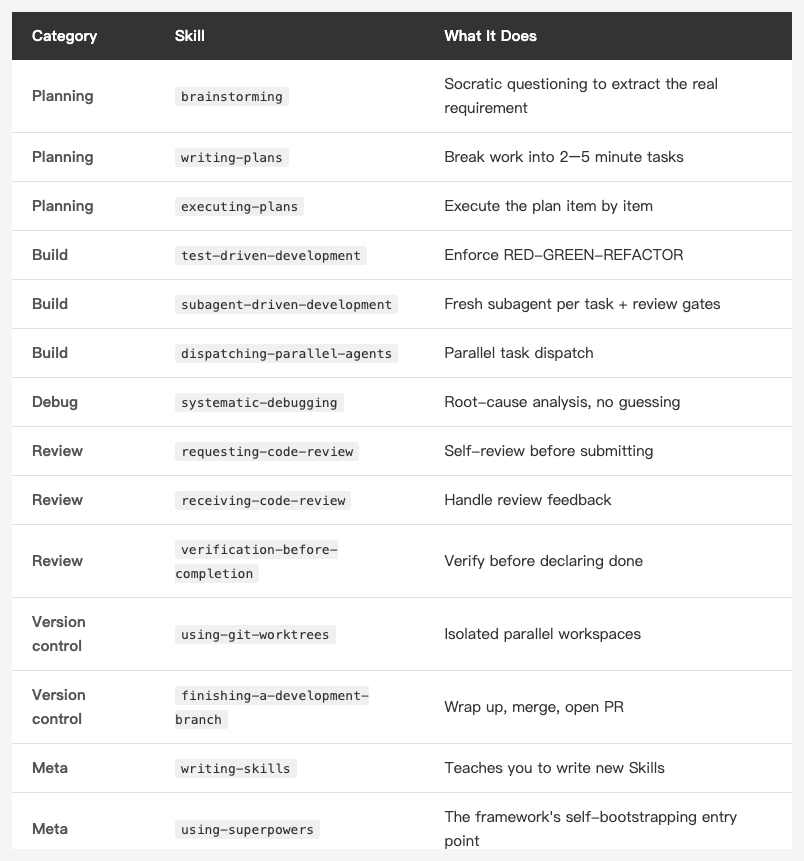
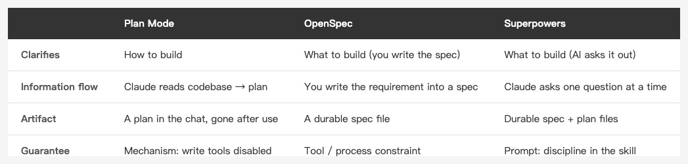

<!-- Tags: Claude Code, AI Agents, Github, Workflow Automation, Open Source -->

*(Insert cover image here: cover.png)*

<!--
Gemini prompt: A cute Ghibli-inspired soft pastel illustration. A chibi engineer character receives a glowing cape labeled "Superpowers" from a floating open-source box. Around the character float several small skill cards, each with a tiny icon: a test tube, a magnifying glass, a branch, a checklist. The character looks pleasantly surprised. Soft pastel colors (mint, peach, lavender), white background, clean and simple. 16:9 ratio.
-->

# Superpowers — Someone Packaged the Entire Claude Code Methodology Into One Command

> I spent three months hand-rolling my own commands, agents, and hooks. Then I found out someone had packaged the whole workflow — and it has 240k stars.

---

## Introduction

This entire series has been about one thing: **whether Claude Code is production-ready depends not on how strong the model is, but on the structure you build around it.** Slash Commands, Custom Agents, Hooks, Plan Mode — each article taught you how to build one piece yourself.

Then I ran into [Superpowers](https://github.com/obra/superpowers).

It's an open-source plugin released by Jesse Vincent (known online as obra) in October 2025. One sentence: **it packages the whole "brainstorm first, then plan, then test-drive, then self-review" methodology into a plugin you install with a single command.** In other words, the things this series taught you to hand-build, it has pre-built into one opinionated set.

I installed it and used it for a few days. This article is my introduction plus an honest assessment: what it actually is, how it works, whether it's worth installing, and — for someone who's already hand-rolled their own workflow — what it adds and what it locks you into.

> As of July 2026, the repo has **~240k stars**, over 20k forks, MIT licensed. For a plugin less than a year old, that's a staggering number.

---

## Part 1: What Is It, Exactly?

The core concept in Superpowers is the **Skill** — note this is the same mechanism as Claude Code's built-in Skills, but Superpowers takes it to the extreme.

A Skill is a `SKILL.md` file describing "the standard process for doing a certain thing." But the key difference is in the author's own words:

> **"If you have a skill to do something, you _must_ use it to do that activity."**

This isn't "reference documentation," it's "mandatory process." A normal CLAUDE.md rule is a suggestion — Claude might follow it, might forget. Superpowers Skills are designed so that once triggered, they must be followed — by design, it will even delete already-written code and make you start over when you try to take a shortcut.

The framework currently has **14 Skills**, in a few categories:

*(Insert image here: table-skills-en.png)*

<!--
| Category | Skill | What It Does |
|----------|-------|--------------|
| Planning | brainstorming | Socratic questioning to extract the real requirement |
| Planning | writing-plans | Break work into 2–5 minute tasks |
| Planning | executing-plans | Execute the plan item by item |
| Build | test-driven-development | Enforce RED-GREEN-REFACTOR |
| Build | subagent-driven-development | Fresh subagent per task + review gates |
| Build | dispatching-parallel-agents | Parallel task dispatch |
| Debug | systematic-debugging | Root-cause analysis, no guessing |
| Review | requesting-code-review | Self-review before submitting |
| Review | receiving-code-review | Handle review feedback |
| Review | verification-before-completion | Verify before declaring done |
| Version control | using-git-worktrees | Isolated parallel workspaces |
| Version control | finishing-a-development-branch | Wrap up, merge, open PR |
| Meta | writing-skills | Teaches you to write new Skills |
| Meta | using-superpowers | The framework's self-bootstrapping entry point |
-->

Looking at this table, you've probably noticed — **this list is almost exactly the topics of every article in this series.** Plan Mode, Agents, parallel workflows, Git, test-driven development... the difference is I taught you to build each piece yourself, while Superpowers binds them into one complete flow where they call each other.

---

## Part 2: How Does It Work?

### How Skills Get Triggered Automatically

Superpowers doesn't require you to remember which Skill to call. Its mechanism: before starting work, Claude **searches for relevant Skills**, and when it finds one, reads it in and follows it. In the author's words:

> **"search for skills by running a script and use skills by reading them and doing what they say."**

So you just say "help me add a feature," and it triggers the brainstorming → writing-plans → test-driven-development chain on its own, without you clicking through each one.

### The Most Interesting Design: Using Persuasion Psychology to Make the AI Behave

This is the cleverest part of the whole project, in my opinion. The author found that simply writing "you must write tests first" doesn't work — under pressure (e.g., a simulated production incident, or having written a pile of code it doesn't want to delete), the AI still takes shortcuts.

So he did something: **he pressure-tested these Skills using Cialdini's principles of persuasion** (the six principles from the book *Influence*), designing "production is on fire" and "sunk cost" scenarios to test the AI, repeatedly tuning the Skills' wording until the AI followed the process even under pressure.

He also shared a funny anecdote: at first he had Claude test these Skills itself, and Claude "quizzed the subagents like they were on a gameshow" — completely failing to test realistic conditions. Only after switching to simulated real pressure scenarios did it actually work.

This itself is worth remembering for an iOS developer: **a prompt isn't write-once — it has to be adversarially tested.** That's the exact same mindset we bring to writing tests.

---

## Part 3: What the Full Workflow Looks Like

After installing, when you ask it to build a feature, it runs a seven-phase flow:

1. **Brainstorming** — Doesn't write code directly; first uses questions to dig out what you "really want," then presents the design in small digestible chunks for you to confirm
2. **Git worktrees** — Opens an isolated workspace and new branch, without polluting the main line
3. **Writing plans** — Breaks work into 2–5 minute tasks, each with an exact spec
4. **Subagent-driven development** — Dispatches a fresh subagent for each task, with review gates in between
5. **Test-driven development** — Enforces RED-GREEN-REFACTOR; try to write code first and it deletes the code and makes you start over
6. **Code review** — Automatic review between tasks; **critical issues block progress outright** — no fix, no proceeding
7. **Branch finishing** — Handles merge, PR creation, or cleanup

Compare this to my last article, [From Demos to Production — One Day Shipping a Feature with Claude Code](https://medium.com/@n913239/from-demos-to-production-one-day-shipping-a-feature-with-claude-code-191e757b4332) — this flow is almost the same script, except Superpowers turns it from "I wire it up manually" into "it wires itself up."

### The Question You're Bound to Ask: How Is Brainstorming Different from Plan Mode?

An earlier entry in this series already covered Plan Mode as "think before you build" — so isn't phase one's brainstorming redundant? No — **they point in different directions and fill different gaps**. And let me fold in OpenSpec, which I've also written about, since it's a third answer to "align before you build":

*(Insert image here: table-brainstorm-planmode-en.png)*

<!--
| | Plan Mode | OpenSpec | Superpowers (brainstorming) |
|---|---|---|---|
| Clarifies | How to build | What to build (you write the spec) | What to build (AI asks it out of you) |
| Information flow | Claude reads the codebase → hands you a plan | You write the requirement into a spec | Claude asks you one question at a time |
| Artifact | A plan in the chat, gone after use | A durable spec file | Durable spec + plan files |
| Level of guarantee | Mechanism: write tools disabled | Tool / process constraint | Prompt: discipline in the skill |
-->

**Plan Mode vs Brainstorming:** one has Claude read the codebase and hand you a plan to approve (the "how"), the other asks you one question at a time (digging out the "what"); the first guards against "the AI acting before it understands," the second against "you delegating before you understand." One technical difference: Plan Mode is a **built-in mode** of Claude Code — while active, write tools are disabled outright, a hard guarantee; brainstorming's "no code until the design is approved" is **discipline written into the skill**, persuaded rather than locked.

**And OpenSpec?** It solves "requirements only live in the chat box" — by writing the spec into a **durable file** (I go deeper in [Align Before You Build — OpenSpec / opsx](https://medium.com/@n913239/align-before-you-build-openspec-opsx-prompt-engineering-and-rag-a995f1f5d379)). The interesting part: Superpowers' brainstorming → writing-plans also lands in durable `spec` + `plan` files — effectively automating OpenSpec's "persist the spec" plus Plan Mode's "produce a plan," with the "AI interviews you for the requirement" step added on top. The difference: OpenSpec's spec is **written by you**, Superpowers' is **drawn out of you**.

In practice: if you already know exactly what you want, brainstorming's rounds of questions feel redundant — Plan Mode, or just writing an OpenSpec spec, is enough. If the requirement is still fuzzy ("I want some kind of notification system"), that one-question-at-a-time dialogue is where the real value is.

---

## Part 4: How to Install (Really Just One Line)

To install it in Claude Code, type one line in a session:

```
/plugin install superpowers@claude-plugins-official
```

No npm package, no config file, under five minutes. After installing, its Skills trigger automatically based on your needs — you describe a feature, and brainstorming and planning wake up; you start implementing, and TDD takes over; you wrap up, and review steps in.

It supports more than just Claude Code. Cursor, Gemini CLI, GitHub Copilot CLI, Codex CLI, and more all have their own install methods (part of why its star count is so high — cross-platform).

---

## Part 5: I Actually Ran Two Real Tasks Through It

Reading the docs doesn't count. On my own iOS project, I handed it two small-but-complete tasks back to back, letting it drive the whole flow while I watched.

**Task one: a small string-formatting utility** (masking the middle digits of a phone number with `***`). It automatically ran brainstorming → write tests → implement → wrap-up, and the tests it produced **followed my project's existing naming and mocking conventions exactly** — the edge cases (empty string, wrong length, non-digit input) it thought of on its own.

**Task two I deliberately made harder: a validator with a checksum algorithm** (national ID validation, with a letter-to-code lookup table plus a weighted checksum). This kind of "there's one correct answer" task is the best way to expose whether the TDD is real or for show — and it **got it right on the first pass**: the lookup table that's easiest to copy wrong (several of its codes are non-sequential) was flawless, the checksum formula was correct, and I verified it by hand. It even proactively added a test to cover a special branch of that table.

**A few observations that beat my expectations — and corrected worries I'd started with:**

- **It doesn't spin up git worktrees carelessly.** Both tasks were done right in the main working tree; even the more complex second one didn't open one. The "it constantly opens worktrees, and CocoaPods has to be reinstalled" fear didn't materialize.
- **It doesn't push on its own.** At wrap-up it gave me a four-way menu (merge locally / open a PR / keep as-is / discard) instead of pushing automatically — it asks me, rather than acting first and reporting later. That's reassuring.
- **The harder it got, the steadier it was.** The checksum task was clearly harder than the masking one, and it handled it more rigorously.

**But it also missed one trap.** Task one's implementation used Swift's `isNumber` to check "is this a digit" — and that method returns true even for **full-width digits**, so full-width input would be wrongly treated as a valid number. Its flow didn't catch this; I found it in my own review and fixed it by adding a test. That says something: **its process is strict, but its depth is still bounded by the model's grasp of language-level details.** For bugs that need knowledge of a language's sharp edges, you still want someone who knows them (or a strict enough reviewer) at the gate.

---

## Part 6: My Honest Assessment

As someone who's already hand-rolled their entire workflow, I see two sides — and this judgment is no longer just from reading docs; it's the conclusion after the two hands-on rounds above.

**What it adds (reasons to install)**

- **It forces discipline.** My own hooks and commands only work "if I remember to set them up." Superpowers makes "plan first, test first, review first" the unbypassable default. For people prone to impatiently jumping straight to code (that's me), this enforcement is genuinely useful.
- **Its TDD is the real thing.** Both trial tasks were strictly tests-first, and it drove even a checksum algorithm — one with a single correct answer — to being right on the first pass. Not for show. (The docs say it deletes your code if you try to write it before the tests; my two tasks never triggered that step, but the enforcement of the flow is real.)
- **It's an adversarially-tested methodology, not someone's casual notes.** Prompts tuned with Cialdini's principles really do show a quality difference.

**What it locks you into (things to think through)**

- **It's very opinionated.** The whole flow is Jesse Vincent's way of working. If your habits don't match his (e.g., you just don't do strict TDD), you'll be constantly fighting its defaults. (I'd worried it would constantly spin up worktrees and force CocoaPods reinstalls — but neither trial task opened one, so this turned out milder than I feared.)
- **Every task runs the full ceremony.** Even a one-line typo gets pulled through brainstorm → plan → TDD; in practice it wasn't as heavy as I feared, but the ceremony always runs, and when you're in a hurry you'll feel it.
- **A black-box feel.** With 14 Skills calling each other, when its behavior isn't what you expect, debugging which Skill is responsible is much harder than debugging the three commands I wrote myself.

**My conclusion:** If you're new to Claude Code and haven't built your own workflow yet, Superpowers is an excellent shortcut to "expert-grade process out of the box" — I strongly recommend installing it and experiencing it once. If you've already hand-rolled a structure that fits you, like I have, it's better treated as a **source of inspiration** — read how its `SKILL.md` files are written, how it uses persuasion psychology to lock in behavior, and absorb the good parts into your own setup, rather than swapping wholesale.

In the end, for all this series has covered, it comes back to one line: **structure is what moves AI from demo to production.** And Superpowers is the best proof of it — a structure good enough that someone packaged it into a plugin, and good enough that 240 thousand people hit that star.

---

## References

- [From Demos to Production — One Day Shipping a Feature with Claude Code](https://medium.com/@n913239/from-demos-to-production-one-day-shipping-a-feature-with-claude-code-191e757b4332) — the previous entry in this series, one day of wiring the same flow by hand
- [Align Before You Build — OpenSpec / opsx, Prompt Engineering, and RAG](https://medium.com/@n913239/align-before-you-build-openspec-opsx-prompt-engineering-and-rag-a995f1f5d379) — Spec-Driven Development: another take on persisting requirements as a durable spec
- [obra/superpowers — GitHub](https://github.com/obra/superpowers) — the project itself, MIT licensed
- [Superpowers: How I'm using coding agents in October 2025](https://blog.fsck.com/2025/10/09/superpowers/) — the author Jesse Vincent's original announcement, the most complete account of the design philosophy
- [Claude Code Docs — Plugins](https://docs.anthropic.com/en/docs/claude-code/plugins) — official docs on the plugin mechanism
- [Claude Code Docs — Skills](https://docs.anthropic.com/en/docs/claude-code/skills) — official docs on the Skill mechanism
