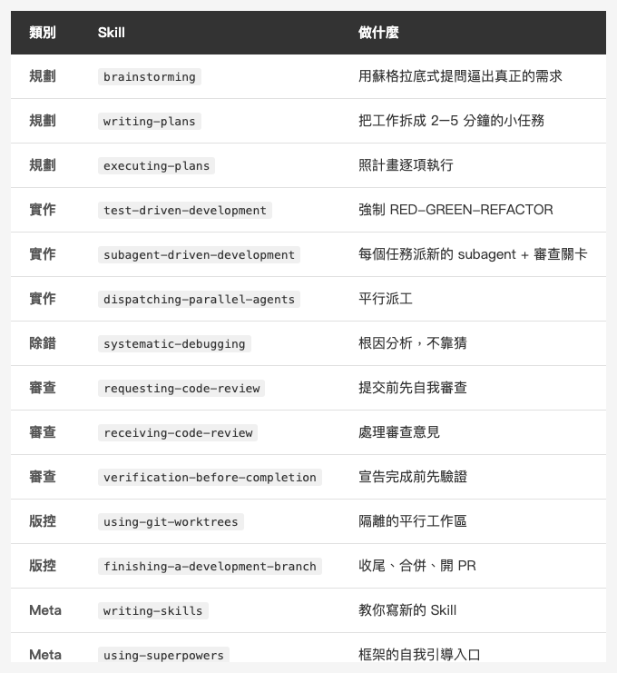
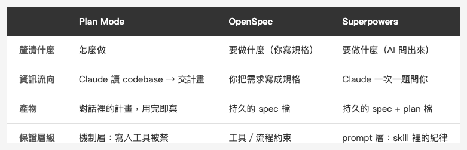

<!-- Tags: Claude Code, AI Agents, Github, Workflow Automation, Open Source -->

*(在這裡插入封面圖：cover.png)*

<!--
Gemini prompt: A cute Ghibli-inspired soft pastel illustration. A chibi engineer character receives a glowing cape labeled "Superpowers" from a floating open-source box. Around the character float several small skill cards, each with a tiny icon: a test tube, a magnifying glass, a branch, a checklist. The character looks pleasantly surprised. Soft pastel colors (mint, peach, lavender), white background, clean and simple. 16:9 ratio.
-->

# Superpowers — 有人把整套 Claude Code 方法論，打包成一行指令

> 我花了三個月手刻 commands、agents、hooks。然後我發現有人把整套流程打包好了，還拿了 24 萬顆星。

---

## 前言

這個系列從頭到尾在講同一件事：**Claude Code 能不能用在 production，靠的不是模型多強，是你在它周圍搭起來的結構。** Slash Commands、Custom Agents、Hooks、Plan Mode——每一篇都是教你怎麼自己動手搭一塊。

然後我遇到 [Superpowers](https://github.com/obra/superpowers)。

它是 Jesse Vincent（網路上的 ID 是 obra）在 2025 年 10 月放出來的開源外掛。一句話形容：**它把「先腦力激盪、再規劃、再測試驅動、最後自我審查」這整套方法論，打包成一個你一行指令就能裝的外掛。** 換句話說，這個系列前面教你手刻的東西，它幫你刻好了一整組——而且是一套很有主見的版本。

我裝來用了幾天。這篇是我的介紹 + 誠實評價：它到底是什麼、怎麼運作、值不值得裝，還有對一個已經手刻過自己工作流的人來說，它補了什麼、又綁了什麼。

> 截至 2026 年 7 月，這個 repo 有 **約 24 萬顆星**、超過 2 萬個 fork，MIT 授權。對一個還不到一年的外掛來說，這個數字非常驚人。

---

## Part 1：它到底是什麼？

Superpowers 的核心概念叫 **Skill**——注意，這跟 Claude Code 內建的 Skills 是同一套機制，但 Superpowers 把它用到極致。

一個 Skill 就是一份 `SKILL.md` 檔案，裡面寫的是「做某件事的標準流程」。但關鍵的差別在這句作者的原話：

> **"If you have a skill to do something, you _must_ use it to do that activity."**
> （如果你有一個技能可以做某件事，那你**必須**用它來做那件事。）

這不是「參考文件」，是「強制流程」。一般的 CLAUDE.md 規範是建議，Claude 可能會遵守也可能會忘。Superpowers 的 Skill 被設計成「一旦觸發就必須照做」——設計上，它甚至會在你想抄捷徑時，把已經寫好的 code 刪掉叫你重來。

整套框架目前有 **14 個 Skill**，分成幾類：

*(在這裡插入圖片：table-skills.png)*

<!--
| 類別 | Skill | 做什麼 |
|------|-------|--------|
| 規劃 | brainstorming | 用蘇格拉底式提問逼出真正的需求 |
| 規劃 | writing-plans | 把工作拆成 2–5 分鐘的小任務 |
| 規劃 | executing-plans | 照計畫逐項執行 |
| 實作 | test-driven-development | 強制 RED-GREEN-REFACTOR |
| 實作 | subagent-driven-development | 每個任務派新的 subagent + 審查關卡 |
| 實作 | dispatching-parallel-agents | 平行派工 |
| 除錯 | systematic-debugging | 根因分析，不靠猜 |
| 審查 | requesting-code-review | 提交前先自我審查 |
| 審查 | receiving-code-review | 處理審查意見 |
| 審查 | verification-before-completion | 宣告完成前先驗證 |
| 版控 | using-git-worktrees | 隔離的平行工作區 |
| 版控 | finishing-a-development-branch | 收尾、合併、開 PR |
| Meta | writing-skills | 教你寫新的 Skill |
| Meta | using-superpowers | 框架的自我引導入口 |
-->

看這張表你大概已經發現了——**這整個列表，幾乎就是我這個系列前面每一篇的主題。** Plan Mode、Agents、平行工作流、Git、測試驅動……差別是我教你一塊一塊自己搭，Superpowers 把它們綁成一套互相呼叫的完整流程。

---

## Part 2：它怎麼運作？

### Skill 是怎麼被自動觸發的

Superpowers 不需要你記得呼叫哪個 Skill。它的機制是：Claude 在動工前會先**搜尋有沒有相關的 Skill**，找到就讀進來、照著做。作者的原話：

> **"search for skills by running a script and use skills by reading them and doing what they say."**

所以你只要說「幫我加一個功能」，它就會自己觸發 brainstorming → writing-plans → test-driven-development 這條鏈，不用你一個一個點。

### 最有趣的設計：用「說服心理學」逼 AI 守規矩

這是我覺得整個專案最聰明的地方。作者發現，光是寫「你必須先寫測試」沒有用——AI 在壓力下（例如模擬 production 出事、或已經寫了一堆 code 捨不得刪）還是會抄捷徑。

於是他做了一件事：**拿 Cialdini 的說服原理（《影響力》那本書的六大原則）來壓力測試這些 Skill**，設計各種「生產環境失火」「沉沒成本」的情境去考 AI，反覆調整 Skill 的措辭，直到 AI 在壓力下也會乖乖照流程走。

他還講了一個很好笑的插曲：一開始讓 Claude 自己測試這些 Skill，結果 Claude「把 subagent 當成在參加益智節目一樣出題考它們」（quizzed the subagents like they were on a gameshow），完全測不出真實情況。後來改成模擬真實的壓力場景，才真的有效。

這件事本身就值得一個 iOS 開發者記住：**prompt 不是寫一次就好，是要被對抗性測試的。** 這跟我們寫測試的心態一模一樣。

---

## Part 3：完整的工作流長什麼樣

裝好之後，你叫它做一個功能，它會跑一條七階段的流程：

1. **Brainstorming** — 不直接寫 code，先用提問把你「真正想要的」挖出來，然後把設計分成一小段一小段給你確認
2. **Git worktrees** — 開一個隔離的工作區和新 branch，不污染主線
3. **Writing plans** — 把工作拆成 2–5 分鐘的小任務，每個都有明確規格
4. **Subagent-driven development** — 每個任務派一個全新的 subagent 去做，中間有審查關卡
5. **Test-driven development** — 強制 RED-GREEN-REFACTOR，想先寫 code 就把 code 刪掉重來
6. **Code review** — 任務之間自動審查，**嚴重問題會直接擋住進度**，不修不准往下
7. **Branch finishing** — 處理合併、開 PR、或清理

對照我上一篇寫的[從 Demo 到 Production — 我用 Claude Code 產出一個功能的一天](https://medium.com/@n913239/%E5%BE%9E-demo-%E5%88%B0-production-%E6%88%91%E7%94%A8-claude-code-%E7%94%A2%E5%87%BA%E4%B8%80%E5%80%8B%E5%8A%9F%E8%83%BD%E7%9A%84%E4%B8%80%E5%A4%A9-e609d74729a0)——這條流程幾乎是同一個劇本，只是 Superpowers 把它從「我手動串」變成「它自動串」。

### 你一定會問：Brainstorming 跟 Plan Mode 有什麼不同？

系列前篇才講過 Plan Mode 也是「動手前先想清楚」，那第一階段的 brainstorming 不就重複了？不——**它們方向不同，解決的是不同的缺口**。順帶把我之前寫過的 OpenSpec 也放進來，因為它是「動手前先對齊」的第三種答案：

*(在這裡插入圖片：table-brainstorm-planmode.png)*

<!--
| | Plan Mode | OpenSpec | Superpowers（brainstorming） |
|---|---|---|---|
| 釐清什麼 | 怎麼做 | 要做什麼（你寫規格） | 要做什麼（AI 問你問出來） |
| 資訊流向 | Claude 讀 codebase → 交計畫 | 你把需求寫成規格 | Claude 一次一題問你 |
| 產物 | 對話裡的計畫，用完即棄 | 持久的 spec 檔 | 持久的 spec + plan 檔 |
| 保證層級 | 機制層：寫入工具被禁 | 工具／流程約束 | prompt 層：skill 裡的紀律 |
-->

**Plan Mode vs Brainstorming**：一個 Claude 讀完 codebase 交計畫給你批准（管「怎麼做」），一個一次一題問你（挖「要做什麼」）；前者防「AI 沒想清楚就動手」，後者防「你沒想清楚就叫 AI 動手」。還有個技術差別：Plan Mode 是 Claude Code **內建模式**，啟用時寫入類工具直接被禁用——是硬保證；brainstorming 的「設計沒批准前不准寫 code」則是**寫在 skill 裡的紀律**，本質是「被說服的」，不是「被鎖住的」。

**那 OpenSpec 呢？** 它解的是「需求只活在對話框裡」——把規格寫成一份**持久的檔案**（我在[讓 AI 寫 code 前先對齊規格 — OpenSpec / opsx](https://medium.com/@n913239/%E8%AE%93-ai-%E5%AF%AB-code-%E5%89%8D%E5%85%88%E5%B0%8D%E9%BD%8A%E8%A6%8F%E6%A0%BC-openspec-opsx-%E5%AF%A6%E6%88%B0%E8%88%87%E6%8F%90%E7%A4%BA%E8%A9%9E%E5%B7%A5%E7%A8%8B-106125e09aee) 那篇講得更完整）。有趣的是，Superpowers 的 brainstorming → writing-plans 最後也落在持久的 `spec` + `plan` 檔——等於把 OpenSpec 的「規格持久化」和 Plan Mode 的「產計畫」自動串成一條，還多了「AI 問你問出需求」那段。差別在：OpenSpec 的規格是**你寫的**，Superpowers 的是**它問出來的**。

實務判斷：需求已經很清楚，brainstorming 那幾輪提問會覺得多餘，Plan Mode 或直接寫 OpenSpec 規格就夠；需求還很糊（「我想要某種通知系統」），一次一題的 brainstorming 才真的有價值。

---

## Part 4：怎麼裝（真的就一行）

Claude Code 裝它，在 session 裡打一行：

```
/plugin install superpowers@claude-plugins-official
```

沒有 npm 套件、沒有設定檔、不用五分鐘。裝完之後它的 Skill 會根據你的需求自動觸發——你描述一個功能，brainstorming 和 planning 就醒過來；開始實作，TDD 就接手；收尾，review 就上場。

它不只支援 Claude Code。Cursor、Gemini CLI、GitHub Copilot CLI、Codex CLI 等等都有對應的安裝方式（這也是它星數這麼高的原因之一——跨平台）。

---

## Part 5：我實際拿它跑了兩個真任務

光讀文件不算數。我在自己的 iOS 專案上連續丟了兩個小而完整的任務給它，全程讓它自己走流程、我在旁邊看。

**第一題：一個字串格式化小工具**（把手機號碼中間幾碼遮成 `***`）。它自動跑完 brainstorming → 寫測試 → 實作 → 收尾，產出的測試**完全照我專案既有的命名與 mock 慣例**，邊界情況（空字串、長度不符、含非數字）它自己就想到了。

**第二題我故意加難：一個帶檢查碼演算法的驗證函式**（身分證字號驗證，含一張字母對照表 + 加權檢查碼）。這種「有唯一正確答案」的題目最能拆穿 TDD 是真懂還是裝樣子——結果它**一次寫對**：那張最容易抄錯的對照表（裡面有幾個碼是非連續的）一個沒錯，檢查碼公式也對，我自己手算驗證過。它甚至主動多加一個測試去覆蓋對照表的特殊分支。

**幾個超出預期、也修正了我原本擔心的觀察：**

- **它不會亂開 git worktree。** 兩題都直接在主工作區做，連較複雜的第二題也沒開。我原本擔心的「動不動開 worktree、CocoaPods 得重裝」沒發生。
- **它不會擅自 push。** 收尾時它給一個四選一選單（本機合併 / 開 PR / 原樣留著 / 丟棄），而不是自動推上去——是它問我，不是先斬後奏，反而讓人安心。
- **越難反而越穩。** 檢查碼那題明顯比遮罩難，它做得更嚴謹。

**但也抓到一個它沒抓到的坑。** 第一題的實作用了 Swift 的 `isNumber` 來判斷「是不是數字」——這個方法連**全形數字**都算 true，所以全形輸入會被誤判成有效號碼。它的流程沒攔到；是我自己 review 才發現、補了測試修掉。這說明一件事：**它的流程很嚴，但深度仍卡在模型對語言細節的掌握。** 需要語言 sharp edge 知識的 bug，還是得有個懂的人（或一個夠嚴的 reviewer）把關。

---

## Part 6：我的誠實評價

身為一個已經手刻過自己整套工作流的人，我的看法分兩面——這裡的判斷不再只是看文件，是上面兩輪實測之後的結論。

**它補了什麼（值得裝的理由）**

- **它逼出紀律。** 我自己的 hook 和 command 是「我記得設才有」，Superpowers 把「先規劃、先測試、先審查」變成預設不可繞過。對容易心急想直接寫 code 的人（我就是），這個強制力很有用。
- **TDD 是玩真的。** 實測那兩題都嚴格 tests-first，連一個有標準答案的檢查碼演算法都靠測試逼到一次寫對——不是裝樣子。（文件說你想先寫 code 它會刪掉重來；我這兩題沒觸發到那步，但流程的強制性是真的。）
- **它是一套經過對抗性測試的方法論，不是某人的隨手筆記。** 用 Cialdini 原理調教過的 prompt，品質確實有差。

**它綁了什麼（要想清楚的地方）**

- **它非常有主見。** 整套流程是 Jesse Vincent 的工作方式。如果你的習慣跟他不合（例如你根本不做嚴格 TDD），你會一直在跟它的預設拔河。（原本我還擔心它動不動開 worktree、CocoaPods 得重裝，但實測兩題都沒開——這點比想像溫和。）
- **每件事都要走完整套儀式。** 改一行 typo 也會被帶進 brainstorm → plan → TDD；實測起來沒我原本怕的那麼重，但那套 ceremony 一定會跑一遍，趕時間時還是會嫌。
- **黑箱感。** 14 個 Skill 互相呼叫，當它的行為不如預期時，要 debug 是哪個 Skill 在搞鬼，比 debug 我自己寫的三個 command 難得多。

**我的結論：** 如果你是 Claude Code 新手、還沒建立自己的工作流，Superpowers 是一個極好的「直接拿到專家級流程」的捷徑，強烈建議裝來體會一遍。如果你已經像我一樣手刻了一套合身的結構，它更適合當成**靈感來源**——去讀它的 `SKILL.md` 怎麼寫、它怎麼用說服心理學固定行為，然後把好的部分吸收進你自己的設定，而不是整套換掉。

說到底，繞完整個系列，結論還是那一句：**結構，讓 AI 從 demo 走到 production。** 而 Superpowers，就是這句話最好的證明——這套結構好到值得有人做成套件，也好到讓 24 萬人替它按下了那顆星。

---

## 參考資料

- [從 Demo 到 Production — 我用 Claude Code 產出一個功能的一天](https://medium.com/@n913239/%E5%BE%9E-demo-%E5%88%B0-production-%E6%88%91%E7%94%A8-claude-code-%E7%94%A2%E5%87%BA%E4%B8%80%E5%80%8B%E5%8A%9F%E8%83%BD%E7%9A%84%E4%B8%80%E5%A4%A9-e609d74729a0) — 系列前篇，手動串起同一條流程的一天實錄
- [讓 AI 寫 code 前先對齊規格 — OpenSpec / opsx 實戰與提示詞工程](https://medium.com/@n913239/%E8%AE%93-ai-%E5%AF%AB-code-%E5%89%8D%E5%85%88%E5%B0%8D%E9%BD%8A%E8%A6%8F%E6%A0%BC-openspec-opsx-%E5%AF%A6%E6%88%B0%E8%88%87%E6%8F%90%E7%A4%BA%E8%A9%9E%E5%B7%A5%E7%A8%8B-106125e09aee) — 規格驅動開發（SDD），把需求寫成持久規格的另一種取徑
- [obra/superpowers — GitHub](https://github.com/obra/superpowers) — 專案本體，MIT 授權
- [Superpowers: How I'm using coding agents in October 2025](https://blog.fsck.com/2025/10/09/superpowers/) — 作者 Jesse Vincent 的原始公告，講設計理念最完整
- [Claude Code Docs — Plugins](https://docs.anthropic.com/en/docs/claude-code/plugins) — 外掛機制官方說明
- [Claude Code Docs — Skills](https://docs.anthropic.com/en/docs/claude-code/skills) — Skill 機制官方說明
