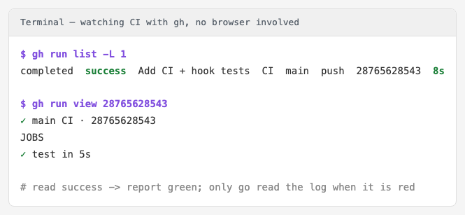
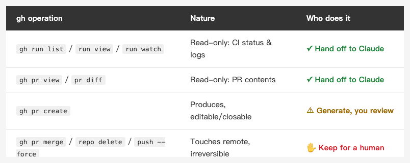

<!-- Tags: Claude Code, GitHub CLI, CICD, Developer Tools, Automation -->

*(Insert cover image here: cover.png)*

<!--
Gemini prompt: A cute Ghibli-inspired soft pastel illustration. A chibi engineer relaxes back in a chair while a friendly robot assistant reads a terminal/monitor showing a green CI checkmark and a small traffic light (one red, one green). The robot holds a small "gh" luggage tag, watching the CI status on the human's behalf. Soft pastel colors (mint, peach, lavender), white background, clean and simple. 16:9 ratio.
-->

# Let Claude Watch Your CI with gh — From Red/Green to Reading Failure Logs to Opening PRs

> Your CI is wired up and the green light comes on. But going to look at it — red or green, and clicking in to read the log when it's red — is still on you. That step can be handed off too.

---

## Introduction

The previous article, "[Testing the Workflow Itself](https://medium.com/@n913239/testing-the-workflow-itself-guarding-your-claude-code-setup-with-ci-7514fc0344e1)," wired up CI: on every push, GitHub Actions guards your hook, config, and tests. But I left a hook at the end of that piece — the CI runs, sure, yet "going to look at whether it's red or green, and clicking in to read the log when it's red" is still on you.

This article is about handing off that step too. The key isn't to have Claude open a browser and screenshot it — it's to let Claude drive `gh` (GitHub's official CLI). And this isn't hypothetical: to verify that CI in the last article, the whole "create the repo → push → watch CI go green" flow was something I let Claude do end to end with gh — and it hit a real pit along the way (Part 4).

---

## Part 1: Why gh, Not "Open a Browser"

A very natural thought: to check CI, just have Claude open a browser, take a screenshot, and see if it's green. It works, but it's the worst possible interface.

For anything meant for an AI, the CLI almost always beats the GUI:

- **Plain text**: `gh` tells you "red or green, how long, who pushed" in a single line. Claude reads one line of text instead of "looking at a picture" to guess the state.
- **Structured**: `gh` supports `--json`, emitting fields Claude can branch on programmatically (`status == "completed"`, `conclusion == "failure"`) rather than eyeballing a green checkmark.
- **Composable**: `gh` pipes into `grep`, into `jq`, into a polling loop. Browser screenshots are slow, brittle, coordinate-dependent, and break the moment GitHub reshuffles its UI.

In one line: **the CLI is an AI's native interface.** When you hand something off to it, give it text and structure — not a picture it has to squint at alongside you.

---

## Part 2: Monitoring a CI Run

(Prerequisite: `gh` is already bound to your account via `gh auth login` — from there Claude just runs it as an ordinary Bash command, no different from you typing it in a terminal.)

The most basic move: after a push, did CI pass? One line:

```bash
gh run list -L 1
```

It prints a line like this (this is the actual output from the last article):

```
completed  success  Add CI + hook tests  CI  main  push  28765628543  8s
```

`completed` + `success` + `8s` — status, red/green, duration, all in one line. Claude reads `success` and reports "it's green"; reads `failure` and moves to the next step (read the log).

And it doesn't even have to read the whole line and slice a string — this is exactly where Part 1's "structured" pays off. `--json` hands it fields directly:

```bash
gh run list -L 1 --json status,conclusion -q '.[0].conclusion'
# → success
```

A clean `success`, which Claude drops straight into an `if` — no misreading. For more detail, `gh run view <id>` lists each check (`✓ test in 5s`).

As for "tell me once it finishes," two ways: block with `gh run watch`, or let Claude poll itself — which is Part 1's "composable" again:

```bash
until gh run list -L 1 --json status -q '.[0].status' | grep -q completed; do sleep 5; done
```

That's exactly how I watched that CI in the last article — from queued, to `test in 5s`, to all green in 8 seconds, without ever opening a browser.

*(Insert image here: gh-run-en.png)*

<!-- Generated by gen.sh: a terminal running gh run list / gh run view, showing completed success and test in 5s -->

---

## Part 3: When It Goes Red — Let It Read the Log Itself

Green takes one line of text; **red** is where gh really saves time. When CI goes red, the traditional path is: open GitHub → Actions → click into that run → expand the failing job → scroll the log for the red line. Six clicks deep.

gh does it in one step:

```bash
gh run view <id> --log-failed
```

`--log-failed` pulls only the *failing* step's log, not the whole bundle. Feed that to Claude and it reads the error, pins the line, and proposes a fix — you never open GitHub.

And "only the failing step" matters especially for an AI: a full log easily runs to thousands of lines, and pouring all of it into the model's context is both expensive and noisy; `--log-failed` filters out the noise up front and hands it only the slice worth reading — fewer tokens, and more accurate too.

For example, say the `shellcheck` check goes red; `--log-failed` prints something like:

```
scripts/precommit-guard.sh:23:24: warning: Quote this to prevent word splitting. [SC2086]
```

Claude reads `SC2086` plus the line number, knows line 23 has an unquoted variable, and tells you exactly where to add the quotes. From "CI is red" to "which line, how to fix" is one command away.

---

## Part 4: A Real Pit — When the Push Gets Blocked

Here's one that actually happened. To verify the CI in the last article, Claude used gh to create a public repo and push the config up — and `git push` got shot down by GitHub outright:

```
remote: - Push cannot contain secrets — Stripe API Key detected
remote:   (?) To push, remove the secret or follow this URL to allow it...
 ! [remote rejected] main -> main (push declined due to repository rule violations)
```

The reason is delicious: a **fake**, `sk_live_`-prefixed token in the hook's tests (the fixture for the "should block a hardcoded secret" case) happened to look exactly like a real Stripe key, so GitHub's secret scanning blocked the whole push.

What matters is what came next: Claude read that `remote:` message, judged that "this isn't a code failure — it's secret scanning mistaking a fake test key for a real one," swapped the fake token for a placeholder that doesn't trip the pattern (the guard still catches it), re-pushed, and it went through.

The change was literally that one string:

```diff
- let apiKey = "sk_live_0123456789…"            // looks like a real Stripe key → GitHub blocks it
+ let apiKey = "placeholder-not-a-real-secret"  // obviously fake → GitHub lets it through
```

The key: GitHub's secret scanning cares whether it **looks like** a key; the hook's guard cares whether there's an `apiKey = "…"` **shape** at all. Swap in an obviously-fake value and the first lets it through while the second still blocks (the test is still `exit 2`) — both correct.

That's the value of handing CI/git interaction to an AI that *reads text*: **it understands the error message, can tell "actually broken" from "blocked by a rule," and treats the right one** — instead of dumping a wall of red back on you to go google.

---

## Part 5: All the Way to a PR

gh doesn't just read — it can close things out. The seed repo from last time has a `/pr-description` command: it reads the branch's commits relative to the mainline and produces a "motivation / what changed / how to test" PR description. Wire it to gh:

```bash
gh pr create --title "..." --body "<Claude's generated description>"
```

Now it's a single pipeline: Claude writes the code → runs the tests → commits (with 0717's hook gatekeeping) → generates the PR description → `gh pr create` opens the PR. From a one-line request to a fully-described, opened PR, all you do is nod at the key moments.

And once the PR is open, you don't switch back to GitHub to check whether its CI passed — `gh pr checks` lists every check under that PR, red or green, in one line:

```bash
gh pr checks
```

Green, and then you decide whether to merge (and that merge step, per Part 6 below, stays on you).

---

## Part 6: What to Hand Off, What to Keep a Hand On

But not everything should be automatic. Of what gh can do, half is "read" and half is "act" — and that line has to be drawn clearly:

*(Insert image here: table-handoff-en.png)*

<!--
| gh operation | Nature | Who does it |
|---|---|---|
| `gh run list` / `run view` / `run watch` | Read-only: CI status & logs | ✓ Hand off to Claude |
| `gh pr view` / `pr diff` | Read-only: PR contents | ✓ Hand off to Claude |
| `gh pr create` | Produces, editable/closable | ⚠ Generate, then you review |
| `gh pr merge` / `repo delete` / `git push --force` | Touches remote, irreversible | ✋ Keep for a human |
-->

- **Safe to hand off**: `gh run list`, `gh run view`, `gh run watch`, `gh pr view`, `gh pr diff` — all read-only; worst case it reads something wrong, no harm done.
- **Keep a hand on**: `gh pr merge`, `gh repo delete`, `git push --force` — these touch the remote and can't be undone.

And you don't have to hold that line by willpower alone — three things stack up in your favor, and they compound.

**One: the token never leaves your machine.** When Claude runs `gh run list`, it spawns a subprocess on *your* computer; gh reads the locally-stored credential (the system keychain, or its own config) to authenticate — **the credential never enters the model's context and never goes to the cloud.** All the model ever sees is the `gh` command and the text it prints. That's the opposite of pasting a PAT into a prompt or wiring it into some agent's config, which is exactly where a key gets transmitted and logged. (One caveat: don't have it run `gh auth token` or `echo $GH_TOKEN` — that's reading the key out loud yourself.)

**Two: least privilege.** The token you give Claude doesn't have to be your master key that can create, delete, and change settings — use a **fine-grained token** scoped to only what it needs: read Actions, read/write PRs on specific repos, nothing more; no `delete_repo`, no `admin`. That `gh repo delete` failing last time wasn't luck — it was by design: the token simply never had the scope.

**Three: Claude Code's own `permissions`.** For things the token *can* do but you don't want it doing unattended (push, merge), put `Bash(gh pr merge:*)` and `Bash(git push:*)` in `settings.json`'s `ask` list, so every remote-touching action checks with you first — exactly what the 0717 seed repo does for `git commit` / `git push`. That force-push only happened after I explicitly gave the nod.

Stack all three: **the credential never leaves your machine, the token holds only the minimum scope, and anything dangerous needs your nod.** That's what lets you actually hand gh to an AI to use every day.

So it lands right on the closing line of 0717: **automation isn't full autonomy.** Hand off "read / watch / diagnose"; keep "merge / delete / publish" for yourself.

---

## Summary

0717 built the guard; this article automates *interacting* with the guard. The whole chain now looks like this: you change one line → the hook gatekeeps → CI guards the hook → Claude uses gh to watch CI for you, read the log when it's red, and open the PR to boot.

And what makes all of this work is a very plain idea — **the CLI is an AI's native interface.** The more your tools are plain-text, composable, and clear about their state, the more the AI can take over for you; give it only a screenshot and all it can do is squint alongside you. Get the interface right, and "hands off" stops being a slogan.

---

## References

- [GitHub CLI manual](https://cli.github.com/manual/)
- [Claude Code Hooks reference](https://code.claude.com/docs/en/hooks)
- Previous in this series: [Testing the Workflow Itself — Guarding Your Claude Code Setup with CI](https://medium.com/@n913239/testing-the-workflow-itself-guarding-your-claude-code-setup-with-ci-7514fc0344e1)
