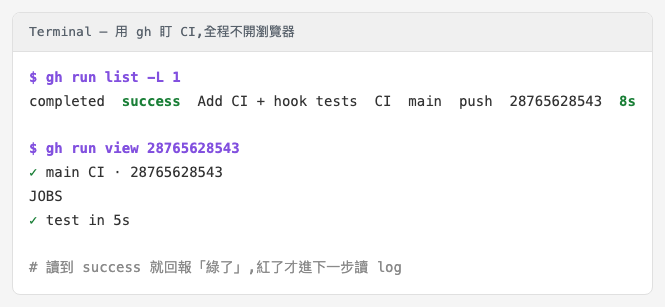
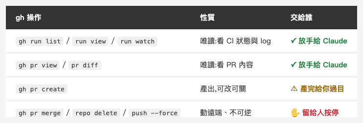

<!-- Tags: Claude Code, GitHub CLI, CICD, Developer Tools, Automation -->

*(在這裡插入封面圖：cover.png)*

<!--
Gemini prompt: A cute Ghibli-inspired soft pastel illustration. A chibi engineer relaxes back in a chair while a friendly robot assistant reads a terminal/monitor showing a green CI checkmark and a small traffic light (one red, one green). The robot holds a small "gh" luggage tag, watching the CI status on the human's behalf. Soft pastel colors (mint, peach, lavender), white background, clean and simple. 16:9 ratio.
-->

# 讓 Claude 用 gh 幫你顧 CI — 從看紅綠、讀失敗 log 到開 PR

> CI 掛好了、綠燈也會亮了。但「去看它紅還是綠、紅了點進去讀 log」這一步,還是你在做。這一步,也能交給 Claude。

---

## 前言

上一篇〈[幫工作流本身寫測試](https://medium.com/@n913239/%E5%B9%AB-%E5%B7%A5%E4%BD%9C%E6%B5%81-%E6%9C%AC%E8%BA%AB%E5%AF%AB%E6%B8%AC%E8%A9%A6-%E7%94%A8-ci-%E5%AE%88%E4%BD%8F%E4%BD%A0%E7%9A%84-claude-code-%E8%A8%AD%E5%AE%9A-e44ac4c81630)〉把 CI 掛上了:每次 push,GitHub Actions 都會幫你把 hook、設定、測試守一遍。但那篇的結尾我留了一個鉤子——CI 在跑歸在跑,「去看它紅還是綠、紅了點進去讀 log」這件事,還是你自己在做。

這一篇就講怎麼把這一步也交出去。關鍵不是叫 Claude 開瀏覽器截圖,而是讓它驅動 `gh`(GitHub 官方 CLI)。而且這不是紙上談兵——上一篇為了驗證那套 CI,整個「建 repo → push → 盯著 CI 跑綠」的流程,我就是讓 Claude 用 gh 一路做完的,中間還真的踩到一個坑(Part 4 講)。

---

## Part 1:為什麼是 gh,不是叫它開瀏覽器

一個很直覺的想法是:要看 CI,叫 Claude 開瀏覽器、截個圖、看綠不綠不就好了?能動,但那是最差的介面。

給 AI 用的東西,CLI 幾乎永遠贏過 GUI:

- **純文字**:`gh` 一行就講完「紅還綠、幾秒、誰推的」。Claude 讀一行字,不必「看圖」猜狀態。
- **結構化**:`gh` 支援 `--json`,能吐出欄位讓 Claude 程式化判斷(`status == "completed"`、`conclusion == "failure"`),而不是靠肉眼辨識綠勾。
- **可組合**:`gh` 能接 `grep`、接 `jq`、塞進迴圈輪詢。瀏覽器截圖慢、脆、還要對座標,GitHub 一改版就崩。

一句話:**CLI 是 AI 的原生介面**。你把事情交給它,就該給它文字、給它結構,而不是丟一張圖讓它瞇著眼跟你一起猜。

---

## Part 2:監控一次 CI run

(前提:`gh` 已 `gh auth login` 綁好帳號——之後 Claude 就是把它當一般 Bash 指令來跑,和你在終端手打沒兩樣。)

最基本的動作:push 完,CI 過了沒?一行就好:

```bash
gh run list -L 1
```

它會吐出像這樣一行(這是上一篇實際跑出來的):

```
completed  success  Add CI + hook tests  CI  main  push  28765628543  8s
```

`completed` + `success` + `8s`——狀態、紅綠、耗時,全在一行。Claude 讀到 `success` 就回報你「綠了」;讀到 `failure` 就進下一步(讀 log)。

而且不必讓它去讀整行、切字串——這正是 Part 1 說的「結構化」派上用場之處。`--json` 直接給它欄位:

```bash
gh run list -L 1 --json status,conclusion -q '.[0].conclusion'
# → success
```

一個乾淨的 `success`,Claude 拿去寫 `if` 判斷,不會看錯。要看細一點,`gh run view <id>` 會把每一關列出來(`✓ test in 5s`)。

至於「等它跑完再回報」,兩種寫法:阻塞就用 `gh run watch`;或讓 Claude 自己輪詢——這又是 Part 1 說的「可組合」:

```bash
until gh run list -L 1 --json status -q '.[0].status' | grep -q completed; do sleep 5; done
```

上一篇我就是這樣盯著那條 CI——從排隊、到 `test in 5s`、到 8 秒收工全綠,全程沒開過瀏覽器。

*(在這裡插入圖片：gh-run.png)*

<!-- 由 gen.sh 產生:終端跑 gh run list / gh run view,顯示 completed success、test in 5s -->

---

## Part 3:紅了怎麼辦 — 讓它自己讀 log

綠燈只要一行字;**紅燈**才是 gh 真正省時間的地方。CI 紅了,傳統做法是:開 GitHub → Actions → 點進那次 run → 展開失敗的 job → 往下捲 log 找那行紅字。六層點擊。

gh 一步到位:

```bash
gh run view <id> --log-failed
```

`--log-failed` 只抓「失敗那一關」的 log,不是整包。把這段直接餵給 Claude,它就能讀錯誤、定位到哪一行、提修法——你連 GitHub 都不用開。

而且「只給失敗那關」對 AI 特別重要:整包 log 動輒上千行,全灌進模型的上下文又貴又吵;`--log-failed` 等於先幫它濾掉雜訊、只留該讀的那一段——省 token,也更準。

舉個例:假設 `shellcheck` 那關紅了,`--log-failed` 會吐出類似:

```
scripts/precommit-guard.sh:23:24: warning: Quote this to prevent word splitting. [SC2086]
```

Claude 讀到 `SC2086` + 行號,就知道是第 23 行某個變數沒加引號,直接告訴你補在哪。從「CI 紅了」到「知道哪行、怎麼修」,一條指令的距離。

---

## Part 4:一個真實的坑 — 當 push 被擋下

講一個真的發生的。上一篇為了驗證 CI,Claude 用 gh 建了一個公開 repo、把設定推上去,結果 `git push` 直接被 GitHub 打槍:

```
remote: - Push cannot contain secrets — Stripe API Key detected
remote:   (?) To push, remove the secret or follow this URL to allow it...
 ! [remote rejected] main -> main (push declined due to repository rule violations)
```

原因很妙:hook 的測試裡有一個**假的**、`sk_live_` 開頭的 token(拿來測「該擋 hardcode 密鑰」那個案例),它剛好長得像真的 Stripe 金鑰,GitHub 的 secret scanning 就把整個 push 擋了。

重點在接下來:Claude 讀了這段 `remote:` 訊息,判斷出「這不是程式壞了,是 secret scanning 誤把測試用的假 key 當真的」,把那個假 token 換成一個不會觸發樣式的 placeholder(guard 仍然攔得到),重推,過。

實際上只動了那一個字串:

```diff
- let apiKey = "sk_live_0123456789…"            // 像真的 Stripe key → 被 GitHub 擋
+ let apiKey = "placeholder-not-a-real-secret"  // 明顯的假值 → GitHub 放行
```

關鍵在:GitHub 的 secret scanning 在意的是「**像不像**密鑰的樣式」,而 hook 的 guard 在意的是「**有沒有** `apiKey = "…"` 這種寫法」。換個明顯的假值,前者放行、後者照樣攔(測試仍是 `exit 2`)——兩邊都對。

這就是把 CI / git 互動交給「會讀文字」的 AI 的價值:**錯誤訊息它讀得懂,能自己分辨是「真的壞了」還是「被規則擋了」,然後對症下藥**——而不是把一段紅字原封不動丟回來,要你自己去 google。

---

## Part 5:一路收尾到 PR

gh 不只能讀,也能收尾。上一篇的種子庫裡有個 `/pr-description` command:它讀 branch 相對主線的 commits,產出「動機 / 改了什麼 / 怎麼測」的 PR 描述。把它接上 gh:

```bash
gh pr create --title "..." --body "<Claude 產的描述>"
```

於是變成一條龍:Claude 幫你寫 code → 跑測試 → commit(還有 0717 的 hook 把關)→ 產 PR 描述 → `gh pr create` 開 PR。從一行需求,到一個開好、描述齊全的 PR,中間你只需要在關鍵處點頭。

而且 PR 開了之後,不必切回 GitHub 看它的 CI 過了沒——`gh pr checks` 一行列出這個 PR 底下每個檢查的紅綠:

```bash
gh pr checks
```

綠了,你再決定要不要 merge(而 merge 這一步,照下面 Part 6 說的,留給你自己按)。

---

## Part 6:哪些放手、哪些要按停

但不是全部都該自動。gh 能做的事,一半是「讀」、一半是「動」,這條線得畫清楚:

*(在這裡插入圖片：table-handoff.png)*

<!--
| gh 操作 | 性質 | 交給誰 |
|---|---|---|
| `gh run list` / `run view` / `run watch` | 唯讀,看 CI 狀態與 log | ✓ 放手給 Claude |
| `gh pr view` / `pr diff` | 唯讀,看 PR 內容 | ✓ 放手給 Claude |
| `gh pr create` | 產出,可改可關 | ⚠ 產完給你過目 |
| `gh pr merge` / `repo delete` / `git push --force` | 動遠端、不可逆 | ✋ 留給人按停 |
-->

- **可以放手**:`gh run list`、`gh run view`、`gh run watch`、`gh pr view`、`gh pr diff`——全是唯讀,錯了頂多看錯,不會造成傷害。
- **要留一手**:`gh pr merge`、`gh repo delete`、`git push --force`——這些會動到遠端、不可逆。

有意思的是,這條線你不必只靠自律去守——你手上有三件事,疊起來很紮實。

**一、token 從頭到尾沒離開你的機器。** 當 Claude 跑 `gh run list`,它啟動的是你電腦上的一個子行程;gh 自己去讀本地存好的憑證(系統 keychain 或它自己的設定檔)完成認證,**憑證沒進到模型的上下文、也沒被送上雲端**——模型看得到的,只有 `gh` 這行指令和它吐出的文字。這跟把一把 PAT 直接貼進 prompt、或塞進某個 agent 設定截然不同:那才是把鑰匙交到會被傳輸、被記錄的地方。(唯一前提:別叫它跑 `gh auth token`、`echo $GH_TOKEN` 這種會把 token 印出來的指令——那等於自己把鑰匙念出來。)

**二、最小權限。** 你給 Claude 用的那把 token,不必是你自己那把能開能刪、還能改設定的萬能鑰匙——用一把 **fine-grained token**,只開它真正需要的:讀 Actions、讀寫指定 repo 的 PR 就好,`delete_repo`、`admin` 一律不給。上一篇那次 `gh repo delete` 擋得下來,正是因為 token 本來就沒那個 scope——**這不是運氣,是設計**。

**三、Claude Code 自己的 `permissions`。** token 有、但你不想讓它自己來的(push、merge),把 `Bash(gh pr merge:*)`、`Bash(git push:*)` 放進 `settings.json` 的 `ask` 清單,每次要動遠端它都得先問過你——這正是 0717 種子庫對 `git commit` / `git push` 做的事。那個 force-push,也是我明確點頭它才推。

三件事合起來:**憑證不出你的機器、token 只給最小權限、危險操作一律要你點頭。** 這麼疊,你才敢把 gh 真的交給 AI 天天用。

所以這正好呼應 0717 最後那句:**自動化不等於全自動**。把「讀 / 看 / 診斷」交出去,把「合併 / 刪除 / 對外」留給自己。

---

## 總結

0717 建立守護,這一篇把「跟守護互動」也自動化。整條鏈現在長這樣:你改一行 → hook 把關 → CI 守 hook → Claude 用 gh 替你看 CI、紅了讀 log、順手把 PR 開好。

而讓這一切成立的,是一個很樸素的道理——**CLI 是 AI 的原生介面**。你的工具愈是純文字、可組合、把狀態講清楚,AI 就愈能替你接手;反過來,你只給它一張截圖,它就只能跟你一起瞇著眼猜。把介面做對,「放手」才不是口號。

---

## 參考資料

- [GitHub CLI 官方手冊](https://cli.github.com/manual/)
- [Claude Code Hooks 官方文件](https://code.claude.com/docs/en/hooks)
- 系列前篇:[幫「工作流」本身寫測試 — 用 CI 守住你的 Claude Code 設定](https://medium.com/@n913239/%E5%B9%AB-%E5%B7%A5%E4%BD%9C%E6%B5%81-%E6%9C%AC%E8%BA%AB%E5%AF%AB%E6%B8%AC%E8%A9%A6-%E7%94%A8-ci-%E5%AE%88%E4%BD%8F%E4%BD%A0%E7%9A%84-claude-code-%E8%A8%AD%E5%AE%9A-e44ac4c81630)