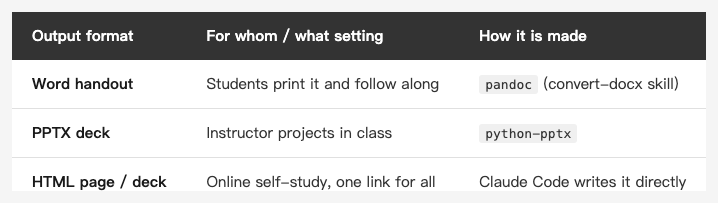

<!-- Tags: Claude Code, Markdown, Pandoc, Teaching, Productivity -->

*(Insert cover image here: cover.png)*

<!--
Gemini prompt: A cute Ghibli-inspired soft pastel illustration. A chibi robot assistant holds a single glowing Markdown scroll, and from it three ribbons flow out into three objects: a Word document, a slide deck, and a web browser page. A friendly senior student watches happily. Soft pastel colors (mint, peach, lavender), white background, clean and simple. 16:9 ratio.
-->

# AI Isn't Just for Code — Turning One Markdown File into Handouts, Slides, and a Web Page with Claude Code

> I built the materials for a seniors' AI class: one Markdown file as the source, and out of it grow a Word handout, a PPTX deck, and an HTML page. Students take the handout, the instructor projects the slides, self-learners read the page — and it's always the same single source.

---

## Introduction

When people hear "Claude Code," they think writing code and fixing bugs. But lately I used it for something completely different: **building a full set of teaching materials for a community seniors' AI class** — teaching "how to get the photos your iPhone took onto your Mac, and how to organize and back them up," for older adults who've barely touched a computer.

Doing it, one thing became clear: **AI is especially good at "structured content × many output formats."** One Markdown file as the source, and from it grow a Word handout, a PPTX deck, and an HTML page — students follow the printed handout, the instructor projects the deck in class, and self-learners read the page. This article takes that pipeline apart for you.

(I did the same for a 28-topic Mac basics course — bigger in scale, but exactly the same logic.)

---

## Part 1: Why Markdown as the Single Source of Truth

The thing that kills teaching materials is "three files, three versions": you edit the Word doc, forget the slides, and the web page is stale — and you only find out mid-class that the three don't line up. So the first decision was: **write the content once, in Markdown**, and grow every other format from it.

Markdown as the source is a great fit for working *with* an AI:

- **Plain text**: Claude reads and edits it smoothly; tweaking a paragraph never touches layout.
- **Version-controllable**: `git diff` shows exactly which sentence changed this round — unlike Word / PPTX, which are binary black boxes that hide what changed.
- **One source, many formats**: from the same md, pandoc makes Word, python-pptx makes slides, and Claude writes HTML directly (coming up).

The source looks like this (a slice from the photo class, written for beginners):

```markdown
> 💡 In one line: both iPhone and Mac have a built-in "Photos" app, and the
> two integrate seamlessly — the key is first understanding *where the photos
> actually live*.

## ⚠️ First, remember the one most important thing
**iCloud Photos on = delete on one side, deleted on both**
Delete a photo on the Mac and the one on your iPhone is gone too.
```

Plain text, easy to read, easy to edit — that's the one and only source.

---

## Part 2: One md, Three Outputs

From the same md, three formats grow according to "who uses it, and how":

*(Insert image here: table-formats-en.png)*

<!--
| Output format | For whom / what setting | How it's made |
|---|---|---|
| **Word handout** | Students print it and follow along | pandoc (wrapped as my `convert-docx` skill) |
| **PPTX deck** | Instructor projects in class | python-pptx |
| **HTML page / deck** | Online self-study, one link for everything | Claude Code writes it directly |
-->

**Word handout (for students to print)** — via pandoc, wrapped into a skill so one line converts it, auto-fixes table borders, and outputs to a `word/` subfolder:

```bash
pandoc 01_photos.md -o word/01_photos.docx --from markdown --to docx
```

Students have paper in hand and follow along step by step, instead of chasing the projector.

**PPTX deck (to project in class)** — this one isn't pandoc; it's **python-pptx** (a Python library for producing PowerPoint). Claude Code reads the md's section structure and assembles a `.pptx` page by page — titles, bullets, callout boxes, all laid out. The code roughly looks like this (Claude writes it and runs it for you):

```python
from pptx import Presentation
prs = Presentation()
slide = prs.slides.add_slide(prs.slide_layouts[1])
slide.shapes.title.text = "Four ways to move photos"
body = slide.placeholders[1].text_frame
for m in ["iCloud Photos: auto-sync", "AirDrop: fastest for a few", "Cable: most reliable in bulk"]:
    body.add_paragraph().text = m
prs.save("slides.pptx")
```

In class you just open it in PowerPoint or Keynote.

**HTML page / deck (self-study, online)** — this one needs no conversion at all: **just ask Claude Code to write it.** It produces a self-contained, keyboard-navigable HTML deck with its own CSS; drop it in a browser and present. Self-learners get the whole set from a single link.

Write once, use in three places: students print the handout, the instructor projects the deck, the page goes online — and the content is always the same md. Change the source, regenerate the three formats once, and everything's back in sync.

It's not fully automatic, of course: pandoc's Word tables need their borders fixed, python-pptx's finer layouts sometimes need a manual pass, and the HTML's interactions need tuning — but that's the "last 20%." The first 80% — the skeleton and the content — the AI nails in one go.

---

## Part 3: Not Just Content — the Teaching Scaffolding Too

Here's the more interesting part: AI helped not just with "typing out the words," but with **the instructional design itself**.

Content for older adults needs its language tuned. Every md in the photo class has these built in:

- **One-line takeaway**: each section opens with a `💡` boiling it down to a sentence, so a senior grasps the core before the details.
- **⚠️ warning boxes**: landmines that bite if stepped on — like "iCloud deletes on both sides" — get called out on their own.
- **emoji as signposts**: `📱➡️💻`, `✅`, `☁️` — easing the pressure plain text puts on a beginner.
- **📷 screenshot placeholders**: mark where an image goes, and fill them in once the content is final.

For the other course, the Mac class, I even had it produce an **instructor's teaching guide**: how many sessions, hours per session, and the rhythm for each unit —

```
demo (10–15 min) → follow along (5–10 min) → practice solo (5–10 min) → Q&A (3–5 min)
```

That's no longer "typing for you" — it's **building the skeleton of a whole lesson**. You spell out "what to teach and who for," it puts up the scaffolding, and you fill in the flesh and fine-tune the pacing.

---

## Part 4: One Content, Four Slide Styles

The most time-consuming part of a deck often isn't the content — it's "does it look good, does it fit the setting." Here AI was a huge help: **from the same handout, I had it make four visual styles**, changing only the CSS —

*(Insert image here: styles-compare.png)*

<!-- Four style cover pages side by side: A warm / B minimal / C dark / D three-step -->

- **Style A, Warm Teaching** — cream background, rounded cards, warm-orange accents; easiest on older eyes.
- **Style B, Apple Minimal** — pure white, lots of whitespace, like Apple's own site.
- **Style C, Dark Premium** — dark background, good for projector screens and talks.
- **Style D, Three-Step Flow** — breaks each task into a clear 1 → 2 → 3.

The four HTML files share the **exact same layout structure**; the only difference is the set of CSS variables at the top:

```css
/* Style A, Warm: cream background + orange */
:root { --bg: #FFF8F0; --ink: #3A2E26; --c1: #FF9F68; }
/* Style C, Dark: midnight background + teal */
:root { --bg: #0e0f13; --ink: #f2f3f5; --accent: #4fd1c5; }
```

Not a word of content changed, and four styles switch with a keystroke — pick one on the spot for the setting and the audience. This "same content, many skins" job would take four manual re-layouts by hand; handed to AI, it's the effort of swapping one `:root`.

(You might ask: why not use a ready-made "Markdown → slides" framework like Marp? You could, and it's less work — but these four **fully bespoke** styles are exactly what a framework's built-in themes can't give you. Want speed, use a framework; want a one-of-a-kind look, hand-build it — pick what you need.)

---

## Summary

I used to think Claude Code was for writing code. Building these two sets of materials, I realized a bigger chunk of its value may lie in **turning structured content into many formats** — and teaching materials, slides, documents, and handouts are all exactly that kind of work.

The recipe is simple: **write the content once (Markdown) → grow the formats per audience (pandoc for Word, python-pptx for slides, HTML written directly) → and let the AI help build the teaching rhythm and the visual styles too.** You own "what to teach and who for"; you hand off the grunt work of formatting and layout.

Next time you need a document, a deck, or a course's handouts — stop opening three files to lay out separately. **Write one Markdown file, and let the AI turn it into every shape you need.**

---

## References

- [pandoc](https://pandoc.org/) — the Swiss-army knife for Markdown → Word / many formats; the engine under the `convert-docx` skill.
- [python-pptx](https://python-pptx.readthedocs.io/) — programmatically produce PowerPoint with Python; the generator for this article's decks.
- [Marp](https://marp.app/) — a ready-made framework that turns Markdown straight into slides (HTML / PDF / PPTX); the most direct alternative if you'd rather use a tool than hand-write HTML.
- [The Markdown Guide](https://www.markdownguide.org/) — a starting point if you're new to Markdown syntax.
