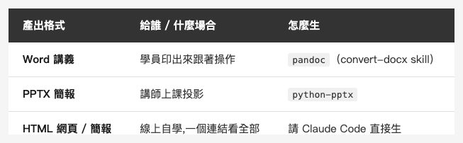

<!-- Tags: Claude Code, Markdown, Pandoc, Teaching, Productivity -->

*(在這裡插入封面圖：cover.png)*

<!--
Gemini prompt: A cute Ghibli-inspired soft pastel illustration. A chibi robot assistant holds a single glowing Markdown scroll, and from it three ribbons flow out into three objects: a Word document, a slide deck, and a web browser page. A friendly senior student watches happily. Soft pastel colors (mint, peach, lavender), white background, clean and simple. 16:9 ratio.
-->

# AI 不只會寫 code — 用 Claude Code 把一份 Markdown 變成講義、簡報、網頁

> 我幫一門長者 AI 課做教材:一份 Markdown 當來源,自動長出 Word 講義、PPTX 簡報、HTML 網頁。學員拿講義、講師投簡報、想自學的看網頁——內容永遠是同一份。

---

## 前言

講到 Claude Code,大家想到的都是寫 code、修 bug。但我最近拿它做了一件完全不同的事:**幫一門社區長者 AI 課做整套上課教材**——教「iPhone 拍的照片怎麼傳進 Mac、怎麼整理備份」,對象是幾乎沒碰過電腦的長輩。

做下來我發現一件事:**AI 特別適合「結構化內容 × 多種輸出格式」這種活。** 一份 Markdown 當來源,依需求長出 Word 講義、PPTX 簡報、HTML 網頁——學員印講義跟著操作、講師上課投簡報、想自學的看網頁。這篇就把這條 pipeline 拆給你看。

(同一套做法,我也做過一門 28 個主題的 Mac 基礎課,規模更大,但邏輯一模一樣。)

---

## Part 1:為什麼用 Markdown 當「單一真相來源」

教材最怕的是「三份檔案、三個版本」:Word 改了、簡報忘了改、網頁又是舊的,上課才發現三邊對不起來。所以第一個決定是:**內容只寫一次,寫在 Markdown 裡**,其他格式全部從它生。

Markdown 當來源,對「跟 AI 協作」特別對味:

- **純文字**:Claude 讀它、改它都順,調一個段落不必碰排版。
- **好版控**:`git diff` 一眼看到「這版改了哪句」,不像 Word / PPTX 是二進位黑盒,改了什麼看不出來。
- **一源多格式**:同一份 md,pandoc 轉 Word、python-pptx 轉簡報、Claude 直接生 HTML(下面就講)。

來源長這樣(照片課其中一段,寫給新手看):

```markdown
> 💡 一句話重點:iPhone 和 Mac 都內建「照片」App,兩者可以無縫
> 整合,重點是先搞懂「照片到底存在哪裡」。

## ⚠️ 先記住一件最重要的事
**開了 iCloud 照片 = 一邊刪,兩邊都刪**
在 Mac 刪一張,iPhone 那張也會不見。
```

純文字、好讀、好改——這就是唯一的來源。

---

## Part 2:一份 md,三種產出

同一份 md,依「誰用、怎麼用」長成三種格式:

*(在這裡插入圖片：table-formats.png)*

<!--
| 產出格式 | 給誰 / 什麼場合 | 怎麼生 |
|---|---|---|
| **Word 講義** | 學員印出來跟著操作 | pandoc（我包成 `convert-docx` skill） |
| **PPTX 簡報** | 講師上課投影 | python-pptx |
| **HTML 網頁 / 簡報** | 線上自學、一個連結看全部 | 請 Claude Code 直接生 |
-->

**Word 講義(給學員印)** — 走 pandoc,我把它包成一個 skill,一句話就轉,還會自動修表格框線、輸出到 `word/` 子資料夾:

```bash
pandoc 01_照片教學.md -o word/01_照片教學.docx --from markdown --to docx
```

學員手上有紙本,跟著一步一步做,不用盯著投影幕追。

**PPTX 簡報(上課投影)** — 這個不是 pandoc,而是走 **python-pptx**(一個用 Python 產 PowerPoint 的套件)。Claude Code 讀 md 的章節結構,用 python-pptx 一頁一頁組出 `.pptx`——標題、條列、重點框都照排。程式大概長這樣(Claude 幫你寫、也幫你跑):

```python
from pptx import Presentation
prs = Presentation()
slide = prs.slides.add_slide(prs.slide_layouts[1])
slide.shapes.title.text = "傳照片,四種方法"
body = slide.placeholders[1].text_frame
for m in ["iCloud 照片:自動同步", "AirDrop:一兩張最快", "傳輸線:量大最穩"]:
    body.add_paragraph().text = m
prs.save("slides.pptx")
```

上課直接開 PowerPoint 或 Keynote 投。

**HTML 網頁 / 簡報(自學、線上)** — 這個連轉都不用,**直接請 Claude Code 生**。它產一份自帶 CSS、能鍵盤翻頁的 HTML 簡報,丟進瀏覽器就能放;想自學的學員,一個連結就看得到整套。

一次寫、三處用:學員印講義、講師投簡報、線上放網頁,而內容永遠是同一份 md——改來源,三種格式重生一次就同步了。

當然不是全自動:pandoc 的 Word 表格框線要補、python-pptx 的精細版面偶爾要手動收尾、HTML 的互動也要調——但這些都是「最後 20%」,前面 80% 的骨架和內容,AI 一次就到位。

---

## Part 3:不只內容,還有教學鷹架

更有意思的是——AI 幫的不只是「把字打出來」,還有**教學設計本身**。

給長輩的內容,語言得特別調。照片課的每份 md 都內建這幾件:

- **一句話重點**:每段開頭用 `💡` 濃縮成一句,長輩先抓得住核心再看細節。
- **⚠️ 警告框**:像「iCloud 一邊刪、兩邊都刪」這種一踩就出事的地雷,獨立標出來。
- **emoji 當路標**:`📱➡️💻`、`✅`、`☁️`——降低純文字對新手的壓迫感。
- **📷 截圖預留位**:該補圖的地方先留記號,內容定稿後再統一補圖。

另一門 Mac 課,我甚至請它產了一份**講師教學指南**:課程分幾節、每節幾小時、每個單元用什麼節奏——

```
講解示範(10–15 分)→ 跟著操作(5–10 分)→ 獨立練習(5–10 分)→ 提問確認(3–5 分)
```

這已經不只是「幫你打字」,是**幫你把一堂課的骨架搭出來**。你把「教什麼、教給誰」講清楚,它把鷹架搭好,你再填血肉、微調節奏。

---

## Part 4:同一份內容,4 種簡報風格

簡報最花時間的,往往不是內容,是「排得好不好看、對不對場合」。這裡 AI 幫了大忙:**同一份講義,我請它做了四種視覺風格**,換的只是 CSS——

*(在這裡插入圖片：styles-compare.png)*

<!-- 四種風格首頁對比:A 親切 / B 簡約 / C 深色 / D 三步驟 -->

- **風格A 親切教學風** — 奶油底、圓角卡片、暖橘配色,給長輩看最舒服。
- **風格B 蘋果簡約風** — 純白、大量留白,像 Apple 官網。
- **風格C 深色質感風** — 深色底,適合投影幕、演講場。
- **風格D 三步驟流程風** — 把操作拆成清清楚楚的 1 → 2 → 3。

四份 HTML 的**版面結構完全一樣**,差別只在最上面那組 CSS 變數:

```css
/* 風格A 親切:暖奶油底 + 橘 */
:root { --bg: #FFF8F0; --ink: #3A2E26; --c1: #FF9F68; }
/* 風格C 深色:深夜底 + 青 */
:root { --bg: #0e0f13; --ink: #f2f3f5; --accent: #4fd1c5; }
```

內容一字沒改,四種風格一鍵切換——現場看場合、看對象挑一個就好。這種「同內容、多套皮膚」的事,手工做要重排四遍,交給 AI 就是換組 `:root` 的功夫。

(你可能會想:那怎麼不用 Marp 這類「Markdown → 投影片」的現成框架?能,而且更省事——但那四種**完全客製**的風格,框架的內建主題給不了。要快就用框架、要獨一無二就手刻,看你需要哪個。)

---

## 總結

我原本以為 Claude Code 是拿來寫 code 的。做完這兩套教材才發現,它更大的一塊價值,可能在**「把結構化內容變成多種格式」**這件事上——而教材、簡報、文件、講義,正好全是這種活。

配方其實很單純:**內容只寫一次(Markdown)→ 依對象長出格式(pandoc 轉 Word、python-pptx 轉簡報、直接生 HTML)→ 連教學節奏和視覺風格都讓 AI 一起搭。** 你負責「教什麼、教給誰」,把格式與排版的苦工交出去。

下次你要做一份文件、一套簡報、一門課的講義——別再開三個檔案分別排版了。**寫一份 Markdown,讓 AI 把它變成你需要的每一種樣子。**

---

## 參考資料

- [pandoc](https://pandoc.org/) — Markdown 轉 Word / 多種格式的瑞士刀,`convert-docx` skill 的底層。
- [python-pptx](https://python-pptx.readthedocs.io/) — 用 Python 程式化產出 PowerPoint,本文簡報的產生器。
- [Marp](https://marp.app/) — 把 Markdown 直接變投影片(HTML / PDF / PPTX)的現成框架;想走工具路線、不手刻 HTML 的話,這是最直接的替代方案。
- [Markdown 指南](https://www.markdownguide.org/) — 不熟 Markdown 語法的話,從這裡入門。
