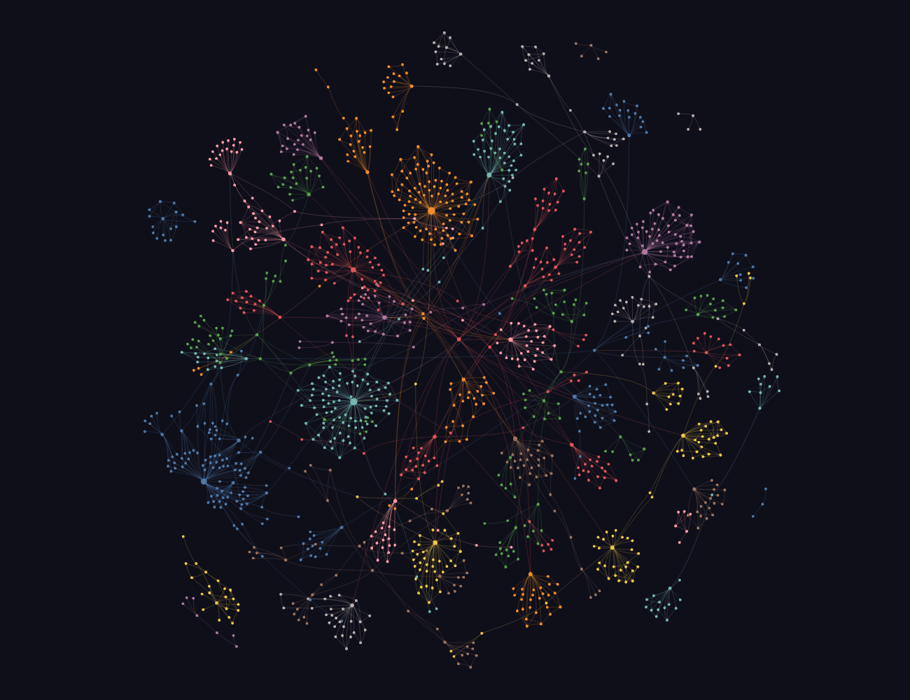
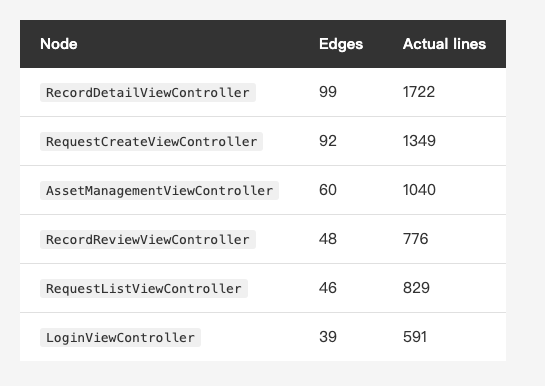
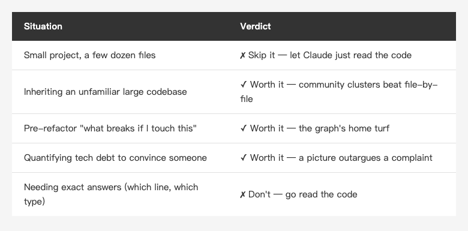
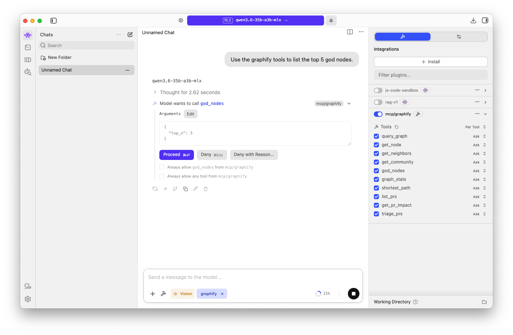

<!-- Tags: Claude Code, Knowledge Graph, Code Analysis, iOS, Developer Tools -->

*(Insert cover image here: cover.png)*

<!--
Gemini prompt: A cute Ghibli-inspired soft pastel illustration. A chibi engineer stands in front of a large glowing constellation map made of connected dots and lines, where a few dots are noticeably bigger and brighter than the rest. A small friendly robot points at the biggest dot with a magnifying glass. The map looks like a night-sky star chart. IMPORTANT: no text, no labels, no letters, no words anywhere in the image — the map is made of dots and lines only. Soft pastel colors (mint, peach, lavender), white background, clean and simple. 16:9 ratio.
-->

# Let Claude See Your Project First — Turning a Codebase into a Knowledge Graph with Graphify

> You already know that 1,722-line ViewController is bloated. What you can't say is exactly what it's tangled up with — and that part can be drawn.

---

## Introduction

This series has been about structure the whole way through: Plan Mode, Skills, hooks, CI, gh — every article about building a process-level scaffold around the AI so it can go from demo to production.

But there's another kind of structure I've never written about: **the structure of your codebase itself.**

When Claude walks into an unfamiliar large project, it's essentially grepping its way around. It reads fast, but what it reads is *a pile of files*, not *a system*. Which class is the real core, which two modules are secretly fused together, what breaks if you touch this — none of that lives inside any single file. It lives **between** them.

That's the problem [Graphify](https://github.com/Graphify-Labs/graphify) goes after: scan the whole repo into a knowledge graph so you (and the AI) can *query* it instead of *leafing through* it.

I ran it against a real iOS project — the same one I used for [the Superpowers piece](https://medium.com/@n913239/superpowers-someone-packaged-the-entire-claude-code-methodology-into-one-command-a76145ed322c) a few weeks back. The result was more interesting than I expected: it told me nothing I didn't already know, and yet it turned something I'd never bothered to say out loud into a picture I couldn't look away from.

> As of July 2026 the repo has **over 90k stars**, MIT licensed, with support for 36 programming languages.

---

## Part 1: What It Actually Does

One sentence: **it scans code, docs, and images into a graph — nodes are concepts (classes, functions, modules), edges are their relationships (calls, inheritance, imports) — and then lets you query that graph.**

What convinced me the design is smart, though, is that it **handles different material differently**:

- **Code** — tree-sitter AST plus a call-graph pass
- **Docs / papers** — concepts and relationships extracted via Claude
- **Images / screenshots** — Claude vision

The first item is the important one: **code never goes through an LLM at all.** It parses the syntax tree directly with tree-sitter, which means scanning code costs zero tokens, ships not one line of your source anywhere, and is deterministic — scan the same code twice, get the same graph. That is a fundamentally different thing from "dump the repo into a model and ask it to summarize the architecture."

One more design choice I appreciate: **every edge carries a confidence tag** — `EXTRACTED` (actually read from the syntax tree), `INFERRED`, or `AMBIGUOUS`. You always know what was found versus what was guessed. Not many tools are willing to publish their own uncertainty; worth noting.

Install is two lines (the project recommends `uv`):

```bash
uv tool install graphifyy && graphify install
```

Not a uv person? The project also documents `pip install graphifyy` and `pipx install graphifyy` as alternatives — you'll just have to make sure your own Python is 3.10+ on those two paths.

> One detail that will block you: graphify needs **Python 3.10+**. This machine only had the system's built-in 3.9, so I had `uv` pull a 3.12 to install it (`uv tool install --python 3.12 …`) — one of the upsides of uv being that it handles the Python version for you, no separate environment to set up first, which is why I'd steer you toward the uv path.

**That double `y` isn't a typo, and this is worth being careful about.** The README says the `graphify` name is still being reclaimed, so the official PyPI package is `graphifyy` (double y) while the CLI command stays `graphify`. The project also explicitly warns that **other `graphify*` packages on PyPI are not affiliated with it.**

I checked: `pypi.org/project/graphify` currently returns 404 (the name really is unclaimed), and `graphifyy`'s homepage points back at `Graphify-Labs/graphify` — you want all three to line up. A package whose correct name is taken and which therefore ships under a temporary one is exactly the setup typosquatting thrives on. Glance at the homepage field before you install.

Then one line inside Claude Code kicks off the scan:

```
/graphify .
```

---

## Part 2: I Ran It on a Real Project

Reading the docs doesn't count. I pointed it at a real iOS project: a commercial app in production, several years old, touched by more than one pair of hands — in other words, exactly the kind of project where I know it's bad but can't articulate *how* it's bad.

> **Business-revealing** class and community names below have been replaced with illustrative stand-ins (generic framework/scaffold names like `NSObject`, `BaseViewController`, `AppCoordinator` are kept as-is); the numbers — line counts, edge counts, node counts — are **the real output**, untouched.

**The first surprise: it estimates the bill before it starts.**

I ran `/graphify`, and instead of charging ahead it did a corpus check first:

```
Large corpus: 355 files · ~1,891,940 words.
Semantic extraction will be expensive (many Claude tokens).
Consider running on a subfolder, or use --no-semantic to run AST-only.
```

355 files, nearly 1.9 million words — it did the math, told me semantic extraction would get expensive, and handed me two ways to spend less: narrow to a subfolder, or pass `--no-semantic` for AST only. A tool that quotes you a price before it starts — and volunteers how to lower it — feels meaningfully different from one that hands you the invoice afterward.

The result:

```
1498 nodes · 2147 edges · 41 communities detected
Extraction: 100% EXTRACTED · 0% INFERRED · 0% AMBIGUOUS
Token cost: 0 input · 0 output
```

Of those 355 files, the ones actually extracted into nodes were **82 Swift source files** — the rest are images, assets, storyboards, and other things that don't go through the AST path.

**That last line is the point of this article: 1,498 nodes and 2,147 edges, built for zero tokens.** And 100% `EXTRACTED` — not one edge guessed — because a pure Swift project goes entirely through the AST path. The LLM never got off the bench.

One boundary worth drawing, though: **that "zero tokens" is the code / AST path specifically.** For docs, PDFs, and images graphify takes the other route — **LLM extraction, which does cost tokens.** That `semantic extraction will be expensive` line it flagged earlier is warning about exactly this path. My scan was pure Swift, all AST, so it genuinely cost nothing; but if your repo has a pile of docs going into the graph too, the bill won't be zero. (In fairness: I didn't exercise the docs/image path this time — that part is from graphify's own docs and that warning; what's verified is the code-path-is-zero half.)

The run leaves three things in `graphify-out/`: a `GRAPH_REPORT.md` summary, a clickable `graph.html`, and the full `graph.json`.

*(Insert image here: graph-screenshot.png)*

<!-- Actual screenshot of the generated graph.html: force-directed graph, 41 communities clustering out -->

---

## Part 3: It Said the Thing I'd Been Avoiding

The report has a section called **God Nodes** — the most-connected nodes, i.e. your core abstractions. Here's what my project produced:

*(Insert image here: table-godnodes-en.png)*

<!--
| Node | Edges | Actual lines |
|---|---|---|
| `RecordDetailViewController` | 99 | 1722 |
| `RequestCreateViewController` | 92 | 1349 |
| `AssetManagementViewController` | 60 | 1040 |
| `RecordReviewViewController` | 48 | 776 |
| `RequestListViewController` | 46 | 829 |
| `LoginViewController` | 39 | 591 |
-->

That's the top six above — and the full top ten are *all* ViewControllers. Not one Service, not one Model, not one Coordinator.

That's the textbook term made visible: **Massive View Controller**. I wrote about this architectural arc in [Four Years, Three iOS Apps — The Long Walk from Massive VC to Coordinator](https://medium.com/@n913239/four-years-three-ios-apps-the-long-walk-from-massive-vc-to-coordinator-a22fb3f1fa80), and this table quantifies it — I no longer have to say "those VCs are a bit heavy," I can say "the heaviest one carries 99 edges."

**But the genuinely interesting part is something else.**

The community analysis (it uses the Leiden algorithm to cluster nodes) found 41 communities, and community #9 is named **"App Coordinator (navigation)"** — holding `AppCoordinator`, `CoordinatorType`, `CoordinatorFinishDelegate`.

Which means: **this project does have a Coordinator.** The navigation layer really has been pulled out into its own clean community. And yet on the same graph, the ViewControllers are still dragging 99 edges each.

Put those two facts side by side and the conclusion writes itself: **the migration from Massive VC to Coordinator is half-finished.** Navigation moved out; the business logic stayed home.

That was the moment the tool earned its keep. `grep Coordinator` finds those files, but it will never tell you "the Coordinator has become its own community while the VCs still carry 99 edges." **Questions no single file can answer are exactly the ones that need relationships to see.**

---

## Part 4: Where It's Rough

Same as always — the good part is done, now the honest part. Several things here are still crude.

**One: it knows syntax, not necessarily semantics.**

The report contains this edge:

```
Event --inherits--> String   [EXTRACTED]
```

Which reads strangely — what inherits from String? Back to the source:

```swift
enum Event: String, CaseIterable {
```

That's **an enum with a String raw value**, not inheritance. In Swift's syntax tree `enum Event: String` looks structurally like `class Foo: Bar`, but it means something completely different. Tree-sitter read the syntax correctly; Graphify hung the wrong relationship label on it.

And note: that edge is still tagged `EXTRACTED` — the highest-confidence tier. **The confidence tag guarantees the edge was read rather than guessed; it does not guarantee the relationship name is right.** Worth keeping that distinction in mind.

**Two: "Surprising Connections" are not surprising.**

There's a section headed "Surprising Connections (you probably didn't know these)." Four of the five it listed look like this:

```
DBManager --inherits--> NSObject
ChatViewController --inherits--> BaseViewController
SettingViewController --inherits--> BaseViewController
```

`DBManager` extending `NSObject`, view controllers extending their own `BaseViewController` — the most ordinary facts in any iOS project. The logic behind picking them is "this edge bridges two communities," which is fair enough graph-theoretically, but packaging that as "things you didn't know" is overselling.

**Three, and this is the sharpest question: couldn't I just run `wc -l`?**

Look at that table in Part 3 again — the edge-count ranking is very nearly the line-count ranking. 99 edges is the 1,722-line file, 92 is the 1,349-line one, 60 is 1,040, and so on, with exactly one pair swapped. So why build a graph instead of sorting by line count?

The objection lands, and answering it exposes where the tool's value actually begins: **line count tells you which file is fat; the graph tells you what it's entangled with.**

One is body weight, the other is joints. The thing only the graph could answer is the Part 3 finding — the Coordinator community is already independent while the VCs still carry 99 edges, so *here* is where the migration stalled. That isn't a property of any single file, and `wc -l` will never compute it.

**Four: the signal is noisy.** The report scores each community for cohesion, but read that number carefully: the highest scorers (0.4 to 0.67) are all communities of one or two nodes — a single node is trivially "cohesive." Meanwhile the genuinely substantial communities, like the 90-node data-model cluster, score 0.03. **In other words, the metric discriminates least exactly where you need it most.**

The report closes by flagging **118 isolated nodes** (≤1 connection). In a 1,498-node graph, 118 islands are mostly edges the parser failed to connect, not genuinely unrelated components.

---

## Part 5: When It's Worth It

Not every project needs this, and the project itself is refreshingly honest about it: six files fit in a context window anyway, so the graph's value there is structural clarity, not compression.

*(Insert image here: table-when-en.png)*

<!--
| Situation | Verdict |
|---|---|
| Small project, a few dozen files | ✗ Skip it — let Claude just read the code |
| Inheriting an unfamiliar large codebase | ✓ Worth it — community clusters beat file-by-file |
| Pre-refactor "what breaks if I touch this" | ✓ Worth it — the graph's home turf |
| Quantifying tech debt to convince someone | ✓ Worth it — a picture outargues a complaint |
| Needing exact answers (which line, which type) | ✗ Don't — go read the code |
-->

Before the server, one clarification a lot of people wonder about: **you don't have to run an MCP server to use this graph at all.** How you consume it depends on scale:

- **Small graph, or you just want the highlights** → read the fixed summary output `graphify-out/GRAPH_REPORT.md` (a hair over 8 KB, written for humans) — god nodes, communities, cohesion are all in there. **The Part 3 and Part 4 analysis in this article came exactly that way, with no server running at all.** For a smaller graph you could even feed the full `graph.json` straight to the LLM.
- **Large graph, and you want the AI to query it repeatedly on its own** → now `graph.json` is impractical (this 1,498-node graph is ~400k tokens as raw JSON, past most models' context), and that's where the MCP server earns its place.

In other words, **MCP isn't mandatory — it's built for "large graph + let the AI query it actively."** Where it ties most tightly back into this series is that the graph can run as an **MCP server** — not a report for a human to read, but something Claude queries directly. It's fully local: it reads the `graph.json` from the run above, starts a process, defaults to stdio (it doesn't even open a network port), and not a byte leaves your machine:

```bash
graphify-mcp --graph graphify-out/graph.json
```

> Heads-up: the MCP server is an optional extra. If Part 1's `uv tool install graphifyy` is all you ran, add it with `uv tool install "graphifyy[mcp]"` before this line will work.

Once it's up it exposes 10 tools: `graph_stats`, `god_nodes`, `get_neighbors`, `shortest_path`, `query_graph`, and more. Then you wire it into Claude Code with one line:

```bash
claude mcp add graphify -- graphify-mcp --graph graphify-out/graph.json
```

With it wired in, I didn't memorize any tool names — I just asked Claude in plain English: "How does RecordDetailViewController connect to the rest of the app?" Claude decided to query the graph on its own, called `query_graph`, ran a BFS traversal from that node, and pulled back **96 related nodes** as context in one shot: the class itself, its pile of methods (`setupUI()`, `submitButtonClick()`, …), and the two delegate protocols it conforms to — each carrying its file path, line number, and community.

That's the whole point of the MCP path: **the same question that would normally have Claude grep through a dozen-plus files now gets a structured answer from a single graph query.** Earlier entries covered how MCP pipes external data into Claude Code; what's being piped in here is *the structure of your own project*.

### Keeping the brain local too: query the same graph with a local LLM

There's a natural extension here: **the brain querying it doesn't have to be Claude.** The MCP server end is model-agnostic — it's just a local service exposing tools, and anything that can call tools can be the brain. Swap in an LLM running on your own machine and the whole path goes fully offline: local model + local graph + local code, taking graphify's "nothing leaves the machine" all the way down to the querying brain.

Two common ways to give a local model MCP:

- **LM Studio** — recent versions ship a **built-in MCP client**; paste one config block in the GUI and you're wired. The easy path.
- **Ollama** — it's just a model runtime with no built-in MCP client, so you have to put something in between that speaks MCP and calls Ollama (an agent framework, or a short script). Works, just more plumbing.

I walked it with **LM Studio** — and it actually ran. First you pick a model, and the real bottleneck on this path is exactly one thing: **tool-calling reliability** — the model has to consistently decide to call `query_graph` and fill the arguments correctly; raw smarts matter less. One Mac-specific note: the same model ships in both **MLX** (Apple's format, a good bit faster than GGUF) and GGUF — pick the MLX one. I used **Qwen3's A3B** (an MoE, MLX 4-bit) — big total parameter count but only ~3B active per pass, so it's fast, capable, and a steady tool-caller. Then you wire graphify into LM Studio's `mcp.json`:

```json
{
  "mcpServers": {
    "graphify": {
      "command": "/path/to/graphify-mcp",
      "args": ["--graph", "/path/to/graphify-out/graph.json"]
    }
  }
}
```

Save, flip on the graphify integration toggle, and its 10 tools all show up in the panel. Then open a chat and ask in plain English: "list the top 5 god nodes."

It nailed it on the first try: the local model thought for a couple of seconds, decided on its own to **call `god_nodes` with arguments `{"top_n": 5}`**, ran it, and handed back the five nodes — `RecordDetailViewController — 99 edges` and the rest — **identical to what the Claude side and the report gave**, then added its own line that this VC is "the most central component by a significant margin."

*(Insert image here: lmstudio-graphify.png)*

<!-- LM Studio trial: the local model qwen3.6-35b-a3b (MLX) decides on its own to call god_nodes with {"top_n": 5}; the right panel shows graphify's 10 tools wired in -->


So the fully-offline path genuinely holds: local model + local graph + local code, not a byte leaving the machine, and the answer's still correct.

> One honest note: whether this path runs smoothly comes down to the **local model's tool-calling reliability**, not graphify. My M4 Pro with the A3B nailed it first try; a smaller model might stall on "it just won't call the tool, or fills the arguments wrong" — that's a model limitation, so pick one that's solid at tool-calling (the Qwen family usually is).

---

## Summary

Full circle, my verdict on Graphify: **it told me nothing I didn't know, and it turned what I couldn't say out loud into a picture.**

I already knew that ViewController was too big — it's 1,722 lines, I feel it every time I open the file. I already knew the Coordinator rollout stopped halfway. But "knowing" and "being able to point at a picture and say it" are different things, especially when the person you need to convince isn't only yourself.

Placed back in this series, it fills in the other half. Everything before it was about **process structure** — how to make the AI work by the rules. Graphify is about **existing structure** — how to make the AI understand what you've accumulated over the years.

What they share is the same old line: **how much the AI can take off your hands depends on how clearly you've laid out the structure.** Write your process as a skill and it follows the process; flatten your codebase into a graph and it stops feeling around in the dark.

As for those 99 edges — the picture exists now. Whether I go pull that thing apart is on me, not on the tool.

---

## References

- [Graphify-Labs/graphify — GitHub](https://github.com/Graphify-Labs/graphify) — the project itself, MIT licensed
- [tree-sitter](https://tree-sitter.github.io/tree-sitter/) — the parser behind its code scanning, and the reason no LLM is involved
- Earlier in this series: [Superpowers — Someone Packaged the Entire Claude Code Methodology Into One Command](https://medium.com/@n913239/superpowers-someone-packaged-the-entire-claude-code-methodology-into-one-command-a76145ed322c) — a packaged methodology, the other half to this article's "existing structure"
- Related: [Four Years, Three iOS Apps — The Long Walk from Massive VC to Coordinator](https://medium.com/@n913239/four-years-three-ios-apps-the-long-walk-from-massive-vc-to-coordinator-a22fb3f1fa80) — the full story of the architectural arc this article quantifies
- [Claude Code Docs — MCP](https://code.claude.com/docs/en/mcp) — how the graph can be wired up as an MCP server
