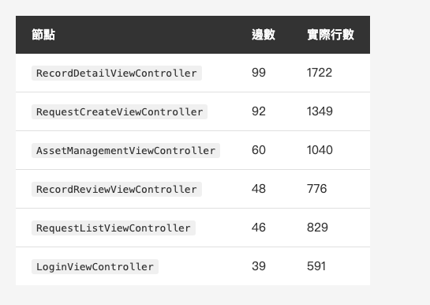
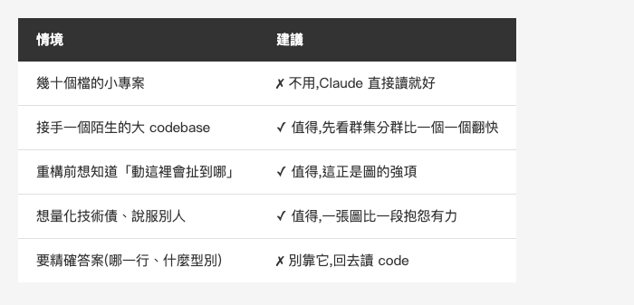

<!-- Tags: Claude Code, Knowledge Graph, Code Analysis, iOS, Developer Tools -->

*(在這裡插入封面圖：cover.png)*

<!--
Gemini prompt: A cute Ghibli-inspired soft pastel illustration. A chibi engineer stands in front of a large glowing constellation map made of connected dots and lines, where a few dots are noticeably bigger and brighter than the rest. A small friendly robot points at the biggest dot with a magnifying glass. The map looks like a night-sky star chart. IMPORTANT: no text, no labels, no letters, no words anywhere in the image — the map is made of dots and lines only. Soft pastel colors (mint, peach, lavender), white background, clean and simple. 16:9 ratio.
-->

# 讓 Claude 先看懂你的專案 — 用 Graphify 把 codebase 掃成一張知識圖

> 一個 1722 行的 ViewController,你早就知道它肥。但你說不出它到底跟誰纏在一起——這件事,可以先畫成一張圖。

---

## 前言

這個系列講了一路的「結構」:Plan Mode、Skills、hooks、CI、gh——每一篇都在講怎麼替 AI 搭一個流程上的框架,讓它從 demo 走到 production。

但有另一種結構,我一直沒寫過:**你的 codebase 本身的結構**。

Claude 進到一個陌生的大專案時,其實是靠 grep 一路摸過去的。它讀得很快,但它讀到的是「一堆檔案」,不是「一個系統」。哪個類別是核心、哪兩個模組其實黏在一起、動這裡會扯到哪裡——這些東西不在任何一個檔案裡,而在檔案**之間**。

[Graphify](https://github.com/Graphify-Labs/graphify) 想解的就是這件事:把整個 repo 掃成一張知識圖,讓你(和 AI)用「查詢」的方式問它,而不是用「翻」的。

我拿它掃了一個真實的 iOS 專案——就是前陣子[那篇測 Superpowers](https://medium.com/@n913239/superpowers-%E6%9C%89%E4%BA%BA%E6%8A%8A%E6%95%B4%E5%A5%97-claude-code-%E6%96%B9%E6%B3%95%E8%AB%96-%E6%89%93%E5%8C%85%E6%88%90%E4%B8%80%E8%A1%8C%E6%8C%87%E4%BB%A4-e60729e12e84)用的同一個。結果比我預期的有意思:它沒告訴我任何我「不知道」的事,但它把我一直懶得說出口的話,變成了一張沒辦法迴避的圖。

> 截至 2026 年 7 月,這個 repo 有 **9 萬顆以上的星**,MIT 授權,支援 36 種程式語言。

---

## Part 1:它到底在做什麼

一句話:**把 code、文件、圖片掃成一張圖,節點是概念(class、function、模組),邊是它們的關係(呼叫、繼承、import),然後讓你查詢這張圖。**

但真正讓我覺得這個工具設計得聰明的,是它**分開處理不同的東西**:

- **程式碼** — tree-sitter 的 AST + call-graph 分析
- **文件 / 論文** — 靠 Claude 抽概念與關係
- **圖片 / 截圖** — 靠 Claude 的 vision

重點在第一項:**程式碼完全不經過 LLM**。它用 tree-sitter 直接解析語法樹,所以掃 code 這件事不花任何 token、不送任何一行程式碼出去、而且結果是確定的——同樣的 code 掃兩次會得到同一張圖。這跟「把整個 repo 餵給模型請它總結架構」是完全不同的東西。

另外一個我很欣賞的設計:**每一條邊都會標記信心度**——`EXTRACTED`(從語法樹實際讀到的)、`INFERRED`(推論的)、`AMBIGUOUS`(不確定的)。你隨時知道哪些是「找到的」、哪些是「猜的」。願意把自己的不確定性標出來的工具不多,這點值得記一筆。

裝起來兩行(官方建議用 `uv`):

```bash
uv tool install graphifyy && graphify install
```

不想用 uv 也行,官方也列了 `pip install graphifyy` 和 `pipx install graphifyy` 兩種備選——只是這兩條你得自己確保手上的 Python 是 3.10 以上。

> 一個會擋住你的細節:graphify 需要 **Python 3.10 以上**。我這台只有系統內建的 3.9,是靠 `uv` 另外拉一個 3.12 才裝起來的(`uv tool install --python 3.12 …`)——用 uv 的好處之一就是它會自己處理 Python 版本,不必先去弄一套環境,這也是我會建議走 uv 這條的原因。

**套件名稱那個雙 `y` 不是錯字,而且這裡要小心。** README 說 `graphify` 這個名字還在申請取回中,所以 PyPI 上的正式套件是 `graphifyy`(雙 y),但 CLI 指令仍然叫 `graphify`。專案自己也特別警告:**PyPI 上其他 `graphify*` 開頭的套件都跟這個專案無關。**

我自己查證過:`pypi.org/project/graphify` 目前是 404(名字確實還沒被取回),而 `graphifyy` 的 homepage 指回 `Graphify-Labs/graphify`——三方對得起來才是對的。一個「正確名字被佔住、只能用暫時名字」的套件本來就是 typosquatting 的溫床,裝之前多看一眼 homepage,不吃虧。

裝完在 Claude Code 裡打一行就開始掃:

```
/graphify .
```

---

## Part 2:我拿它掃了一個真專案

光讀文件不算數。我拿它掃了一個真實的 iOS 專案:一套實際上線的商用 App,寫了好幾年、經手過不只一個人——換句話說,是那種「我知道它哪裡爛,但我說不清楚爛在哪」的專案。

> 以下**涉及專案業務**的類別與群集名稱已置換成示範名稱(通用的框架/骨架名如 `NSObject`、`BaseViewController`、`AppCoordinator` 保持原樣);行數、邊數、節點數這些**數據則是實際跑出來的原始結果**,一個都沒動。

**第一件讓我意外的事:它會先幫你算錢。**

`/graphify` 下去之後,它沒有埋頭就衝,而是先做了一次 corpus check:

```
Large corpus: 355 files · ~1,891,940 words.
Semantic extraction will be expensive (many Claude tokens).
Consider running on a subfolder, or use --no-semantic to run AST-only.
```

355 個檔、將近 190 萬字——它算完之後告訴我「語意抽取會很貴」,還順手給了兩條省錢的路:縮到子資料夾,或加 `--no-semantic` 只跑 AST。一個會在動手前先報成本、還主動教你怎麼少花錢的工具,比一個跑完才讓你看帳單的工具,體感差很多。

跑完的結果:

```
1498 nodes · 2147 edges · 41 communities detected
Extraction: 100% EXTRACTED · 0% INFERRED · 0% AMBIGUOUS
Token cost: 0 input · 0 output
```

那 355 個檔裡,實際被抽成節點的是 **82 個 Swift 原始碼檔**——其餘是圖片、資源、storyboard 這類不走 AST 的東西。

**最後那一行是這篇的重點:整張圖 1498 個節點、2147 條邊,花了零個 token。** 而且 100% 都是 `EXTRACTED`,沒有一條是猜的——因為純 Swift 專案全部走 AST,LLM 根本沒上場。

不過要把邊界講清楚:**這個「零 token」是程式碼那條 AST 路的事。** graphify 對文件、PDF、圖片走的是另一條——**用 LLM 抽取,那會花 token**。前面它跳的那句 `semantic extraction will be expensive`,警告的就是這條。我這次掃的是純 Swift、整包走 AST,所以真的零成本;但如果你的 repo 有一大堆文件要一起進圖,帳單就不會是 0。(公平說一句:文件/圖片那條我這次沒實測,這裡是照它的文件和那句警告講的——已驗證的是程式碼零 token 這半。)

跑完會在 `graphify-out/` 留下三個東西:一份 `GRAPH_REPORT.md`(重點摘要)、一個可以點來點去的 `graph.html`、還有完整的 `graph.json`。

*(在這裡插入圖片：graph-screenshot.png)*

<!-- 實際跑出來的 graph.html 截圖:力導向圖,41 個群集各自成團 -->

---

## Part 3:它說出了我一直沒說出口的話

報告裡有一段叫 **God Nodes**——連接數最高的節點,也就是「你的核心抽象」。我這個專案跑出來是這樣:

*(在這裡插入圖片：table-godnodes.png)*

<!--
| 節點 | 邊數 | 實際行數 |
|---|---|---|
| `RecordDetailViewController` | 99 | 1722 |
| `RequestCreateViewController` | 92 | 1349 |
| `AssetManagementViewController` | 60 | 1040 |
| `RecordReviewViewController` | 48 | 776 |
| `RequestListViewController` | 46 | 829 |
| `LoginViewController` | 39 | 591 |
-->

上面列的是前六名,而完整的前十名**全部都是 ViewController**。沒有一個 Service、沒有一個 Model、沒有一個 Coordinator。

這就是教科書上那個詞:**Massive View Controller**。我在〈[四年三代 iOS App:那條從 Massive VC 走到 Coordinator 的路](https://medium.com/@n913239/%E5%9B%9B%E5%B9%B4%E4%B8%89%E4%BB%A3-ios-app-%E9%82%A3%E6%A2%9D%E5%BE%9E-massive-vc-%E8%B5%B0%E5%88%B0-coordinator-%E7%9A%84%E8%B7%AF-ecda89c2aa5d)〉那篇寫過這段架構演進,而這張表等於把那件事量化了——我不用再說「那幾個 VC 有點肥」,我可以說「最肥的那個扛了 99 條邊」。

**但真正有意思的是另一件事。**

報告裡的群集分析(它用 Leiden 演算法把節點分群)跑出 41 個群集,其中第 9 號群集叫 **"App Coordinator (navigation)"**,裡面躺著 `AppCoordinator`、`CoordinatorType`、`CoordinatorFinishDelegate` 這些東西。

也就是說:**這個專案是有 Coordinator 的。** 導航層確實已經抽出去、自成一個乾淨的群集了。但同一張圖上,ViewController 還是掛著 99 條邊。

兩件事擺在一起,結論就很清楚了:**這場從 Massive VC 走向 Coordinator 的遷移,做到一半。** 導航搬走了,業務邏輯還留在原地。

這是我覺得這個工具最有價值的一刻。`grep Coordinator` 找得到那些檔案,但它不會告訴你「Coordinator 已經自成一個群集,而 VC 還連著 99 條邊」。**單一檔案回答不了的問題,要看關係才看得到。**

---

## Part 4:它不準的地方

老規矩,說完好的講不好的。這工具有幾個地方明顯還粗。

**一、它認得語法,不見得認得語意。**

報告裡有一條邊寫著:

```
Event --inherits--> String   [EXTRACTED]
```

聽起來很怪——什麼東西會「繼承 String」?我翻回原始碼:

```swift
enum Event: String, CaseIterable {
```

這是一個 **raw value 是 String 的 enum**,不是繼承。在 Swift 的語法樹上,`enum Event: String` 跟 `class Foo: Bar` 長得像,但語意完全不同。tree-sitter 讀到了正確的語法,graphify 卻套用了錯誤的關係標籤。

而且注意:這條邊還被標成 `EXTRACTED`(從語法樹實際讀到的,信心最高的等級)。**信心標記保證的是「這條邊是讀出來的、不是猜的」,不保證「這個關係名稱是對的」。** 這個區別要記住。

**二、"Surprising Connections" 一點都不 surprising。**

報告有一段標題叫「Surprising Connections (you probably didn't know these)」——你大概不知道的連結。實際列出來的五條裡,有四條長這樣:

```
DBManager --inherits--> NSObject
ChatViewController --inherits--> BaseViewController
SettingViewController --inherits--> BaseViewController
```

`DBManager` 繼承 `NSObject`、VC 繼承自己的 `BaseViewController`——這是 iOS 專案裡最平凡不過的事。它挑這幾條出來的邏輯是「這條邊跨越了兩個群集」,從圖論來說沒錯,但包裝成「你不知道的驚喜」就吹過頭了。

**三、然後是最尖銳的那個問題:那我 `wc -l` 就好了?**

回頭看 Part 3 那張表——邊數的排名,幾乎就是行數的排名。99 邊的檔案 1722 行、92 邊的 1349 行、60 邊的 1040 行……順序只有一處對調。既然如此,我跑 `wc -l` 排個序不就好了,何必建一張圖?

這個質疑是成立的,而且它逼出了這工具真正的價值邊界:**行數告訴你哪個檔案胖,圖告訴你它跟誰纏在一起。**

前者是體重,後者是關節。真正只有圖能回答的,是 Part 3 那個問題——Coordinator 群集已經獨立、VC 卻還掛著 99 條邊,所以遷移卡在哪裡。那不是任何單一檔案的屬性,`wc -l` 永遠算不出來。

**四、訊號有點糊。** 報告會給每個群集一個 cohesion(內聚度)分數,但這個數字要小心讀:分數最高的那幾個群集(0.4 到 0.67)其實都只有一兩個節點——單獨一個節點當然「內聚」。而真正有規模的群集,像那個 90 個節點的資料模型群,cohesion 只有 0.03。**換句話說,這個指標在你最需要它的地方最沒有鑑別力。**

報告最後還列出 **118 個孤立節點**(連接數 ≤1)。一個 1498 節點的圖裡有 118 個孤島,這些多半是解析沒接上的邊,不是真的沒關係。

---

## Part 5:什麼時候值得用

這工具不是每個專案都需要,而且官方自己講得很老實:六個檔案本來就塞得進 context window,建圖只是圖個結構清楚,談不上壓縮。

*(在這裡插入圖片：table-when.png)*

<!--
| 情境 | 建議 |
|---|---|
| 幾十個檔的小專案 | ✗ 不用,Claude 直接讀就好 |
| 接手一個陌生的大 codebase | ✓ 值得,先看群集分群比一個一個翻快 |
| 重構前想知道「動這裡會扯到哪」 | ✓ 值得,這正是圖的強項 |
| 想量化技術債、說服別人 | ✓ 值得,一張圖比一段抱怨有力 |
| 要精確答案(哪一行、什麼型別) | ✗ 別靠它,回去讀 code |
-->

在講 server 之前先澄清一個很多人會有的疑問:**這張圖不是非得開 MCP server 才能用。** 怎麼消費它,看規模:

- **圖小、或你只想看重點** → 直接讀那份固定產出的摘要 `graphify-out/GRAPH_REPORT.md`(8 KB 出頭,人看的)就夠——god nodes、群集、cohesion 這些都在裡面。**這篇 Part 3、Part 4 的分析,其實就是這樣來的,一個 server 都沒開。** 圖再小一點,連完整的 `graph.json` 都能直接餵給 LLM。
- **圖大、又想讓 AI 自己反覆查** → 這時 `graph.json` 大到不切實際(這張 1498 節點的圖光 JSON 就約 40 萬 token,塞不進多數模型的 context),才輪到 MCP server 上場。

換句話說,**MCP 不是必要,是為「大圖 + 讓 AI 主動查」而生的**。它最跟這個系列扣得緊的地方,是能把這張圖開成 **MCP server**,讓 Claude 直接查——不是給人看報告,是讓 AI 拿去用。它是純本地端的:把上面那次跑出來的 `graph.json` 讀進來,起一個行程,預設走 stdio、連網路埠都不開,一個 byte 都不出你的機器:

```bash
graphify-mcp --graph graphify-out/graph.json
```

> 提醒:MCP server 是選配的 extra。如果你 Part 1 只跑了 `uv tool install graphifyy`,得先補一行 `uv tool install "graphifyy[mcp]"` 才會有 `graphify-mcp` 可用。

起來之後它對外開了 10 個工具:`graph_stats`、`god_nodes`、`get_neighbors`、`shortest_path`、`query_graph`……接著把它掛進 Claude Code 一行就好:

```bash
claude mcp add graphify -- graphify-mcp --graph graphify-out/graph.json
```

掛上去之後我沒有自己去記工具名,而是直接用白話問 Claude:「RecordDetailViewController 怎麼連到 app 其他部分?」——Claude 自己判斷該查圖,呼叫了 `query_graph`,從那個節點做了一次 BFS 走訪,一口氣拿回 **96 個相關節點**當脈絡:那個 class 本身、它的一堆方法(`setupUI()`、`submitButtonClick()`…)、還有它實作的兩個 delegate protocol,每一個都帶著檔案路徑、行號、屬於哪個群集。

這正是 MCP 的意義:**同樣的問題,Claude 平常要 grep 一二十個檔案慢慢拼,現在它查一次圖就拿到結構化的答案。** 系列前面寫過 MCP 是怎麼把外部資料接進 Claude Code 的,而這裡接進去的,是「你自己專案的結構」本身。

### 把大腦也留在本地:用本地 LLM 查同一張圖

到這裡有個很自然的延伸:**查它的大腦不一定要是 Claude。** MCP server 這一端跟模型無關——它只是個開了工具的本地服務,誰來當「會呼叫工具的那顆腦」都行。換成一個跑在你機器上的本地 LLM,整條路就變成**全程離線**:本地模型 + 本地圖 + 本地 code,把 graphify「什麼都不出機器」貫徹到連查詢的大腦都不例外。

本地要接 MCP,常見兩條路:

- **LM Studio** — 新版**內建 MCP client**,在 GUI 裡貼一份設定就能掛,最省事。
- **Ollama** — 它本身只是模型 runtime,沒內建 MCP client,得自己在中間補一層會講 MCP、又會呼叫 Ollama 的東西(某些 agent 框架或一小段 script)。行得通,就是多一道工。

這裡我用 **LM Studio** 走一遍——而且真的跑通了。第一步是挑模型,而這條路真正的瓶頸只有一個:**tool-calling 準不準**——模型要能穩定地「決定呼叫 `query_graph`、把參數填對」,聰不聰明反而其次。在 Mac 上還有個要注意的:同一個模型會有 **MLX**(Apple 專屬、比 GGUF 快一截)和 GGUF 兩種格式,挑 MLX 那個。我用的是 **Qwen3 的 A3B(MoE,MLX 4-bit)**——總參數大、每次只激活約 3B,又快又能打,tool-calling 也穩。接著在 LM Studio 的 `mcp.json` 裡把 graphify 掛上去:

```json
{
  "mcpServers": {
    "graphify": {
      "command": "/path/to/graphify-mcp",
      "args": ["--graph", "/path/to/graphify-out/graph.json"]
    }
  }
}
```

存檔、把 graphify 那個整合開關打開,它開的 10 個工具就全列在面板上了。然後開個 chat,用一樣的白話問:「列出前 5 個 god node」。

結果一次就中:本地模型想了兩秒多,自己**決定呼叫 `god_nodes`、參數填成 `{"top_n": 5}`**,執行後把 `RecordDetailViewController — 99 邊`那五個節點原封不動吐回來——**跟前面 Claude 那端、跟報告裡的數字一字不差**,還自己補了句「這個 VC 是遙遙領先的最核心元件」。

*(在這裡插入圖片：lmstudio-graphify.png)*

<!-- LM Studio 實測:本地模型 qwen3.6-35b-a3b(MLX)自己決定呼叫 god_nodes,參數 {"top_n": 5};右側是掛上去的 graphify 10 個工具 -->


也就是說,這條全離線路線是**真的成立**的:本地模型 + 本地圖 + 本地 code,一個 byte 不出機器,答案照樣正確。

> 一句實話:這條路能不能順,變數在**本地模型的 tool-calling 穩定度**,不在 graphify。我這台 M4 Pro 配 A3B 一次就過;但如果你用更小的模型,可能會卡在「它就是不肯呼叫工具、或參數填錯」——那是模型的限制,換一個 tool-calling 紮實的(Qwen 系列通常穩)就好。

---

## 總結

繞完一圈,我對 Graphify 的評價是:**它沒告訴我任何我不知道的事,但它把我說不出口的話變成了一張圖。**

我早就知道那個 ViewController 太肥——它 1722 行,我每次打開都知道。我也知道 Coordinator 導入到一半就停了。但「知道」跟「能指著一張圖說出來」是兩件事,尤其當你要說服的不只是自己的時候。

而放回這個系列的脈絡,它補的是另外半塊。前面所有文章講的都是**流程的結構**——怎麼讓 AI 照規矩做事。Graphify 講的是**既有的結構**——怎麼讓 AI 看懂你這幾年累積下來的東西。

兩者的共同點,還是那句老話:**AI 接得住多少,取決於你把結構交代得多清楚。** 你把流程寫成 skill,它就照流程走;你把 codebase 攤成一張圖,它就不必再靠 grep 摸黑。

至於那 99 條邊——圖已經畫出來了,接下來要不要動手拆,那是我的事,不是工具的事。

---

## 參考資料

- [Graphify-Labs/graphify — GitHub](https://github.com/Graphify-Labs/graphify) — 專案本體,MIT 授權
- [tree-sitter](https://tree-sitter.github.io/tree-sitter/) — 它掃程式碼用的解析器,不經 LLM 的關鍵
- 系列前篇:[Superpowers — 有人把整套 Claude Code 方法論,打包成一行指令](https://medium.com/@n913239/superpowers-%E6%9C%89%E4%BA%BA%E6%8A%8A%E6%95%B4%E5%A5%97-claude-code-%E6%96%B9%E6%B3%95%E8%AB%96-%E6%89%93%E5%8C%85%E6%88%90%E4%B8%80%E8%A1%8C%E6%8C%87%E4%BB%A4-e60729e12e84) — 打包好的方法論,對照這篇「既有結構」的另一半
- 系列相關:[四年三代 iOS App:那條從 Massive VC 走到 Coordinator 的路](https://medium.com/@n913239/%E5%9B%9B%E5%B9%B4%E4%B8%89%E4%BB%A3-ios-app-%E9%82%A3%E6%A2%9D%E5%BE%9E-massive-vc-%E8%B5%B0%E5%88%B0-coordinator-%E7%9A%84%E8%B7%AF-ecda89c2aa5d) — 這篇量化的那段架構演進的完整故事
- [Claude Code Docs — MCP](https://code.claude.com/docs/en/mcp) — 把圖接成 MCP server 的機制說明
