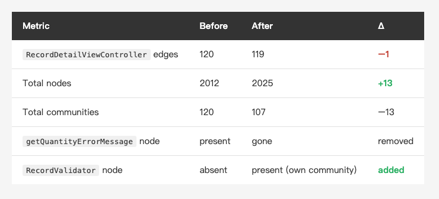

<!-- Tags: Claude Code, Refactoring, iOS, Knowledge Graph, Technical Debt -->

*(Insert cover image here: cover.png)*

<!--
Gemini prompt: A cute Ghibli-inspired soft pastel illustration. A chibi engineer gently lifts one small glowing block out of a big tangled ball of connected dots and lines, and places it into a neat little separate box beside the ball. The big ball stays almost as tangled as before. Soft pastel colors (mint, peach, lavender), white background, clean and simple, no text anywhere. 16:9 ratio.
-->

# Diagnosis Was the Easy Part — Cutting a God Node with Claude Code, Measured on the Same Graph

> At the end of the last piece I said whether those 99 edges get pulled apart is on me, not the tool. This time I went and pulled — then measured, on the same graph, whether it actually got better.

---

## Introduction

In the last piece, Graphify drew a real iOS project as a knowledge graph, and the verdict was blunt: the heaviest node, `RecordDetailViewController`, carried 99 edges across 1,722 lines, and the Coordinator migration was only half done — the navigation layer had broken out into its own community, but the business logic was still squatting inside the VC.

But a diagnosis doesn't refactor itself. The graph tells me "there's a problem here"; it doesn't pick up the scalpel for me. So this time I took Claude Code and actually made a cut — sliced one small piece out of that god node, put tests around it, and then **re-ran the same graph to measure whether it actually got better.**

The shape of the conclusion, up front: this isn't a satisfying before/after picture. It's a piece about how honestly the graph tells me what one clean extraction did change — and what it didn't.

---

## Part 1: Picking the Lesion off the Graph

To cut, you first have to see clearly where. I didn't go on memory — I asked the graph.

The god node is the one from last time: `RecordDetailViewController`, 99 edges, 1,722 lines. I broke its edges apart — of the 99, **92 are its own methods** and 6 are inheritance (its `BaseViewController` superclass plus a few UIKit delegates). In other words, this VC is heavy not because it connects to lots of *other* things, but because **one class is carrying 92 methods** — a textbook Massive View Controller.

Those 92 methods sort themselves into clusters just by their names:

- **Building UI (`make*` × 43 + `setup*` × 13 ≈ 56)**: every subview on the screen, hand-laid in code inside this one VC.
- **Date picking (~18)**: its own hand-rolled date-picker component.
- **Keyboard / gestures, text-field delegates**: a pile of callbacks.
- **Validation (~7)**: checking the input before submit.

Which cluster gets the first cut? I picked the **validation logic** — not because it's the biggest (it's actually the smallest), but because it's the **safest and most testable**. Validation is "given a set of inputs, return whether they're valid" — the natural shape of a pure function, and a pure function is exactly where characterization tests are easiest to land. Starting with the testable, lowest-risk piece is my standard move on a real project: **make it safe first, make it pretty later.**

---

## Part 2: Safety Net First

Rule one of refactoring: have tests before you touch anything. So I set out to write characterization tests for those validation methods first — lock the current behavior, then move it safely.

Then I opened them up and found **they couldn't be tested at all.**

Those methods take `String` parameters and look pure on the surface, but inside they're tangled with three different things:

```swift
func isInputValid(...) -> Bool {
    ...
    Utility.showAlert(alertInfo, on: self)          // 1. side effect: pops an alert
    let hasTime = optionButton.isSelected || ...    // 2. reads UI: the state of 8 buttons
    if !(itemQty > 0) { ... }                       //    quantities read from text fields too
    return false                                    // 3. the pure rule: buried in the middle
}
```

It computes "is this valid," reads 8 buttons, and fires an alert — all at once. To unit-test something like that, you'd have to spin up a real view controller, set every button to the right state, and intercept the alert — **the test is harder to write than the logic under test.**

So the first cut isn't "move," it's "**peel**": peel the **decision** out from **reading the UI** and **popping the alert**. I had Claude extract a pure `RecordValidator` —

- it takes **plain values** (`RecordInput`: name, dates, which options are selected + their quantities),
- it returns a **result enum** (`RecordValidationError`, or `nil` = valid),
- and it **touches no UIKit, pops no alert, reads no `self`.**

Once it's peeled clean, the tests get boring — and boring is the point. I wrote 14 cases pinning the original rules down one by one: required fields, an option selected but no quantity entered, at least one time slot, at least one type, date ordering, and the **precedence** between rules. All green.

Those 14 green lights are the safety net. With them in place, I can actually touch the VC in the next step without flinching. (Aside: this project already had a `MyAppTests` habit — I'm just adding to it.)

---

## Part 3: Cutting, One Slice at a Time

With the net up, back to shrinking the VC. Just three changes, all small:

1. **Slim down `isInputValid`**: what used to be a long if-else chain mixing UI reads and alerts now does three things — gather the UI state into a `RecordInput`, hand it to `RecordValidator.validate()`, and decide whether to pop an alert based on the result. The whole decision moves out.
2. **Delete `getQuantityErrorMessage` entirely**: its logic now lives in the validator; the VC no longer needs it.
3. **Reduce the date check to an alert wrapper**: the pure comparison moves into the validator; the VC keeps only "pop an alert if invalid."

Claude proposes the diffs, I gate them slice by slice. This mechanical-but-tedious migration is exactly what it's best at — collecting scattered checks, aligning parameters, keeping the alert text identical to the character. What I have to watch for is whether it quietly changed behavior (swapped the order of a rule, or dropped an edge case).

`RecordDetailViewController` drops from **1,722 lines to 1,660**. Not much — because I only cut the validation sliver; those 56 UI-building methods are still lying there untouched.

But what actually let me hit commit isn't the line count — it's that **the existing tests pass without a single change.** This project already had a set of `RecordDetailViewControllerTests` calling `super.isInputValid(...)` and `super.isEndOnOrAfterStart(...)` through a mock — landing right on the two methods I changed. They didn't move a line, and they all pass: the hardest proof that behavior didn't change. That's the definition of a refactor, after all: **change the structure, not the behavior.** Green tests, or it doesn't count.

---

## Part 4: Re-run the Graph, Before and After

Diagnosis and surgery are both done. Now the point of this piece: **use the same graph to measure whether it actually got better.**

One honest caveat first, or the numbers will lie to you. By the time I re-ran graphify, its version was newer than the last article's — and the same code, built by the newer version, produced a graph a whole size bigger (edge count nearly doubled, and the node-id scheme changed too). So I **cannot** hold this run's numbers up against that "99 edges" from before — the same VC that read 99 last time reads 120 under the newer build, and **what grew is the tool's counting, not the VC.** To make the comparison stand, I did the dumb but necessary thing: **I built both the pre-refactor and post-refactor code with *the current* graphify, and compared only those two.**

Same ruler, here's the result:

*(Insert image here: table-diff-en.png)*

<!--
| Metric | Before | After | Δ |
|---|---|---|---|
| `RecordDetailViewController` edges | 120 | 119 | −1 |
| Total nodes | 2012 | 2025 | +13 |
| Total communities | 120 | 107 | −13 |
| `getQuantityErrorMessage` node | present | gone | removed |
| `RecordValidator` node | absent | present (own community) | added |
-->

Your first reaction might be a double-take: **I extracted a clean validator with 14 tests around it, and that god node dropped from 120 to 119 — one edge. And the graph as a whole got *more* nodes, not fewer.**

Which edge vanished? I split the god node's 92 `method` edges apart; after the refactor there are 91 — **and the one that's gone is precisely the only method I fully deleted, `getQuantityErrorMessage`.** Everything else (the `isInputValid` that reads 8 buttons, the date methods) still hangs off the VC. Because **I moved the *decision* out, but not the *UI-reading*** — `isInputValid` still has to read that whole row of buttons and text fields into one bundle before handing it to the validator. The decision became testable; the VC's tentacles didn't lose a single one.

**So what actually moved on the graph isn't edges — it's communities.**

What's a *community* here? In a knowledge graph, a clustering algorithm (Leiden, the one from the last piece) groups nodes that are tightly connected to each other but loosely connected to everything else — each such group is a **community**, essentially a module or cluster that emerges naturally on the graph (like classmates forming one cluster and coworkers another on a social network, except here it's your code).

Leiden's clustering carved out a new community this time, and it recognized the *entire validation call-chain* and pulled it into one cluster:

```
submitButtonClick() → isInputValid() → validate()
                                     → quantityMissingTypes()
                                     → isEndOnOrAfterStart()
+ RecordValidator / RecordInput / RecordValidationError
```

18 members, **25 edges inside vs 17 crossing out** — more internal than external, a reasonably cohesive block. And the god node itself stayed put in its original big community.

In other words: **the refactor didn't make the VC less connected (degree only −1), but it gave the codebase a named, pointable "validation" region.** The path "submit button → validation → validator," which used to be buried in the god node's mud ball, is now something the graph recognizes and boxes off.

That's what this one cut actually did, and it happens to be counterintuitive:

- **Edges (coupling) are sticky — one cut won't move them.** The god node is still a god node.
- **But communities (conceptual boundaries) respond to a refactor.** I didn't make the VC smaller; I gave "validation" its own shape on the graph for the first time.
- The graph even got **bigger** after the refactor (+13 nodes) — I added a layer of abstraction. A good refactor doesn't necessarily shrink the graph; it makes it **layer more honestly.**

If you came for the satisfying "refactor → god node collapses" picture, this piece doesn't have it. What graphify handed me was a more honest sentence: **one clean extraction doesn't even break a Massive VC's skin (120 → 119). Fixing a god node isn't one heroic refactor — it's a hundred boring cuts.** And each one at least buys you a piece of logic you can test and name — this time, the validator with 14 tests around it.

---

## Summary

Place this piece back in the series: last time, graphify was the **diagnosis**; this time, Claude Code was the **operation**; and the 14 characterization tests in between were the **safety net**. All three together make one complete refactor loop — you can see the disease, make the cut, and there's a net underneath.

And the payoff here isn't a smaller graph. It's a piece of logic that finally has a **name and a test**: `RecordValidator`. Those 99 (now 120) edges are still there; that VC is still a god node, and I only made *one corner* of it testable — dozens of its other methods still run bare, a long way from "this VC is safe" (**"a refactor with tests" and "a refactored project that has tests" are different things**). But I now know where the next cut goes, and that each cut buys me at least one piece I can name and defend.

Back to the line this series keeps returning to: **the clearer the structure, the more the AI can take off your hands.** graphify makes the structure visible, Claude Code makes it movable, and the tests keep every move from going backwards. Fixing a god node isn't one heroic refactor — it's a hundred boring cuts, each with a net, each leaving a mark. This was the first.

---

## References

- Earlier in this series: [Let Claude See Your Project First — Turning a Codebase into a Knowledge Graph with Graphify](https://medium.com/@n913239/let-claude-see-your-project-first-turning-a-codebase-into-a-knowledge-graph-with-graphify-9142daf79d8f) — where the graph this piece quantifies came from
- [tree-sitter](https://tree-sitter.github.io/tree-sitter/) — the parser behind graphify's zero-token code scanning
- Michael Feathers, *Working Effectively with Legacy Code* — the classic source for characterization tests and "get it under test before you refactor"
