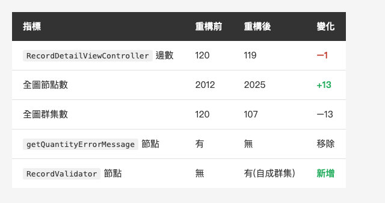

<!-- Tags: Claude Code, Refactoring, iOS, Knowledge Graph, Technical Debt -->

*(在這裡插入封面圖:cover.png)*

<!--
Gemini prompt: A cute Ghibli-inspired soft pastel illustration. A chibi engineer gently lifts one small glowing block out of a big tangled ball of connected dots and lines, and places it into a neat little separate box beside the ball. The big ball stays almost as tangled as before. Soft pastel colors (mint, peach, lavender), white background, clean and simple, no text anywhere. 16:9 ratio.
-->

# 圖說遷移只做一半,那我就把它拆——帶 Claude Code 動一次真重構(附前後對照)

> 上一篇的結尾我說,那 99 條邊要不要拆是我的事,不是工具的事。這一篇我去拆了——然後用同一張圖,量它到底有沒有變好。

---

## 前言

上一篇 Graphify 幫我把一個真實 iOS 專案畫成知識圖,結論很不客氣:那顆最肥的 `RecordDetailViewController` 扛了 99 條邊、1722 行,而 Coordinator 只搬了一半——導航層獨立成自己的群集了,商業邏輯還賴在 VC 裡。

但診斷不會自己變成重構。圖告訴我「這裡有病」,不會替我開刀。所以這一篇,我帶著 Claude Code 真的去動一刀——挑那顆 god node 的一小塊切出來、補上測試,然後**再跑一次同一張圖,量它到底有沒有變好**。

先講結論的形狀:這不是一篇「重構前後爽圖」。這是一篇「圖怎麼誠實地告訴我,一次乾淨的抽離,到底改變了什麼、又沒改變什麼」。

---

## Part 1:從圖挑病灶

要動刀,先看清楚切哪。我沒憑印象,直接問圖。

god node 就是上一篇那顆:`RecordDetailViewController`,99 條邊、1722 行。我把它的邊拆開看——99 條裡有 **92 條是它自己的方法**、6 條繼承(父類 `BaseViewController` + 幾個 UIKit delegate)。換句話說,這顆 VC 肥,不是因為它連到很多「別人」,而是因為它**一個類別扛了 92 個方法**——教科書級的 Massive View Controller。

那 92 個方法,光看名字就自己分好群了:

- **建 UI(`make*` 43 個 + `setup*` 13 個 ≈ 56 個)**:整個畫面的 subview,都在這顆 VC 裡用程式碼手拉。
- **日期選擇(約 18 個)**:自己刻的 date picker 元件。
- **鍵盤 / 手勢、TextField delegate**:一堆回呼。
- **驗證(約 7 個)**:送出前檢查輸入合不合法。

第一刀切哪群?我選**驗證邏輯**——不是因為它最大(它其實最小),而是因為它**最安全、最好測**。驗證是「給一組輸入、回一個合不合法」,天生就是純函式的形狀;而純函式,正是 characterization test 最好下手的地方。先從測得動、風險最低的那塊開刀,是我對真實專案的一貫做法:**先求不出事,再求漂亮。**

---

## Part 2:安全網先行

重構第一守則:動之前先有測試。所以我打算先幫那幾個驗證方法補 characterization test,把現有行為鎖住,再放心搬。

結果一打開,發現**根本測不了**。

那幾個方法表面收 String 參數、看起來很純;但體內其實糾了三種東西:

```swift
func isInputValid(...) -> Bool {
    ...
    Utility.showAlert(alertInfo, on: self)          // ① 副作用:直接彈 alert
    let hasTime = optionButton.isSelected || ...    // ② 讀 UI:8 顆 button 的狀態
    if !(itemQty > 0) { ... }                       //    數量也是從 textField 讀
    return false                                    // ③ 純規則:混在中間
}
```

它一邊算「合不合法」、一邊讀 8 顆 button、一邊還會跳 alert。要單元測試這種東西,你得先生出一個真的 view controller、把每顆 button 擺到對的狀態、還得攔截 alert——**測試比被測的邏輯還難寫**。

所以第一刀根本不是「搬」,是「**剝**」:把**決策**從**讀 UI** 和**彈 alert** 裡剝出來。我讓 Claude 抽出一個純粹的 `RecordValidator`——

- 吃的是**素值**(`RecordInput`:名字、日期、各選項是否勾選 + 數量),
- 回的是**結果列舉**(`RecordValidationError`,或 `nil` = 通過),
- **不碰 UIKit、不彈 alert、不讀 `self`**。

剝乾淨之後,測試就變得很無聊——而無聊正是重點。我寫了 14 個 case,把原本的規則一條條釘住:必填、勾了選項卻沒填數量、至少選一個時段、至少選一種方式、日期先後、以及規則的**優先順序**。全綠。

這 14 個綠燈就是安全網。有了它,下一步真的動 VC 才敢放手。(附帶一提:這專案本來就有 `MyAppTests` 的測試習慣,我只是往上加。)

---

## Part 3:一刀一刀拆

安全網架好,回頭縮 VC。改動就三處,而且都很小:

1. **`isInputValid` 瘦身**:原本一長串 if-else 混著讀 UI、彈 alert,現在只做三件事——把 UI 狀態蒐集成 `RecordInput`、丟給 `RecordValidator.validate()`、拿回結果後決定要不要彈 alert。決策整塊移出去。
2. **`getQuantityErrorMessage` 整個刪掉**:它的邏輯已經在 validator 裡,VC 不再需要它。
3. **日期檢查只留 alert 包裝**:純比較搬進 validator,VC 這邊只剩「不合法就彈 alert」。

Claude 提 diff、我逐段把關。它最擅長的正是這種機械但繁瑣的搬遷——把散落的判斷收攏、對齊參數、保持 alert 文字一字不差。我要盯的,是它有沒有偷改行為(把某條規則的順序調換、或漏掉一個邊界)。

`RecordDetailViewController` 從 **1722 行掉到 1660 行**。不多——因為我只切了驗證這一小塊,那 56 個建 UI 的方法還原封不動躺在那。

但真正讓我敢按下 commit 的,不是行數,是**既有測試不用改就全綠**。這專案本來就有一組 `RecordDetailViewControllerTests`,透過 mock 呼叫 `super.isInputValid(...)`、`super.isEndOnOrAfterStart(...)`——正好踩在我改的那兩個方法上。它們一行沒動、全部通過,就是「行為沒變」最硬的證明。重構的定義本來就是:**改結構,不改行為。** 測試綠,才算數。

---

## Part 4:再跑一次圖,前後對照

好,診斷、開刀都做完了,現在回到這篇的重點:**用同一張圖,量它到底有沒有變好。**

先講一個誠實的前提,不然數字會騙人。我重跑 graphify 時,它的版本已經比上一篇新——同一份程式,新版建出來的圖整整大了一圈(邊數幾乎翻倍、節點 id 的命名規則也變了)。所以我**不能**拿這次的數字去比上一篇那個「99 邊」——同一顆 VC,上一篇讀到 99、現版讀到 120,**變胖的是工具的數法,不是 VC 本身**。為了讓對照站得住,我做了一件笨但必要的事:**把重構前、重構後兩個版本,都用「現在這一版」graphify 各掃一次**,只比這兩者。

同一把尺,結果是這樣:

*(在這裡插入圖片:table-diff.png)*

<!--
| 指標 | 重構前 | 重構後 | 變化 |
|---|---|---|---|
| `RecordDetailViewController` 邊數 | 120 | 119 | −1 |
| 全圖節點數 | 2012 | 2025 | +13 |
| 全圖群集數 | 120 | 107 | −13 |
| `getQuantityErrorMessage` 節點 | 有 | 無 | 移除 |
| `RecordValidator` 節點 | 無 | 有(自成群集) | 新增 |
-->

第一眼你可能會愣一下:**我抽出了一個乾淨、有 14 個測試罩著的 validator,而那顆 god node 只從 120 掉到 119——一條邊。而且整張圖的節點還「變多」了。**

這條消失的邊是誰?我把 god node 的 92 個 `method` 邊拆開看,重構後剩 91——**少的那一個,正好是我唯一完全刪掉的方法 `getQuantityErrorMessage`**。其餘的方法(那個要讀 8 顆 button 的 `isInputValid`、那些日期方法)都還掛在 VC 上。因為**我把「決策」搬走了,但沒把「讀 UI」搬走**——`isInputValid` 現在還是得把那一整排 button 和輸入框讀成一包資料,再丟給 validator。決策變得可測了,VC 的觸手卻一根沒少。

**所以圖上真正動的不是「邊」,是「群集」。**

群集是什麼?在知識圖裡,分群演算法(0807 用的 **Leiden**)會把「彼此連得特別密、跟外面連得鬆」的一群節點自動圈成一組——那就是一個**群集**,等於圖裡自然浮現的一塊模組 / 聚落(像社群網站上同學自成一團、同事自成一團,只是這裡圈的是程式碼)。

Leiden 分群這次多切出一個新群集,而且它把**整條驗證呼叫鏈**認了出來、聚成一塊:

```
submitButtonClick() → isInputValid() → validate()
                                     → quantityMissingTypes()
                                     → isEndOnOrAfterStart()
+ RecordValidator / RecordInput / RecordValidationError
```

這個群集 18 個成員,**內部 25 條邊、對外 17 條**——內比外多,算是內聚的一塊。而 god node 本體仍留在它原本那個大群集裡,沒動。

換句話說:**重構沒讓 VC 變不連通(度數只 −1),但它讓這個 codebase 多出一塊有名字、指得出來的「驗證」區域。** 「submit 按鈕 → 驗證 → validator」這條路,原本埋在 god node 的大泥球裡,現在被圖認出來、框成了一塊。

這就是這一刀真正的意義,而它剛好違反直覺:

- **邊(耦合)是黏的,一刀砍不動。** god node 還是 god node。
- **但群集(概念邊界)會回應重構。** 我沒讓 VC 變小,我讓「驗證」這件事第一次在圖上有了自己的形狀。
- 甚至**重構後圖還變大了**(節點 +13)——我加了一層抽象。好的重構未必讓圖變小,而是讓它**分層更誠實**。

如果你期待看到「重構 → god node 邊數大跌」的爽圖,這篇沒有。graphify 給我的是更老實的一句話:**一次乾淨的抽離,連 Massive VC 的皮都沒破。修好一顆 god node 不是一次英雄式重構,是一百次無聊的小刀。** 而每一次,你至少換到一塊測得動、講得清楚的邏輯——這次換到的,就是那 14 個測試罩著的 validator。

---

## 總結

把這篇擺回系列裡:上一篇 graphify 是**診斷**,這一篇 Claude Code 是**執行**,中間那 14 個 characterization test 是**安全網**。三件湊齊,才是一個完整的重構循環——看得到病、動得了刀、還有網接著。

而這次的收穫,不是一張更小的圖,是一塊**終於有名字、測得動**的邏輯:`RecordValidator`。那 99(現在 120)條邊還在,那顆 VC 還是 god node,而且我只讓「驗證」這一角測得動——它另外幾十個方法還在裸奔,離「整顆 VC 安全」還很遠(**「有測試的重構」和「重構過的專案有測試」是兩回事**)。但我已經知道下一刀該往哪切,而且知道每切一刀,至少換到一塊講得清楚、守得住的東西。

回到系列一直在講的那句:**結構愈清楚,AI 能替你接手的就愈多。** graphify 讓結構看得見,Claude Code 讓結構動得了,測試讓每一次動都不會退步。修一顆 god node 不是一次英雄式重構——是一百次無聊的小刀,每一刀都有網、都留痕。這篇,是第一刀。

---

## 參考資料

- 系列前篇:[讓 Claude 先看懂你的專案 — 用 Graphify 把 codebase 掃成一張知識圖](https://medium.com/@n913239/%E8%AE%93-claude-%E5%85%88%E7%9C%8B%E6%87%82%E4%BD%A0%E7%9A%84%E5%B0%88%E6%A1%88-%E7%94%A8-graphify-%E6%8A%8A-codebase-%E6%8E%83%E6%88%90%E4%B8%80%E5%BC%B5%E7%9F%A5%E8%AD%98%E5%9C%96-f1920429ee45) — 這篇量化的那張圖從哪來
- [tree-sitter](https://tree-sitter.github.io/tree-sitter/) — graphify 掃程式碼、零 token 的底層
- Michael Feathers,《Working Effectively with Legacy Code》 — characterization test 與「先立測試再重構」的經典出處
