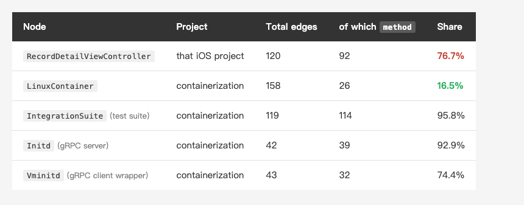
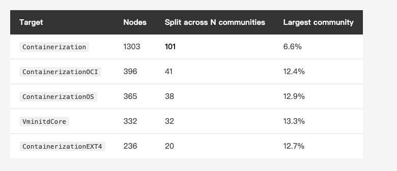
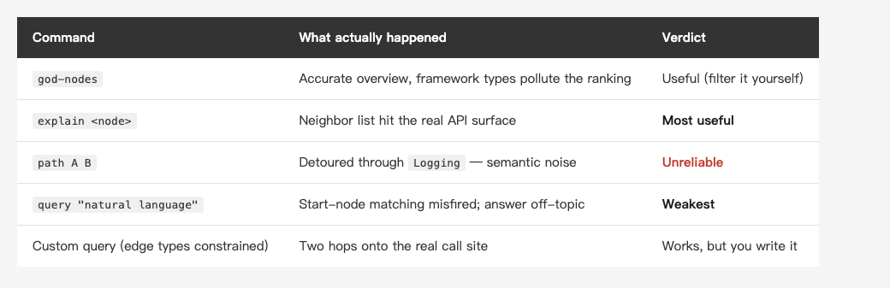

<!-- Tags: Claude Code, Knowledge Graph, Swift, Open Source, Code Reading -->

*(Insert cover image here: cover.png)*

<!--
Gemini prompt: A cute Ghibli-inspired soft pastel illustration. A tiny chibi engineer stands in front of a huge unfamiliar machine covered in hundreds of identical closed doors, holding up a small glowing map made of connected dots and lines; the map casts light on just three of the doors, which glow softly. Soft pastel colors (mint, peach, lavender), white background, clean and simple, no text anywhere. 16:9 ratio.
-->

# The Graph Only Tells You Which Files to Read — Analyzing an Unfamiliar Apple Open-Source Project

> The last two pieces pointed the graph at my own project. This time I aimed it somewhere else: a Swift project I'd never read, and one that's written well. Which answers a question I'd been curious about — what does a *healthy* codebase look like on a graph?

---

## Introduction

The last two pieces in this series had the same subject: my real commercial iOS project. The 08/07 piece used graphify to **diagnose** it; the 08/14 piece took Claude Code in to **operate**. Both starred a single god node carrying 92 methods.

But in the 08/07 piece I published a "when is this worth it" table, and one row read:

> Inheriting an unfamiliar large codebase ✓ Worth it — community clusters beat file-by-file

This piece is me going and cashing that line — **finding a project I genuinely don't know, and reading it from zero.**

I picked [apple/containerization](https://github.com/apple/containerization): Apple's open-source Swift package for running Linux containers on macOS. Three reasons: it's Swift (same ruler as the last two pieces, so the numbers compare), I'd never read a line of it (genuinely unfamiliar), and it's Apache-2.0 (I can quote it verbatim instead of renaming everything the way I had to before).

And it has one thing most projects don't: **an answer key.**

The shape of the conclusion, up front: the graph is excellent at two things and fairly bad at two others — and the two it's bad at are exactly what most people want to use it for.

---

## Part 1: A New Subject, and This Time There's an Answer Key

Thirty seconds on what this project actually does, or the graph won't mean anything.

`containerization` is a **Swift library**, not a CLI (the CLI lives in a separate repo, `apple/container`). It lets applications run Linux containers on Apple silicon Macs by giving **each container its own lightweight VM**, booted through `Virtualization.framework`. Inside that VM runs a small init system called **vminitd** as PID 1, and the host drives it over **gRPC on vsock**. The `cctl` binary in the repo is a demo playground, not the shipping product.

Size: **335 Swift files.**

One honest caveat first. The README requires **Apple silicon + macOS 26 + Xcode 26**, and I'm on macOS 15.7.7 / Xcode 16.4 — **I can't build it.** But this piece never needs to: graphify is pure static AST analysis, so a fresh clone is enough. Which is arguably the whole point — **you don't have to get an unfamiliar project running before you start reading it.** For inheriting someone else's code, that alone saves a day of environment hell.

As for the answer key: in `Package.swift`, Apple **declares the module boundaries out loud**.

```
ContainerizationError   ← zero dependencies (bottom layer)
ContainerizationOS / Extras / IO / Archive / EXT4 / OCI / Netlink / CloudHypervisor
Containerization        ← depends on a dozen of the above (top layer)
VminitdCore / Cgroup / cctl …
```

The 08/07 piece couldn't do this. My own project declares no module boundaries, so whatever communities the graph produced, all I could say was "seems reasonable." Not this time — **I can take Leiden's communities, hold them against the targets Apple declared, and score them.**

---

## Part 2: A Five-Second Graph, and a First Look at the Skeleton

One command, zero tokens:

```bash
graphify extract . --code-only
```

**4.95 seconds.** Result:

- **6,182 nodes, 15,855 edges, 315 communities**
- **4,531 of those nodes (73.3%)** map back to a `Package.swift` target, across **27 targets**

First, the most connected nodes:

```
1. ContainerizationError - 247 edges
2. Foundation            - 239 edges
3. UInt64                - 189 edges
4. IntegrationError      - 176 edges
5. GRPCCore              - 162 edges
6. FilePath              - 160 edges
7. LinuxContainer        - 158 edges
```

A problem shows up immediately: `Foundation`, `UInt64`, `GRPCCore`, `FilePath` **aren't this project's code at all** — they're framework and language types. (The worst offender is `Sendable`, raw degree 500, which only stays off the list because graphify filters it as builtin noise.) Same complaint I had in the 08/07 piece: **the connectivity ranking gets squatted on by framework types.**

Filter the framework types out and the top three are all the project's own: `ContainerizationError` (247), `IntegrationError` (176), `LinuxContainer` (158). The first two are error types — the whole project imports them and throws them, so of course they're well connected. The third one is the interesting one.

`LinuxContainer` has 158 edges, which at a glance looks like a god node. But break those edges apart: **109 are `calls` (other things calling it), only 26 are `method` (its own methods)**, and 23 are everything else.

**It only has 26 methods.** It has a lot of edges because **the whole project calls it** — which is what an API entry point is supposed to look like.

Put it next to the VC from the 08/14 piece and the difference is immediate:

*(Insert image here: table-method-en.png)*

<!--
| Node | Project | Total edges | of which `method` | Share |
|---|---|---|---|---|
| `RecordDetailViewController` | that iOS project | 120 | 92 | **76.7%** |
| `LinuxContainer` | containerization | 158 | 26 | 16.5% |
| `IntegrationSuite` (test suite) | containerization | 119 | 114 | 95.8% |
| `Initd` (gRPC server) | containerization | 42 | 39 | 92.9% |
| `Vminitd` (gRPC client wrapper) | containerization | 43 | 32 | 74.4% |
-->

**That's the most useful metric I dug out of this run: raw degree misleads you — look at the `method` edge share.**

`LinuxContainer` is 158 edges at 16.5%; the VC is 120 edges at **76.7%**. The first says "lots of people use me," the second says "I'm carrying too much myself." Same label — "highly connected" — opposite diagnoses.

But the bottom three rows are the interesting part: their `method` shares are all high, and none of them is a disease.

- `IntegrationSuite` is at 95.8%, but it's a **test suite** — one test, one method. That's the correct shape.
- `Initd` is at 92.9%, and it's vminitd's **gRPC server**; one RPC per method, so the method count is **dictated by the protocol**, not by an author losing control.

So the sharper statement is: **a healthy codebase isn't one with no fat nodes — it's one where the fat nodes are fat for a reason.** And worth noting — across Apple's entire repo, the highest method count in **production** code is `Initd`'s **39**; the only thing over a hundred is a test suite. That VC was at **92**.

---

## Part 3: How Accurate Are the Communities? This Time We Can Score It

Now to use that answer key.

The method is direct: every node carries a `source_file`, and the file path states which target it belongs to (`Sources/X/…`, `Tests/X/…`, `vminitd/Sources/X/…`). Take Leiden's communities and hold them against that real module membership.

Read forward, the score is great:

- **Weighted average community purity: 87.0%** — a community's members are, on average, 87% from a single target
- **Of 278 non-empty communities, 197 are 100% pure** (entirely from one target)
- Of attributable edges, **77.6% stay inside a target**; only 22.4% cross

I was about to conclude "the graph maps almost perfectly onto the modules." Then I ran the query in reverse — and **the conclusion flipped**:

*(Insert image here: table-split-en.png)*

<!--
| Target | Nodes | Split across N communities | Largest community's share |
|---|---|---|---|
| `Containerization` | 1303 | **101** | 6.6% |
| `ContainerizationOCI` | 396 | 41 | 12.4% |
| `ContainerizationOS` | 365 | 38 | 12.9% |
| `VminitdCore` | 332 | 32 | 13.3% |
| `ContainerizationEXT4` | 236 | 20 | 12.7% |
-->

The `Containerization` target has 1,303 nodes and gets **carved into 101 communities**, the largest of which holds just 6.6%.

Put both readings together and it's clear: **Leiden almost never mixes two modules together (87% purity), but it will slice one module into a hundred pieces.**

Which means — **a community isn't a module; a community sits *inside* a module.** What it finds is **substructure within a module**, not the module itself.

That changes how the tool should be used:

- **Don't read communities as a module map.** If you want the module map, `Package.swift` already spells it out — one glance, no algorithm required.
- **Use them to find substructure inside one module.** "This 1,300-node module — what does it actually break into internally?" is the question `Package.swift` can't answer and the graph can.

Which makes the 08/14 piece read better in hindsight: after I extracted that validator, the graph carved out a new 18-member community wrapping the whole "submit → validate → validator" chain. That was **substructure inside a module** — exactly the behavior I'm seeing here on Apple's code.

---

## Part 4: Following One Real Path Through the Graph

Skeleton done; now the actual reading. What I wanted to understand is **"when `cctl` runs a container, how does that reach vminitd inside the VM?"** — the central path in this project.

### The one that works: `explain`

```bash
graphify explain "LinuxContainer"
```

It hands back that node's neighbors: `.create()`, `.start()`, `.stop()`, `.exec()`, `.copyIn()`, `.copyOut()`, `VirtualMachineManager`, `Mount`, `State`, `Configuration`…

**Dead on.** That's essentially this class's public API surface, and I hadn't read a single line of source yet. As a way to pick an entry point, this step earns its keep more than any other.

### The two that don't: `path` and `query`

Asking for a path first:

```bash
graphify path "cctl" "LinuxContainer"
```

```
cctl.swift --imports--> Logging <--imports-- LinuxContainer.swift --contains--> LinuxContainer
```

**That's noise.** All it says is "both files import Logging" — true of almost any two files.

Then natural language:

```bash
graphify query "how does a container process get launched inside the VM"
```

It chopped my question into `['Get', 'process', 'Container', '.archiveDirectorySymlinkInside()']` as starting points, then handed back a pile of `ArchiveReader`, archive tests, and things from `examples/sandboxy` — **nothing touching vminitd at all.**

The cause isn't hard to find: this graph is **undirected** (`directed: false`) and keeps its `imports` edges. So `Logging`, `UInt64` (189 edges), `JSONEncoder` — the shared nodes everything touches — become **wormholes** that connect any two points. Shortest-path on a graph like that gets hijacked by wormholes every time.

### But the answer is in there

I didn't buy it, so I wrote my own query: **keep only `calls` / `method` / `contains` / `implements` — the edges that represent something actually happening — drop `references` and `imports`, and block high-degree nodes from serving as intermediate hops.** Immediately:

```
Run --method--> .run() --calls--> LinuxContainer
```

**Two hops.** (A "hop" on a graph is one edge traversed: `Run` to `.run()` is one, `.run()` to `LinuxContainer` is two. Fewer hops means a more direct relationship — the route `path` gave me earlier took three, and the middle one was that meaningless detour through `Logging`.)

And this route maps exactly onto `Sources/cctl/RunCommand.swift:451`, the line `let container = try LinuxContainer(`.

**So the problem isn't the data, it's the default query strategy.** The right answer is sitting in the graph; graphify just throws "connects to everything" edges and "actually calls" edges into one undirected graph and runs shortest-path over it, which buries that correct two-hop route.

### I fell into the same hole

Full disclosure: my first filter said "**exclude any node with degree above 60**," meant to knock out framework types. It returned "no path found" — because `LinuxContainer` itself has 158 edges and **I'd filtered out my own target.** I came close to publishing "that edge isn't in the graph" as a finding.

Which is telling: **a god node is simultaneously the thing you're looking for and the thing you have to filter out.** Filter loosely and wormholes hijack you; filter tightly and you delete the answer. That's also why the tool can't ship a good default — it doesn't know which of the two you're after this time.

*(Insert image here: table-cmd-en.png)*

<!--
| Command | What actually happened | Verdict |
|---|---|---|
| `god-nodes` | Accurate overview, but framework types pollute the ranking | Useful (filter it yourself) |
| `explain <node>` | Neighbor list hit the real API surface | **Most useful** |
| `path A B` | Detoured through `Logging` — semantic noise | Unreliable |
| `query "natural language"` | Start-node matching misfired; answer entirely off-topic | **Weakest** |
| Custom query (edge types constrained) | Two hops onto the real call site | Works, but you write it |
-->

A quick note back to a thread the 08/07 piece left open. That one ended by wiring this graph into **LM Studio** and querying it with a local model, fully offline — local model, local graph, local code, not a byte leaving the machine — and concluded the path genuinely works. This run adds a caveat: **whether the path works and whether the answers are any good are two different questions.** Swapping in a local model only replaces the brain doing the asking; the flaws in `path` and `query` live **in the graph layer** — a different brain won't fix a bad query. So the offline route still stands (and if what you're scanning is your employer's private code, that's the whole point) — but for accuracy you still have to constrain the edge types yourself, as above.

### The last step: hand the selected files to Claude

This is where the graph passes the baton. What it circled was four files: `cctl/RunCommand.swift`, `Containerization/LinuxContainer.swift`, `Containerization/Vminitd.swift`, `VminitdCore/Server+GRPC.swift`. That's 4,572 lines together — still a lot, but a world away from 335 files.

Only now does the AI come in. I didn't dump all four files on it and ask for a summary — that's just "feed the repo to the model" again. I asked **with the graph's leads in hand**: "Starting from `Run.run()`, follow `.create()` and `.start()` down — how does the host actually drive that agent inside the VM?" Given a concrete starting point and real symbol names, it doesn't have to guess; it jumps straight to the right passages.

The skeleton that came back:

```
cctl Run.run()
  └─ LinuxContainer(id, rootfs:, vmm: VirtualMachineManager)
       ├─ create() → vmm boots the VM → vm.withAgent { agent in … }
       │               agent.standardSetup() / mount / mkdir /
       │               setupInterface / configureDNS / configureHosts
       └─ start()  → vm.dialAgent() gets the agent, then launches the process
```

And the key abstraction is the layer **the graph can't show you and reading does**: `VirtualMachineAgent` is a protocol, and `dialAgent()` on both `VZVirtualMachineInstance` (macOS) and `CHVirtualMachineInstance` (Linux / cloud-hypervisor) **returns the same `Vminitd`**. Two completely different hypervisors, one shared guest contract.

As for what that contract is, the top of `Vminitd.swift` states it outright:

```swift
/// A remote connection into the vminitd Linux guest agent via a port (vsock).
public struct Vminitd: Sendable {
    public static let port: UInt32 = 1024
```

**Host and guest are separated by gRPC over vsock, port 1024.** That's the single most important architectural fact in the project — and I read it on line 26 of the third file the graph picked out.

The division of labor here is clean: **the graph gives you coordinates, not answers.** It can tell me "two hops from `Run.run()` lands on `LinuxContainer`," but a *concept* like "there's a protocol layer abstracting two backends into one guest contract" isn't in the graph and never could be — that takes reading. Four files, 4,572 lines, of which I actually read line by line maybe two hundred; the rest I skimmed by symbol name.

So what do you actually walk away holding? One page of notes:

- **Layering**: `ContainerizationError` sits at the bottom with zero dependencies; above it, OS / Extras / IO / Archive / EXT4 / OCI / Netlink / CloudHypervisor as independent modules; `Containerization` on top, depending on a dozen of them. Before you touch a layer, check what's stacked on it.
- **Entry point**: `LinuxContainer` is the public API (158 edges, only 26 of them its own methods); `cctl` is the demo CLI, and `Run.run()` reaches it in two hops.
- **The boundary**: the `VirtualMachineAgent` protocol, with both backends sharing one guest contract (the vsock gRPC above). To change cross-boundary behavior you change the proto, not either side.
- **The four files to open first**: `cctl/RunCommand.swift`, `LinuxContainer.swift`, `Vminitd.swift`, `VminitdCore/Server+GRPC.swift`.

A dozen lines, most of a day's work. And it exists because the graph narrowed 335 files to 4 first. **The format travels to any unfamiliar repo: how it layers, where the entry point is, where the boundary is, which files to open first.**

**One line: the graph tells you which files to read, and the AI reads them.** Treat it as a question-answering engine and it disappoints; treat it as a **file selector** and it delivers.

---

## Summary

Back to the opening question: **what does a healthy codebase look like on a graph?** Three measurable traits this time:

1. **High community purity** (87%) — module boundaries are clean; things don't wander across them.
2. **Edges stay inside modules** (77.6%) — the layering is real, not just documented.
3. **Fat nodes are fat for a reason** — the most connected node, `LinuxContainer`, is only 16.5% its own methods; the highest method count in production code is a gRPC server's 39, which the protocol dictates. Next to a VC at 92 methods and 76.7%, the lesion is obvious at a glance.

The run also mapped the tool's own edges: **building the graph takes 5 seconds and zero tokens, and it's a bargain for reading the skeleton and picking entry points — but its path queries and natural-language answering are basically unusable on an undirected graph carrying `imports` edges.** And communities aren't modules; they're an order of magnitude finer, and belong to finding substructure inside a module rather than drawing an architecture diagram.

So what did the trip actually save? Honestly: the graph took 5 seconds, the analysis took me most of a day. But **without the graph I wouldn't have known which file to open first** — 335 Swift files, and I ended up closely reading three or four. The graph didn't read the code for me; it narrowed "which ones to read" from 335 to 4. When you're inheriting an unfamiliar project, that's the expensive step.

In fairness, though: **Apple's project is an atypical sample for this tool** — its documentation sits at very nearly the opposite extreme from the project in the 08/07 piece. The README lays out the architecture, `Package.swift` hands you the module map outright, and even the CLAUDE.md in the root spells out how host and guest divide the work. I got that vsock-gRPC fact by reading code, but honestly — **ten minutes with the README would have told me, no graph required.** **Graphify's marginal value is inversely proportional to how well documented the project is** — which means it's worth most on exactly the kind of undocumented legacy project from the 08/07 piece.

Push one level further, though, and the two don't compete: docs give you the **narrative** (what the author wants you to think it looks like); the graph gives you the **measurement** (what it actually looks like). No document is going to tell you "this class has 26 methods and 109 callers," or that "this thing declared as one module actually scatters into 101 pieces internally." **And where the two disagree is usually exactly what you should go read.**

Back to the line this series keeps returning to: **the clearer the structure, the more the AI can take off your hands.** Except the order reversed this time — I didn't understand the structure and then bring in the AI; **I let the graph dredge the structure up first, so that the AI and I knew where to look at all.**

---

> **On names**: every class name, file path, and line number from `apple/containerization` in this piece is **real** (Apache-2.0, public). The iOS project used for comparison keeps the series' usual stand-in names (`RecordDetailViewController` and friends); **all the numbers are real**, only the names were swapped.

---

## References

- Earlier in this series: [Let Claude See Your Project First — Turning a Codebase into a Knowledge Graph with Graphify](https://medium.com/@n913239/let-claude-see-your-project-first-turning-a-codebase-into-a-knowledge-graph-with-graphify-9142daf79d8f) — where the god node used for comparison here came from
- Earlier in this series: [Diagnosis Was the Easy Part — Cutting a God Node with Claude Code, Measured on the Same Graph](https://medium.com/@n913239/diagnosis-was-the-easy-part-cutting-a-god-node-with-claude-code-measured-on-the-same-graph-8dcc06ddbb0a) — the refactor log for that 92-method VC
- [apple/containerization](https://github.com/apple/containerization) — the subject of this piece (Apache-2.0), scanned at commit `74ace148`
- [tree-sitter](https://tree-sitter.github.io/tree-sitter/) — the parser behind graphify's zero-token code scanning
- [From Louvain to Leiden: guaranteeing well-connected communities](https://www.nature.com/articles/s41598-019-41695-3) — the original paper for the clustering algorithm used in this analysis
