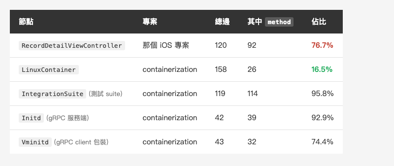
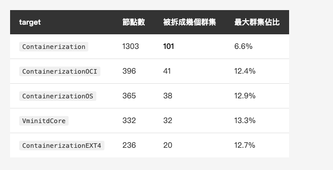
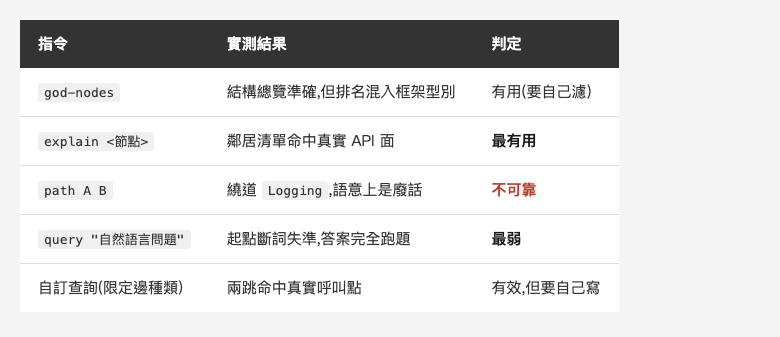

<!-- Tags: Claude Code, Knowledge Graph, Swift, Open Source, Code Reading -->

*(在這裡插入封面圖:cover.png)*

<!--
Gemini prompt: A cute Ghibli-inspired soft pastel illustration. A tiny chibi engineer stands in front of a huge unfamiliar machine covered in hundreds of identical closed doors, holding up a small glowing map made of connected dots and lines; the map casts light on just three of the doors, which glow softly. Soft pastel colors (mint, peach, lavender), white background, clean and simple, no text anywhere. 16:9 ratio.
-->

# 圖只負責告訴你該讀哪幾個檔——用知識圖解析一個完全陌生的 Apple 開源專案

> 前兩篇我都是用圖檢視自己的專案。這次換個對象:一個我沒讀過、而且寫得很好的 Swift 專案。順便回答一個問題——健康的 codebase,在圖上長什麼樣?

---

## 前言

系列前兩篇,對象都是同一個東西:我那個真實的商業 iOS 專案。0807 用 graphify 幫它做**診斷**,0814 帶 Claude Code 去**開刀**。兩篇的主角都是一顆扛了 92 個方法的 god node。

但 0807 那篇裡我列過一張「什麼時候值得用」的表,其中一行是:

> 接手一個陌生的大 codebase ✓ 值得,先看群集分群比一個一個翻快

這一篇就是去把那句話兌現——**找一個我真的不熟的專案,從零開始讀。**

我挑的是 [apple/containerization](https://github.com/apple/containerization):Apple 開源的 Swift package,讓 macOS 上跑 Linux 容器。挑它的理由有三個:同樣是 Swift(尺一樣,可以跟前兩篇對照)、我完全沒讀過(真的陌生)、Apache-2.0 公開授權(可以照登,不用像前兩篇那樣處處換名字)。

而且它有一樣別的專案不見得有的東西:**標準答案。**

先講結論的形狀:圖在兩件事上非常好用,在另外兩件事上相當爛——而爛的那兩件,正好是大家最想拿它做的。

---

## Part 1:換一個對象,而且這次有標準答案

先花三十秒說明這個專案到底在做什麼,不然後面的圖看不懂。

`containerization` 是一個 **Swift 函式庫**,不是 CLI(CLI 在另一個 repo `apple/container`)。它讓應用程式在 Apple silicon 的 Mac 上跑 Linux 容器,做法是**每個容器配一台自己的輕量 VM**,經由 `Virtualization.framework` 開機;VM 裡跑一個叫 **vminitd** 的小 init 系統當 PID 1,主機端再透過 **vsock 上的 gRPC** 指揮它啟動行程。repo 裡的 `cctl` 是示範用的可執行檔,不是出貨產品。

規模:**335 個 Swift 檔。**

這裡先講一個誠實的前提。它的 README 要求 **Apple silicon + macOS 26 + Xcode 26**,而我手上是 macOS 15.7.7 / Xcode 16.4——**我編不動它。** 但這篇完全不需要編:graphify 是純 AST 的靜態分析,clone 下來就能掃。這其實正是它的賣點之一——**你不必先讓一個陌生專案跑起來,才開始讀它。** 光是這點,對「接手別人的東西」就已經省掉一整天的環境地獄。

至於那個「標準答案」:`Package.swift` 裡,Apple **親口宣告了模組邊界**。

```
ContainerizationError   ← 零相依(最底層)
ContainerizationOS / Extras / IO / Archive / EXT4 / OCI / Netlink / CloudHypervisor
Containerization        ← 依賴上面十幾個(最頂層)
VminitdCore / Cgroup / cctl …
```

這件事 0807 做不到。自家專案沒有明確的模組宣告,圖分出什麼群集,我都只能說「看起來合理」。這次不一樣——**我可以把 Leiden 分出來的群集,拿去對 Apple 自己宣告的 target,算分。**

---

## Part 2:五秒建圖,先看骨架

指令就一行,零 token:

```bash
graphify extract . --code-only
```

**4.95 秒**跑完,結果:

- **6182 個節點、15855 條邊、315 個群集**
- 其中 **4531 個節點(73.3%)**可以對回 `Package.swift` 的 target,共 **27 個 target**

先看最連通的節點是誰:

```
1. ContainerizationError - 247 邊
2. Foundation            - 239 邊
3. UInt64                - 189 邊
4. IntegrationError      - 176 邊
5. GRPCCore              - 162 邊
6. FilePath              - 160 邊
7. LinuxContainer        - 158 邊
```

第一個問題馬上冒出來:`Foundation`、`UInt64`、`GRPCCore`、`FilePath` **都不是這個專案的東西**,是框架和語言型別。(更誇張的是 `Sendable`,原始度數 500,被 graphify 內建的雜訊清單濾掉了才沒出現在榜上。)這跟我在 0807 抱怨過的是同一個毛病:**連接度排名很容易被框架型別霸佔。**

濾掉框架型別,榜上前三名都是專案自己的東西:`ContainerizationError`(247)、`IntegrationError`(176)、`LinuxContainer`(158)。前兩個是錯誤型別——全專案都在 import、都在 throw,連得多理所當然。真正值得看的是第三個。

`LinuxContainer` 158 條邊,乍看很像一顆 god node。但把邊拆開:**109 條是 `calls`(別人呼叫它),只有 26 條是 `method`(它自己的方法)**,剩下 23 條是其他。

**它的方法只有 26 個。** 它邊多,是因為**整個專案都在呼叫它**——那是一個 API 入口該有的樣子。

對照一下 0814 那顆 VC,差別立刻出來:

*(在這裡插入圖片:table-method.png)*

<!--
| 節點 | 專案 | 總邊 | 其中 `method` | 佔比 |
|---|---|---|---|---|
| `RecordDetailViewController` | 那個 iOS 專案 | 120 | 92 | **76.7%** |
| `LinuxContainer` | containerization | 158 | 26 | 16.5% |
| `IntegrationSuite`(測試 suite) | containerization | 119 | 114 | 95.8% |
| `Initd`(gRPC 服務端) | containerization | 42 | 39 | 92.9% |
| `Vminitd`(gRPC client 包裝) | containerization | 43 | 32 | 74.4% |
-->

**這就是我這次挖到最實用的一項度量指標:看 degree 會誤判,要看 `method` 邊佔比。**

`LinuxContainer` 是 158 邊、16.5%;那顆 VC 是 120 邊、**76.7%**。前者是「很多人用我」,後者是「我自己扛太多」。同樣叫「連接度高」,病因完全相反。

但表格下面三行更有意思——它們的 `method` 佔比都很高,卻都不是病:

- `IntegrationSuite` 佔 95.8%,可是它是**測試 suite**,一個測試一個方法,本來就該長這樣。
- `Initd` 佔 92.9%,是 vminitd 的 **gRPC 服務端**;一個 RPC 對一個方法,方法數是**協定決定的**,不是作者失控。

所以更準確的說法是:**健康的 codebase 不是「沒有肥節點」,是「肥得有理」。** 而且值得注意的是——Apple 整個 repo 裡,自帶方法數最多的**正式程式碼**是 `Initd` 的 **39 個**;唯一破百的那個是測試。那顆 VC 是 **92**。

---

## Part 3:群集到底準不準——這次可以算分

現在來用那個標準答案。

做法很直白:每個節點都有 `source_file`,而檔案路徑就寫著它屬於哪個 target(`Sources/X/…`、`Tests/X/…`、`vminitd/Sources/X/…`)。把 Leiden 分出來的群集,跟這個「真實模組歸屬」對一對就行。

正向看,成績漂亮:

- **群集的加權平均純度 87.0%** ——一個群集的成員,平均有 87% 來自同一個 target
- **278 個有效群集裡,197 個是 100% 純的**(整群只來自單一 target)
- 可歸屬的邊裡,**77.6% 留在 target 內部**,跨 target 只有 22.4%

看到這裡我本來要下結論說「圖幾乎完美對上模組」。然後我反過來查了一次——**結論就翻了**:

*(在這裡插入圖片:table-split.png)*

<!--
| target | 節點數 | 被拆成幾個群集 | 最大群集佔比 |
|---|---|---|---|
| `Containerization` | 1303 | **101** | 6.6% |
| `ContainerizationOCI` | 396 | 41 | 12.4% |
| `ContainerizationOS` | 365 | 38 | 12.9% |
| `VminitdCore` | 332 | 32 | 13.3% |
| `ContainerizationEXT4` | 236 | 20 | 12.7% |
-->

`Containerization` 這個 target 有 1303 個節點,**被切成 101 個群集**,而且最大的那個只佔 6.6%。

兩邊放在一起,答案就清楚了:**Leiden 幾乎不會把兩個模組的東西混在一起(純度 87%),但它會把一個模組切成上百塊。**

也就是說——**群集 ≠ 模組,群集 ⊂ 模組。** 它分出來的是「**模組內部的功能小塊**」,不是模組本身。

這個發現直接改變了工具的用法:

- **別拿群集當模組圖看。** 你要模組圖,`Package.swift` 就寫在那裡了,一秒看完,不需要跑演算法。
- **要拿它在一個模組內部找次結構。** 「這 1300 個節點的大模組,內部其實自己分成哪幾塊?」——這才是 `Package.swift` 答不出來、只有圖答得出來的問題。

回頭看 0814 反而更有味道:那次抽出 validator 之後,圖多切出一個 18 人的群集,把「送出 → 驗證 → validator」整條鏈圈了起來。那正是一個**模組內的次結構**——跟這次在 Apple 專案上看到的行為,完全一致。

---

## Part 4:順著圖,讀一條真實的路徑

骨架看完了,接下來是真正的閱讀:我想搞懂**「`cctl` 跑一個容器,到底怎麼走到 VM 裡的 vminitd」**。這是這個專案最核心的一條路徑。

### 好用的那個:`explain`

```bash
graphify explain "LinuxContainer"
```

它吐回這個節點的鄰居清單:`.create()`、`.start()`、`.stop()`、`.exec()`、`.copyIn()`、`.copyOut()`、`VirtualMachineManager`、`Mount`、`State`、`Configuration`……

**完全命中。** 這幾乎就是這個類別對外的 API 面,而我一行原始碼都還沒讀。當作「挑入口」用,這一步價值最高。

### 不好用的那兩個:`path` 和 `query`

先問路徑:

```bash
graphify path "cctl" "LinuxContainer"
```

```
cctl.swift --imports--> Logging <--imports-- LinuxContainer.swift --contains--> LinuxContainer
```

**這是廢話。** 它說的是「這兩個檔案都 import 了 Logging」——任何兩個檔案都成立。

再問自然語言:

```bash
graphify query "how does a container process get launched inside the VM"
```

它把問題斷成 `['Get', 'process', 'Container', '.archiveDirectorySymlinkInside()']` 當起點,然後回給我一堆 `ArchiveReader`、archive 的測試、`examples/sandboxy` 裡的東西——**完全沒碰到 vminitd。**

原因不難找:這張圖是**無向的**(`directed: false`),而且保留了 `imports` 邊。於是 `Logging`、`UInt64`(189 邊)、`JSONEncoder` 這些到處都連的共用節點就變成**蟲洞**,可以把任意兩點接起來。在這種圖上求最短路徑,結果必然被蟲洞劫持。

### 但答案其實就在圖裡

我不信邪,自己寫了一個查詢:**只保留 `calls` / `method` / `contains` / `implements` 這幾種「真的在做事」的邊(丟掉 `references` 和 `imports`),再把高度數節點擋在「中繼」的位置上。** 立刻得到:

```
Run --method--> .run() --calls--> LinuxContainer
```

**兩跳。**(圖上的「跳」就是走過一條邊:`Run` 到 `.run()` 一跳,`.run()` 到 `LinuxContainer` 第二跳。跳數愈少,代表兩個東西的關係愈直接——剛才 `path` 給的那條要走三跳,中間那跳還是繞過 `Logging` 的廢話。)

而且這條路完全對應原始碼 `Sources/cctl/RunCommand.swift:451` 的那行 `let container = try LinuxContainer(`。

**所以問題不在資料,在預設的查詢策略。** 圖裡有正確答案,只是 graphify 預設把「什麼都連得起來」的邊和「真的在呼叫」的邊丟進同一張無向圖裡找最短路徑,那條正確的兩跳路徑就被淹掉了。

### 我自己也踩了同一個坑

順帶自首一下:我第一版過濾器寫的是「**度數大於 60 的節點一律排除**」,想把框架型別擋掉。結果跑出來是「找不到路徑」——因為 `LinuxContainer` 自己就有 158 條邊,**被我當成雜訊擋掉了。** 我差點就把「圖裡沒有這條邊」寫成結論。

這件事其實很說明問題:**god node 既是你想找的東西,也是你必須擋掉的東西。** 濾太鬆,被蟲洞劫持;濾太緊,把答案濾掉。這也解釋了為什麼工具很難給一個好的預設值——它不知道你這次要找的是哪一種。

*(在這裡插入圖片:table-cmd.png)*

<!--
| 指令 | 實測結果 | 判定 |
|---|---|---|
| `god-nodes` | 結構總覽準確,但排名混入框架型別 | 有用(要自己濾) |
| `explain <節點>` | 鄰居清單命中真實 API 面 | **最有用** |
| `path A B` | 繞道 `Logging`,語意上是廢話 | 不可靠 |
| `query "自然語言問題"` | 起點斷詞失準,答案完全跑題 | **最弱** |
| 自訂查詢(限定邊種類) | 兩跳命中真實呼叫點 | 有效,但要自己寫 |
-->

順帶回應 0807 留下的一條線。那篇最後把這張圖掛進 **LM Studio**,用本地模型走完全離線的查詢,結論是「這條路真的成立」——本地模型 + 本地圖 + 本地 code,一個 byte 不出機器。這次的實測要幫它補一個但書:**路走不走得通,跟查詢準不準,是兩件事。** 本地模型換掉的只是「發問的那顆腦」,而 `path` 和 `query` 的毛病出在**圖這一層**——換一顆腦,不會讓爛查詢變好。所以那條離線路線依然成立(而且如果你要掃的是公司的私有專案,那才是真正的重點);但要準,還是得像上面那樣自己限定邊的種類。

### 最後一步:把選出來的檔交給 Claude

圖到這裡就交棒了。它圈出來的是四個檔:`cctl/RunCommand.swift`、`Containerization/LinuxContainer.swift`、`Containerization/Vminitd.swift`、`VminitdCore/Server+GRPC.swift`。加起來 4572 行——還是不少,但比 335 個檔好太多。

這時才輪到 AI。我沒有把四個檔整包丟過去叫它「總結一下」——那又回到「把 repo 餵給模型」的老路。我是**帶著圖給的線索問**:「從 `Run.run()` 開始,順著 `.create()`、`.start()` 追下去,主機端到底怎麼指揮 VM 裡那個 agent?」有了具體起點和符號名,它不必亂猜,直接跳到對的段落。

拿回來的骨架:

```
cctl Run.run()
  └─ LinuxContainer(id, rootfs:, vmm: VirtualMachineManager)
       ├─ create() → vmm 開 VM → vm.withAgent { agent in … }
       │               agent.standardSetup() / mount / mkdir /
       │               setupInterface / configureDNS / configureHosts
       └─ start()  → vm.dialAgent() 拿到 agent,再啟動行程
```

而真正的關鍵抽象,是**圖上看不出來、讀了才知道**的那一層:`VirtualMachineAgent` 是一個 protocol,而 `VZVirtualMachineInstance`(macOS)和 `CHVirtualMachineInstance`(Linux / cloud-hypervisor)各自的 `dialAgent()`,**回傳的是同一個 `Vminitd`**。兩套完全不同的 hypervisor,共用同一份 guest 協定。

至於那份協定是什麼,`Vminitd.swift` 開頭直接把答案寫在臉上:

```swift
/// A remote connection into the vminitd Linux guest agent via a port (vsock).
public struct Vminitd: Sendable {
    public static let port: UInt32 = 1024
```

**主機和客體之間隔著 vsock 上的 gRPC,port 1024。** 這是整個專案最重要的一條架構事實——而我是在圖圈出來的第三個檔、第 26 行讀到的。

這一步的分工很乾淨:**圖給的是座標,不是答案。** 它能告訴我「從 `Run.run()` 走兩跳到 `LinuxContainer`」,但「有一層 protocol 把兩個 backend 抽象成同一個 guest 協定」這種**概念**,圖裡沒有,也不可能有——那要靠讀。四個檔 4572 行,我真正逐行讀的大概兩百多行,其餘都是靠符號名跳著看。

那這一趟讀完,手上握著的是什麼?一頁筆記:

- **分層**:`ContainerizationError` 零相依在最底,中間是 OS / Extras / IO / Archive / EXT4 / OCI / Netlink / CloudHypervisor 幾個各自獨立的模組,最頂是 `Containerization`,依賴其中十幾個。要動哪一層,先看上面壓了誰。
- **入口**:`LinuxContainer` 是對外 API(158 條邊,自己的方法只有 26 個);`cctl` 是示範用的 CLI,`Run.run()` 兩跳就到它。
- **邊界**:`VirtualMachineAgent` 那層 protocol,兩個 backend 共用同一份 guest 協定(就是上面那條 vsock gRPC)。要改跨界行為,動的是 proto,不是任何一邊。
- **真要動手,先讀這四個檔**:`cctl/RunCommand.swift`、`LinuxContainer.swift`、`Vminitd.swift`、`VminitdCore/Server+GRPC.swift`。

十幾行,大半天的產出。而它寫得出來,是因為圖先把 335 個檔縮到 4 個。**這個格式對任何陌生 repo 都適用:怎麼分層 / 入口在哪 / 邊界在哪 / 先讀哪幾個檔。**

**結論一句話:圖負責告訴你「該讀哪幾個檔」,AI 負責「讀懂那幾個檔」。** 把圖當問答引擎用會失望,當**選檔器**用才對。

---

## 總結

回到開頭那個問題:**健康的 codebase 在圖上長什麼樣?** 這次量到三個特徵:

1. **群集純度高**(87%)——模組之間界線乾淨,東西不會亂串門。
2. **邊留在模組內**(77.6%)——分層是真的,不是文件上寫寫。
3. **肥節點肥得有理**——最連通的那個 `LinuxContainer` 只有 16.5% 是自己的方法;方法數最高的正式程式碼是 gRPC 服務端的 39 個,那是協定決定的。對照那顆 92 個方法、76.7% 佔比的 VC,病灶一眼就分得出來。

而工具本身,這一趟也照出了它的邊界:**建圖 5 秒、零 token,拿來看骨架和挑入口非常划算;但它的路徑查詢和自然語言問答,在一張帶著 `imports` 邊的無向圖上基本不能用。** 群集也不是模組——它比模組細一個量級,該拿去找模組內的次結構,而不是拿來畫架構圖。

那這一趟到底省了什麼?老實說,建圖 5 秒,真正的分析花了我大半天。但**如果沒有圖,我連該從哪個檔開始都不知道**——335 個 Swift 檔,而我最後真正細讀的只有三、四個。圖沒有替我讀程式碼,它替我把「該讀哪幾個」從 335 縮到 4。對接手陌生專案來說,這一步才是最貴的。

但也得說一句公道話:**Apple 這個專案,對這套工具來說其實是個非典型範例**——它文件齊全的程度,幾乎站在 0807 那個專案的另一個極端。README 寫了架構、`Package.swift` 直接給了模組圖,連根目錄那份 CLAUDE.md 都把 host / guest 怎麼分工講得清清楚楚。前面那條 vsock gRPC 我是讀 code 讀出來的,但老實說——**先讀 README 的話,十分鐘就知道了,根本不用建圖。** **graphify 的邊際價值,跟專案文件的完整度成反比**——它最值錢的場合,反而是 0807 那種沒人寫文件的老專案。

不過再往下想一層,兩者其實不衝突:文件給你的是**敘事**(作者想讓你以為它長什麼樣),圖給你的是**度量**(它實際長什麼樣)。文件不會告訴你「這個類別有 26 個方法、109 個呼叫者」,也不會告訴你「這個被宣告成一個模組的東西,內部其實散成 101 塊」。**而兩者對不起來的地方,往往就是最該讀的地方。**

回到系列一直在講的那句:**結構愈清楚,AI 能替你接手的就愈多。** 只是這次的順序反過來了——不是我先懂結構再叫 AI 幫忙,而是**先讓圖把結構撈出來,我和 AI 才知道要往哪裡看。**

---

> **關於名稱**:文中 `apple/containerization` 的所有類別名、檔案路徑、行號都是**真實的**(Apache-2.0 公開專案)。而拿來對照的那個 iOS 專案沿用系列一貫的代稱(`RecordDetailViewController` 等),**數字全是真的**,只有名字換過。

---

## 參考資料

- 系列前篇:[讓 Claude 先看懂你的專案 — 用 Graphify 把 codebase 掃成一張知識圖](https://medium.com/@n913239/%E8%AE%93-claude-%E5%85%88%E7%9C%8B%E6%87%82%E4%BD%A0%E7%9A%84%E5%B0%88%E6%A1%88-%E7%94%A8-graphify-%E6%8A%8A-codebase-%E6%8E%83%E6%88%90%E4%B8%80%E5%BC%B5%E7%9F%A5%E8%AD%98%E5%9C%96-f1920429ee45) — 本篇對照用的那顆 god node 從哪來
- 系列前篇:[圖說遷移只做一半,那我就把它拆——帶 Claude Code 動一次真重構(附前後對照)](https://medium.com/@n913239/%E5%9C%96%E8%AA%AA%E9%81%B7%E7%A7%BB%E5%8F%AA%E5%81%9A%E4%B8%80%E5%8D%8A-%E9%82%A3%E6%88%91%E5%B0%B1%E6%8A%8A%E5%AE%83%E6%8B%86-%E5%B8%B6-claude-code-%E5%8B%95%E4%B8%80%E6%AC%A1%E7%9C%9F%E9%87%8D%E6%A7%8B-%E9%99%84%E5%89%8D%E5%BE%8C%E5%B0%8D%E7%85%A7-ba2f859c92cf) — 92 個方法那顆 VC 的重構實錄
- [apple/containerization](https://github.com/apple/containerization) — 本篇的標的(Apache-2.0),掃描版本 commit `74ace148`
- [tree-sitter](https://tree-sitter.github.io/tree-sitter/) — graphify 掃程式碼、零 token 的底層
- [From Louvain to Leiden: guaranteeing well-connected communities](https://www.nature.com/articles/s41598-019-41695-3) — 本篇群集分析用的分群演算法原始論文
