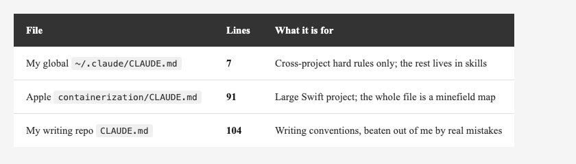
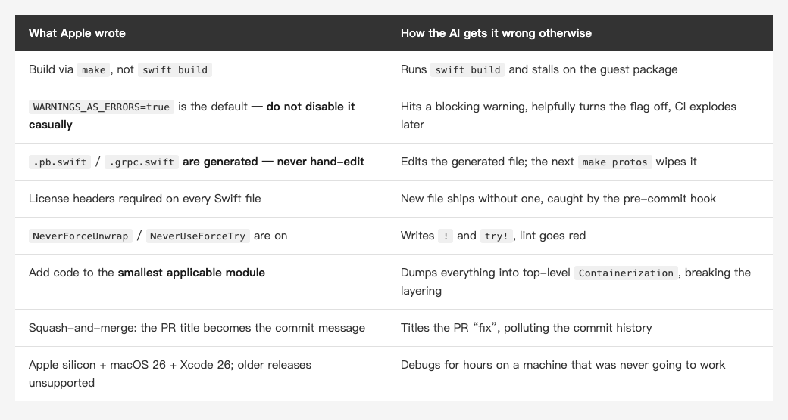
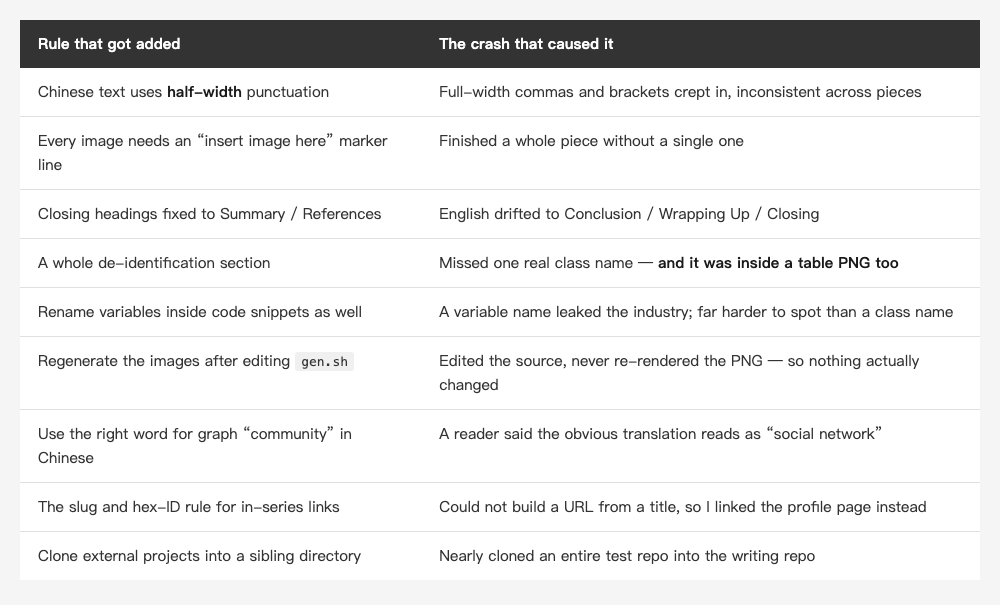

<!-- Tags: Claude Code, AI Coding, Documentation, Developer Tools, Open Source -->

*(Insert cover image here: cover.png)*

<!--
Gemini prompt: A cute Ghibli-inspired soft pastel illustration. A chibi engineer pins a single short handwritten note onto a workshop wall, next to a huge crossed-out scroll of flowery text lying crumpled on the floor. The small note glows softly; a friendly robot reads it and nods. Soft pastel colors (mint, peach, lavender), white background, clean and simple, no text anywhere. 16:9 ratio.
-->

# Apple Ships a CLAUDE.md — 91 Lines, Not One Wasted. What About Yours?

> While reading Apple's container project for the last piece, I found a CLAUDE.md sitting in the repo root. Reading it sent me back to my own — which had gone from 53 lines to 104 in six weeks, every added line traceable to something I got wrong.

---

## Introduction

Most people's `CLAUDE.md` looks about the same: a paragraph of project blurb, a few lines of "write clean code" and "follow best practices," and that's it. It feels sensible while you're writing it and changes nothing in practice — because Claude was already going to say those things. Writing them down buys you nothing.

In the last piece, while pointing a knowledge graph at [apple/containerization](https://github.com/apple/containerization), I found a `CLAUDE.md` in the repo root — **Apple's own project instructions for Claude Code**, Apache-2.0, free to quote in full.

My first reaction on finishing it: **this is a different species from what most people write.**

So this piece does three things: takes Apple's file apart and measures it, checks it against what the official docs actually say, and then turns the same lens on mine — the one that went from a "looks adequate" 53 lines to 104 in six weeks, where every added rule traces back to something I genuinely got wrong.

This series already covered `CLAUDE.md` once, nearly four months ago, in [The Complete Guide to CLAUDE.md](https://medium.com/@n913239/the-complete-guide-to-claude-md-make-claude-code-truly-understand-your-project-d9d026b808f1) — the three-layer structure, what belongs in the file, how to phrase a rule. This piece doesn't rehash any of it. It measures a real, official file instead, and against that yardstick **one of the tests I handed out back then turns out to need revising**.

---

## Part 1: Start with the Numbers

Forget the content for a moment; look at the shape.

The file is **91 lines**, **63 of them non-empty**, in four top-level sections: `Build / Test / Format`, `Architecture` (with four subsections), `Conventions`, and `Requirements`.

Then it gets interesting:

- It names **more than twenty `make` commands** (`make all`, `make check`, `make protos`, `make linux-integration`…)
- **230 inline code spans**, spread across 53 lines — meaning **more than 3 out of every 4 non-empty lines carry a concrete command, filename, or setting**
- I grepped it for filler: `clean code`, `best practice`, `please`, `be helpful`, `high quality`, `readable code` — **zero hits**

**Zero. Not one.**

Put three `CLAUDE.md` files side by side and the range becomes clear:

*(Insert image here: table-count-en.png)*

<!--
| File | Lines | What it's for |
|---|---|---|
| My global `~/.claude/CLAUDE.md` | **7** | Only cross-project hard rules; everything else lives in skills |
| Apple's `containerization/CLAUDE.md` | **91** | Large Swift project; the whole file is a minefield map |
| My writing repo's `CLAUDE.md` | **104** | Personal writing conventions, beaten out of me by real mistakes |
-->

Worth noting: the Claude Code docs recommend keeping a single `CLAUDE.md` **under 200 lines** — it loads in full at the start of every session, so a longer file eats context and, per the docs, **reduces adherence**. Apple used less than half of that.

---

## Part 2: Every Line Is a "You'll Get This Wrong Otherwise"

Numbers aside, what's worth copying is *what it chose to say*. My test: **translate each line into "if this weren't written down, how would the AI get it wrong?"** If you can't do that translation, the line doesn't earn its place.

The first sentence of the first section is the perfect demonstration:

> The project is built via `make`, not directly with `swift build`.

One sentence, and the AI's most likely first mistake is gone. This repo holds **two** Swift packages (one at root, one under `vminitd/`), and the second has to be cross-compiled as a static musl binary inside a Linux container. Don't say so, and it will absolutely run `swift build` and stall.

A few more:

*(Insert image here: table-rules-en.png)*

<!--
| What Apple wrote | How the AI gets it wrong otherwise |
|---|---|
| Build via `make`, not `swift build` | Runs `swift build` and stalls on the guest package |
| `WARNINGS_AS_ERRORS=true` is the default — **don't disable it casually** | Hits a blocking warning, helpfully turns the flag off, CI explodes later |
| `.pb.swift` / `.grpc.swift` **are generated — never hand-edit** | Edits the generated file; next `make protos` wipes it |
| License headers required on every Swift file | New file ships without one, caught by the pre-commit hook |
| `NeverForceUnwrap` / `NeverUseForceTry` are on | Writes `!` and `try!`, lint goes red |
| Add code to the **smallest applicable module** | Dumps everything into top-level `Containerization`, breaking the layering |
| Squash-and-merge: the PR title becomes the commit message | Titles the PR "fix", polluting the commit history |
| Apple silicon + macOS 26 + Xcode 26; older releases unsupported | Debugs for hours on a machine that was never going to work |
-->

See the common thread? **Every line is something unguessable whose wrong guess costs you.**

`.pb.swift` is generated — say nothing and it's just an ordinary Swift file, obviously fine to edit. `WARNINGS_AS_ERRORS` is on by default — say nothing and disabling it to get past a blocking warning is an entirely reasonable call. None of this is the AI being dim; it's the AI **not having the project context that lives in your head**.

Run the same test on "write clean code" and the answer to "how would it get this wrong otherwise?" is: **it wouldn't.** It was already trying. So that sentence hasn't earned a line.

### Applying the test to your own file

Most `CLAUDE.md` files open like this:

```markdown
## Project overview
This is an iOS app written in Swift, using an MVVM architecture.

## Development guidelines
- Write clean, readable code
- Follow Swift best practices
- Be mindful of performance and security
```

Four rules, and not one of them survives the test. Worse: **"this is an iOS app written in Swift" is something Claude learns by opening the folder** — you spent context telling it what it can already see.

Same project, a version that does survive:

```markdown
## Build
- Use `xcodebuild -workspace App.xcworkspace`, not `-project`
  (SPM dependencies won't resolve)
- There are **two** `Package.resolved` files (one under `.xcodeproj`, one under
  `.xcworkspace`); when a private repo URL changes, both need updating or
  it keeps fetching the old one

## Conventions
- Everything under `Generated/` comes from SwiftGen — **never hand-edit**;
  after changing `.strings`, run `make gen`
- UI tests take ~12 minutes; locally run unit tests only:
  `-only-testing:AppTests`
```

Roughly the same length, but **every line in the second one is a "you'll get this wrong unless I tell you"** — and those two `Package.resolved` files are something I only know because it bit me.

---

## Part 3: What the Docs Say, and Two Interesting Disagreements

The Claude Code docs are unusually direct about this, and they line up with Apple's file.

**When should you add a rule?** The docs' test: **when Claude makes the same mistake a second time.** Also: when a code review catches something it should have known about this codebase, when you type the same correction you typed last session, or when a new teammate would need the same context to be productive.

**Be concrete, not abstract.** The docs give the comparison outright: write "use 2-space indentation" rather than "format code properly"; write "run `npm test` before committing" rather than "test your changes." Exactly the conclusion from Part 2.

**And one line that matters most, which plenty of people don't know:**

> Claude treats them as context, not enforced configuration. To block an action regardless of what Claude decides, use a PreToolUse hook instead.

**`CLAUDE.md` is context, not enforcement.** It gets read, it shapes behavior, and it is **not guaranteed** to be followed. If you need an action blocked no matter what the model decides, that's a **hook's** job, not a memory file's.

That single fact changes what belongs in the file: **if something must be blocked, don't rely on `CLAUDE.md` — write a hook or a setting.**

Apple's file looks like a counterexample here — `WARNINGS_AS_ERRORS` and license headers both already have CI and a pre-commit hook watching them, so why write them down at all? The difference is timing: **a tool blocks you afterwards; `CLAUDE.md` keeps you off that road in the first place.** Say nothing, and the AI hits a blocking warning, quietly disables the flag, keeps going, and finds out the whole run was wasted when CI goes red. The two aren't alternatives — **one saves the round trip, the other is the backstop.**

### Disagreement one: `/doctor` would cut the section Apple wrote most of

This one starts with me. In "The Complete Guide to CLAUDE.md" mentioned earlier, I handed out a test of my own:

> One way to decide: if a passage runs more than 10 lines, ask whether Claude could work it out from the codebase on its own. If it could, leave it out.

The docs take the same position. `/doctor` proposes trims for a checked-in `CLAUDE.md`, and its criterion is this: **cut what Claude can derive from the codebase itself** — directory layouts, dependency lists, **architecture overviews** — and **keep** pitfalls, rationale, and conventions that differ from tool defaults.

Which is interesting, because Apple's longest section is precisely **Architecture** (four subsections deep). By either criterion, the docs' or my own, it's a trim candidate.

I'm now revising that test — and the last piece is my evidence.

Pointing a knowledge graph at this repo took me **most of a day** to surface the one fact that matters most: host and guest are separated by gRPC over vsock. Apple's `CLAUDE.md` covers that in roughly 15 lines, and throws in the `VirtualMachineAgent` abstraction, how the two VMM backends split, and which files are `#if os(macOS)`.

So that criterion — the official one and the one I wrote myself — needs a caveat: **"derivable" is not the same as "affordably derivable."**

On a 6,182-node, 15,855-edge project the architecture is certainly derivable — at a cost of most of a day. Written down in 15 lines, it's paid once and saved every session. **The test isn't whether it can be derived; it's how long one derivation takes multiplied by how many times you'll need it.**

### Disagreement two: the creator tells you to delete the whole thing

There's one more position — not in the docs, and considerably more aggressive — from the person who built Claude Code: Boris Cherny.

In January 2026 he posted a single line on Threads:

> Try deleting your CLAUDE.md every 3 months. Then add back an instruction at a time when you see the model struggling with it

Just over six months later, on stage at YC Startup School 2026 — the day after Opus 5 shipped — he stretched the interval and widened the scope: `CLAUDE.md`, skills, hooks, **delete all of it every six months**, then see what the model does without them. Same conversation, he dropped a number too: when Opus 5 landed they cut **more than 80% of Claude Code's own system prompt**, because "the model is actually a little bit more intelligent without these prompts" — and added that you could try deleting the rest as well.

**But the weight sits in the second half of that first post:** `add back an instruction at a time when you see the model struggling with it`. He isn't telling you not to write the file; he's demoting it from "rules I feel are proper" to **patches with evidence behind them** — every line has to be backed by an identifiable failure or it doesn't get to exist. Deleting is just the mechanism that forces you to re-prove your case. It's the same standard as Part 2's "can you translate it into what happens if I don't write this" — he just tests it dynamically.

**And the shift from three months to six is itself part of the argument.** The interval isn't a best practice; it's **a function of model capability** — the stronger the model, the less scaffolding it needs and the faster that scaffolding rots. Which is why he offers no list of what to write, only how often to clear it out: a list is guaranteed to expire, a process isn't.

There is a silent premise, though: **your rules have to be the kind a model could plausibly learn on its own.** "Don't force-unwrap" may simply be built into the next generation; "there are two `Package.resolved` files, and a private repo URL change has to be made in both" never will be, because it isn't a general principle — it's a **historical fact about your project**. So the delete test is really sorting your rules for you: **capability rules expire as models improve; fact rules don't.** Apple's 91 lines are almost entirely the second kind, which is why they'd survive a six-month wipe.

One caveat worth holding onto: he's testing in a domain with a very tight feedback loop — delete it, run once, and a break announces itself. **The slower the feedback, the worse an idea it is to probe by deletion.** And slow feedback is exactly what turns around and bites me in the next section.

---

## Part 4: Mine Nearly Doubled in Six Weeks

Enough about someone else's. Mine.

This writing repo has a `CLAUDE.md` too — **53 lines** written the day I set the repo up, and I felt pretty good about them. (When I wrote this piece `git log` still showed a single commit; the additions went in after, so you'll see two today.)

Six weeks later it was **104 lines**. The 51 added lines nearly doubled it.

And not one of those 51 was something I sat down and *thought of*. **Every one was crashed into:**

*(Insert image here: table-fail-en.png)*

<!--
| Rule that got added | The crash that caused it |
|---|---|
| Chinese text uses **half-width** punctuation | Full-width commas and brackets crept in, inconsistent across pieces |
| Every image needs an "insert image here" marker line | Finished a whole piece without a single one |
| Closing headings fixed to Summary / References | English drifted to Conclusion / Wrapping Up / Closing |
| A whole de-identification section | Missed one real class name — **and it was inside a table PNG too** |
| Rename variables inside code snippets as well | A variable name leaked the industry; far harder to spot than a class name |
| Regenerate the images after editing `gen.sh` | Edited the source, never re-rendered the PNG — so nothing actually changed |
| Use the right word for graph "community" in Chinese | A reader said the obvious translation reads as "social network" |
| The slug and hex-ID rule for in-series links | Couldn't build a URL from a title, so I linked the profile page instead |
| Clone external projects into a sibling directory | Nearly cloned an entire test repo into the writing repo |
-->

That table *is* the argument of this piece: **a `CLAUDE.md` isn't a project blurb written for an AI. It's a list of the mines you've both stepped on.** It should be **grown**, not **designed** — and the only way it grows is by actually getting things wrong.

You might be thinking: those nine are all writing problems — punctuation widths, image marker lines — what do they have to do with a code project?

Swap the domain and the shape is identical. "Regenerate the images after editing `gen.sh`" is **the same rule** as Apple's "`.pb.swift` is generated — never hand-edit" from Part 2: something is produced by something else, and editing the wrong end means your change never happened. "The real class name was inside a table PNG too" is the config file in your project that nobody remembers to update alongside the code. **The content of a rule follows the domain. The way rules come into existence doesn't.**

### A counterintuitive comparison

Line them up: **Apple's container project, 91 lines. My personal writing repo, 104.**

One is a cross-platform systems project with 27 modules that has to deal with virtualization and gRPC. The other is for writing Markdown. The Markdown one has the longer rulebook.

Why?

Because **Apple's project has an entire toolchain remembering the rules for it**: `Package.swift` declares the module boundaries, the `Makefile` defines every workflow, `.swift-format` owns formatting, CI runs with `WARNINGS_AS_ERRORS` on, a pre-commit hook catches missing license headers. **A rule a tool can enforce doesn't need to be in `CLAUDE.md`.**

Writing has **no compiler**. "The Chinese and English versions must have the same number of H2 sections," "image count must equal marker-line count," "no full-width punctuation in the Chinese version" — nothing on earth stops me, so they live as prose, loaded once per session, and hoped for.

Which loops straight back to that warning in Part 3: **context, not enforcement.** A good half of my 104 lines are things **a script could check** — and if a script could check them, they shouldn't only live in a memory file.

So my next move isn't adding lines. It's turning that pre-publish checklist into a script, so a machine enforces it instead of an AI remembering it.

---

## Summary

What a `CLAUDE.md` is worth has nothing to do with its length and everything to do with **the cost of violating each line**.

Three tests you can actually apply:

1. **Can you translate it into "what happens if I don't write this"?** If not, delete it. "Write clean code" translates to "nothing happens."
2. **Does this need to be *guaranteed*?** Then make it a hook, a linter, or a CI check — the memory file is context, and context isn't a guarantee. Its job is keeping the model off the wrong road, not being the last line of defense.
3. **Is it unguessable, with a real cost for guessing wrong?** Generated files, default flags, unwritten workflow conventions — that's the payload this file is actually for.

And one about how to write it: **don't sit down and invent rules; wait for them to crash into you.** The docs' test is "the same mistake a second time," and my experience matches — not one of those 51 lines was invented in advance.

And one about maintenance: **rules don't expire on their own; you have to delete them.** Boris Cherny's suggestion is to wipe the file every six months and see whether the model actually breaks without it. The lines that deserved to be there — generated files, the two `Package.resolved` files, the historical facts about your project — will earn their way back no matter how good the model gets.

Back to the line this series keeps returning to: **the clearer the structure, the more the AI can take off your hands.** And `CLAUDE.md` is where you hand over the project context that currently exists only inside your head. Apple handed over every mine in a virtualization project in 91 lines, without wasting one of them.

Next time you open yours, take the first rule and ask: **what happens if I don't write this?**

If you can't answer, delete it.

---

## References

- [The CLAUDE.md in apple/containerization](https://github.com/apple/containerization/blob/main/CLAUDE.md) — the file taken apart here (Apache-2.0), read at commit `74ace148`
- [Claude Code docs — How Claude remembers your project](https://code.claude.com/docs/en/memory) — load order, the 200-line guideline, `.claude/rules/`, and auto memory
- [Claude Code docs — Hooks](https://code.claude.com/docs/en/hooks-guide) — for when you need something blocked rather than merely remembered
- [Boris Cherny on Threads (2026-01-05)](https://www.threads.com/@boris_cherny/post/DTJR_fEkq2L) — the original "delete your CLAUDE.md every 3 months"
- [Boris Cherny: Building Claude Code — YC Startup School 2026](https://www.ycombinator.com/library/UN-boris-cherny-building-claude-code) — where the interval became six months and the 80% system-prompt cut came up; also available as a [transcript](https://www.ycrootaccess.com/p/boris-cherny-building-claude-code)
- Also in this series: [The Complete Guide to CLAUDE.md — Make Claude Code Truly Understand Your Project](https://medium.com/@n913239/the-complete-guide-to-claude-md-make-claude-code-truly-understand-your-project-d9d026b808f1) — the full treatment of the three-layer structure and how to phrase rules; this piece revises one of its tests
- Earlier in this series: [The Graph Only Tells You Which Files to Read — Analyzing an Unfamiliar Apple Open-Source Project](https://medium.com/@n913239/the-graph-only-tells-you-which-files-to-read-analyzing-an-unfamiliar-apple-open-source-project-98a957a5b6ac) — the expedition where this CLAUDE.md turned up
