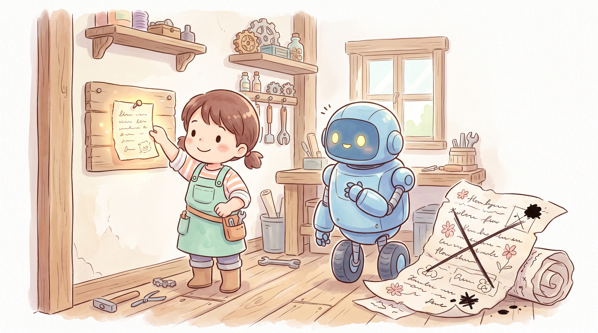
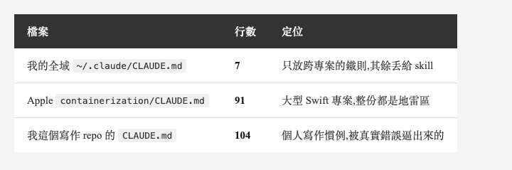
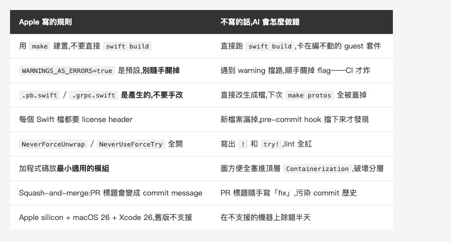
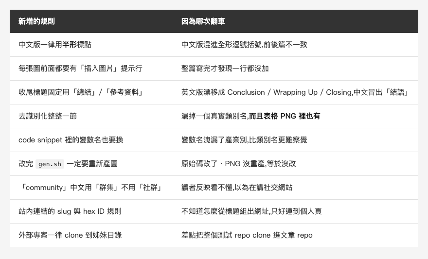

<!-- Tags: Claude Code, AI Coding, Documentation, Developer Tools, Open Source -->

*(在這裡插入封面圖:cover.png)*

<!--
Gemini prompt: A cute Ghibli-inspired soft pastel illustration. A chibi engineer pins a single short handwritten note onto a workshop wall, next to a huge crossed-out scroll of flowery text lying crumpled on the floor. The small note glows softly; a friendly robot reads it and nods. Soft pastel colors (mint, peach, lavender), white background, clean and simple, no text anywhere. 16:9 ratio.
-->

# Apple 官方的 CLAUDE.md:91 行,零句廢話——那你的呢?

> 上一篇讀 Apple 的容器專案時,我在根目錄撿到一份 CLAUDE.md。讀完之後回頭看自己那份,發現它六週內從 53 行長到 104 行——而多出來的每一行,都對應一次翻車。

---

## 前言

大部分人的 `CLAUDE.md` 長得很像:一段專案簡介,幾句「請寫出乾淨的程式碼」「請遵循最佳實踐」,然後就沒有然後了。寫的時候覺得很有道理,用起來完全沒感覺——因為那些話 Claude 本來就會說,你寫不寫都一樣。

上一篇我用知識圖去讀 [apple/containerization](https://github.com/apple/containerization) 時,在 repo 根目錄撿到一份 `CLAUDE.md`——**Apple 官方寫給 Claude Code 的專案指示**,Apache-2.0,可以整份照讀。

我讀完的第一個感覺是:**它跟大家寫的完全是兩種東西。**

這篇就做三件事:把 Apple 那份拆開量給你看、對照官方文件怎麼說、再回頭檢討我自己那份——那份在六週內從「看起來夠用」的 53 行長到 104 行,而每一條新增規則,背後都有一次我真的做錯的事。

這個系列將近四個月前寫過一篇 [CLAUDE.md 完全攻略](https://medium.com/@n913239/claude-md-%E5%AE%8C%E5%85%A8%E6%94%BB%E7%95%A5-%E8%AE%93-claude-code-%E7%9C%9F%E6%AD%A3%E7%90%86%E8%A7%A3%E4%BD%A0%E7%9A%84%E5%B0%88%E6%A1%88-3a9478865a11),把三層架構、該放什麼、寫法技巧整理過一輪。這篇不重講那些——這篇改拿一份真實的官方檔案當標準,而對照之下,**連我當初給的判準都得修正一條**。

---

## Part 1:先看數字

先不談內容,只看形狀。

那份檔案 **91 行**,其中 **63 行非空**,四個主段落:`Build / Test / Format`、`Architecture`(含 4 個子節)、`Conventions`、`Requirements`。

然後是有意思的部分:

- 裡面點名了**二十多個 `make` 指令**(`make all`、`make check`、`make protos`、`make linux-integration`…)
- **230 個行內 code span**,分布在 53 行裡——也就是**每 4 個非空行就有超過 3 行帶著具體的指令、檔名或設定值**
- 我拿「空泛用語」去掃它:`clean code`、`best practice`、`please`、`be helpful`、`high quality`、`readable code`——**命中 0 筆**

**零。一句都沒有。**

再把三份 `CLAUDE.md` 放在一起看,尺度就出來了:

*(在這裡插入圖片:table-count.png)*

<!--
| 檔案 | 行數 | 定位 |
|---|---|---|
| 我的全域 `~/.claude/CLAUDE.md` | **7** | 只放跨專案的鐵則,其餘丟給 skill |
| Apple `containerization/CLAUDE.md` | **91** | 大型 Swift 專案,整份都是地雷區 |
| 我這個寫作 repo 的 `CLAUDE.md` | **104** | 個人寫作慣例,被真實錯誤逼出來的 |
-->

順帶一提,Claude Code 官方文件建議 **單一 `CLAUDE.md` 控制在 200 行以內**——理由是它每次 session 都會整份載入,太長會吃掉 context、而且**降低遵循率**。Apple 用了不到一半。

---

## Part 2:每一條都是「不寫就會做錯」

數字歸數字,真正值得抄的是它挑了什麼來寫。我的讀法是:**把每一條都翻譯成「如果沒寫,AI 會怎麼做錯」**——翻得出來的,才有資格留在檔案裡。

第一段第一句就是最好的示範:

> The project is built via `make`, not directly with `swift build`.

一句話擋掉 AI 最可能犯的第一個錯。這個 repo 裡有**兩個** Swift package(根目錄一個、`vminitd/` 一個),後者還得在 Linux 容器裡用 musl 靜態編譯。你不講,它一定直接 `swift build` 然後卡死在那。

再往下看幾條:

*(在這裡插入圖片:table-rules.png)*

<!--
| Apple 寫的規則 | 不寫的話,AI 會怎麼做錯 |
|---|---|
| 用 `make` 建置,不要直接 `swift build` | 直接跑 `swift build`,卡在編不動的 guest 套件 |
| `WARNINGS_AS_ERRORS=true` 是預設,**別隨手關掉** | 遇到 warning 擋路,順手關掉 flag——CI 才炸 |
| `.pb.swift` / `.grpc.swift` **是產生的,不要手改** | 直接改生成檔,下次 `make protos` 全被蓋掉 |
| 每個 Swift 檔都要 license header | 新檔案漏掉,pre-commit hook 擋下來才發現 |
| `NeverForceUnwrap` / `NeverUseForceTry` 全開 | 寫出 `!` 和 `try!`,lint 全紅 |
| 加程式碼放**最小適用的模組** | 圖方便全塞進頂層 `Containerization`,破壞分層 |
| Squash-and-merge:PR 標題會變成 commit message | PR 標題隨手寫「fix」,污染 commit 歷史 |
| Apple silicon + macOS 26 + Xcode 26,舊版不支援 | 在不支援的機器上除錯半天 |
-->

看出共同點了嗎?**每一條都是「猜不到、而且猜錯要付出代價」的事。**

`.pb.swift` 是生成檔——你不講,AI 看到它就是一個普通的 Swift 檔,改它天經地義。`WARNINGS_AS_ERRORS` 是預設開啟——你不講,AI 遇到 warning 擋路時關掉它,是完全合理的判斷。這些都不是「AI 不夠聰明」,是**它沒有你腦袋裡那份專案脈絡**。

反過來說,「請寫出乾淨的程式碼」翻譯成「不寫的話 AI 會怎麼做錯」,答案是:**不會怎樣。** 它本來就在盡量寫乾淨的程式碼。所以那句話沒有資格佔一行。

### 把這個測試套用在自己的檔案上

大部分 `CLAUDE.md` 的開頭長這樣:

```markdown
## 專案簡介
這是一個 iOS App,使用 Swift 開發,架構採用 MVVM。

## 開發規範
- 請寫出乾淨、可讀的程式碼
- 請遵循 Swift 最佳實踐
- 請注意效能與安全性
```

四條規則,一條也通不過那個測試。而且更糟的是:**「這是一個 iOS App、使用 Swift」這種話,Claude 打開資料夾就知道了**——你花了 context 去講它已經看得到的事。

同一個專案,通得過測試的版本會長這樣:

```markdown
## 建置
- 用 `xcodebuild -workspace App.xcworkspace`,不要用 `-project`(SPM 相依會解不到)
- `Package.resolved` **有兩份**(`.xcodeproj` 與 `.xcworkspace` 各一),
  改私有 repo 網址時兩份都要改,不然還是抓舊網址

## 慣例
- `Generated/` 底下是 SwiftGen 產的,**不要手改**;改完 `.strings` 跑 `make gen`
- UI 測試約 12 分鐘,本機只跑 unit test:`-only-testing:AppTests`
```

行數差不多,但**後面那份每一條都是「你不講,它就會做錯」**——而且那兩份 `Package.resolved`,是我自己被坑過才知道的事。

---

## Part 3:官方怎麼說,以及兩個有趣的分歧

Claude Code 的官方文件其實把這件事講得很清楚,而且跟 Apple 那份對得上:

**什麼時候該加一條?** 官方的判準是——**同樣的錯,Claude 犯第二次的時候。** 還有:code review 抓到一個「它早該知道」的問題、你這個 session 又打了跟上個 session 一樣的更正、或者一個新同事需要同樣的背景才能上工。

**寫具體,不要寫抽象。** 官方直接給了對照組:寫「使用 2 個空格縮排」而不是「把格式弄好」;寫「commit 前跑 `npm test`」而不是「記得測試」。跟 Part 2 的結論完全一致。

**但有一條最重要,而且很多人不知道:**

> Claude treats them as context, not enforced configuration. To block an action regardless of what Claude decides, use a PreToolUse hook instead.

**`CLAUDE.md` 是「脈絡」,不是「強制執行」。** 它會被讀進去、會影響行為,但**不保證**被遵守。真的要擋一個動作、不管 AI 怎麼想都得擋,那是 **hook** 的工作,不是 `CLAUDE.md` 的。

這一點直接改變了「該往裡面寫什麼」的判斷:**要「一定擋得住」的事,就別指望 `CLAUDE.md`,寫成 hook 或設定。**

看起來 Apple 那份是個例外——`WARNINGS_AS_ERRORS`、license header,這兩條明明都有 CI 和 pre-commit hook 在守,為什麼還要寫?差別在時機:**工具是事後擋,`CLAUDE.md` 是讓它一開始就別走那條路。** 不講,AI 遇到 warning 擋路就順手關掉 flag,一路寫下去,等 CI 紅了才知道整趟白跑。兩者不是二選一,是**一個省來回,一個保底**。

### 分歧一:`/doctor` 想砍的,正是 Apple 寫最長的那段

這條分歧,得先從我自己說起。前面提到的那篇「CLAUDE.md 完全攻略」裡,我給過一條判準:

> 一個判斷方式:如果這段內容超過 10 行,問自己「Claude 能不能自己從 codebase 裡推斷出來?」如果可以,就不用放。

官方的立場一樣。文件提到 `/doctor` 會幫你精簡 `CLAUDE.md`,而它的精簡標準是——**砍掉「Claude 可以自己從 codebase 推導出來」的東西**(目錄結構、相依清單、**架構概覽**),**留下**踩雷點、理由、以及「跟工具預設不同」的慣例。

有意思的是:Apple 那份最長的一段,正好就是 **Architecture**(還帶 4 個子節)。不管照官方那條還是我自己那條,它都該被砍掉。

現在我要修正這條判準——而上一篇正好是證據。

上一篇我拿知識圖去讀這個 repo,花了**大半天**,才把「主機和客體隔著 vsock 上的 gRPC」這條架構事實挖出來。而 Apple 的 `CLAUDE.md` 裡,這件事用大約 15 行就講完了,還附上 `VirtualMachineAgent` 這層抽象、兩個 VMM backend 怎麼分、哪些檔是 `#if os(macOS)`。

所以那條標準——不管是官方的還是我自己寫過的——都要加一個但書:**「能推導」不等於「推導成本可以接受」。**

一個 6182 節點、15855 條邊的專案,架構確實「推導得出來」——代價是大半天。而寫成 15 行,是一次寫、每個 session 都省。**判準不是「推不推得出來」,是「推導一次要花多久 × 會推導幾次」。**

### 分歧二:創造者叫你定期刪光它

還有一條不在官方文件裡、但更激進的說法,來自 Claude Code 的創造者 Boris Cherny。

2026 年 1 月,他在 Threads 上只寫了一句:

> Try deleting your CLAUDE.md every 3 months. Then add back an instruction at a time when you see the model struggling with it

六個多月後,在 YC Startup School 2026 的台上(Opus 5 上線隔天),他把週期放寬、範圍擴大:`CLAUDE.md`、skills、hooks,**每六個月全部刪掉**,然後看看模型少了這些會怎樣。同一場他還給了一個數字:Opus 5 出來時,他們把 Claude Code **自己的 system prompt 砍掉超過 80%**,因為「the model is actually a little bit more intelligent without these prompts」——並補了一句,剩下的你也可以試著刪。

**但重點在後半句:**`add back an instruction at a time when you see the model struggling with it`。他不是叫你別寫,是把 `CLAUDE.md` 從「我覺得該立的規矩」降級成**有實證的補丁**:每一條都得有一次可指認的失敗當背書,否則不准存在。刪光只是逼你重新舉證的手段——跟 Part 2 那個「翻譯得出不寫會怎樣嗎」是同一個標準,只是他用動態的方式測。

**而三個月改口成六個月,本身就是論點的一部分。** 這個週期不是最佳實踐,是**模型能力的函數**:模型愈強,需要外掛的指示愈少、也腐爛得愈快。所以他不給「該寫什麼」的清單,只給「多久清一次」——清單註定過期,流程不會。

不過這條建議有個沉默的前提:**你的規則得是「模型有機會自己學會」的那種。**「不要用 force unwrap」下一代可能就內建了;「`Package.resolved` 有兩份,改私有 repo 網址時兩份都要改」——這種事模型永遠不會自己學會,因為它不是通則,是你們專案的**歷史事實**。所以刪除法其實是在替你分類:**能力型的規則會隨模型變強而失效,事實型的不會。** Apple 那 91 行幾乎全是後者,所以它撐得住六個月一刪。

最後一點得留意:他測的場景回饋迴路很緊——刪掉、跑一次、壞了當場就知道。**回饋愈慢的地方,愈不適合用刪除法試探。** 而回饋慢這一點,下一段就會反過來咬到我自己。

---

## Part 4:我自己那份,六週內差點翻倍

講完別人的,回頭看自己的。

我這個寫文章的 repo 也有一份 `CLAUDE.md`,建立那天寫了 **53 行**,自我感覺良好。(寫這篇的時候 `git log` 還只有那一筆;新增的部分是這篇寫完之後才 commit 的,所以你現在查會看到兩筆。)

六週之後,它是 **104 行**。多出來的 51 行,幾乎讓它翻倍。

而這 51 行沒有一行是我坐下來「想」出來的,**全部是撞出來的**:

*(在這裡插入圖片:table-fail.png)*

<!--
| 新增的規則 | 因為哪次翻車 |
|---|---|
| 中文版一律用**半形**標點 | 中文版混進全形逗號括號,前後篇不一致 |
| 每張圖前面都要有「插入圖片」提示行 | 整篇寫完才發現一行都沒加 |
| 收尾標題固定用「總結」/「參考資料」 | 英文版漂移成 Conclusion / Wrapping Up / Closing,中文冒出「結語」 |
| 去識別化整整一節 | 漏掉一個真實類別名,**而且表格 PNG 裡也有** |
| code snippet 裡的變數名也要換 | 變數名洩漏了產業別,比類別名更難察覺 |
| 改完 `gen.sh` 一定要重新產圖 | 原始碼改了、PNG 沒重產,等於沒改 |
| 「community」中文用「群集」不用「社群」 | 讀者反映看不懂,以為在講社交網站 |
| 站內連結的 slug 與 hex ID 規則 | 不知道怎麼從標題組出網址,只好連到個人頁 |
| 外部專案一律 clone 到姊妹目錄 | 差點把整個測試 repo clone 進文章 repo |
-->

這張表就是這篇文章的主張本身:**`CLAUDE.md` 不是一份寫給 AI 的專案簡介,是一份「我們一起踩過的雷」的清單。** 它應該是**長出來**的,不是**設計**出來的。而它長出來的唯一方式,就是你真的做錯過。

你可能會想:這九條全是寫文章的事——全形標點、插入圖片的提示行——跟我的程式專案有什麼關係?

換個領域看就知道了。「改完 `gen.sh` 一定要重新產圖」,跟 Part 2 裡 Apple 那句「`.pb.swift` 是產生的,不要手改」**是同一條規則**:有個東西是別的東西生出來的,你改錯了那一端,等於沒改。「真實類名連表格 PNG 裡都有」,對應的是你專案裡那份沒人記得要一起更新的設定檔。**規則的內容跟著領域走,規則長出來的方式不跟。**

### 一個反直覺的比較

現在把兩份放在一起:**Apple 的容器專案 91 行,我這個寫文章的個人 repo 104 行。**

一個是跨 macOS / Linux、有 27 個模組、要處理虛擬化和 gRPC 的系統專案;一個是拿來寫 Markdown 的。後者的規則檔居然比較長。

為什麼?

因為 **Apple 那個專案有一整套工具在替它記規則**:`Package.swift` 宣告了模組邊界、`Makefile` 定義了每條流程、`.swift-format` 管格式、CI 開著 `WARNINGS_AS_ERRORS`、pre-commit hook 擋 license header。**規則只要工具能強制,就不必寫進 `CLAUDE.md`。**

而寫文章**沒有編譯器**。「中英文的 H2 章節數要一樣」「圖片數要等於提示行數」「中文版不能有全形標點」——沒有任何工具會擋你,所以只能寫成散文,每個 session 載入一次,祈禱它被遵守。

這就接回 Part 3 那句官方警告了:**`CLAUDE.md` 是脈絡,不是強制執行。** 我這 104 行裡,有一大半其實是**可以被腳本檢查的**——那它們就不該只活在 `CLAUDE.md` 裡。

所以我下一步不是繼續加行數,是把那份發布前檢查清單寫成腳本,讓機器擋,而不是讓 AI 記。

---

## 總結

一份 `CLAUDE.md` 值不值錢,不看它多長,看**每一行的「被違反成本」有多高**。

實際可以用的三個判準:

1. **翻譯得出「不寫會怎樣」嗎?** 翻不出來的,刪掉。「請寫出乾淨的程式碼」翻譯出來是「不會怎樣」。
2. **這條需要「一定擋得住」嗎?** 需要的話寫成 hook、lint 或 CI——`CLAUDE.md` 是脈絡,不保證被遵守。它的工作是讓 AI 一開始就別走錯路,不是當最後一道關。
3. **這條是不是「猜不到,而且猜錯要付代價」?** 生成檔、預設開關、不成文的流程慣例——這些才是它真正該裝的東西。

還有一條寫作方式上的:**別坐下來想規則,等它撞出來。** 官方的判準是「同樣的錯犯第二次」,我的經驗也一樣——那 51 行沒有一行是想出來的。

以及一條保養上的:**加進去的規則不會自己過期,得你去刪。** Boris Cherny 建議每半年整份清空,看模型少了它會不會出事;真正該留的那幾條——生成檔、兩份 `Package.resolved`、你們專案的歷史事實——不管模型變多強都會自己活回來。

回到系列一直在講的那句:**結構愈清楚,AI 能替你接手的就愈多。** 而 `CLAUDE.md` 就是你把腦袋裡那份「只有你知道的專案脈絡」交出去的地方。Apple 用 91 行交出了一個虛擬化專案的全部地雷,一句廢話都沒有。

下次打開你自己那份,拿第一條規則問一次:**這條不寫的話,會怎樣?**

答不出來,就刪掉它。

---

## 參考資料

- [apple/containerization 的 CLAUDE.md](https://github.com/apple/containerization/blob/main/CLAUDE.md) — 本篇拆解的那份(Apache-2.0),掃描版本 commit `74ace148`
- [Claude Code 官方文件 — How Claude remembers your project](https://code.claude.com/docs/en/memory) — `CLAUDE.md` 的載入順序、200 行建議上限、`.claude/rules/` 與 auto memory
- [Claude Code 官方文件 — Hooks](https://code.claude.com/docs/en/hooks-guide) — 需要「一定要擋」而不是「希望它記得」時,用這個
- [Boris Cherny 的 Threads 貼文(2026-01-05)](https://www.threads.com/@boris_cherny/post/DTJR_fEkq2L) — 「每三個月刪掉你的 CLAUDE.md」的原始出處
- [Boris Cherny: Building Claude Code — YC Startup School 2026](https://www.ycombinator.com/library/UN-boris-cherny-building-claude-code) — 改口成六個月、以及砍掉 80% system prompt 的那場對談,另有[逐字稿版](https://www.ycrootaccess.com/p/boris-cherny-building-claude-code)
- 系列相關:[CLAUDE.md 完全攻略 — 讓 Claude Code 真正理解你的專案](https://medium.com/@n913239/claude-md-%E5%AE%8C%E5%85%A8%E6%94%BB%E7%95%A5-%E8%AE%93-claude-code-%E7%9C%9F%E6%AD%A3%E7%90%86%E8%A7%A3%E4%BD%A0%E7%9A%84%E5%B0%88%E6%A1%88-3a9478865a11) — 三層架構與寫法技巧的完整版;本篇修正了它其中一條判準
- 系列前篇:[圖只負責告訴你該讀哪幾個檔——用知識圖解析一個完全陌生的 Apple 開源專案](https://medium.com/@n913239/%E5%9C%96%E5%8F%AA%E8%B2%A0%E8%B2%AC%E5%91%8A%E8%A8%B4%E4%BD%A0%E8%A9%B2%E8%AE%80%E5%93%AA%E5%B9%BE%E5%80%8B%E6%AA%94-%E7%94%A8%E7%9F%A5%E8%AD%98%E5%9C%96%E8%A7%A3%E6%9E%90%E4%B8%80%E5%80%8B%E5%AE%8C%E5%85%A8%E9%99%8C%E7%94%9F%E7%9A%84-apple-%E9%96%8B%E6%BA%90%E5%B0%88%E6%A1%88-79b192a598dc) — 這份 CLAUDE.md 是在那次探勘裡撿到的
