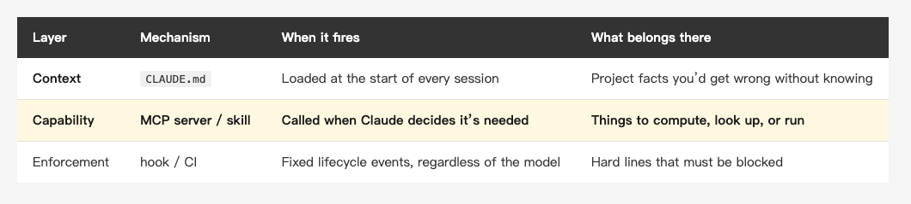
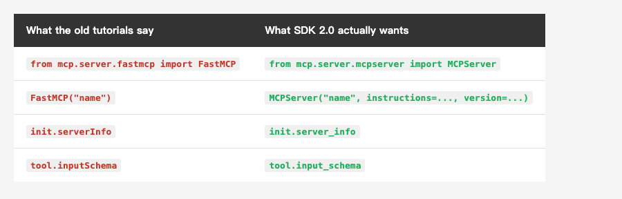
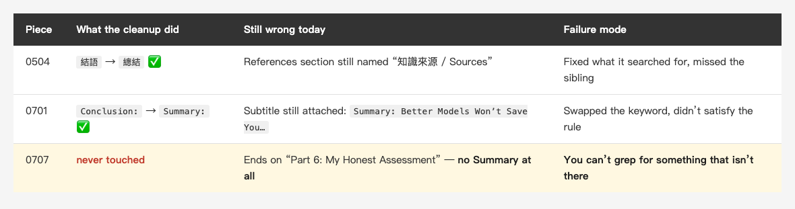
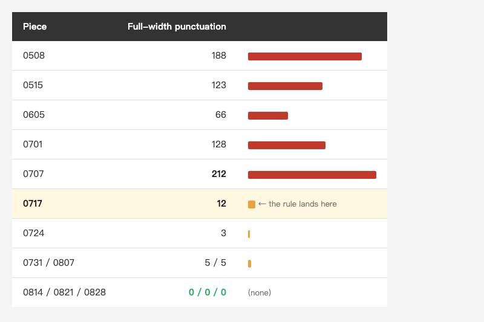

<!-- Tags: Claude Code, MCP, Developer Tools, Python, Automation -->

*(Insert cover image here: cover.png)*

<!--
Gemini prompt: A cute Ghibli-inspired soft pastel illustration. A chibi engineer hands a small handmade inspection stamp tool to a friendly robot, who is stamping a stack of paper documents; one sheet in the stack glows red as if caught. Soft pastel colors (mint, peach, lavender), white background, clean and simple, no text anywhere. 16:9 ratio.
-->

# Building My Own MCP Server — 237 Lines, and on Its First Run It Found Something I Leaked Three Months Ago

> At the end of the last piece I said the next step was handing my pre-publish checklist to a machine. This is that step. On its first run it found three things — two of them were my own rules being wrong, and the third was a username I'd had published for three months.

---

## Introduction

[The last piece, on CLAUDE.md](https://medium.com/@n913239/apple-ships-a-claude-md-91-lines-not-one-wasted-what-about-yours-e925cfb65448), ended with this:

> So my next move isn't adding lines. It's turning that pre-publish checklist into a script, so a machine enforces it instead of an AI remembering it.

This is that next move. But when I actually sat down, the first question wasn't *how to write it* — it was **what to build it as**. A script? A skill? An MCP server?

I've used all three. I picked MCP server this time because the series has been missing a piece: [the MCP in Practice article from a few months back](https://medium.com/@n913239/mcp-in-practice-let-claude-code-query-your-database-call-apis-and-read-figma-6e0f66641d8c) is entirely about **consuming** someone else's server — databases, APIs, Figma. Its Part 6 is titled "Building a Custom MCP Server (Advanced)," but that's twelve lines of sketch TypeScript in which even the `fetchFromJira()` is invented; not one line of it runs.

**A sketch isn't a shipped server.** This time I built one that actually works, and pointed it at something I do every single week. The wall between consuming and producing turns out to be thinner than it looks.

This piece walks the whole trip: how I chose, how the 237 lines came out, how it connects to Claude Code, and what the first run reported — which was uglier than I expected, and valuable precisely because of that.

---

## Part 1: First Decide What to Build It As

The last piece left a framework behind: **`CLAUDE.md` is context, not enforced configuration**. The docs are blunt about it — it gets read, it shapes behavior, and it is not guaranteed to be followed; if you need something blocked, that's a hook's job.

Push that sentence and any given rule has three places it can live:

*(Insert image here: table-layer-en.png)*

<!--
| Layer | Mechanism | When it fires | What belongs there |
|---|---|---|---|
| **Context** | `CLAUDE.md` | Loaded at the start of every session | Project facts you'd get wrong without knowing |
| **Capability** | **MCP server / skill** | **Called when Claude decides it's needed** | Things that must be computed, looked up, or run |
| Enforcement | hook / CI | Fixed lifecycle events, regardless of what the model decides | Hard lines that must be blocked |
-->

So where does a pre-publish checklist go?

**Not context alone.** I had been holding myself to "image count must equal marker-line count" and "the Chinese and English versions need the same H2 count" for half a year without ever writing them into `CLAUDE.md` — they landed in the file in the very commit this article is about, the same commit that finally gave me a program to count for me. Prose rules get read. But **nothing executes them**.

**Not enforcement yet, either.** Hooks and CI mean "you don't pass, you don't proceed" — the last line of defense. But mid-draft what I actually want is to **ask, at any moment, whether it's clean yet**, not to get bounced at commit time.

So it's the middle layer: **a tool Claude can call on its own that returns structured results.**

Then why an MCP server rather than a skill? The test is simpler than I expected:

- A **skill** is a **procedure written for an AI to read** — "do these steps." Its output is the AI's behavior.
- An **MCP server** is a **program** — given this input, it returns that output. Its output is data.

"How many images does this piece have, how many marker lines, are the two equal" is **arithmetic**, not judgment. Arithmetic belongs in a program: the answer is the same every time, and the model shouldn't recount it on every pass — because it does miscount, and I've caught it doing exactly that.

---

## Part 2: 237 Lines, and Two Potholes No Tutorial Mentions

The spec already existed — it's the list sitting in `CLAUDE.md`: images present, image count == marker count, code fences balanced, matching H2 counts across languages, five tags max, correct closing headings, no leftover placeholders, de-identification clean, no full-width punctuation in the Chinese version.

Nine rules, implemented as **20 concrete assertions** (the per-language ones count twice). `server.py` came to **237 non-empty lines**.

### Pothole one: `FastMCP` isn't called `FastMCP` anymore

Nine out of ten MCP tutorials online open with this line:

```python
from mcp.server.fastmcp import FastMCP
```

I copied it and got `ModuleNotFoundError: No module named 'mcp.server.fastmcp'`.

Digging into the package: the Python SDK is now at **2.0.0**, the `fastmcp` module is gone, and the class was renamed `MCPServer`, living in `mcp.server.mcpserver`:

```python
# Since SDK 2.0, FastMCP is renamed MCPServer (most tutorials are still on fastmcp)
from mcp.server.mcpserver import MCPServer

mcp = MCPServer(
    "medium-check",
    instructions="Pre-publish checklist for this repo. Run check_article before pasting to Medium.",
    version="0.1.0",
)
```

The interface barely changed — still a `.tool()` decorator and `.run()`. Only the name moved. But if you're following a post from six months ago, you die on line one.

### Pothole two: the Python side went all-in on snake_case

Writing a test client, I hit it twice more:

```
AttributeError: 'InitializeResult' object has no attribute 'serverInfo'. Did you mean: 'server_info'?
AttributeError: 'Tool' object has no attribute 'inputSchema'. Did you mean: 'input_schema'?
```

The protocol itself still sends camelCase on the wire — that's the JSON-RPC spec and it can't move — but the Python SDK renamed every object attribute to snake_case. The error messages helpfully name the replacement, but following an old example gets you two crashes rather than none.

*(Insert image here: table-sdk-en.png)*

<!--
| What the old tutorials say | What SDK 2.0 actually wants |
|---|---|
| `from mcp.server.fastmcp import FastMCP` | `from mcp.server.mcpserver import MCPServer` |
| `FastMCP("name")` | `MCPServer("name", instructions=..., version=...)` |
| `init.serverInfo` | `init.server_info` |
| `tool.inputSchema` | `tool.input_schema` |
-->

### The good news: you don't write the schema

An MCP tool has to publish a JSON Schema so the model knows its parameters. You don't hand-write it — **type hints plus a docstring are enough**:

```python
@mcp.tool()
def check_article(article: str) -> dict:
    """Run the full pre-publish checklist on one article (CLAUDE.md, step 3).

    Args:
        article: The article folder name (e.g. 2026-09-04_claude-code-mcp-server),
                 or a path relative to story/.

    Returns:
        passed: whether every check succeeded
        failed: number of failed checks
        checks: name / ok / detail for each one
    """
```

The SDK turns that into the schema. Which means **a well-written docstring becomes the manual the model actually reads** — the same point the last piece made about Apple's `CLAUDE.md`: every sentence you write is one way the model no longer gets it wrong.

### A small convenience: no polluting the global environment

I never installed `mcp` into the system Python. It's pulled at run time:

```bash
uv run --with mcp python server.py
```

`uv` manages a cached environment for it. Changing versions or throwing it away costs nothing.

---

## Part 3: Wiring It to Claude Code, and One Deliberate Speed Bump

With the server written, Claude Code needs to know about it:

```bash
claude mcp add medium-check --scope project -- \
  uv run --with mcp python "$PWD/tools/mcp/medium-check/server.py"
```

`--scope project` writes a `.mcp.json` at the repo root:

```json
{
  "mcpServers": {
    "medium-check": {
      "type": "stdio",
      "command": "uv",
      "args": ["run", "--with", "mcp", "python", "${CLAUDE_PROJECT_DIR:-.}/tools/mcp/medium-check/server.py"],
      "env": {}
    }
  }
}
```

What `claude mcp add` actually writes is an **absolute path**; I swapped it for `${CLAUDE_PROJECT_DIR}` by hand, because this file goes into version control — a hard-coded absolute path guarantees it won't run on anyone else's clone (and publishes your directory layout while it's at it). One detail you can't skip: **the `:-.` default is required**, because `CLAUDE_PROJECT_DIR` is set in the server's environment rather than Claude Code's own, so without a default it expands to nothing.

Then `claude mcp list` told me this:

```
medium-check: ... - ⏸ Pending approval (run `claude` to approve)
```

**It does not start on its own.** Someone has to approve it once, interactively.

My first reaction was that this is a nuisance. My second was that it's the part most worth writing down: **`.mcp.json` is checked into version control.** Anyone who clones your repo gets that config. If it auto-started, then "cloning a repo" would mean "running a stranger's chosen command on your machine."

So the approval isn't friction. It's the **supply-chain boundary** around `.mcp.json` — the same instinct that stops you piping a stranger's script into bash.

Once approved, Claude calls it directly. Here's what came back on the article I'd just fixed:

```json
{
  "article": "2026-05-15_claude-code-mcp",
  "passed": false,
  "failed": 1,
  "checks": [
    { "name": "image-markers[zh]", "ok": true,  "detail": "3 images vs 3 marker lines" },
    { "name": "closing[en]",       "ok": true,  "detail": "final two sections ['Summary', 'References']…" },
    { "name": "deident[zh]",       "ok": true,  "detail": "5 patterns, 0 hits" },
    { "name": "parity-h2",         "ok": true,  "detail": "zh 10 / en 10" },
    { "name": "fullwidth[zh]",     "ok": false, "detail": "123 hits: L3, L11, L17…" }
  ]
}
```

Structured data, not a paragraph. That matters: **what Claude receives is something it can reason over further**, rather than prose it has to re-parse.

### A footnote: the protocol itself just moved house

There's a question I have to answer here. **On 2026-07-28 the MCP spec made its largest change to date: the protocol went stateless.** The `initialize` / `notifications/initialized` handshake is gone; every request now carries its own protocol version and capabilities in `_meta`; `Mcp-Session-Id` is removed from the Streamable HTTP transport; and a new `server/discover` RPC arrives that servers **MUST** implement.

So is the `initialize` flow above already obsolete?

I didn't guess. I sent raw JSON-RPC at my own server and asked it:

```
→ {"method": "server/discover"}
← {"error": {"code": -32601, "message": "Method not found"}}

→ {"method": "initialize", "params": {"protocolVersion": "2026-07-28", …}}
← {"result": {"protocolVersion": "2025-11-25", …}}
```

**SDK 2.0.0 defines `LATEST_PROTOCOL_VERSION = 2026-07-28`, but its high-level `MCPServer` actually negotiates `2025-11-25` and doesn't implement `server/discover`.** Five weeks after the spec was finalized, the high-level API hasn't caught up.

So a local stdio server written today still speaks the old handshake protocol, and the code above is correct. Where stateless really bites is **servers deployed behind HTTP** — drop the session and a request no longer has to land on the same machine, so an MCP server becomes an ordinary load-balanced workload. A local stdio server is one process that starts and stops; it never had a session to maintain.

The same revision adds a pattern called **MRTR** (Multi Round-Trip Requests): when a server needs more information, it no longer turns around and asks the client — it returns `resultType: "input_required"`, and the client re-sends the same request with the answers attached. It exists precisely because of statelessness: with no session, a server has no connection belonging to a particular client to push anything down, so the flow has to invert.

None of which applies to `medium-check`: both its tools are pure functions — hand them a folder name, get a result back, nothing to ask anyone mid-call. And that's the reminder worth taking away — **the purer the tool, the less this class of protocol change touches it.** Tools that need to interact with a user mid-request all got redesigned this round; plain input-to-output ones were never touched.

Which is the Part 2 lesson one level up: **it isn't only the tutorials that go stale — the protocol you're learning is moving too.** And the only way to know which version is actually running is to send it a request yourself, exactly as above.

---

## Part 4: The First Run Was Uglier Than I Expected

Tool finished, I pointed it at all 27 bilingual pieces in the series.

**25 of them failed, on 82 findings in total.**

My first reaction was, of course, "that can't be right." And the instinct wasn't entirely wrong — **25 of those 82 were my own rules being wrong.**

### My two broken rules

**Rule one: the placeholder check.** I'd written "a `TODO` in the body means something got left behind," and it flagged 0717 and 0701. Opening them up: both pieces are *about* using a hook to block commits containing `TODO`. `// TODO: remove` is the **subject** of the article, not something I forgot to delete.

The rule was wrong because it never excluded code:

```python
def prose_only(lines, drop_inline_code=False):
    """Keep prose only: drop fenced code, and optionally inline code spans too.

    Why: a piece about a hook that blocks `TODO` will naturally contain TODO
    in its body — that's the subject under discussion, not a leftover placeholder.
    The first version did not exclude it and misfired on 2 pieces.
    """
```

**Rule two: English-version images.** I'd written "every image in the English version must point at an `-en` file," and it flagged eight pieces. But those were UI screenshots and flow diagrams — **there's no text in them at all**. Sharing one file across both languages is correct; forcing two copies is waste.

The right rule isn't "must have `-en`." It's "**an `-en` variant exists on disk and the English version isn't using it**." Shared screenshots pass; a table image that forgot its translation still gets caught.

With both fixed the 82 findings dropped to 57, and every false positive was gone. That's worth recording on its own: **a checker's first user is its own rules.** You think you're checking your articles; for the first half hour, your articles are checking your rules.

### And then the real findings

With the rules corrected, what remained was real. Three things.

**One: I published my own username three months ago.**

The 0515 piece — the one about MCP — had four occurrences in each language, eight in total, looking like this (the username is masked here; you'll see why in a moment):

```json
"args": ["-y", "@modelcontextprotocol/server-filesystem", "/Users/<my-real-account>/projects"]
```

I'd been following the de-identification rule from early on: real class names, business terms, **real paths**, company names — all must be zero. And I'd been violating it for three months, "checking" before every publish, and never seeing it. As for whether the rule had ever actually made it into `CLAUDE.md` — I checked the git history later and it hadn't, and the commit that put it there is the one behind this article.

The fix is trivial: the real name becomes `you`, the JSON stays valid, the tutorial doesn't change. But **the checker was still red after the fix** — because my pattern was `/Users/[a-z0-9]+/`, which matches `/Users/you/` just as happily.

There's an easily missed detail here: **a pattern has to encode both "what a leak looks like" and "what already-sanitized looks like."** The final form uses a negative lookahead — real names caught, sanctioned placeholders allowed:

```
/Users/(?!you/|username/|USER/)[a-z0-9]+/
```

One more thing worth noting: every one of those leaks was inside a code block. So the de-identification check **must not** exclude code — the exact opposite of the placeholder check. Same text, different checks, different scopes.

And the funniest part: **while writing this very section, I pasted that line in verbatim so you could see it — and leaked it all over again.** I ran the checker on this draft and `deident` went red on the spot. That's where the `<my-real-account>` above came from.

The act of fixing a leak can itself create a fresh one — and no checklist stops that, because a checklist only works on the occasions you remember to read it. The tool reads it every time.

**Two: the manual heading cleanup missed three things, in three different ways.**

The series' closing headings were standardized once already: 總結 / 參考資料 in Chinese, Summary / References in English. That was one commit touching 12 files, done by hand.

The checker found 12 pieces whose closing headings are still non-compliant today (22 findings in all). Here are three of them, because they happen to fail in **three different ways**:

*(Insert image here: table-miss-en.png)*

<!--
| Piece | What the cleanup did | Still wrong today | Failure mode |
|---|---|---|---|
| 0504 | `結語` → `總結` ✅ | References section still named "知識來源 / Sources" | Fixed what it searched for, missed the sibling section |
| 0701 | `Conclusion:` → `Summary:` ✅ | Subtitle still attached: `Summary: Better Models Won't Save You…` | Swapped the keyword, didn't satisfy the rule |
| 0707 | **never touched** | Ends on "Part 6: My Honest Assessment" — **no Summary section at all** | **You can't grep for something that isn't there** |
-->

The third one is the interesting one. That cleanup worked by grepping for `結語` and `Conclusion` — and 0707 had **no closing heading to find**. You cannot search for an absence.

The checker doesn't search for keywords. It asserts **structure**: the final two H2s must be Summary and References. That formulation is equally sensitive to something missing and something extra, and it took half a second.

**Three: you can see the exact moment a convention took hold.**

Half-width punctuation in the Chinese version is a rule I adopted late. Scanning the whole series and lining up the counts:

*(Insert image here: table-curve-en.png)*

<!--
| Piece | Full-width punctuation | |
|---|---|---|
| 0508 | 188 | ██████████████ |
| 0515 | 123 | █████████ |
| 0605 | 66 | █████ |
| 0701 | 128 | █████████ |
| 0707 | **212** | ████████████████ |
| **0717** | **12** | █ ← the rule lands here |
| 0724 | 3 | ▏ |
| 0731 / 0807 | 5 / 5 | ▏ |
| 0814 / 0821 / 0828 | **0 / 0 / 0** | (none) |
-->

0707's 212 is the highest in this table (the series high is actually 0424's 239); the very next piece drops to 12. And from 0814 onward it's three consecutive clean zeros.

I thought I knew what caused that cliff, and I had it backwards. `CLAUDE.md` only came into existence an hour after I committed the 0717 piece — and **the punctuation rule didn't land in it for another six weeks**. The convention took hold before the rule was written down, not the other way round.

I knew the rule existed. I had no idea **when it actually started working**. A half-second scan drew six months of self-discipline as a curve.

---

## Summary

Back to the question at the top: should a given rule be context, capability, or enforcement?

Three tests I'd now apply:

1. **Is it knowledge or arithmetic?** Knowledge — project facts you'd get wrong without knowing — goes in `CLAUDE.md`. **Arithmetic, where the answer is identical every time, becomes an MCP server.** Ask a model to count the images and it will eventually miscount.
2. **Does it need to be *guaranteed*?** Then it belongs to a hook or CI. An MCP server is "askable at any time," not "you don't pass, you don't proceed."
3. **Does it return data or behavior?** Data means MCP server. Behavior means skill.

And one that isn't about MCP at all: **this ecosystem moves faster than any tutorial stays fresh.** The three things I tripped over here — the `FastMCP` rename, the Python side going snake_case, the protocol itself going stateless — I knew about none of them before starting, and all three happened within six months. So before you start, have an AI pull the current official docs and release notes; it costs far less than copying whatever ranks first in search, which may well have been written half a year ago without saying so.

But this piece also shows why **asking isn't enough**: the SDK's own constant reads `LATEST_PROTOCOL_VERSION = 2026-07-28` while what it actually negotiates is `2025-11-25`. Docs go stale, and even a constant in the source can mislead you. **The only way to be sure is to send it a request and see what comes back.**

And the thing that surprised me most wasn't the 237 lines. It was that **writing them forced me to turn tacit conventions into executable assertions.**

"Image count must equal marker-line count" is one sentence in `CLAUDE.md`. To make it a program you have to answer: does an `` inside a code block count? Does the English version need its own file? What exactly does "already de-identified" look like? — **none of those questions surface until something forces you to write it as code.**

Which makes that first report — 25 of its 82 findings my own bugs — entirely reasonable in hindsight. I thought I was writing a checker. I was watching my rules get stated precisely for the first time.

Back to the line this series keeps returning to: **the clearer the structure, the more the AI can take off your hands.** And sometimes "clear structure" just means taking a sentence you've been repeating for six months and honestly writing it as a function that returns true or false.

---

## References

- [Claude Code docs — MCP](https://code.claude.com/docs/en/mcp) — `claude mcp add`, scope differences, the `.mcp.json` approval flow, and why `${CLAUDE_PROJECT_DIR}` needs a default
- [Claude Code docs — How Claude remembers your project](https://code.claude.com/docs/en/memory) — the source of Part 1's "context, not enforced configuration"
- [Model Context Protocol](https://modelcontextprotocol.io/) — the protocol spec and SDKs
- [MCP 2026-07-28 spec — Key Changes](https://modelcontextprotocol.io/specification/2026-07-28/changelog) — the revision that went stateless: handshake and `Mcp-Session-Id` removed, `server/discover` added, MRTR introduced
- [MCP Python SDK](https://github.com/modelcontextprotocol/python-sdk) — this piece uses **2.0.0**; `FastMCP` is now `MCPServer`, and what it actually negotiates on the wire is `2025-11-25`
- [uv](https://docs.astral.sh/uv/) — `uv run --with mcp` keeps it out of your global environment
- Earlier in this series: [MCP in Practice — Let Claude Code Query Your Database, Call APIs, and Read Figma](https://medium.com/@n913239/mcp-in-practice-let-claude-code-query-your-database-call-apis-and-read-figma-6e0f66641d8c) — that one covers **consuming** an MCP server; this one adds **producing** one, and it's also the article whose leak this checker caught
- Earlier in this series: [Apple Ships a CLAUDE.md — 91 Lines, Not One Wasted. What About Yours?](https://medium.com/@n913239/apple-ships-a-claude-md-91-lines-not-one-wasted-what-about-yours-e925cfb65448) — where the context / capability / enforcement split comes from, and the promise this piece pays off
