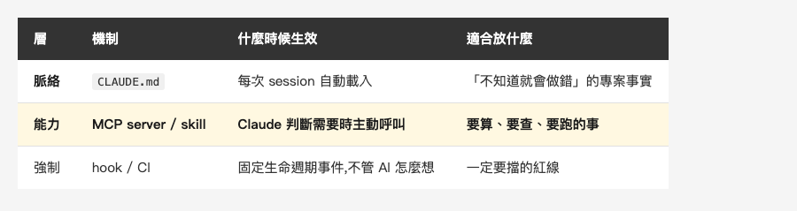
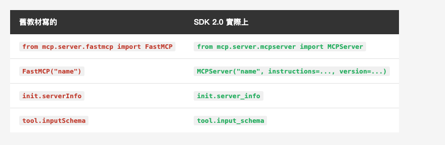
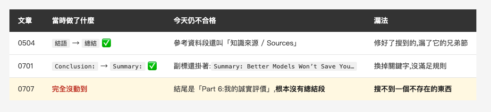
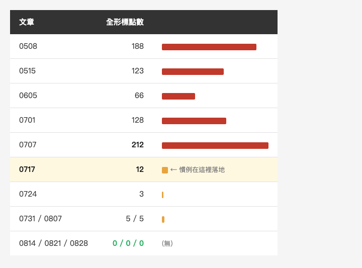

<!-- Tags: Claude Code, MCP, Developer Tools, Python, Automation -->

*(在這裡插入封面圖:cover.png)*

<!--
Gemini prompt: A cute Ghibli-inspired soft pastel illustration. A chibi engineer hands a small handmade inspection stamp tool to a friendly robot, who is stamping a stack of paper documents; one sheet in the stack glows red as if caught. Soft pastel colors (mint, peach, lavender), white background, clean and simple, no text anywhere. 16:9 ratio.
-->

# 自己做一個 MCP server:237 行,第一次跑就抓到我三個月前洩漏的東西

> 上一篇結尾我說,下一步要把發布前檢查清單交給機器。這篇是兌現。做完跑第一次,它抓到三件事——其中兩件是我自己的規則寫錯了,第三件是一個已經公開三個月的使用者名稱。

---

## 前言

[上一篇談 CLAUDE.md](https://medium.com/@n913239/apple-%E5%AE%98%E6%96%B9%E7%9A%84-claude-md-91-%E8%A1%8C-%E9%9B%B6%E5%8F%A5%E5%BB%A2%E8%A9%B1-%E9%82%A3%E4%BD%A0%E7%9A%84%E5%91%A2-a7d1cf8e555b) 的結尾,我寫了一句話:

> 我下一步不是繼續加行數,是把那份發布前檢查清單寫成腳本,讓機器擋,而不是讓 AI 記。

這篇就是那個下一步。但真的坐下來要做的時候,第一個問題不是「怎麼寫」,是**「做成什麼」**——腳本?skill?還是 MCP server?

三個選項我都用過。而這次選 MCP server,是因為這個系列一直缺一塊:[幾個月前那篇 MCP 實戰](https://medium.com/@n913239/mcp-%E5%AF%A6%E6%88%B0-%E8%AE%93-claude-code-%E7%9B%B4%E6%8E%A5%E6%93%8D%E4%BD%9C%E8%B3%87%E6%96%99%E5%BA%AB-%E6%89%93-api-%E8%AE%80-figma-d53051afde01)從頭到尾在講怎麼**消費**別人的 server——資料庫、API、Figma。它第六部分雖然叫「自訂 MCP Server(進階)」,但那是十二行 TypeScript 示意稿,連裡面的 `fetchFromJira()` 都是我編的,一行都跑不起來。

**示意不算生產。** 這次是真的做一個會動的,而且要拿它來做我每週都在做的事。中間隔著的那道牆,比想像中薄。

這篇會走完整趟:怎麼選、237 行怎麼寫、怎麼接上 Claude Code、以及第一次跑出來的結果——那個結果比我預期的難看,而且難看得很有價值。

---

## Part 1:先決定「做成什麼」

上一篇留下一個框架:**`CLAUDE.md` 是脈絡,不是強制執行**。官方文件講得很白——它會被讀進去、會影響行為,但不保證被遵守;真的要擋,那是 hook 的工作。

把這句話推開,一件事其實有三層可以放:

*(在這裡插入圖片:table-layer.png)*

<!--
| 層 | 機制 | 什麼時候生效 | 適合放什麼 |
|---|---|---|---|
| **脈絡** | `CLAUDE.md` | 每次 session 自動載入 | 「不知道就會做錯」的專案事實 |
| **能力** | **MCP server / skill** | **Claude 判斷需要時主動呼叫** | **要算、要查、要跑的事** |
| 強制 | hook / CI | 固定生命週期事件,不管 AI 怎麼想 | 一定要擋的紅線 |
-->

發布前檢查清單放哪一層?

**不能只放脈絡層。** 「圖片數要等於提示行數」「中英 H2 章節數要相同」這兩條規矩,我自己守了半年,卻一直沒寫進 `CLAUDE.md`——真正寫進去是這篇在講的那個 commit,而同一個 commit 裡就有程式在數了。散文形式的規則,Claude 讀得到,但**沒有東西會去執行它**。

**也還不到強制層。** hook 和 CI 是「不通過就擋下來」,那是最後一道關。但寫作過程中我更需要的是**隨時問一句「現在合格了嗎」**,而不是等到 commit 才被打回票。

所以是中間那層:**一個 Claude 可以主動呼叫、回傳結構化結果的工具。**

那為什麼是 MCP server 而不是 skill?判準其實很簡單:

- **skill** 是一段**寫給 AI 讀的流程**——「照這幾步做」。它的產出是 AI 的行為。
- **MCP server** 是一支**程式**——輸入什麼、回傳什麼是確定的。它的產出是資料。

「這篇文章有幾張圖、幾行提示行、兩者相不相等」是**計算**,不是判斷。計算就該交給程式,答案每次都一樣,不該讓模型每次重數一遍(而且它真的會數錯——這半年我就抓到過)。

---

## Part 2:237 行,和兩個現成教材沒寫的坑

規格是現成的,就是 `CLAUDE.md` 裡那份清單:圖檔齊全、圖片數 == 提示行數、code fence 平衡、中英 H2 相同、Tags ≤ 5、收尾標題正確、無殘留佔位符、去識別化、中文版無全形標點。

九條,實作成 **20 項具體斷言**(中英各跑一遍的分開算),`server.py` **237 行非空**。

### 坑一:`FastMCP` 已經不叫 `FastMCP` 了

網路上的 MCP 教學,九成開頭都是這行:

```python
from mcp.server.fastmcp import FastMCP
```

我照抄,然後拿到 `ModuleNotFoundError: No module named 'mcp.server.fastmcp'`。

去翻套件才發現,Python SDK 已經是 **2.0.0**,`fastmcp` 這個模組沒了,類別改名成 `MCPServer`,住在 `mcp.server.mcpserver`:

```python
# SDK 2.0 起 FastMCP 改名為 MCPServer(網路上多數教學還停在 fastmcp)
from mcp.server.mcpserver import MCPServer

mcp = MCPServer(
    "medium-check",
    instructions="這個 repo 的發布前檢查清單。貼文到 Medium 之前用 check_article 跑一遍。",
    version="0.1.0",
)
```

介面幾乎沒變(一樣是 `.tool()` 裝飾器加 `.run()`),就是名字換了。但只要你是照著半年前的文章抄,第一行就會死。

### 坑二:Python 側全面改成 snake_case

寫測試用的 client 時又撞一次:

```
AttributeError: 'InitializeResult' object has no attribute 'serverInfo'. Did you mean: 'server_info'?
AttributeError: 'Tool' object has no attribute 'inputSchema'. Did you mean: 'input_schema'?
```

MCP 協定本身在線上傳的還是 camelCase(那是 JSON-RPC 規格,不能動),但 Python SDK 把物件屬性全改成 snake_case 了。錯誤訊息很貼心地告訴你新名字,但如果你是照著舊範例寫,會連撞兩次。

*(在這裡插入圖片:table-sdk.png)*

<!--
| 舊教材寫的 | SDK 2.0 實際上 |
|---|---|
| `from mcp.server.fastmcp import FastMCP` | `from mcp.server.mcpserver import MCPServer` |
| `FastMCP("name")` | `MCPServer("name", instructions=..., version=...)` |
| `init.serverInfo` | `init.server_info` |
| `tool.inputSchema` | `tool.input_schema` |
-->

### 好消息:schema 不用自己寫

MCP 的 tool 要對外宣告 JSON Schema,讓模型知道有哪些參數。但你不必手寫——**type hint 加 docstring 就夠了**:

```python
@mcp.tool()
def check_article(article: str) -> dict:
    """對一篇文章跑完整的發布前檢查清單(CLAUDE.md 發布流程第 3 條)。

    Args:
        article: 文章資料夾名稱(例如 2026-09-04_claude-code-mcp-server),
                 或 story/ 底下的相對路徑。

    Returns:
        passed: 是否全數通過
        failed: 未通過的檢查數
        checks: 每一項的 name / ok / detail
    """
```

SDK 會把它翻成 schema。這代表**寫得好的 docstring 直接變成模型看得到的說明書**——這跟上一篇講 Apple 的 `CLAUDE.md` 是同一件事:你寫的每一句,都是在替模型擋掉一種做錯的方式。

### 一個順手的小事:不用汙染全域環境

`mcp` 這個套件我沒裝進系統 Python,執行時才拉:

```bash
uv run --with mcp python server.py
```

`uv` 會自己開快取環境。要換版本、要丟掉重來都不痛。

---

## Part 3:接上 Claude Code,以及一個會擋你一下的設計

server 寫完,要讓 Claude Code 看得到:

```bash
claude mcp add medium-check --scope project -- \
  uv run --with mcp python "$PWD/tools/mcp/medium-check/server.py"
```

`--scope project` 會在 repo 根目錄生出 `.mcp.json`:

```json
{
  "mcpServers": {
    "medium-check": {
      "type": "stdio",
      "command": "uv",
      "args": ["run", "--with", "mcp", "python", "${CLAUDE_PROJECT_DIR:-.}/tools/mcp/medium-check/server.py"],
      "env": {}
    }
  }
}
```

`claude mcp add` 產出來的其實是**絕對路徑**,我手動換成了 `${CLAUDE_PROJECT_DIR}`——因為這個檔會進版控,寫死絕對路徑等於別人 clone 下來一定跑不起來(而且會把你的目錄結構一起公開)。這裡有個細節不能漏:**那個 `:-.` 預設值是必要的**,因為 `CLAUDE_PROJECT_DIR` 是設在 server 的環境裡,不是 Claude Code 自己的環境,沒有預設值就展開成空字串。

然後我去 `claude mcp list` 看,結果是這樣:

```
medium-check: ... - ⏸ Pending approval (run `claude` to approve)
```

**它不會自動跑。** 第一次得由你在互動 session 裡按下核准。

我一開始覺得囉唆,想通之後覺得這是整個設計裡最該講的一段:**`.mcp.json` 是進版控的**。也就是說,任何人 clone 你的 repo,都會拿到這份設定。如果它會自動啟動,那「clone 一個 repo」就等於「在自己機器上執行陌生人指定的指令」。

所以這個核准不是麻煩,是 `.mcp.json` 的**供應鏈防線**——跟你不會盲目 `curl | bash` 是同一個道理。

核准之後,Claude 就能直接呼叫了。這是它跑在剛修好的那篇文章上的回傳:

```json
{
  "article": "2026-05-15_claude-code-mcp",
  "passed": false,
  "failed": 1,
  "checks": [
    { "name": "image-markers[zh]", "ok": true,  "detail": "圖片 3 張 vs 提示行 3 行" },
    { "name": "closing[en]",       "ok": true,  "detail": "結尾兩節為 ['Summary', 'References']…" },
    { "name": "deident[zh]",       "ok": true,  "detail": "5 條樣式,0 命中" },
    { "name": "parity-h2",         "ok": true,  "detail": "中 10 / 英 10" },
    { "name": "fullwidth[zh]",     "ok": false, "detail": "123 處:L3::, L11:,, L17::…" }
  ]
}
```

回傳結構化資料,不是一段話。這點很重要:**Claude 拿到的是可以再拿去做判斷的東西**,不是要它重新解析的散文。

### 順帶一提:協定本身也剛搬過一次家

寫到這裡有個問題必須回答。**2026-07-28,MCP 規格做了成立以來最大的一次改動:整個協定變成 stateless。** `initialize` / `notifications/initialized` 握手被拿掉,每個 request 自己在 `_meta` 裡帶協定版本與能力;Streamable HTTP 的 `Mcp-Session-Id` 也移除了;另外新增 `server/discover`,規格寫明 server **MUST** 實作。

那我上面那段 `initialize` 是不是已經過時了?

我沒有猜,直接對自己那台 server 發原始 JSON-RPC 問它:

```
→ {"method": "server/discover"}
← {"error": {"code": -32601, "message": "Method not found"}}

→ {"method": "initialize", "params": {"protocolVersion": "2026-07-28", …}}
← {"result": {"protocolVersion": "2025-11-25", …}}
```

**SDK 2.0.0 的常數寫著 `LATEST_PROTOCOL_VERSION = 2026-07-28`,但它的高階 `MCPServer` 實際協商出來的是 `2025-11-25`,而且沒有實作 `server/discover`。** 規格定案五週了,高階 API 還沒跟上。

所以今天你寫一個本機 stdio server,跑的仍然是有握手的舊協定,上面那些程式碼是對的。stateless 真正影響大的是**部署在 HTTP 後面的 server**——拿掉 session 之後就不必黏在同一台機器上,可以直接丟到普通的負載平衡後面。本機的 stdio 一開一關就是一個 process,本來就沒有 session 要維護。

同一版還有一個叫 **MRTR**(Multi Round-Trip Requests)的新模式:server 需要更多資訊時,不再自己回頭跟 client 要,而是回一個 `resultType: "input_required"`,由 client 補上答案後**重送同一個 request**。它會出現正是因為 stateless——沒有 session,server 就沒有一條屬於某個 client 的連線可以主動推東西,只能把流程反過來。

這個模式跟 `medium-check` 無關:它的兩個 tool 都是純函式,丟一個資料夾名進去、拿一包結果出來,中途不需要問任何人任何事。而這剛好是個可以帶走的提醒——**tool 寫得愈純,愈不會被協定的這類改動掃到。** 需要中途跟使用者互動的 tool 這次全被重新設計了;純粹「輸入 → 輸出」的那種,從頭到尾沒被動過。

但這件事本身,正好是 Part 2 那個教訓再往上一層:**不只教材會過期,你正在學的協定本身也在搬家。** 而唯一能確定「現在到底跑的是哪個版本」的方法,是自己對它發一個 request——就像上面那樣。

---

## Part 4:第一次跑,結果比我預期的難看

工具做好,我把它掃過整個系列的 27 篇雙語文章。

**25 篇不合格,總共 82 個問題。**

第一反應當然是「不可能」。而這個直覺沒有全錯——**那 82 個問題裡,有 25 個是我自己的規則寫錯。**

### 我的兩條錯規則

**第一條:佔位符檢查。** 我寫「內文出現 `TODO` 就是有殘留」,結果它把 0717 和 0701 抓出來。翻開一看,那兩篇正好在講**用 hook 擋掉含 `TODO` 的 commit**——`// TODO: remove` 是文章討論的**對象**,不是我忘了刪的東西。

規則錯在沒有排除程式碼:

```python
def prose_only(lines, drop_inline_code=False):
    """只留散文:剔除 fenced code,可選擇連行內 code span 一起剔除。

    為什麼需要:講 hook 擋 `TODO` 的文章,內文本來就會出現 TODO,
    那是被討論的對象,不是殘留的佔位符。第一版沒排除,誤判了 2 篇。
    """
```

**第二條:英文版圖檔。** 我寫「英文版的圖都要指向 `-en` 版本」,結果它把八篇抓出來。但那些是 UI 截圖、流程圖——**圖上根本沒有文字**,中英共用天經地義,逼它做兩份是浪費。

正確的規則不是「一律要 `-en`」,是「**磁碟上真的有 `-en` 版本,英文版卻沒用到**」才算錯。這樣共用截圖放行,漏用的表格圖照抓。

這兩條修完,82 個問題掉到 57 個,誤判全部消失。而這件事本身值得記一筆:**檢查器的第一個使用者,是它自己的規則。** 你以為你在檢查文章,前半個小時其實是文章在檢查你的規則。

### 然後才是真的發現

規則修對之後,剩下的都是真的。三件。

**一、我三個月前公開了自己的使用者名稱。**

0515 那篇講 MCP 的文章,中英各 4 處,共 8 處長這樣(使用者名稱這裡先遮起來,原因等一下就知道):

```json
"args": ["-y", "@modelcontextprotocol/server-filesystem", "/Users/<我的真實帳號>/projects"]
```

去識別化那條規則我很早就在遵守:真實類名、業務用語、**真實路徑**、公司名皆為 0。而我自己違反了三個月,每次貼文前都「檢查過」,每次都沒看到。至於這條規則有沒有真的寫進 `CLAUDE.md` —— 後來我去查 git 才發現沒有,而補上去的正是這篇在講的那個 commit。

修法很簡單,真名換成 `you`,JSON 照樣有效,教學內容零變動。但**修完之後檢查器還是紅的**——因為我的樣式寫的是 `/Users/[a-z0-9]+/`,連 `/Users/you/` 也照抓。

這裡有個容易忽略的細節:**樣式必須同時編碼「什麼是洩漏」和「什麼叫已經消毒過」**。最後寫成帶負向前瞻的形式,真名照抓,官方佔位符放行:

```
/Users/(?!you/|username/|USER/)[a-z0-9]+/
```

還有一件事順帶提:這些洩漏全都在 code block 裡。所以去識別化檢查**不能**排除程式碼——跟佔位符檢查剛好相反。同一份文字,不同的檢查要看不同的範圍。

而最好笑的部分是:**寫這一段的時候,我為了讓你看見那行長什麼樣,把它原封不動貼了上來——於是這篇文章自己又洩漏了一次。** 我拿檢查器掃這篇草稿,`deident` 當場變紅。上面那行的 `<我的真實帳號>` 就是這麼來的。

修一個洩漏的過程,本身就可能製造出新的洩漏——這種事沒有任何清單擋得住,因為清單只在你記得看的時候有用。而工具是每次都看。

**二、上次手動統一標題,漏了三種東西。**

系列標題早就統一過一次:中文用「總結」/「參考資料」,英文用 Summary / References。那是一個 commit、動了 12 個檔案的手動整理。

檢查器找出 12 篇的收尾標題到今天還是不合格(共 22 條)。下面挑三篇,因為它們剛好是**三種不同的漏法**:

*(在這裡插入圖片:table-miss.png)*

<!--
| 文章 | 當時做了什麼 | 今天仍不合格 | 漏法 |
|---|---|---|---|
| 0504 | `結語` → `總結` ✅ | 參考資料段還叫「知識來源 / Sources」 | 修好了搜到的,漏了它的兄弟節 |
| 0701 | `Conclusion:` → `Summary:` ✅ | 副標還掛著:`Summary: Better Models Won't Save You…` | 換掉關鍵字,沒滿足規則 |
| 0707 | **完全沒動到** | 結尾是「Part 6:我的誠實評價」,**根本沒有總結段** | **搜不到一個不存在的東西** |
-->

第三種最有意思。那次整理是 grep `結語` 和 `Conclusion` 去找的——而 0707 **沒有任何收尾標題可以被搜到**。你沒辦法 grep 一個「不存在」。

檢查器不搜關鍵字,它斷言的是**結構**:最後兩個 H2 必須是「總結」和「參考資料」。這種寫法對「缺少」和「多餘」一樣敏感,0.5 秒就找到了。

**三、慣例被採用的那一刻,在數據上看得見。**

中文版一律用半形標點,是後來才立的規矩。掃過整個系列,每篇的全形標點數量排出來是這樣:

*(在這裡插入圖片:table-curve.png)*

<!--
| 文章 | 全形標點數 | |
|---|---|---|
| 0508 | 188 | ██████████████ |
| 0515 | 123 | █████████ |
| 0605 | 66 | █████ |
| 0701 | 128 | █████████ |
| 0707 | **212** | ████████████████ |
| **0717** | **12** | █ ← 慣例在這裡落地 |
| 0724 | 3 | ▏ |
| 0731 / 0807 | 5 / 5 | ▏ |
| 0814 / 0821 / 0828 | **0 / 0 / 0** | (無) |
-->

0707 的 212 是這張表裡最高的(全系列最高其實是 0424 的 239),下一篇 0717 直接掉到 12。而從 0814 開始連續三篇是乾淨的 0。

斷崖的成因我原本以為很清楚,查了才發現弄反了:0717 那篇 commit 之後一小時,`CLAUDE.md` 才誕生,而**標點規則要再等六週才真的寫進去**。慣例先於規則落地,不是規則帶動慣例。

我知道有這條規矩,但我從來不知道**它是什麼時候開始真的生效的**。一個 0.5 秒的掃描把半年的自律史畫了出來。

---

## 總結

回到最前面那個問題:一件事該做成脈絡、能力,還是強制?

三個判準,我現在會這樣用:

1. **這是「知識」還是「計算」?** 知識(不知道就會做錯的專案事實)寫進 `CLAUDE.md`;**計算(每次答案都一樣的東西)做成 MCP server**。讓模型去數圖片有幾張,它真的會數錯。
2. **需不需要「一定擋得住」?** 需要的話那是 hook / CI 的工作。MCP server 是「隨時可以問」,不是「不通過不准過」。
3. **回傳的是資料還是行為?** 資料就寫 MCP server,行為就寫 skill。

還有一條不是關於 MCP 的:**這個生態移動的速度,已經超過任何教材的保鮮期。** 這篇踩到的三件事——`FastMCP` 改名、Python 側全面 snake_case、協定本身變 stateless——沒有一件是我動手前就知道的,而它們全發生在半年之內。所以動手前先請 AI 把當前的官方文件和 release note 撈一遍,比照著搜尋結果第一頁抄划算得多;那些文章可能是半年前寫的,而你不會知道。

但這篇也示範了為什麼**光問還不夠**:SDK 的常數明明寫著 `LATEST_PROTOCOL_VERSION = 2026-07-28`,實際協商出來的卻是 `2025-11-25`。文件會過期,連程式碼裡的常數都可能誤導你。**唯一能確定的方法,是對它發一個 request,看它回什麼。**

而做完這一趟,最意外的收穫不是那 237 行,是**它逼我把默會的規矩寫成可執行的斷言**。

「圖片數要等於提示行數」寫在 `CLAUDE.md` 裡,是一句話。要寫成程式,你就得回答:code block 裡的 `` 算不算?英文版的圖要不要另外一份?什麼叫「已經去識別化過」?——**這些問題,只有在你被迫寫成程式的時候才會冒出來。**

所以第一份報告的 82 個問題裡有 25 個是我自己的 bug,現在看起來完全合理:我以為我在寫檢查器,其實是規則第一次被逼著說清楚。

回到系列一直在講的那句:**結構愈清楚,AI 能替你接手的就愈多。** 而所謂「結構清楚」,有時候就是把一句你講了半年的話,老老實實寫成一個會回傳 true 或 false 的函式。

---

## 參考資料

- [Claude Code 官方文件 — MCP](https://code.claude.com/docs/en/mcp) — `claude mcp add`、scope 差異、`.mcp.json` 的核准機制,以及 `${CLAUDE_PROJECT_DIR}` 為什麼需要預設值
- [Claude Code 官方文件 — How Claude remembers your project](https://code.claude.com/docs/en/memory) — Part 1 那句「脈絡,不是強制執行」的出處
- [Model Context Protocol 官方站](https://modelcontextprotocol.io/) — 協定規格與各語言 SDK
- [MCP 2026-07-28 規格 — Key Changes](https://modelcontextprotocol.io/specification/2026-07-28/changelog) — 協定變 stateless 的那一版:拿掉握手與 `Mcp-Session-Id`、新增 `server/discover`、MRTR
- [MCP Python SDK](https://github.com/modelcontextprotocol/python-sdk) — 本篇用的是 **2.0.0**;`FastMCP` 已改名 `MCPServer`,而它實際協商出來的協定版本是 `2025-11-25`
- [uv](https://docs.astral.sh/uv/) — `uv run --with mcp` 不用汙染全域環境
- 系列前篇:[MCP 實戰 — 讓 Claude Code 直接操作資料庫、打 API、讀 Figma](https://medium.com/@n913239/mcp-%E5%AF%A6%E6%88%B0-%E8%AE%93-claude-code-%E7%9B%B4%E6%8E%A5%E6%93%8D%E4%BD%9C%E8%B3%87%E6%96%99%E5%BA%AB-%E6%89%93-api-%E8%AE%80-figma-d53051afde01) — 那篇教怎麼**消費** MCP server,這篇補上**生產**;也是本篇檢查器抓到那個洩漏的文章
- 系列前篇:[Apple 官方的 CLAUDE.md:91 行,零句廢話——那你的呢?](https://medium.com/@n913239/apple-%E5%AE%98%E6%96%B9%E7%9A%84-claude-md-91-%E8%A1%8C-%E9%9B%B6%E5%8F%A5%E5%BB%A2%E8%A9%B1-%E9%82%A3%E4%BD%A0%E7%9A%84%E5%91%A2-a7d1cf8e555b) — 「脈絡 / 能力 / 強制」三層的出處,以及這篇要兌現的那句承諾
