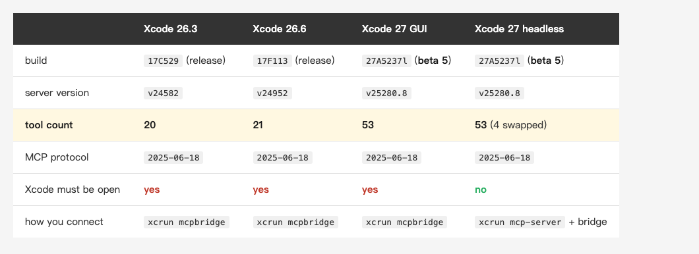
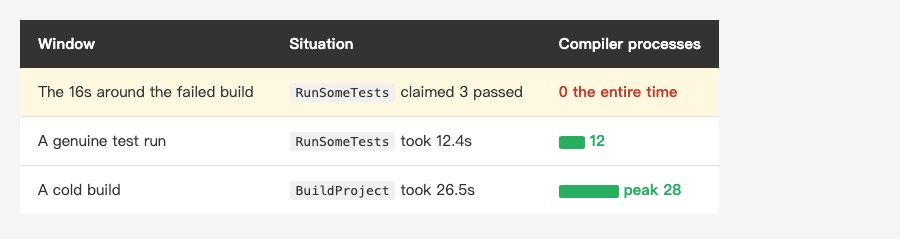
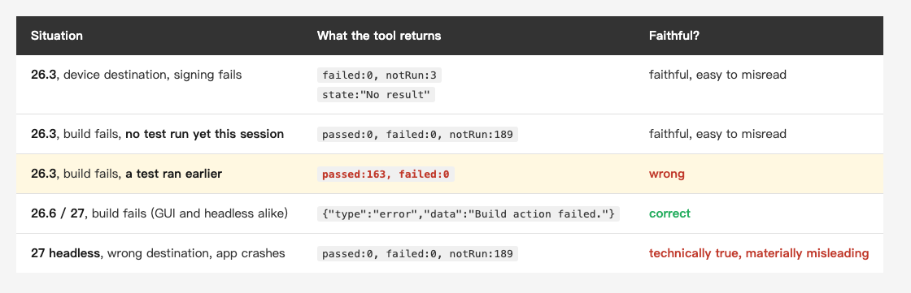
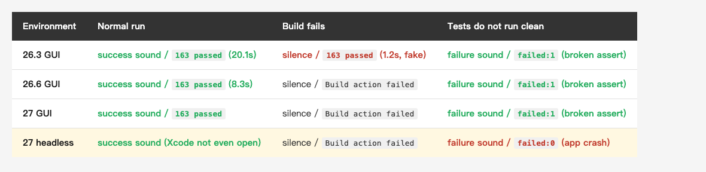

<!-- Tags: Claude Code, MCP, Xcode, iOS, Testing -->

*(Insert cover image here: cover.png)*

<!--
Gemini prompt: A cute Ghibli-inspired soft pastel illustration. A friendly robot proudly holds up a green checkmark report card, while behind it a small workshop bench is clearly on fire with a tiny wisp of smoke; the robot has not noticed. A chibi engineer nearby cups one hand to their ear, listening. Soft pastel colors (mint, peach, lavender), white background, clean and simple, no text anywhere. 16:9 ratio.
-->

# Xcode's Built-In MCP, Tested: It Reported 163 Tests Passing While the Project Would Not Compile

> This is not an introduction. I pointed the built-in MCP of Xcode 26.3, 26.6 and 27 at a commercial iOS project with a decade of baggage, across four environments and more than a dozen build-and-test rounds. The most interesting finding is not what it can do. It is **how it reports failure**.

---

## Introduction

Xcode 26.3 turned Xcode itself into an MCP server. Any MCP client can connect and ask it to read files, build, run tests, and search documentation. This shipped in February, and the introductions are already good — [fatbobman's piece](https://fatbobman.com/en/posts/xcode-263-claude/) covers setup and features thoroughly, and I have no interest in rewriting it.

What nobody has done is the other thing: **point it at a hard, real project and report honestly.**

Every existing tutorial runs on a clean demo app. The project I have is one this series has measured across three earlier articles: CocoaPods and SPM mixed together, a 1,660-line god node, 189 tests, and several dependencies whose minimum deployment target is still iOS 9. That is the kind of project most people actually have to deal with.

When the testing was done, the strongest finding had nothing to do with what Xcode can do. It was this moment:

**My script called `BuildProject` and got "the build failed." One and a bit seconds later it called `RunAllTests` and got "163 tests passed, 0 failed."**

This article is the chase after that one fact.

---

## Part 1: The environment, stated plainly

Numbers first, because the second-hand reports do not match.

*(Insert image here: table-env-en.png)*

<!--
| | Xcode 26.3 | Xcode 26.6 | Xcode 27 GUI | Xcode 27 headless |
|---|---|---|---|---|
| build | `17C529` (release) | `17F113` (release) | `27A5237l` (**beta 5**) | `27A5237l` (**beta 5**) |
| server version | `xcode-tools v24582` | `v24952` | `v25280.8` | `v25280.8` |
| **tool count** | **20** | **21** | **53** | **53** (4 swapped) |
| MCP protocol | `2025-06-18` | `2025-06-18` | `2025-06-18` | `2025-06-18` |
| Xcode must be open | yes | yes | yes | **no** |
| how you connect | `xcrun mcpbridge` | `xcrun mcpbridge` | `xcrun mcpbridge` | `xcrun mcp-server` + bridge |
-->

One thing first, because it changes how you should read the rest: **26.3 and 26.6 are shipping releases; 27 is still a beta** (build `27A5237l`, beta 5). The columns do not carry the same weight. The first two are what you will hit today. What 27 does is a snapshot of one beta build, and Apple can still change it before release. **The build number is in the table so you can check it against yours later.**

Three things worth stating up front.

**The tool count is 20, not the "about 20" or "around 40 endpoints" you will read elsewhere.** This is the kind of number you should just count yourself. The 20 in 26.3 fall into four groups: 9 file operations, 5 build-and-test, 2 diagnostics, 4 execution and documentation.

**And across the whole shipping 26 line, the tool surface barely moved.** 26.6 has 21: `ExecuteSnippet` was renamed `RunCodeSnippet`, and the only genuinely new tool is `XcodeGetCurrentFile`. Twenty to twenty-one over an entire release cycle, then a jump to 53 in 27.

Both of 27's modes expose **53 tools, but 4 of them differ**: headless drops `XcodeListWindows`, `XcodeGetCurrentFile`, `XcodeListNavigatorIssues`, and `DocumentationSearch`, and adds four workspace-management tools in their place. **What it loses is diagnostics and documentation search; what it gains is opening and closing files.** The mode that can reach CI is the mode with less ability to see what went wrong.

**The protocol version is pinned at `2025-06-18`.** The current spec is 2026-07-28 — the one [the previous article](https://medium.com/@n913239/building-my-own-mcp-server-237-lines-and-on-its-first-run-it-found-something-i-leaked-three-a50cb522624e) covered, the revision that made the whole protocol stateless. **Apple's own MCP server is two versions behind, and even the 27 beta has not moved.**

**It is not a server, it is a bridge.** `mcpbridge` describes itself as "STDIO Bridge for Xcode MCP Tools," and it talks over XPC to a **running Xcode process**. On 26.3, with no Xcode open, it fatal-errors immediately:

```
Fatal error: MCP_XCODE_PID environment variable not set
and no running Xcode processes found
```

That architectural difference is the whole subject of the next article. For this one, hold on to a single fact: **it is stateful, and the state does not live on the agent's side.**

As for whether it can build — the answer first: **yes, and not slowly.** On 26.3, with DerivedData wiped, a cold build of this project:

```json
{"buildResult":"The project built successfully.","elapsedTime":26.10,"errors":[]}
```

26.5 seconds, peaking at 28 concurrent compiler processes. I sampled the `swift-frontend` process count once per second, and the compilation activity falls entirely inside that call's window — **so `BuildProject` is synchronous, it blocks until the build finishes, and `elapsedTime` is real.**

Tests behave normally too:

```json
{"counts":{"passed":163,"failed":0,"notRun":26,"total":189}}
```

20.1 seconds, all 163 unit tests green, with 26 UI tests skipped because that target is disabled in the scheme.

**Up to here, everything is fine.** The problem showed up when I broke something.

---

## Part 2: The first fake success

I hit this by accident.

To get a clean cold-build number I wiped DerivedData entirely. But SPM checkouts live under DerivedData — wiping it left the project without one of its private packages, so the build was guaranteed to fail.

I had not realised that yet. The script just ran:

```json
BuildProject → {"buildResult":"The build failed…",
                "errors":[{"message":"Missing package product 'SharedKit'"}]}
```

One second later:

```json
RunSomeTests → {"counts":{"passed":3,"failed":0,"notRun":0,"total":3},
                "summary":"3 tests: 3 passed, 0 failed, 0 skipped, 0 not run",
                "results":[{"state":"Passed"}, {"state":"Passed"}, {"state":"Passed"}]}
```

**Three tests, all `Passed`, in 1.0 seconds.**

My first reaction was "that is impossible." My second was "then I need to be able to prove it is impossible."

### How you prove that nothing happened

You cannot falsify this from the return value — it looks exactly like a real one. So I used two pieces of external evidence.

**Evidence one: how long the real thing takes.** Later, in a healthy state, the same three tests took 12.4 seconds (it had to compile the test target) and 6.5 seconds on a rerun. **1.0 seconds is not enough time to even boot the simulator.**

**Evidence two: the CPU.** I sampled the compiler process count once per second throughout:

*(Insert image here: table-cpu-en.png)*

<!--
| Window | Situation | Compiler processes |
|---|---|---|
| The 16s around the failed build | `RunSomeTests` claimed 3 passed | **0 the entire time** |
| A genuine test run | `RunSomeTests` took 12.4s | **12** |
| A cold build | `BuildProject` took 26.5s | **peak 28** |
-->

**Across sixteen seconds with zero compilation or execution activity, it reported three tests passing.**

### But it is not just accepting anything

First I ruled out the most boring explanation — does it even read the arguments, or does it say Passed to whatever you hand it?

I passed a test that does not exist:

```json
RunSomeTests({"testIdentifier": "ThisClassDoesNotExist/test_totally_made_up()"})
→ 0.0s → {"type":"error",
          "data":"Test 'ThisClassDoesNotExist/test_totally_made_up()' not found in target 'MainAppTests'."}
```

**It validates test identifiers and rejects bad ones in zero seconds.** So it does read the arguments. It just substitutes the previous result when the build has failed.

### Scaling it to 189

One observation is not enough. I renamed the SPM checkouts directory to guarantee a failed build, and this time asked for everything rather than three:

```json
BuildProject → build failed
RunAllTests  → 1.2s → {"counts":{"passed":3,"notRun":186,"failed":0,"total":189}}
```

**Out of 189 tests, exactly the 3 I had run in the previous round report as passed, and the other 186 as `notRun`.**

**Reproducible, not a fluke.**

And the most complete version of it goes like this: run `RunAllTests` normally first (a genuine 20.1 seconds, 163 passed), then hide the SPM checkouts so the build fails, then run it again:

```json
1.2s → {"counts":{"passed":163,"failed":0,"notRun":26,"total":189}}
```

**It reproduced the previous round's 163-passed report in full.** A flawless, freshly-run-looking success, produced in 1.2 seconds against a project that will not compile.

An agent that reads the `failed` or `passed` field — which is every agent — concludes the tests passed and moves on.

### But what if there is no "previous" to return?

So far this is description, not proof. To assert that it returns *the previous result*, one control is missing: **if the session has never run a test at all, and the cache is empty, what comes back?**

I quit Xcode 26.3 entirely, reopened it, touched no tests, then hid the SPM checkouts so the build would fail:

```json
BuildProject → 1.1s → build failed: Missing package product
RunAllTests  → 2.4s → {"counts":{"passed":0,"failed":0,"notRun":189,"total":189}}
```

**No fake success.** Then, in the same session, I put the package back, ran the suite for real (15.4 seconds, 163 passed), and hid it again:

```json
RunAllTests → 2.2s → {"counts":{"passed":163,"failed":0,"notRun":26,"total":189}}
```

Empty returns empty; once filled, it starts copying. **Empty → full → copy, done in under two minutes.** Now it can be asserted: **it returns the previous result, unrelated to the current build state.**

With a useful corollary: **that cache lives in the Xcode session, and quitting Xcode clears it.** If you hit this on 26.3, restarting Xcode is the most direct fix. The deeper fix is to upgrade — **26.6 already fixed it**, and the evidence is in Part 4.

### And the "just read the full log" escape hatch is dead

I assumed there was still a way out. The response carries a `fullSummaryPath` pointing at a complete test report; a suspicious agent could just open that file.

So I opened it. The fake `163 passed` carries a `fullSummaryPath` too — and it points at **a file that was created moments ago**:

```
98089AB0….txt  78,689 bytes  Generated: 2026-08-21T09:07:24Z   ← the real run
CDE46581….txt  78,689 bytes  Generated: 2026-08-21T09:08:10Z   ← the fake one
2FBC13C9….txt  78,689 bytes  Generated: 2026-08-21T09:20:19Z   ← another fake
```

Three different filenames, three different timestamps, three identical byte counts. Strip the `Generated` line and `diff` them — **identical, character for character.**

**It does not hand you the old file's path again. It rewrites a 78,689-byte report from stale data and stamps it with the current time.** An agent that gets suspicious and opens that file finds a detailed success report generated three seconds ago.

Nothing in it says "copy."

---

## Part 3: Headless reports all-clear a different way

Xcode 27 adds something 26.3 does not have: **headless mode.** After `xcrun mcp-server enable`, the whole toolset is available without Xcode open. That is the only path by which MCP reaches CI, so I tested it specifically.

The build side is good news:

```json
BuildProject (headless) → 22.2s → {"buildResult":"The project built successfully."}
```

**No GUI, and the entire commercial project builds in 22.2 seconds.** What runs is not even Xcode — it is a service called `XcodeService.app`.

Then the tests:

```json
RunAllTests (headless) → 63.6s → {"counts":{"passed":0,"failed":0,"notRun":189,"total":189}}
```

**189 tests, not one of them ran. And `failed` is 0, with no error field anywhere in the response.**

This one differs from Part 2 — it **genuinely spent 63.6 seconds.** It was not a cached instant reply. It really went and did something, failed, and then wrote that failure up as a report saying no tests failed.

Where is the actual reason? In a path inside the return value:

```json
"fullConsoleLogsPath": "/var/folders/…/RunAllTests/test-console-log-….txt"
```

Open that file:

```
notice:Model: iPhone 17 Pro (iPhone18,1) / OS 27.0
notice:Successfully installed
notice:Successfully launched MainAppTests
error:MainApp (93329) encountered an error (Early unexpected exit, operation never
      finished bootstrapping - no restart will be attempted.
      (Underlying Error: Test crashed with signal trap before establishing connection.))
** TEST FINISHED **
```

**The app crashes on launch in the simulator.**

### Why it crashes: it picked a machine this app cannot run on

My first suspicion was that I had contaminated it myself — DerivedData holding build products from two different Xcode versions. So I deleted `Build` entirely (only that level; `SourcePackages` untouched) and let headless rebuild from scratch:

```json
BuildProject (headless, cold) → 22.2s → built successfully   ← peak of 28 compiler processes
RunSomeTests                  → 14.2s → {"failed":0,"notRun":1}  ← crashes anyway
```

Not a version mix. Which sends you back to the first line of that log:

```
notice:Model: iPhone 17 Pro (iPhone18,1) / OS 27.0
```

**Headless has no GUI, so it picked the run destination itself — and it picked iOS 27.0.** This decade-old project hits `EXC_BREAKPOINT` on launch under iOS 27.0.

So I changed one value:

```json
XcodeSwitchRunDestination → "iPhone 16 Pro (18.6)"          0.0s
BuildProject                                                 7.1s   success
RunAllTests → {"passed":163,"failed":0,"notRun":26}          9.2s
```

**Same headless server, same build products, same project. One dropdown value changed, and "189 tests, none ran" became "163 passed."**

That makes the conclusion sharper than "headless has a bug": **headless chose an environment for you, chose wrong, and then reported the consequence of that choice as `failed: 0`.** Fixing it costs one tool call — the problem is that an agent holding `failed: 0` has no reason to suspect the destination.

That choice it made for you, the one you cannot see, is the subject of the next article.

This is harder to catch than the cache problem. That one at least was absurdly fast, so watching the clock raises suspicion. This one took a minute and behaved perfectly normally. It just reached an empty conclusion.

### There is a design tension here

To be fair: Apple's "summary into context, full text onto disk" design is the right one. `BuildProject` returns a 4,714-character structured summary with the complete build log left at `fullLogPath`. `RunAllTests` truncates to 100 results and says so:

> "Results truncated to 100 of 189 tests. **Failed tests shown first.** Full logs available at …"

**Failures survive the truncation first** — a detail clearly designed for an agent, and a thoughtful one. Build logs run to tens of thousands of lines; putting all of that in context is a disaster.

But the design has a precondition: **the summary must be faithful.** Here the summary says no tests failed, and the only place that says "the app crashed" is a file. An agent that reads `failed: 0` has no reason to go open that file.

**A thoughtful design plus a summary that reports only the good news is worse than no thoughtfulness at all.**

---

## Part 4: Three failed builds, three different stories

Put every failed-build case side by side and the shape appears:

*(Insert image here: table-shape-en.png)*

<!--
| Situation | What the tool returns | Faithful? |
|---|---|---|
| **26.3**, destination set to a device, signing fails | `failed:0, notRun:3`, `state:"No result"` | **faithful, easy to misread** |
| **26.3**, build fails, **no test run yet this session** | `passed:0, failed:0, notRun:189` | **faithful, easy to misread** |
| **26.3**, build fails, **a test ran earlier this session** | **`passed:163, failed:0`** | **wrong** |
| **26.6 / 27**, build fails (GUI and headless alike) | `{"type":"error","data":"Build action failed. Inspect build logs."}` | **correct** |
| **27 headless**, wrong destination, app crashes on launch | `passed:0, failed:0, notRun:189` | **technically true, materially misleading** |
-->

Two things need saying clearly.

**First, "returns the previous result" is specific to 26.3 — and you do not have to wait for 27, because 26.6 already fixed it.** I reran the exact sequence on 26.6: one Xcode session, a real test run first to put `163 passed` in the cache, hide the SPM checkouts so the build fails, then call `RunAllTests`. It returned an error, not a fake success — and the string is **identical** to 27's. I hit the same conditions three times and got the error three times. 27's GUI and headless behave the same way.

**That matters more than "27 fixed it": 26.6 is a shipping release you can install today.**

**Second, the `failed: 0` trap did not disappear along with the cache bug.** Apart from the row marked wrong, none of these are strictly incorrect: no tests failed, because no tests ran. **And note that the last two rows return exactly the same thing** — one is 26.3 with an empty cache, the other is 27 headless on a machine the app cannot launch on. Entirely different causes, byte-identical JSON. An agent reading `failed: 0` will keep going.

**The safe field is not `failed`. It is the relationship between `passed` and `total`.** If you are going to wire this toolset up, the check should be `passed == total - disabled`, not `failed == 0`.

---

## Part 5: So find a channel that cannot omit

By this point the problem is well defined: **the one field MCP hands the agent is the one field that distorts.** So is there another channel?

The idea came from something very unglamorous. Xcode has always been able to play a sound when tests pass. **Settings → Behaviors → Testing → When testing succeeds → Play sound.** It is meant for humans, so you do not have to watch the screen.

The question is: **when the test run is triggered by an agent over MCP, does that sound still fire?**

Nobody had tested it. I tested it twelve times.

*(Insert image here: table-sound-en.png)*

<!--
| Environment | Normal run | Build fails | Tests do not run clean |
|---|---|---|---|
| **26.3 GUI** | success sound / `163 passed` (20.1s) | **silence** / **`163 passed` (1.2s, fake)** | failure sound / `failed:1` (broken assert) |
| **26.6 GUI** | success sound / `163 passed` (8.3s) | silence / `Build action failed` | failure sound / `failed:1` (broken assert) |
| **27 GUI** | success sound / `163 passed` | silence / `Build action failed` | failure sound / `failed:1` (broken assert) |
| **27 headless** | **success sound** (Xcode not even open) | silence / `Build action failed` | **failure sound** / **`failed:0`** (app crash) |
-->

Four results, each more surprising than the last.

**One: across twelve runs, the sound never once disagreed with reality.** Including the three broken-assertion cells — I flipped an `XCTAssertTrue` to `XCTAssertFalse`, the tool correctly reported `failed: 1`, and the failure sound fired on cue.

**Two: headless fires the sound with Xcode closed.** I got this one wrong. My reasoning was that with no Xcode GUI there is nothing to execute Behaviors. There was a sound — `XcodeService.app` honours the same setting. **That feedback channel is not tied to the GUI.** The agent runs in the background, Xcode is not open at all, and you still hear the outcome.

**Three, and this is the one that matters: in 26.3's fake-success case, MCP returned 163 passed and the sound did not fire.**

One execution, two channels, opposite answers:

- **The JSON the agent reads**: 163 passed, 0 failed
- **What Xcode played for the human**: silence

**Xcode knows that nothing ran. It simply did not put that fact into the JSON it hands the agent.**

That sentence is worth pausing on. This is not "Xcode does not know." It is "Xcode knows, and the field the agent can read does not contain it." **The same program told the human the truth, and left that sentence out of what it told the agent.**

**Four: on 27 headless, the same thing happens again, in the opposite direction.**

I meant to test "a test genuinely fails" in that cell and could not — the app crashes on launch on that destination, so the broken assertion never gets evaluated. What fell out instead was worth more:

- **The JSON the agent reads**: `{"failed": 0, "passed": 0, "notRun": 1}` — nothing failed
- **What Xcode played for the human**: **the failure sound**, plus a system crash-report window

Xcode judged the run a failure and played the sound it was configured to play. The same run wrote `failed: 0` into the JSON. And this time **Xcode's GUI was not open at all** — the thing that made the sound was `XcodeService.app`.

Three versions, two modes, two gaps pointing opposite ways. **Both times, the sound was on the side of the facts.**

---

## Summary

Three sentences.

**One, the build side works.** 26.3 cold-builds a decade-old commercial project in 26.5 seconds, 27 headless does it with no GUI at all, and tests produce an identical 163 passed across all four environments. The path itself is sound.

**Two, what is not sound is how it reports failure.** 26.3 will hand you back the previous result verbatim — a complete 163-passed report, right down to a rewritten 78,689-byte full log at `fullSummaryPath` carrying a fresh timestamp. 26.6 fixed that, and so did 27, but the `failed: 0` trap did not go with it: 26.3 with an empty cache and 27 headless crashing on a badly chosen destination return byte-identical JSON to the agent. **If you wire this up, check `passed == total - disabled`, not `failed == 0`.**

Three concrete remedies: **if you hit the fake success on 26.3, quit Xcode and reopen it** — that clears the cache; **and the deeper fix is to move to 26.6, where the bug is gone and which is a shipping release, not a beta**; **if headless hands you a wall of `notRun`, go look at which simulator it picked for you.** Changing that one value took the same build products from "189 tests, none ran" to "163 passed."

**Three, and all of that presumes you can notice.** I caught it not by reading return values — they look exactly like the real thing. I caught it with three external signals: how long the real work takes, whether the CPU was doing anything, and a sound meant for a human.

That last one I did not expect. The previous article was about turning rules into machine-executable assertions so a machine could catch a human's oversight. This one inverts it: **once a machine starts reporting on its own work, you need a channel that does not run through the machine.**

A checkbox that plays a sound turned out to be the most reliable channel I found. It is unglamorous, but it does not go through that JSON.

One note on shelf life: **the fix for the fake success has already shipped** (26.6, `17F113`) — you do not need 27 for it. What only 27 has — headless, and the self-rescue tools the next article covers — currently exists only in a beta (beta 5, `27A5237l`) and can still move before release. **And 26.3's fake success is not a temporary beta wart: it is shipping behaviour today, with a shipping fix.**

The next article takes the other half: why, with this same toolset, an agent gets stuck in front of a dropdown menu it cannot see — and what 27 changed so it can walk itself out.

---

## References

- [Xcode documentation — Giving external agents access to Xcode](https://developer.apple.com/documentation/xcode/giving-external-agents-access-to-xcode) — the only official write-up, including `claude mcp add --transport stdio xcode -- xcrun mcpbridge`
- [Model Context Protocol](https://modelcontextprotocol.io/) — the spec; all three Xcode versions sit at `2025-06-18`
- [fatbobman — Xcode 26.3 and Claude](https://fatbobman.com/en/posts/xcode-263-claude/) — the clearest setup-and-features write-up in the Chinese Swift community; deliberately not repeated here
- [XcodeBuildMCP](https://github.com/cameroncooke/XcodeBuildMCP) — third-party alternative driving the `xcodebuild` CLI, no Xcode required
- Earlier in this series: [Building My Own MCP Server — 237 Lines, and on Its First Run It Found Something I Leaked Three Months Ago](https://medium.com/@n913239/building-my-own-mcp-server-237-lines-and-on-its-first-run-it-found-something-i-leaked-three-a50cb522624e) — that one turned rules into machine-executable assertions; this one verifies the machine's own reporting
