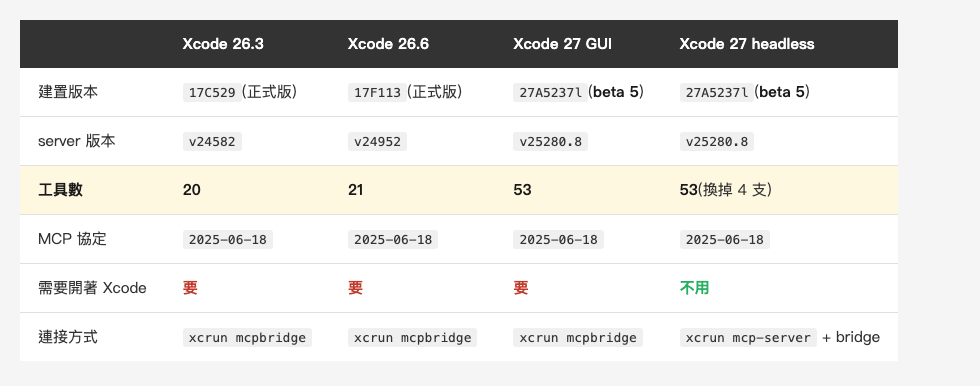
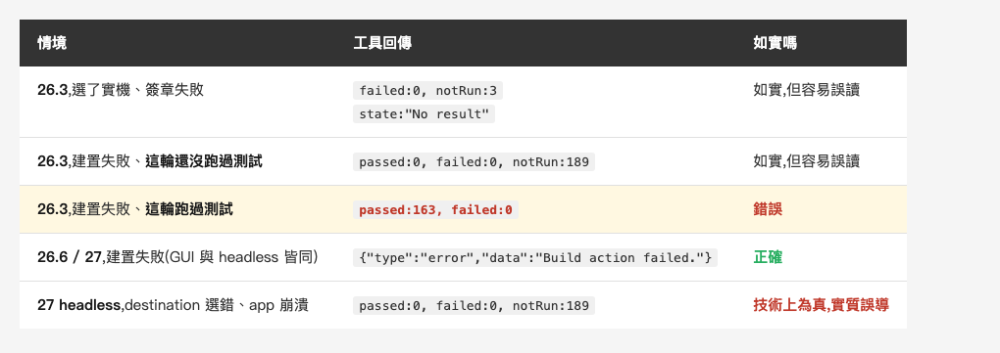

<!-- Tags: Claude Code, MCP, Xcode, iOS, Testing -->

*(在這裡插入封面圖:cover.png)*

<!--
Gemini prompt: A cute Ghibli-inspired soft pastel illustration. A friendly robot proudly holds up a green checkmark report card, while behind it a small workshop bench is clearly on fire with a tiny wisp of smoke; the robot has not noticed. A chibi engineer nearby cups one hand to their ear, listening. Soft pastel colors (mint, peach, lavender), white background, clean and simple, no text anywhere. 16:9 ratio.
-->

# Xcode 內建 MCP 實測:它回報 163 個測試全過,而專案根本編不起來

> 這不是一篇介紹文。我把 Xcode 26.3、26.6 與 27 的內建 MCP 丟進一個有十年包袱的商業 iOS 專案,跑了四種環境、十幾輪建置與測試。最值得寫的不是它能做什麼,是**它報告失敗的方式**。

---

## 前言

Xcode 26.3 把 Xcode 自己變成了 MCP server。任何 MCP client 都能接上去,叫它讀檔、建置、跑測試、查文件。這件事今年二月就發布了,中文圈已經有寫得很好的介紹——[fatbobman 那篇](https://fatbobman.com/en/posts/xcode-263-claude/)把設定與功能講得很清楚,我不打算重寫一遍。

沒人做的是另一件事:**把它丟進一個難搞的真實專案,然後誠實回報。**

現有的教學全部跑在乾淨的 demo app 上。而我手上這個專案是這個系列量過三篇的老朋友:CocoaPods 與 SPM 混用、一個 1,660 行的 god node、189 個測試、部分相依套件的最低部署目標還停在 iOS 9。這種專案才是大多數人真正要面對的。

實測跑完,最強的發現跟「Xcode 能做什麼」無關。它是這樣一個畫面:

**我的腳本呼叫 `BuildProject`,得到「建置失敗」。一點二秒後呼叫 `RunAllTests`,得到「163 個測試通過,0 個失敗」。**

這篇就是在追這一件事。

---

## Part 1:先把環境講清楚

動手前先把數字擺出來,因為二手報導對不上。

*(在這裡插入圖片:table-env.png)*

<!--
| | Xcode 26.3 | Xcode 26.6 | Xcode 27 GUI | Xcode 27 headless |
|---|---|---|---|---|
| 建置版本 | `17C529`(正式版) | `17F113`(正式版) | `27A5237l`(**beta 5**) | `27A5237l`(**beta 5**) |
| server 版本 | `xcode-tools v24582` | `v24952` | `v25280.8` | `v25280.8` |
| **工具數** | **20** | **21** | **53** | **53**(換掉 4 支) |
| MCP 協定 | `2025-06-18` | `2025-06-18` | `2025-06-18` | `2025-06-18` |
| 需要開著 Xcode | 要 | 要 | 要 | **不用** |
| 連接方式 | `xcrun mcpbridge` | `xcrun mcpbridge` | `xcrun mcpbridge` | `xcrun mcp-server` + bridge |
-->

先講一件會影響你怎麼讀這篇的事:**26.3 與 26.6 是正式版,27 還是 beta**(build `27A5237l`,beta 5)。所以每一欄的份量不一樣——前兩欄是你今天裝上去就會遇到的行為,27 那欄是一個 beta build 的快照,正式版出來前都還可能再變。**我把 build 號寫進表裡,就是為了讓你之後能核對。**

三件事值得先講:

**工具數是 20,不是報導說的「約 20 個」或「約 40 個端點」。** 這種數字自己數一遍就好。26.3 的 20 支分成四類:檔案操作 9 支、建置測試 5 支、診斷 2 支、執行與文件 4 支。

**而整個 26 正式版線,工具面幾乎沒動過。** 26.6 是 21 支:`ExecuteSnippet` 改名成 `RunCodeSnippet`,真正新增的只有 `XcodeGetCurrentFile` 一支。從 20 到 21 花了整個 26 週期,到 27 才一次跳到 53。

27 的兩種模式**都是 53 支,但有 4 支不一樣**:headless 拿掉 `XcodeListWindows`、`XcodeGetCurrentFile`、`XcodeListNavigatorIssues`、`DocumentationSearch`,換上四支 workspace 管理工具。**被拿掉的那批裡有診斷與查文件,換來的全是開關檔案。** 進得了 CI 的那一版,反而少了看見問題的能力。

**協定版本停在 `2025-06-18`。** 而現行規格是 2026-07-28——就是[上一篇](https://medium.com/@n913239/%E8%87%AA%E5%B7%B1%E5%81%9A%E4%B8%80%E5%80%8B-mcp-server-237-%E8%A1%8C-%E7%AC%AC%E4%B8%80%E6%AC%A1%E8%B7%91%E5%B0%B1%E6%8A%93%E5%88%B0%E6%88%91%E4%B8%89%E5%80%8B%E6%9C%88%E5%89%8D%E6%B4%A9%E6%BC%8F%E7%9A%84%E6%9D%B1%E8%A5%BF-921040a17e7b)裡談到那個把整個協定變成 stateless 的版本。**Apple 自己的 MCP server 落後兩版,連 27 的 beta 都還沒換。**

**它不是 server,是 bridge。** `mcpbridge` 的自我描述就是 "STDIO Bridge for Xcode MCP Tools",它走 XPC 連到一個**活著的 Xcode 行程**。26.3 沒開 Xcode 就直接 fatal error:

```
Fatal error: MCP_XCODE_PID environment variable not set
and no running Xcode processes found
```

這個架構差異會在下一篇整篇展開。這篇只要記住一件事:**它有狀態,而狀態不在 agent 這邊。**

至於能不能建起來——先給結論:**可以,而且不慢**。26.3 清空 DerivedData 之後冷啟建置這個專案:

```json
{"buildResult":"The project built successfully.","elapsedTime":26.10,"errors":[]}
```

26.5 秒,峰值 28 支編譯器行程並行。我每秒取樣一次 `swift-frontend` 的行程數,編譯活動完整落在這次呼叫的區間內——**所以 `BuildProject` 是同步的,會等到編完才回,`elapsedTime` 也是真的。**

測試也一樣正常:

```json
{"counts":{"passed":163,"failed":0,"notRun":26,"total":189}}
```

20.1 秒,163 個 unit test 全過,26 個 UI 測試因為 scheme 裡停用而沒跑。

**到這裡為止,一切都很好。** 問題出在我把它弄壞的時候。

---

## Part 2:第一個假的成功

事情是意外撞到的。

我為了量一個乾淨的冷啟數字,把 DerivedData 整個清掉了。而 SPM 的相依套件 checkout 就住在 DerivedData 底下——清掉之後,專案少了一個私有套件,建置必然失敗。

我沒意識到這件事,腳本照跑:

```json
BuildProject → {"buildResult":"The build failed…",
                "errors":[{"message":"Missing package product 'SharedKit'"}]}
```

一秒之後:

```json
RunSomeTests → {"counts":{"passed":3,"failed":0,"notRun":0,"total":3},
                "summary":"3 tests: 3 passed, 0 failed, 0 skipped, 0 not run",
                "results":[{"state":"Passed"}, {"state":"Passed"}, {"state":"Passed"}]}
```

**三個測試,全部 `Passed`,耗時 1.0 秒。**

我當下的第一反應是「不可能」,第二反應是「我要能證明它不可能」。

### 怎麼證明「什麼都沒發生」

光看回傳值是無法證偽的——它長得跟真的一模一樣。所以我用了兩個外部證據。

**證據一:同一件事真的做要多久。** 後來在正常狀態下跑同樣三個測試,花了 12.4 秒(需要編譯測試 target)、重跑一次 6.5 秒(已建好)。**1.0 秒連模擬器都來不及啟動。**

**證據二:CPU。** 我全程每秒取樣一次編譯器行程數:

*(在這裡插入圖片:table-cpu.png)*

<!--
| 時間區間 | 情境 | 編譯器行程數 |
|---|---|---|
| 建置失敗那 16 秒 | `RunSomeTests` 宣稱 3 passed | **全程 0** |
| 正常跑測試時 | `RunSomeTests` 花 12.4s | **12** |
| 冷啟建置時 | `BuildProject` 花 26.5s | **峰值 28** |
-->

**在完全沒有任何編譯或執行活動的十六秒裡,它回報三個測試通過。**

### 但它不是照單全收

我先排除了最無聊的解釋——會不會它根本不看參數,你問什麼它都說 Passed?

丟一個不存在的測試進去:

```json
RunSomeTests({"testIdentifier": "ThisClassDoesNotExist/test_totally_made_up()"})
→ 0.0s → {"type":"error",
          "data":"Test 'ThisClassDoesNotExist/test_totally_made_up()' not found in target 'MainAppTests'."}
```

**它會驗證測試 ID,零點零秒就正確拒絕。** 所以它有在讀參數,只是在建置失敗的時候,把上一次的結果拿出來充數。

### 放大到 189 個

一次觀察不夠。我把 SPM checkout 目錄改名藏起來,讓建置必定失敗,然後這次不挑三個,直接叫它跑全部:

```json
BuildProject → build failed
RunAllTests  → 1.2s → {"counts":{"passed":3,"notRun":186,"failed":0,"total":189}}
```

**189 個測試裡,恰好是我前一輪跑過的那 3 個回報通過,其餘 186 個 `notRun`。**

**穩定可重現,不是偶發。**

而最完整的一次是這樣:先正常跑一輪 `RunAllTests`(真的花了 20.1 秒,163 passed),再藏起 SPM 讓建置失敗,再跑一次:

```json
1.2s → {"counts":{"passed":163,"failed":0,"notRun":26,"total":189}}
```

**它完整複製了上一輪那份 163 passed 的報表。** 一份毫無破綻、看起來就是剛跑完的成功結果,在專案編不起來的狀態下,一點二秒生出來。

一個只讀 `failed` 或 `passed` 欄位的 agent——也就是所有 agent——會判定測試通過,然後繼續往下做。

### 那如果本來就沒有「上一次」呢

到這裡我還只是在描述現象。要斷言「它回的是上一次的結果」,還缺一個反方向的對照:**如果這個 session 從來沒跑過測試,快取是空的,它會回什麼?**

我把 Xcode 26.3 整個關掉重開,不碰任何測試,然後藏起 SPM 讓建置失敗:

```json
BuildProject → 1.1s → build failed: Missing package product
RunAllTests  → 2.4s → {"counts":{"passed":0,"failed":0,"notRun":189,"total":189}}
```

**沒有假成功。** 接著在同一個 session 裡把套件放回去、真的跑一輪(15.4 秒,163 passed),再藏起來:

```json
RunAllTests → 2.2s → {"counts":{"passed":163,"failed":0,"notRun":26,"total":189}}
```

空的時候回空,填滿之後就開始複製。**空 → 滿 → 複製,一次做完,前後不到兩分鐘。** 到這裡可以斷言了:**它回的就是上一次的結果,與本次建置狀態無關。**

順帶給出一個實用的推論:**這份快取活在 Xcode 的 session 裡,關掉 Xcode 再開就清空了。** 如果你在 26.3 上撞到這個 bug,重開 Xcode 是最直接的解法。而更根本的解法是升級——**26.6 就修好了**,證據在 Part 4。

### 而「去讀完整 log」這條退路是死的

我原本以為這個 bug 還有救——回傳裡有一個 `fullSummaryPath`,指向一份完整的測試報表。agent 覺得可疑的話,去讀那個檔案就好。

我去讀了。那份假的 `163 passed` 也附了一個 `fullSummaryPath`,而且**指向一個剛剛才產生的新檔案**:

```
98089AB0….txt  78,689 bytes  Generated: 2026-08-21T09:07:24Z   ← 真的跑那次
CDE46581….txt  78,689 bytes  Generated: 2026-08-21T09:08:10Z   ← 假的那次
2FBC13C9….txt  78,689 bytes  Generated: 2026-08-21T09:20:19Z   ← 又一次假的
```

三個不同的檔名、三個不同的時間戳、三個一模一樣的位元組數。把 `Generated` 那行拿掉之後 `diff`——**逐字元完全相同**。

**它不是把舊檔案的路徑再給你一次,是拿舊資料重新寫了一份 78,689 位元組的報表,蓋上現在的時間。** 一個起疑的 agent 打開那個檔案,看到的是一份時間戳是三秒前、內容詳盡的成功報告。

沒有任何線索指向「這是複製品」。

---

## Part 3:headless 用另一種方式報平安

Xcode 27 多了一個 26.3 沒有的東西:**headless 模式**。`xcrun mcp-server enable` 之後,不用開 Xcode 也能提供這整套工具。這是 MCP 進得了 CI 的唯一路徑,所以我特別測了。

建置端是好消息:

```json
BuildProject (headless) → 22.2s → {"buildResult":"The project built successfully."}
```

**沒有 GUI,一樣把整個商業專案建起來,22.2 秒。** 跑的甚至不是 Xcode,是一個叫 `XcodeService.app` 的服務。

然後測試:

```json
RunAllTests (headless) → 63.6s → {"counts":{"passed":0,"failed":0,"notRun":189,"total":189}}
```

**189 個測試,一個都沒跑。而 `failed` 是 0,回應裡沒有任何錯誤欄位。**

這次跟 Part 2 不一樣——它**真的花了 63.6 秒**。它不是秒回快取,是真的去做了什麼、失敗了,然後把失敗寫成了一份「沒有測試失敗」的報表。

真正的原因在哪?在回傳值裡的一個路徑:

```json
"fullConsoleLogsPath": "/var/folders/…/RunAllTests/test-console-log-….txt"
```

打開那個檔案:

```
notice:Model: iPhone 17 Pro (iPhone18,1) / OS 27.0
notice:Successfully installed
notice:Successfully launched MainAppTests
error:MainApp (93329) encountered an error (Early unexpected exit, operation never
      finished bootstrapping - no restart will be attempted.
      (Underlying Error: Test crashed with signal trap before establishing connection.))
** TEST FINISHED **
```

**App 在模擬器上啟動即崩潰。**

### 為什麼崩潰:它自己挑了一台這個 app 跑不起來的機器

我第一個懷疑是自己弄髒的——DerivedData 裡混了兩個 Xcode 版本的建置產物。所以我把 `Build` 整個刪掉(只刪這一層,`SourcePackages` 不碰),讓 headless 從零重建:

```json
BuildProject (headless, 冷啟) → 22.2s → built successfully   ← 峰值 28 支編譯器行程
RunSomeTests                  → 14.2s → {"failed":0,"notRun":1}  ← 照樣崩潰
```

不是混版。那就往回看那行 log 的第一句:

```
notice:Model: iPhone 17 Pro (iPhone18,1) / OS 27.0
```

**headless 沒有 GUI,所以那個 run destination 是它自己挑的——它挑了 iOS 27.0。** 而這個十年包袱的專案在 iOS 27.0 上啟動即 `EXC_BREAKPOINT`。

於是我改了一個值:

```json
XcodeSwitchRunDestination → "iPhone 16 Pro (18.6)"          0.0s
BuildProject                                                 7.1s   成功
RunAllTests → {"passed":163,"failed":0,"notRun":26}          9.2s
```

**同一個 headless、同一份產物、同一個專案,只換了一個下拉選單的值,就從「189 個全部沒跑」變成「163 個全過」。**

所以這一段的結論比「headless 有 bug」精確得多:**headless 替你選了一個環境,選錯了,然後把選錯的後果回報成 `failed: 0`。** 修好它只要一次工具呼叫——問題是 agent 拿到 `failed: 0`,沒有任何理由去懷疑 destination。

那個「它自己挑的、你看不到的選擇」是下一篇的主題。

這比 Part 2 的快取問題更難察覺。快取那個至少快得離譜,你盯著時間會起疑。這個花了一分鐘,行為完全正常,只是結論是空的。

### 這裡有個設計上的兩難

要公平地說:Apple 這個「摘要進 context、全文留磁碟」的設計本身是對的。`BuildProject` 回 4,714 字元的結構化摘要,完整的建置 log 留在 `fullLogPath`;`RunAllTests` 回被截斷成 100 筆的結果,並註明:

> "Results truncated to 100 of 189 tests. **Failed tests shown first.** Full logs available at …"

**截斷時優先保留失敗項**——這是為 agent 設計過的細節,很體貼。建置 log 動輒幾萬行,全塞進 context 是災難。

但這個設計有一個前提:**摘要必須如實。** 而這裡的摘要說「沒有測試失敗」,唯一說出「app 崩潰了」的地方在檔案裡。agent 拿到 `failed: 0` 就不會有理由去開那個檔案。

**體貼的設計配上報喜不報憂的摘要,結果比不體貼更糟。**

---

## Part 4:三種建置失敗,三種說法

把所有建置失敗的情境放在一起看,形狀就出來了:

*(在這裡插入圖片:table-shape.png)*

<!--
| 情境 | 工具回傳 | 如實嗎 |
|---|---|---|
| **26.3**,destination 選了實機、簽章失敗 | `failed:0, notRun:3`,`state:"No result"` | **如實,但容易誤讀** |
| **26.3**,建置失敗、**這輪還沒跑過測試** | `passed:0, failed:0, notRun:189` | **如實,但容易誤讀** |
| **26.3**,建置失敗、**這輪跑過測試** | **`passed:163, failed:0`** | **錯誤** |
| **26.6 / 27**,建置失敗(GUI 與 headless 皆同) | `{"type":"error","data":"Build action failed. Inspect build logs."}` | **正確** |
| **27 headless**,destination 選錯、app 啟動即崩潰 | `passed:0, failed:0, notRun:189` | **技術上為真,實質誤導** |
-->

有兩件事要說清楚。

**第一,「回上一次結果」是 26.3 的問題,而且不必等 27——26.6 就修好了。** 我在 26.6 上重跑了一模一樣的流程:同一個 Xcode session、先真的跑一輪拿到 `163 passed` 把快取灌滿、藏起 SPM 讓建置失敗、再呼叫 `RunAllTests`。它回的是錯誤,不是假的成功,而且字串跟 27 **一字不差**。同樣條件我命中三次,三次都是錯誤。27 的 GUI 與 headless 也一樣。

**這件事的實用意義比「27 修了」大得多:26.6 是正式版,你今天就裝得到。**

**第二,`failed: 0` 這個陷阱,並沒有跟著快取 bug 一起消失。** 除了那一列「錯誤」之外,其他四列嚴格說起來都不算錯:沒有測試失敗,因為根本沒有測試跑。**而且注意最後兩列的回傳是一模一樣的** —— 一個是 26.3 快取空、一個是 27 headless 選錯機器,原因天差地遠,agent 看到的 JSON 完全相同。它讀到 `failed: 0`,就是會往下走。

**真正安全的欄位不是 `failed`,是 `passed` 與 `total` 的關係。** 如果你要接這套工具,檢查邏輯應該是 `passed == total - disabled`,不是 `failed == 0`。

---

## Part 5:那就找一個不會漏報的訊號

問題到這裡很清楚:**MCP 回給 agent 的那個欄位,正好是唯一會失真的那個。** 那還有沒有別的管道?

這個念頭來自一個很土的想法:Xcode 本來就有「測試成功時播放音效」的功能。**Settings → Behaviors → Testing → When testing succeeds → Play sound。** 那是給人聽的,設計目的是讓你不必盯著螢幕。

問題是:**當測試是 agent 透過 MCP 觸發的,這個音效還會響嗎?**

沒人測過。我測了十二次。

*(在這裡插入圖片:table-sound.png)*

<!--
| 環境 | 正常跑 | 建置失敗 | 測試沒跑過 |
|---|---|---|---|
| **26.3 GUI** | 成功音 / `163 passed`(20.1s) | **無聲** / **`163 passed`(1.2s,假的)** | 失敗音 / `failed:1`(改壞斷言) |
| **26.6 GUI** | 成功音 / `163 passed`(8.3s) | 無聲 / `Build action failed` | 失敗音 / `failed:1`(改壞斷言) |
| **27 GUI** | 成功音 / `163 passed` | 無聲 / `Build action failed` | 失敗音 / `failed:1`(改壞斷言) |
| **27 headless** | **成功音**(Xcode 根本沒開) | 無聲 / `Build action failed` | **失敗音** / **`failed:0`**(app 崩潰) |
-->

四個結果,一個比一個意外。

**一、音效十二次沒有一次與事實不符。** 包括「改壞一個斷言」那三格——我把 `XCTAssertTrue` 改成 `XCTAssertFalse`,工具正確回報 `failed: 1`,失敗音也準時響。

**二、headless 沒開 Xcode 也會響。** 這格我猜錯了。我原本推論:沒有 Xcode GUI,就沒有東西去執行 Behaviors。實測有聲音——`XcodeService.app` 同樣吃這份設定。**那條回饋管道不綁 GUI**,agent 在背景跑、Xcode 完全沒開,人照樣聽得到結果。

**三、而最關鍵的是 26.3 那個假成功的格子:MCP 回了 163 passed,音效沒有響。**

同一次執行,兩個管道給出相反的答案:

- **agent 讀到的 JSON**:163 passed,0 failed
- **Xcode 播給人聽的**:安靜

**Xcode 知道什麼都沒跑。它只是沒有把這件事寫進回給 agent 的那份 JSON 裡。**

這句話值得停一下。這不是「Xcode 不知道」,是「Xcode 知道,但 agent 讀得到的那個欄位裡沒有」。**同一個程式,對人說了實話,對 agent 漏了這句。**

**四、而在 27 headless 上,同一件事以相反的方向再發生一次。**

那格我原本想測「測試真的失敗」,但辦不到——app 在那個 destination 上啟動即崩潰,壞掉的斷言根本沒機會被求值。結果反而撞出更值得寫的一格:

- **agent 讀到的 JSON**:`{"failed": 0, "passed": 0, "notRun": 1}`——一個失敗都沒有
- **Xcode 播給人聽的**:**失敗音**,外加一個系統崩潰報告視窗

Xcode 判定這次執行是失敗的,照設定響了失敗音;同一次執行寫進 JSON 的卻是 `failed: 0`。而這次 **Xcode 的 GUI 根本沒開**——響的是 `XcodeService.app`。

三個版本、兩種模式、兩個相反方向的落差,**音效兩次都站在事實那一邊。**

---

## 總結

把這篇的實測收成三句話。

**第一,建置這一端是可用的。** 26.3 冷啟 26.5 秒建完一個十年包袱的商業專案,27 headless 沒開 GUI 也做得到,測試在四種環境跑出完全一致的 163 passed。這條路本身是通的。

**第二,不可用的是它報告失敗的方式。** 26.3 會把上一次的結果原樣回給你,而且是完整的 163 passed 報表——連 `fullSummaryPath` 那份 78,689 位元組的全文都是重寫的複製品,時間戳是新的。26.6 就修了這個,27 也一樣,但 `failed: 0` 的陷阱沒跟著消失:26.3 快取空的時候,和 27 headless 挑錯 destination 讓 app 崩潰的時候,回給 agent 的 JSON 一模一樣。**要接這套工具,檢查 `passed == total - disabled`,不要檢查 `failed == 0`。**

三個具體的解法:**26.3 撞到假成功,關掉 Xcode 再開就清掉了**;**而更根本的是升到 26.6——這個 bug 在那裡已經修好,而且它是正式版,不是 beta**;**headless 跑出一片 `notRun`,先去看它替你挑了哪一台模擬器**——我這次就是換一個 destination,同一份產物就從 189 個全沒跑變成 163 個全過。

**第三,而這一切的前提是你有辦法發現。** 我能抓到,靠的不是讀回傳值——回傳值長得跟真的一樣。靠的是三個外部證據:同一件事真的做要多久、CPU 有沒有在動、以及那個給人聽的音效。

最後這點是我沒預期的。前一篇講的是把規則變成機器可執行的斷言,好讓機器擋住人的疏忽。這篇反過來:**當機器開始回報自己的工作成果,你需要一個不經過它的管道去驗證。**

一個播放音效的核取方塊,是我這次找到最可靠的那個管道。它土,但它不經過那份 JSON。

最後補一句時效:**假成功的修正已經進了正式版**(26.6,`17F113`),不必等 27。但 27 才有的那些東西——headless、以及下一篇要談的自救工具——目前只活在 beta 5(`27A5237l`),正式版出來前都可能再動。**26.3 那個假成功則不是 beta 的暫時毛病,是正式版上現在就會踩到的行為,而它的解藥同樣在正式版上。**

下一篇談另一半:同樣這套工具,為什麼 agent 會卡在一個它根本看不見的下拉選單前面——以及 27 做了什麼,讓它能自己走出來。

---

## 參考資料

- [Xcode 官方文件 — Giving external agents access to Xcode](https://developer.apple.com/documentation/xcode/giving-external-agents-access-to-xcode) — 官方唯一一份說明,含 `claude mcp add --transport stdio xcode -- xcrun mcpbridge` 的接法
- [Model Context Protocol 官方站](https://modelcontextprotocol.io/) — 協定規格;Xcode 三個版本都停在 `2025-06-18`
- [fatbobman — Xcode 26.3 與 Claude](https://fatbobman.com/en/posts/xcode-263-claude/) — 中文 Swift 圈把設定與功能講得最清楚的一篇,本篇刻意不重複它
- [XcodeBuildMCP](https://github.com/cameroncooke/XcodeBuildMCP) — 第三方替代方案,走 `xcodebuild` CLI,不需要開 Xcode
- 系列前篇:[自己做一個 MCP server:237 行,第一次跑就抓到我三個月前洩漏的東西](https://medium.com/@n913239/%E8%87%AA%E5%B7%B1%E5%81%9A%E4%B8%80%E5%80%8B-mcp-server-237-%E8%A1%8C-%E7%AC%AC%E4%B8%80%E6%AC%A1%E8%B7%91%E5%B0%B1%E6%8A%93%E5%88%B0%E6%88%91%E4%B8%89%E5%80%8B%E6%9C%88%E5%89%8D%E6%B4%A9%E6%BC%8F%E7%9A%84%E6%9D%B1%E8%A5%BF-921040a17e7b) — 那篇是把規則變成機器可執行的斷言,這篇是反過來驗證機器自己的回報
