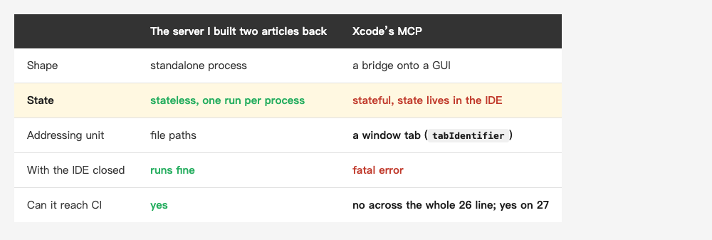
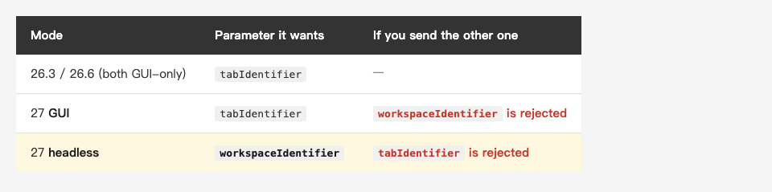
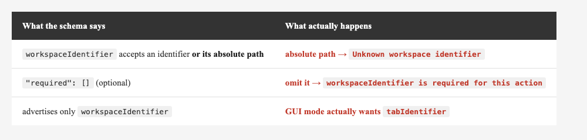
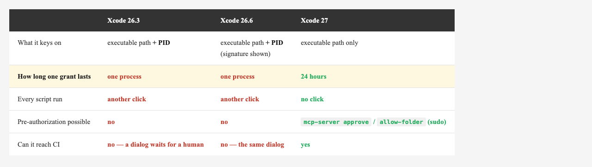
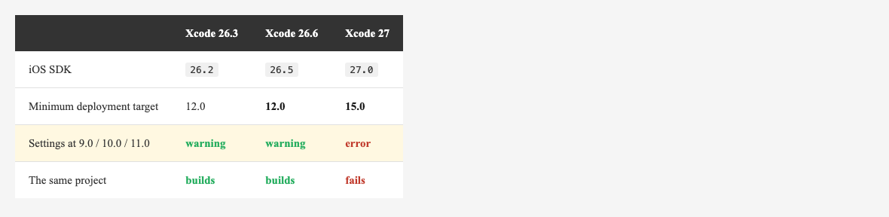

<!-- Tags: Claude Code, MCP, Xcode, iOS, Developer Tools -->

*(Insert cover image here: cover.png)*

<!--
Gemini prompt: A cute Ghibli-inspired soft pastel illustration. A small robot stands in front of a large control panel, reaching for a dropdown switch that is drawn behind a pane of frosted glass it cannot reach through; a chibi engineer on the other side casually flips the same switch. Soft pastel colors (mint, peach, lavender), white background, clean and simple, no text anywhere. 16:9 ratio.
-->

# The Agent Is Stuck in Front of a Dropdown It Cannot See: State in Xcode's MCP

> The previous article was about how Xcode's built-in MCP reports failure. This one is about why it fails: it is not a server, it is a bridge bolted onto an IDE. Half the state lives inside that IDE, where the agent can neither see nor change it. Xcode 27 fixed the worst of those.

---

## Introduction

Here is a moment from the testing.

Same script, same project, same version of Xcode, run twice. The first time:

```json
BuildProject → {"buildResult":"The build failed…",
                "errors":[{"message":"No Accounts: Add a new account in Accounts settings."},
                          {"message":"No profiles for 'com.example.mainapp' were found…"}]}
```

Between the two runs I changed no code and edited no configuration file. I changed the destination in Xcode's toolbar from a physical device to a simulator. The second time:

```json
BuildProject → {"buildResult":"The project built successfully.",
                "elapsedTime":26.10,"errors":[]}
```

**What decided whether the agent succeeded was a choice a human left in a GUI dropdown.** And on Xcode 26.3 the agent can neither read that choice nor change it — none of the 20 tools in 26.3 has anything to do with the run destination.

[The previous article](https://medium.com/p/fa3d8e6591b3) was about how it reports failure. This one is about how it gets there: **this toolset is stateful, and the state is not on the agent's side.**

---

## Part 1: Not a server, a bridge

This is the root of everything, and the official documentation covers it in one sentence:

> Before prompting an external agent (outside of Xcode), be sure to open your project in Xcode.

`mcpbridge` describes itself as "STDIO Bridge for Xcode MCP Tools." It is not a standalone server; it is a bridge that talks over XPC to a **running Xcode process**. With no Xcode open, 26.3 fatal-errors:

```
Fatal error: MCP_XCODE_PID environment variable not set
and no running Xcode processes found
```

If that is not explicit enough, the evidence is in the tool signatures: **18 of the 20 tools in 26.3 require a `tabIdentifier`** — only two are exempt: `XcodeListWindows`, and `DocumentationSearch` (the one tool that has nothing to do with which project you have open). On 26.6 it is 19 of 21, with exactly the same two exemptions. The unit it addresses is not "a project." It is **"a tab in an Xcode window."**

*(Insert image here: table-arch-en.png)*

<!--
| | The server I built [two articles back](https://medium.com/@n913239/building-my-own-mcp-server-237-lines-and-on-its-first-run-it-found-something-i-leaked-three-a50cb522624e) | Xcode's MCP |
|---|---|---|
| Shape | standalone process | a bridge onto a GUI |
| State | stateless, one run per process | **stateful, state lives in the IDE** |
| Addressing unit | file paths | **a window tab (`tabIdentifier`)** |
| With the IDE closed | runs fine | **fatal error** |
| Can it reach CI | yes | **no across the whole 26 line; yes on 27** |
-->

The MCP server I built last time is a Python script: one process per run, no state whatsoever. **Xcode's is the exact opposite, and that difference bites in several different ways.**

---

## Part 2: The dropdown it cannot see

`BuildProject` takes two parameters: `tabIdentifier`, and an optional `buildForTesting`.

**There is no destination parameter.**

It uses whatever run destination is currently selected in the Xcode GUI. When I opened the project, that was a physical device — left over from the last time I used it. So the agent asked for a build, Xcode went looking for a developer account and a provisioning profile, and failed.

**The agent has no way to learn this.** The error says "no accounts" and "no profiles," so a reasonable agent starts working the signing problem: reading `project.pbxproj`, checking `DEVELOPMENT_TEAM`, suggesting you sign in to your Apple account. It walks confidently down a path that is entirely correct and entirely useless.

The actual fix is: **change that dropdown to a simulator.** And in 26.3's tool list:

- there is no `XcodeListRunDestinations`
- there is no `XcodeSwitchRunDestination`
- `XcodeListWindows` returns only a `tabIdentifier` and a workspace path, with no destination

**On 26.3, an agent that hits this can only stop and wait for a human.** And it does not even know it should ask for one.

### 27 fills the gap

A version note first: everything here about 27 comes from build `27A5237l` (beta 5) — **27 is still a beta**, so these behaviours can move before release. The 26 side is a shipping release and holds today.

And "26 cannot do this" is not a 26.3 quirk. I installed the latest shipping 26 — **26.6 (`17F113`)** — and measured it: `xcrun mcp-server` **does not exist**, there is no `XcodeService.app` anywhere in the bundle, and the tool list is 21 tools with **neither** `XcodeListRunDestinations` **nor** `XcodeSwitchRunDestination`. **Headless and self-rescue are missing from the entire shipping 26 line, not from one point release.**

Xcode 27's tool list jumps from 26.6's 21 to 53 — 36 added, 4 dropped. Most of what is new expands from "read and write files" to "drive the whole IDE and the device": device interaction, crash telemetry, localization, build settings. For this problem, two of them matter:

```json
XcodeListRunDestinations → 0.0s → 40 destinations
{"activeDestinationDisplayTitle":"iPhone 17 Pro (27.0)",
 "activeSchemeName":"MainApp",
 "destinations":[{"displayTitle":"iPhone 16 Pro (18.6, …)","group":"Simulators",
                  "isActive":false,"isEligible":true,"osVersion":"18.6",
                  "platformIdentifier":"com.apple.platform.iphonesimulator"}, …]}
```

Every destination is tagged with `isActive` (which one is selected) and `isEligible` (whether it can be used). **The agent can finally see the dropdown.**

And change it:

```json
XcodeSwitchRunDestination({"displayTitle":"iPhone 16 Pro (18.6, …)"})
→ 0.0s → {"message":"Active run destination is now '…' for scheme 'MainApp'."}
```

**This single gap is worth more than all 36 of the tools 27 adds combined,** because what it changes is not the range of capability. It is the agent's behaviour when it hits a wall: from stopping to recovering.

### One complete self-rescue

The nicest run of the whole test. Xcode 27's headless mode (no Xcode open at all) has its own scheme state, and it had `iPhone 17 Pro (27.0)` selected. I asked it to run everything:

```json
RunAllTests → 63.6s → {"counts":{"passed":0,"failed":0,"notRun":189,"total":189}}
```

189 tests, none of them ran (the reason is in the previous article: the app crashes on launch in the iOS 27 simulator). Then, in the same session:

```json
XcodeSwitchRunDestination("iPhone 16 Pro (18.6, …)")  →  0.0s
BuildProject                                          →  7.1s   ✅
RunAllTests                                           →  9.2s   → 163 passed
```

**One destination change took 189 tests from total wipeout to 163 green.**

On 26.3 and 26.6 alike, the first of those three steps does not exist.

---

## Part 3: There is more than one copy of the state

The destination is just the most dramatic case. Across the testing, "the same thing has different answers in different places" showed up four times.

### One: GUI and headless keep separate state

27's headless mode does not run Xcode. It runs a service called `XcodeService.app`, with its own workspace list, its own active scheme, its own destination.

The GUI had `iPhone 16 Pro (18.6)` selected; headless had `iPhone 17 Pro (27.0)`. **Neither knows about the other.** Anything you set up in the GUI counts for nothing once you switch to headless — and headless is precisely the mode CI will use.

### Two: the parameter name changes with the mode

Same `BuildProject`, same version:

*(Insert image here: table-param-en.png)*

<!--
| Mode | Parameter it wants | If you send the other one |
|---|---|---|
| 26.3 / 26.6 (both GUI-only) | `tabIdentifier` | — |
| 27 **GUI** | `tabIdentifier` | `workspaceIdentifier` is rejected |
| 27 **headless** | `workspaceIdentifier` | `tabIdentifier` is rejected |
-->

And the schema I pulled from headless **advertises only `workspaceIdentifier`.**

### Three: two tools give opposite answers about the same build

This one I measured on 26.3 GUI. Right after a successful build, I asked two diagnostic tools at the same moment:

```json
XcodeListNavigatorIssues → {"issues":[], "totalFound":0}
GetBuildLog(severity=warning) → 43,107 characters of warnings across dozens of targets
```

**One says there are no problems; the other hands you forty thousand characters of them.**

Neither is wrong: `XcodeListNavigatorIssues` reflects **the current state of an Xcode UI panel** (cleared after a successful build), while `GetBuildLog` reads the build record. But to an agent these are two tools whose names both mean "tell me what is wrong here," returning opposite things.

**Pick the wrong one and you conclude the project is clean.** As an aside, 27 removes `XcodeListNavigatorIssues` outright — it is one of the four tools 27 drops. The contradiction goes away not by making the two agree, but by deleting one of them.

### Four: even "which Xcode am I talking to" is decided elsewhere

This one I walked into myself, and it cost me the most time. With several Xcode versions installed, `xcrun mcpbridge` does **not** default to the Xcode in the bundle you invoked it from. It connects to whatever `xcode-select -p` points at. Mine pointed at an older Xcode with no MCP at all, so:

```json
initialize → {"serverInfo":{"name":"xcode-tools","version":"24952"}}   ← 26.6's version, looks perfectly fine
tools/list → (no response, ever)
```

**`initialize` succeeded, and it reported the correct 26.6 version.** But that version is read by the `mcpbridge` executable out of its own bundle; it says nothing about who it actually reached. I retested with 27's bridge and it likewise reports its own `25280.8`. So **a clean handshake with the right version number is no evidence at all that you are talking to the Xcode you think you are.**

And when it is wrong, `tools/list` does not answer, does not error, and no authorization dialog appears. I enumerated every window on the system to confirm there was no dialog, and worked my way through version contention, a misset `IDEAllowUnauthenticatedAgents`, and a project not being open — none of them.

The fix is one environment variable:

```bash
MCP_XCODE_PID=$(pgrep -f 'Xcode_266.app/Contents/MacOS/Xcode') xcrun mcpbridge
```

Set it and the dialog appears immediately; `tools/list` returns 21 tools. **And that variable is documented only in 27's `mcpbridge --help`. 26.6's help never mentions it — but 26.6 honours it all the same.**

This is the cleanest example in the whole article: **the state that decides success or failure (where `xcode-select` points) lives neither in the project nor in the agent — and when it is wrong, what comes back is a correct-looking version number.**

---

## Part 4: Four schema mismatches, three of them rescued by the error message

I sent the wrong parameters three times during testing, and none of those were my mistake — the schema said one thing and the runtime wanted another.

*(Insert image here: table-schema-en.png)*

<!--
| What the schema says | What actually happens |
|---|---|
| `workspaceIdentifier` accepts an identifier **or its absolute path** | absolute path → `Unknown workspace identifier` |
| `"required": []` (optional) | omit it → `workspaceIdentifier is required for this action` |
| advertises only `workspaceIdentifier` | GUI mode actually wants `tabIdentifier` |
-->

All three were rejected. And all three I fixed **on the very next round**, because the error messages look like this:

```
Unknown workspace identifier '/Users/you/projects/MainApp/MainApp.xcworkspace'.
Call XcodeListWorkspaces to get the current list of open workspaces and their
identifiers, then retry with a valid workspaceIdentifier.
```

```
Error: workspaceIdentifier is required for this action.
Choose from the following open workspaces, or open one with XcodeOpenWorkspace:
* workspaceIdentifier: workspace-JMfxBofCuD, workspacePath: /Users/you/projects/…
```

**It does not just say you are wrong. It names the tool to call, tells you how to retry, and hands you the answer on the way past.**

This deserves stating on its own, because it cuts against intuition:

> **An inaccurate schema is survivable. An error message that does not teach you the next step is not.**

An agent facing "wrong parameter name" recovers in one round trip if the error is specific enough — a few hundred tokens. An agent facing the previous article's fake success report never gets the chance to know it was wrong at all.

**If you write tools for agents, this is the line worth keeping: the error message is part of the API, and it is the more important part.**

**But that quality is not uniform inside one API.** I hit a fourth parameter change: the shape of `RunSomeTests` changed back in 26.6 — 26.3 takes `testIdentifiers`, while 26.6 and 27 want `tests:[{targetName, testIdentifier}]`. I sent it the 26.3 way and got this:

```json
{"type":"error","data":"The data couldn't be read because it is missing."}
```

**It does not name the bad parameter, does not show the correct shape, and does not point at a tool to call first.** I fixed that one by pulling the schema down and diffing it field by field, not by reading the error.

So that line needs a second clause: **the error message is part of the API, and the quality of those messages can vary wildly within one API.** The good ones cost me a single round trip. The bad one cost me a detour.

`XcodeSwitchRunDestination`'s schema even thinks ahead on the agent's behalf — its `displayTitle` description states that the value round-trips from the previous tool's output, with no need to look it up again:

> Round-trips through any of these prior tool outputs without needing a fresh `XcodeListRunDestinations` call.

**That is a detail designed for an agent loop.** The same API contains that kind of care, and four schema mismatches.

---

## Part 5: The authorization dialog cannot help you

One last piece of state, not in the project but between you and the toolset.

The first time you connect, Xcode raises an authorization dialog. On 26.3:

*(Insert image here: dialog-263.png)*


> **Allow "probe" to access Xcode?**
> The agent "probe" at /opt/homebrew/…/Python, **PID 74256** wants to use Xcode's tools
> to perform actions like building, testing, or modifying code.
> [Don't Allow] [Allow]

On 26.6 — note the extra line at the bottom:

*(Insert image here: dialog-266.png)*


> **Allow "probe" to access Xcode?**
> The agent wants to use Xcode's tools to perform actions like building, testing, or modifying code.
> Path: /opt/homebrew/…/MacOS/Python
> **PID: 65337**
> **Signed by: Python-55554944b63197771fc53b…**
> [Don't Allow] [Allow]

On 27:

*(Insert image here: dialog-27.png)*


> **Allow "probe" to use Xcode Tools?**
> Allowing access lets agents build, test, and modify your code.
> /opt/homebrew/…/Python
> Agents with valid code signatures can be permanently allowed.
> [Don't Allow] [**Allow for 24 Hours**]

The difference between the versions is **the granularity of the grant**:

*(Insert image here: table-auth-en.png)*

<!--
| | Xcode 26.3 | Xcode 26.6 | Xcode 27 |
|---|---|---|---|
| What it keys on | executable path **+ PID** | executable path **+ PID** (signature shown) | executable path only |
| How long one grant lasts | **one process** | **one process** | **24 hours** |
| Every script run | **another click** | **another click** | no click |
| Pre-authorization possible | no | no | `mcp-server approve` / `allow-folder` (sudo) |
| Can it reach CI | **no — a dialog waits for a human** | **no — the same dialog** | yes |
-->

26.3 keys on the PID, so three consecutive test rounds cost me three clicks — the PID in my screenshots goes 74256, then 74496, then 78403.

**26.6 behaves identically.** I opened three clients inside one Xcode session — PIDs 65337, 65522, 65539 — and got **three dialogs and three clicks**, even though the `Signed by` line was byte-for-byte the same all three times. **It computes the signature and prints it, but does not use it to decide.** Only 27's dialog says validly signed agents can be permanently allowed.

So "a human has to click" is not a 26.3 defect. It is **how the entire shipping 26 line behaves**. **That, not the smaller tool count, is the real reason 26 cannot reach CI.**

27 replaced it with "by executable path, for 24 hours, permanently for validly signed agents," plus sudo-gated pre-authorization via `mcp-server approve` and `allow-folder`. **From "a human clicks" to "a machine can be authorized ahead of time."**

There is also an undocumented switch. `com.apple.dt.Xcode` has a key called `IDEAllowUnauthenticatedAgents`, and it lives in the `IDEIntelligenceChat.framework` of 26.3, 26.6 and 27 alike. I turned it off and reconnected: `initialize` still succeeds and the server reports its version, **but `tools/list` returns zero tools and no dialog appears at all.** It is not a switch that skips the question. It is a switch that **never asks and grants nothing** — you get a server that handshakes cleanly and exposes an empty tool list.

### But what that dialog tells you cannot be trusted

I set `clientInfo.name` to `probe` in `initialize`, and the dialog's title read `Allow "probe" to…`.

**That name is a string I chose.** I changed it to `Xcode Helper` and the title became `Allow "Xcode Helper" to use Xcode Tools?`. Any agent can call itself anything.

So what about the executable path below it — the one field the system fills in, the one that sounds trustworthy? For the second experiment I only changed which interpreter ran the script, to `/usr/bin/python3`. That is a shim, and `xcode-select` pointed at 26.3, so the path in the dialog became:

```
/Applications/Xcode_263.app/Contents/Developer/Library/Frameworks/
Python3.framework/Versions/3.9/Resources/Python.app/Contents/MacOS/Python
```

*(Insert image here: dialog-spoof.png)*


**Something called "Xcode Helper," with a path inside Xcode's own app bundle.** It looks impeccable. It was my script.

I am not demonstrating an attack — this does not rise to the level of one; I swapped an interpreter. The point is that the information this dialog can offer is structurally insufficient to answer "is this the agent I meant to authorize?"

**Authorizing an MCP agent is the same category of decision as `npm install`-ing a package you have not heard of.** When [the MCP-server article](https://medium.com/@n913239/building-my-own-mcp-server-237-lines-and-on-its-first-run-it-found-something-i-leaked-three-a50cb522624e) covered `.mcp.json` sitting at "pending approval" under project scope, I called that a supply-chain boundary. This is the other end of the same line: **the boundary exists, but the guard standing on it cannot make out who is arriving.**

In practice this means something simple: **finish the trust decision at the moment you type the command, not at the dialog.** You know what you just launched. The dialog does not.

---

## Part 6: An aside — your old project may not get in at all

One more thing, unrelated to state but worth knowing, because it affects whether you upgrade.

My first build of this project on Xcode 27 died in 1.55 seconds, with 16 errors that all read the same:

```
The iOS Simulator deployment target 'IPHONEOS_DEPLOYMENT_TARGET' is set to 9.0,
but the range of supported deployment target versions is 15.0 to 27.0.x.
```

*(Insert image here: table-deploy-en.png)*

<!--
| | Xcode 26.3 | Xcode 26.6 | Xcode 27 |
|---|---|---|---|
| iOS SDK | 26.2 | 26.5 | **27.0** |
| Minimum deployment target | 12.0 | **12.0** | **15.0** |
| Settings at 9.0 / 10.0 / 11.0 | **warning** | **warning** | **error** |
| The same project | builds | builds | **fails** |
-->

Same CocoaPods dependencies, same setting values: **26 lets them through, 27 blocks them.**

**Note that this boundary sits somewhere different from the earlier ones.** The fake success was fixed in 26.6 and the tool count nudged in 26.6 — but the deployment-target line falls **between 26 and 27**: 26.6's SDK (26.5) carries the same `12.0` floor as 26.3, and only 27 jumps to `15.0`. **Not every change lands on the same version. Measure them one at a time.** The fix is to raise all 38 `IPHONEOS_DEPLOYMENT_TARGET` entries to 15.0, after which 27 builds fine, headless included (22.2 seconds).

None of that is hard to fix. What is worth noticing is the ordering:

> **27 gives you the headless mode and pre-authorization that CI needs, and then your old project will not compile on it.**

And the older the project, the more it needed the agent's help.

---

## Summary

**Xcode's MCP is not a server; it is a bridge onto an IDE — it is stateful, and the state is not on the agent's side.** That one sentence explains everything in this article: the invisible destination, the separate GUI and headless state, the parameter name that changes with the mode, the two diagnostic tools that disagree, and `xcode-select` deciding from outside which Xcode you are even talking to.

**The most important change from 26 to 27 is not the 36 new tools. It is that the agent goes from stuck to self-rescuing.** `XcodeListRunDestinations` and `XcodeSwitchRunDestination`, plus moving authorization from "keyed on PID, a click every time" to "keyed on path, 24 hours, pre-approvable" — those two together are the actual answer to "can MCP reach CI."

**And of the four schema mismatches, three cost me a single round trip each,** because the error message named the next tool to call. The fourth only said the data could not be read, and I had to pull the schema and diff it myself. That is a clean contrast with the previous article's fake success report: **loud errors are cheap; quiet ones are expensive** — and one API had both.

One last note on shelf life: **27's improvements are still in beta 5 (`27A5237l`)** and can change before release, while 26's limitations are shipping behaviour — I measured them on both 26.3 and 26.6 — and will not go away on their own.

If you take one thing from these two articles: **when you wire up a set of agent tools, first find out what state you cannot see, and how it talks when it fails.** What it can do turns out to be the part you need to worry about least.

Separately, I'm in the middle of my third iThome Ironman contest, a Taiwanese writing challenge of one technical article a day for 30 days (September 15 to October 14, in Chinese). What the contest is and how I used AI to plan it is in [Nine Years, Three Ironman Contests: From Setting Up Cloud Servers to Not Trusting AI Blindly](https://medium.com/@n913239/nine-years-three-ironman-contests-414110a72011).

---

## References

- [Xcode documentation — Giving external agents access to Xcode](https://developer.apple.com/documentation/xcode/giving-external-agents-access-to-xcode) — the source of "be sure to open your project in Xcode"
- [Model Context Protocol](https://modelcontextprotocol.io/) — the spec and the stdio transport
- [fatbobman — Xcode 26.3 and Claude](https://fatbobman.com/en/posts/xcode-263-claude/) — the full setup-and-features introduction
- [XcodeBuildMCP](https://github.com/cameroncooke/XcodeBuildMCP) — a third-party alternative driving the `xcodebuild` CLI: stateless, no Xcode required
- Earlier in this series: [Xcode's Built-In MCP, Tested: It Reported 163 Tests Passing While the Project Would Not Compile](https://medium.com/p/fa3d8e6591b3) — how the same toolset reports failure, and the fake 163-passed report
- Earlier in this series: [Building My Own MCP Server — 237 Lines, and on Its First Run It Found Something I Leaked Three Months Ago](https://medium.com/@n913239/building-my-own-mcp-server-237-lines-and-on-its-first-run-it-found-something-i-leaked-three-a50cb522624e) — the stateless stdio server this compares against, and the `.mcp.json` pending-approval supply-chain boundary
- Later in this series: [Nine Years, Three Ironman Contests: From Setting Up Cloud Servers to Not Trusting AI Blindly](https://medium.com/@n913239/nine-years-three-ironman-contests-414110a72011) — what the iThome Ironman contest is, and how I used AI to plan this year's entry
